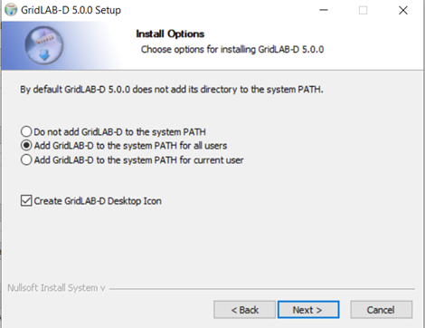

# Quick Install

The following instructions are provided to quickly get GridLab-D™ installed on Windows, Mac, or Linux. 

## Latest Release

Navigate to [github](https://github.com/gridlab-d/gridlab-d/releases) for the latest release of GridLAB-D™.

## GridLAB-D-#.#.#-Windows.exe

Scroll down past the *What's Changed* and *Contributors* sections to the **Assets** dropdown. Select the download that makes sense for your operating system. For example: `GridLAB-D-5.3.0-Windows.exe`. Download the file and run the executable. Follow the prompts, including:

### Add to Path

Add GridLAB-D™ to the system PATH for all users.

### Finish

Proceed through dialogue box by clicking `Next >` when prompted, then `Finish`.

## Open GridLAB-D™

1. Click the **Start Menu**.
2. Search for **GridLAB-D™ Runner**. 
3. Open it. This will launch the command prompt configured for GridLAB-D™. 

!!! Note

    Powershell may also be used to open GridLAB-D™ and the same commands apply as with using **GridLAB-D™ Runner**.
    
## Check Version

To confirm your install and check the version, enter the following into one of the above options:

    gridlabd.exe --version

## Quick Run

GridLAB-D™ simulations are run using .glm (GridLAB-D™ model) files. Follow the steps below to run a simulations on a Windows computer.

### Step 1: Navigate to Your .glm File
After you open GridLAB-D™, you must change the directory to the folder that contains the .glm file you want to run. For example if your file is located in the GridLAB-D™ examples folder, type:

    cd "C:\Program Files\Gridlab-d 5.3.0\share"`

Then press `Enter`.

!!! important

    If the folder path contains spaces (such as Program Files), you must include quotation marks (" "), or the above command will fail.

### Step 2: Run the Simulation
Once you are in the correct folder, run the simulation by typing:

    gridlabd.exe my_file_name.glm

Replace `'my_file_name.glm'` with the name of your actual .glm file, then press `Enter`.

### Step 3: View Results
GridLAB-D will run the simulation and display messages in the command window. Any output files defined in the .glm file will be saved in the same directory folder unless otherwise specified. 

### Example Files
Several example files are inclded with the GridLAB-D™ installation and can be found here:

    C:\Program Files\Gridlab-d 5.3.0\share
These examples are a good starting point for learning how GridLAB-D™ models and simulations are setup and structured. 

# Configuration

The following sections describe the GridLAB-D™ installation configuration in greater detail.

## File locations
The default directory tree for GridLAB-D™ on Windows is as follows:

**TODO - Review - determine whether this should change or even be listed. The current default directory does not include these paths.**

- `c:\Program Files\GridLAB-D` - 
This is the main GridLAB-D directory. It contains all the subdirectories as well as the readme and uninstall files.
- `c:\Program Files\GridLAB-D\bin` -
This contains all the executables. The PATH environment variable should include this directory.
- `c:\Program Files\GridLAB-D\etc` -
This contains all the runtime files. The GLPATH environment variable should include this directory.
- `c:\Program Files\GridLAB-D\lib` -
This contains all the module files. Both the PATH and GLPATH environment variables should include this directory.
- `c:\Program Files\GridLAB-D\samples` -
This contains sample data files.

## Environment variables
Only two environment variables must be set for GridLAB-D to function properly.

**TODO - Review - do these get set automatically when you select the add to path option in the executable? If not, describe what the user needs to do and what is done automatically. [JK- not sure. I don't see these set in my path, though I used the simple executable instructions. These instructions may change as well with the new release. Flag for revisit/review by Dev team]**

### PATH
The Windows `PATH` environment must include both the bin and lib directories. Users who want to include their own modules should add the directory that contains them as well, e.g., `C:\Documents and Settings\user\My Documents\path`, where `user` is the user's login name, and `path` is the path to their own modules.
### GRIDLABD
This should contain the path where GridLAB-D is installed.
### GLPATH
GridLAB-D uses the GLPATH environment to find runtime files and module files. It should include at least the etc and lib directories. Users who want to include their own modules or runtime files should add the directory that contains them as well, e.g., `C:\Documents and Settings\user\My Documents\path`, where `user` is the user's login name, and `path` is the path to their own modules.
### GLTEMP
(optional) Set to the path where temporary files will be stored. If `GLTEMP` is not set, it will be automatically set depending on the environment variables defined in the following order:
1. `%HOMEDRIVE%%HOMEPATH%\Local Settings\Temp\gridlabd` if both `HOMEDRIVE` and `HOMEPATH` are defined.
2. `%TMP%\%USERNAME%\gridlabd`. If `TMP` is not defined, then `TEMP` will be tried in its place. If both `TMP` and `TEMP` are undefined, then `C:\Windows\Temp` will be used for `%TMP%`.

!!! note 

    If the `GLTEMP` directory does not exist and it is required, it and all its parent directories will be created.

## Search Order
Searches for GridLAB-D files on GLPATH will be performed using the following order:

1. Current working directory
2. Directories in `GLPATH` environment variable in the order listed
3. `GridLAB-D` installation directory (usually `C:\Program Files\GridLAB-D`)
4. `etc` subdirectory of GridLAB-D install directory (`C:\Program Files\GridLAB-D\etc`)
5. `lib` subdirectory of GridLAB-D install directory (`C:\Program Files\GridLAB-D\lib`)

# Linux and OS-X

## File locations
Prior to Hassayampa (Version 3.0) installation on Mac OS/X could only be performed using the build process. Since Hassayampa (Version 3.0) a DMG build is available, but the installation file structure is different when using the DMG.

## Build Installation
These folders are created by the build process. There is no official DMG installer before Hassayampa (Version 3.0).

- `/usr/bin/gridlabd` - 
A symbolic link to `/usr/lib/gridlabd/gridlabd`, a bash script that sets up an appropriate environment to run gridlabd. `/usr/lib/gridlabd/gridlabd` is itself a soft link to `gridlab.bin`, the actual GridLAB-D binary.
- `/usr/lib/gridlabd` - 
Contains all runtime files.
- `/usr/share/doc/gridlabd`- 
Contains copyright notice and other documentation.

## DMG Installation
- `/usr/local/bin` - 
Executable folder contains the command line script and the main executable binary image.
- `/usr/local/lib/gridlabd` -
Library folder the modules and basic support files.

Note that the `DMG` installer does not alter you profile, so you may need to add the path to `/usr/local/bin` if it is not already included in your command shell path.

## Environment variables
### GRIDLABD
This should contain the path where GridLAB-D is installed. The `gridlabd` script sets this variable before calling gridlabd.bin.
### GLPATH
A set of colon-separated paths used for searching for GridLAB-D configuration files, modules, and runtime files. At a minimum, this variable should contain the path to the directory where GridLAB-D is installed (`/usr/lib/gridlabd`). It may also be used to add additional search paths.
### GLTEMP
(optional) Set to the path where temporary files will be stored. If GLTEMP is not set, it will be automatically set depending on the environment variables defined in the following order:

1. `$HOME/.gridlabd/tmp` if `HOME` is defined.
2. `$TMP/$USER/gridlabd`. If `TMP` is not defined, then `TEMP` will be tried in its place. If both `TMP` and `TEMP` are undefined, then /tmp will be used for `$TMP`.

!!! note 
    If the `GLTEMP` directory does not exist and it is required, it and all its parent directories will be created.

## Search Order
Searches for GridLAB-D files on `GLPATH` will be performed using the following order:

1. Current working directory
2. Directories in `GLPATH` environment variable in the order listed
3. `/usr/lib/gridlabd` or `/usr/local/lib/gridlabd
4. `/usr/etc/gridlabd` (not used after Grizzly (Version 2.3))

!!! note 
    The last two hard-coded paths should probably not be hard-coded or at least should be set using the install prefix.