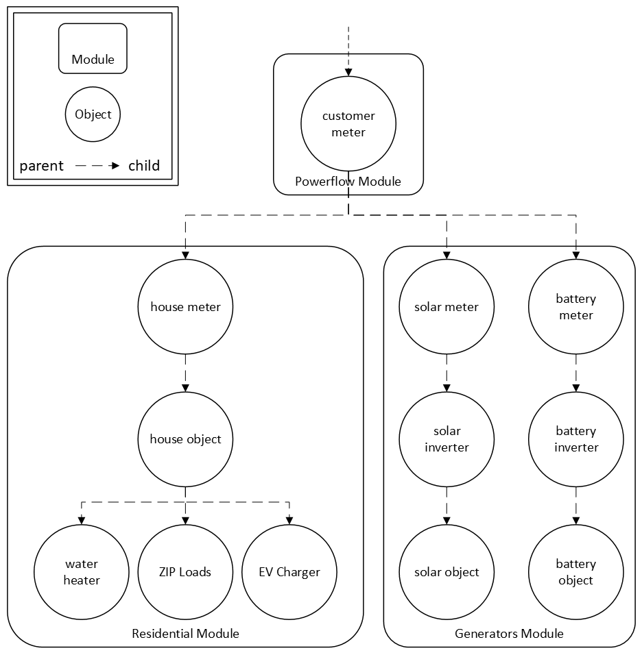

# Gridlab-D™ Overview

GridLAB-D™ is a power system simulation tool that provides valuable information to users who design and operate electric power transmission and distribution systems, and for utilities that want to take advantage of the latest smart grid technologies. **TODO - Consistency - ...grid technologies or technology? In the next sentance, "load modeling technology" seems odd. Can we say, "load modeling software or programs?" Technology seems like an odd word here *[jk 12/1 I almost feel like "capabilities" is the more apropriate word here. Trevor?]*** It incorporates advanced modeling techniques with high-performance algorithms to deliver the latest in end-use load modeling technology integrated with three-phase unbalanced power flow and retail market systems. Historically, the inability to effectively model and evaluate smart grid technologies has been a barrier to adoption; GridLAB-D™ is designed to address this problem.

This guide to using GridLAB-D™ is intended to help those who are at least slightly familiar with distribution systems to establish a foundation that will allow them to use GridLAB-D™ in their work. It is not intended to be comprehensive, as GridLAB-D™ contains many models with many parameters. Rather, this guide is intended to address some of the more important and popular features **TODO - Terminology - I added "of the software." Is this correct? [jk 12/1, yes]** of the software. The guide will address practical issues such as how certain models function, and will also cover more general topics within the architecture of GridLAB-D™.

This guide contains and references many example GridLAB-D™ models and files.  Readers are recommended to pull a local copy of the folder [Tutorial](https://github.com/gridlab-d/course/tree/master/Tutorial) so these files are readily available during the tutorial. **TODO - Update? - This previous link still works, but brings the user to a place that was last updated 9 years ago by Trevor *[jk 12/1--this the location of the required files to run the tutorial examples. I wouldn't expect them to be updated unless we add new ones. This doesn't preclude us from updating the language or descriptions in that section, but the .glms and inculde files should remain largely unchanged]***

# GridLAB-D™ Design

GridLAB-D™ is a flexible agent-based simulator that can model the behavior of many objects, *such as houses, distributed energy resources, and power systems controls*, over time. The simulator looks for changes in objects that affect other objects and keeps track of the evolution of these objects over time. GridLAB-D™ continues advancing its clock and allows each object to update itself until all the objects report that they are at equilibrium and the clock need not be advanced further. This is very important to understand and is often one of the least-understood aspects of GridLAB-D™.

**TODO - Rewrite - The following is very unclear. What is the hierarchy? Based on my understanding, this is how I would write this. If this is correct, please replace the next 1.5 sentences accordingly: Within GridLAB-D™, users assign objects to different types of classes. A combination of one or many object classes make up a module. Modules are the aggregation of object classes... Nah, I don't even know what this is saying. What is nested in what? Could say, "objects such as a house or a building..." [addressed by jk 12/1]** 

GridLAB-D™ uses modules to define classes of objects. *For example, the **residential** module contains the definitions of the **house**, **water heater**, and **Zip Load** load classes.* For example, a house with water heater, zip loads, EV charger, rooftop solar, and battery backup would be described in GridLAB-D™ according to the hierarchy in [Figure 1](#figure-1-module---object---parentage-hierarchy).

#### Figure 1. Module - Object - Parentage Hierarchy

The house object, part of the **residential** module, is a parent of the water heater, any zip loads, and EV charger objects, but is a child to its own meter. The solar and battery objects are a part of the **generators** module, and are children to their own meters, as they are able to exist as standalone generator objects. All three meters are children to the same meter, in this diagram referred to as the customer meter, so that both billing and behavior of the solar and battery objects are inclusive of all the objects that make up this residence. 

Classes define which properties are allowed in objects. For example, it makes sense to define the number of doors and windows in a house object, but it would not make sense to define the number of doors and windows for an EV charger object. Classes also define how the behaviors of those objects are implemented, such as the thermodynamics of a house based on its insulation, thermostat setpoint, outside air temperature, and other relevant properties. Each class *of object* must be defined in a module, *and cannot exist without one*.

Objects are instances of classes, so each object can have its own values for each property while sharing behaviors with other objects of the same class. *For example, every house on a street is not identical nor sets their thermostat to the same temperature; however, each house does obey the laws of thermodynamics*. During simulations, GridLAB-D™ will keep the objects' properties synchronized with each other as time advances *to accurately model the behavior of the object with respect to time*. *Note also that* modules can either be static, meaning they are implemented in a dynamic link library (e.g., `.dll` in Windows, `.so` in Linux, `.dylib` on Macs), or they can be dynamic, meaning they are compiled and linked at runtime.

# Introduction to GridLAB-D™

**TODO - Consistency - Changed "you're" to "you are" and will spell out contractions throughout documentation [jk- this conflicts with our style guide to be more accessible. Should we revisit that discussion?].** If you are already competent with GridLAB-D™ and want skip straight to the details of runtime classes or high-performance simulation, then as an advanced user you can jump straight the list of [Modules](../../3.0%20-%20Modeling%20Reference/Modules/1.0%20-%20Introduction.md)  **TODO - Reference - Previous linke does not seem to work [jk-updated should work]** However, we suggest that all beginners and most intermediate users continue through this guide.

**TODO - Still applicable? - Is it still the only environment?** GridLAB-D™ is the first (and so far only) environment for simulating highly-integrated modern energy systems. GridLAB-D™ is also an open-source system, meaning that the source code, which is the programming code that makes up GridLAB-D™, is freely available to anyone. People all over the world can add to GridLAB-D™, fix bugs, make improvements, or suggest optimizations, and they do.  GridLAB-D™ has grown tremendously since the prototype implementation (called PDSS, short for Power Distribution System Simulator) was created at Pacific Northwest National Laboratory (PNNL) in 2002 [1].  **TODO - Delete? - Rest of this paragraph, while interesting to us, is irrelevant for using GLD. [jk- agree. Maybe move to our version history section for a little historical background?]** Back then, David Chassin and Ross Guttromson were commissioned under the Laboratory’s Energy Systems Transformation Initiative to look into a) whether such a software system could be built, b) whether it could model how energy systems might evolve over time, and c) how much value would this evolution bring to consumers and utilities.  In 2007, after the US Department of Energy's Office of Electricity committed to getting the results of that work more widely available, the open-source model of development and distribution was used to make sure that as many people as possible could both contribute to it and benefit from what it has to offer.  Since then, GridLAB-D™ has grown quickly, mainly because of the hard work and dedication of all the contributors, and of course the early dedication of the GridLAB-D™ team at PNNL.

**TODO - Delete part - Suggest period after "contribution" because even incompetent people could add stuff, right? [jk-maybe rephrase by clarifying that contributions must be vetted and validated before being incorporated into the main code]** Unlike proprietary simulation tools, where the source code is written by a few people and carefully guarded, open-source projects like GridLAB-D™ exclude no one who is interested in making a contribution if they are competent enough. **TODO - tone? - JK- this next sentence feels a little outdated, I feel like we have lots of examples of this being a really great model of collaboration and shared discovery** Many vendors of established energy-related software tools still scoff at the idea that such a tool can make an impact, but the success of other large-scale open-source projects shows that this approach can and will work so long as enough support from contributors is available.

Another important advantage of the open-source model is the transparency of the implementation, which is necessary for building confidence in the accuracy of the results that come from using GridLAB-D™. While proprietary tools must be carefully validated using test cases, GridLAB-D™ has an advantage wherein validation can begin much sooner by ensuring that the implementation meets industry standards for quality and accuracy.

**TODO - Version History - What version are we on now? V5.3.0? Suggest deleting (probably this entire paragraph). [jk-, let's move this to version history section and then add to it for full context]** With Version 1, GridLAB-D™ revealed the potential for a transformation in how complex energy systems are modeled, and garnered a great deal of interest from potential users around the world.  The availability of Version 2 has built on that interest and provides a much more appealing and flexible product with a wider potential range of users.  The open-source system works well on both proprietary and open-source operating system and is expected to perform strongly in the utility market.  GridLAB-D™ is set to transform how we model and study modern energy systems.

**TODO - Delete? - What section are we talking about? The guide?If we keep this bulleted list, it should reflect the order we're utilizing (is that 2.3, 2.4, 2.5, and so forth?) [jk- agree, delete, we've rearranged so much since this was written]** In this section we will discuss the following:

* Essential concepts and terminology
* Starting and stopping GridLAB-D
* Creating and running models
* Creating and modifying classes
* Instantiating objects
* Extracting results
* Constructing complex models

# Understanding GridLAB-D™ Basics

GridLAB-D™ is an agent-based simulation environment specifically designed to model modern energy systems. It’s a program capable of tracking the simultaneous states of vast numbers of objects having a wide variety of properties and behaviors, and gathering information about their condition as time progresses in the simulation.

GridLAB-D™ simulates a system by computing a series of steady states, separated by state transitions.  The simulation discovers when those state transitions occur by looking at each object to determine:
1) Its next proposed steady. **TODO - What else? - Its next proposed steady what? Steady state? Or should steady be replaced with state? [jk, believe it should be steady state solution, Trevor confirm?]** 
2) Whether that state is consistent with the proposed steady states of all the other objects in the model. 
3) How long that state is expected to last.

The details of how GridLAB-D™ works are left to a later discussion.  All the tools needed for constructing and compiling models, debugging and running them in the simulator, and extracting results are either installed with GridLAB-D™ or are available as free downloads from open-source repositories. *A quick reference for accessing help resources is provided below.*

# Runtime Help Resources

There are several options for getting assistance: 
  To get a list of `command options`

    gridlabd --help

  To get a list of a module's `classes` and their properties:

    gridlabd --modhelp modulename:classname 

  To get a list of `global variables`

    gridlabd --globals

  To get an `example` of an object:

    gridlabd --example modulename:classname

  To search online for a topic:

    gridlabd --info topic

The `GLBROWSER` environment variable is used to specify the browser to use when the simulator is running. This feature is used by the `--info` and the GUI. The default browser is different on various platforms: Internet explorer (iexplore) for Windows systems; Firefox for Linux; and Safari for Mac OSX.

The `--copyright` command line option is used to display the GridLAB-D copyright. The copyright message is suppressed at startup when the file `COPYRIGHT` is found in one of the folders specified by the `GLPATH` environment variable. The version information is also displayed when the copyright is output.

    gridlabd --copyright

# References

  * [1] RT Guttromson, DP Chassin, SE Widergren, "Residential energy resource models for distribution feeder simulation", IEEE PES GM, 2003, DOI: <http://dx.doi.org/10.1109/PES.2003.1267145>