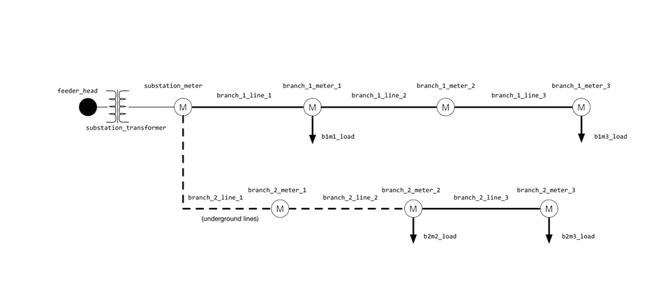

# Recorders and Players

Data input and output is an essential part of any simulation, and simulations with GridLAB-D™ are no exception. If you’ve read through and run the simulations covered in the previous sections of the tutorial, you’ve seen that to be useful, GridLAB-D™ must explicitly include objects in the model file that will record data of interest. If none of these recorder objects are included, there are effectively no results to the simulation. Similar to **recorders** is a parallel object called a **player** which allows externally defined data to be played into a simulation, affecting the behavior of that object and thus the simulation as a whole.

Both recorders and players create a mapping between internal parameters of GridLAB-D™ objects and external data files. However, to use these objects, we must answer the question: *how does a user find the names of the class parameters to which a recorder or player might be tied?* There are two good answers to this: the GridLAB-D™ documentation and the GridLAB-D™ source code.

We provide just an overview of the functionality of GridLAB-D™ in this tutorial. There is quite a bit more that GridLAB-D™ can do that you will find described in the [Modeling Reference](../../3.0%20-%20Modeling%20Reference/Modules/1.0%20-%20Introduction.md) section, whith pages primarily organized by the **module** to which they belong. [Loads](../../3.0%20-%20Modeling%20Reference/Loads/1.0%20-%20Loadshape.md) and loadshapes get their own section, as well as a handful of assorted use cases, reference material, and other features of GridLAB-D™, which can be found in the "Other Features" section. You should be able to find most everything you need to answer that question in this refernce section.

For example, going to the [Powerflow User Guide](../../3.0%20-%20Modeling%20Reference/Modules/Powerflow/1.0%20-%20Power_Flow_User_Guide.md) page and navigating to the section on the **node**, you'll see not only a brief description of how nodes are represented in GridLAB-D™ but also an example of how node objects can be created in GridLAB-D™ and a list of the parameters associated with the node class (and hence each node object). This parameter list generally defines the parameters with which recorders and players can interact.

While we work hard to keep the GridLAB-D™ documentation as up-to-date as possible, the GridLAB-D™ code itself is what truly defines how the software operates. For classes that are well established (like the node) it is likely that the documentation is up-to-date. For newer classes, though, this may not entirely be the case and examining the source code itself may be the best route to finding details that may be needed. Examining other people’s code is never simple or easy, and GridLAB-D™ has grown into a relatively complex piece software over time. It is easy to feel overwhelmed and confused when first starting to examine the guts of GridLAB-D™. That being said, the first time you really must understand why a particular object is doing what it does, being able to jump into the source code and find the one or two lines that answer the question will be very helpful and satisfying.

So let's try it and see how to go about examining GridLAB-D™ source code for these elusive parameters. To find out what parameters the node class has, we first have to find the file containing the source code that defines the node class. All of the code for GridLAB-D™ is in the source code folder, which will either downloaded as a part of the installation process you went through in the [Installation Guide](../2.1%20-%20Installation%20Guide.md) or found in the online [GridLab-D™ repository](https://github.com/gridlab-d/gridlab-d). 

You can either use an IDE (Integrated Development Environment) like VSCode or search online via github to look through those files and find instances of the word "node". Given how fundamental nodes are to GridLAB-D™, this is likely to return many files. So, alternatively, we can try to intuitively navigate the source code tree and find the file ourselves. Trying the latter route and looking through all the source code folders, we can see there is one called **powerflow** and inside that folder is a file called *"node.cpp"”"*. Opening this text file and reading the introductory comments confirms that this is the source code for node objects.

Now, to find those parameters. Scrolling down a bit we find a long list of statements that look something like this:

```
PT_INHERIT, "powerflow_object", 

PT_enumeration, "bustype", PADDR(bustype),PT_DESCRIPTION,"defines whether the node is a PQ, PV, or SWING node",

PT_KEYWORD, "PQ", (enumeration)PQ,

PT_KEYWORD, "PV", (enumeration)PV,

PT_KEYWORD, "SWING", (enumeration)SWING,

PT_set, "busflags", PADDR(busflags),PT_DESCRIPTION,"flag indicates node has a source for voltage, i.e. connects to the swing node",

PT_KEYWORD, "HASSOURCE", (set)NF_HASSOURCE,

PT_object, "reference_bus", PADDR(reference_bus),PT_DESCRIPTION,"reference bus from which frequency is defined",

PT_double,"maximum_voltage_error[V]",PADDR(maximum_voltage_error),PT_DESCRIPTION,"convergence voltage limit or convergence criteria",


PT_complex, "voltage_A[V]", PADDR(voltageA),PT_DESCRIPTION,"bus voltage, Phase A to ground",

PT_complex, "voltage_B[V]", PADDR(voltageB),PT_DESCRIPTION,"bus voltage, Phase B to ground",

PT_complex, "voltage_C[V]", PADDR(voltageC),PT_DESCRIPTION,"bus voltage, Phase C to ground",

PT_complex, "voltage_AB[V]", PADDR(voltageAB),PT_DESCRIPTION,"line voltages, Phase AB",

PT_complex, "voltage_BC[V]", PADDR(voltageBC),PT_DESCRIPTION,"line voltages, Phase BC",

PT_complex, "voltage_CA[V]", PADDR(voltageCA),PT_DESCRIPTION,"line voltages, Phase CA",

PT_complex, "current_A[A]", PADDR(currentA),PT_DESCRIPTION,"bus current injection (in = positive), this an accumulator only, not a output or input variable",

...
```

The quoted values are the class parameter names we are looking for; the value in square brackets `[ ]` is the default unit of the parameter. That is, node's have a parameter called `voltage_A` and its default unit is **volts**. We can also see that the programmer of the node class left a comment that the voltages are line-to-ground values and not the more traditional line-to-line values; that's good-to-know. And, as promised, looking at the source code has revealed a few parameters not listed in the original documentation  such as `service_status` and `current_uptime`. When it comes to finding class parameter names, most of the GridLAB-D™ modules are as straight-forward as this.


## Time in GridLAB-D

Before we dig further into the details of recording data out of or playing data into GridLAB-D™, we need to understand how time (as in time of day) in GridLAB-D™ is tracked. Jump back a page for a full explanation of [Simulation Time](./2.5.3.1%20-%20SimulationTime.md) in GridLAB-D™. For our purposes in this context, a brief recap will suffice. 

Internally, GridLAB-D™ uses UTC as its clock but has support for presenting time in any timezone with or without daylight saving time. Near the top of every GridLAB-D™ model or .glm is a **clock** statement which defines the local timezone in which the simulation will be run. Also included in that clock statement are the dates and times of the beginning and ending of the simulation period. GridLAB-D™ represents hours of the day using a 24-hour clock with 00:00 being midnight, the beginning of the day, and 23:59 being the last minute of the day, 11:59 pm.

GridLAB-D™ also takes care of the time changes that occur when daylight saving time begins and ends. In the United States these times have changed over the years. To allow GridLAB-D™ to correctly track local time, the dates of the beginning and end daylight saving time are included in a specific file GridLAB-D™ references: “*tzinfo.txt*". This file is found in the source code “core” folder and is copied to the installation's "share" folder during installation process. As of the writing of this tutorial, there are three distinct daylight saving time translation rules as a function of the year of the simulation. 

The timezone for the simulation can be specified as an offset from UTC (with daylight saving time as necessary), as in `PST+8DST`. GridLAB-D™ also allows users to specify this offset by defining the geographic location in which the simulation is set, like: `US/WA/Seattle`. The list of supported locations is relatively limited and can be found in “*tzinfo.txt*”.

As a demonstration, open up [distribution_system_basics.glm](https://github.com/gridlab-d/course/blob/master/Tutorial/Chapter%203%20-%20Basic%20Electrical%20Distribution%20Systems/Distribution%20system%20basics/distribution_system_basics.glm) again and let's make a few small changes:

* Change the clock statement so that the simulation starts on March 1st and ends on April 1st.

* Change the two recorder intervals from minutely (60) to hourly (3600).

Run the model and take a look at one of the output files generated by the recorder. In 2009, daylight saving time began on March 8th at 2 AM. At that time, the local clocks were all advanced an hour, effectively jumping from 1:59 AM to 3:00 AM. Looking at the recorder output file, we can see this reflected in the data that was collected, as expressed in local time. Note that “*tzinfo.txt*” indicates that this latest definition of daylight saving time began in 2007; if we re-run the simulation setting the `starttime` and `stoptime` to be in the year 2000, we see that no hour was skipped on March 8th or any day in March as daylight saving time that year began in April. This may seem relatively nuanced, but especially when running historical simulations, properly handilng time changes is both important and sometimes frustrating when you don't expect them.

## Recorders

As you’ve already seen in this tutorial where we built a very basic distribution system model, recorders are the fundamental means of getting simulation results out of GridLAB-D™. They can either be declared as their own object explicitly parented to the object with data of interest by adding a `parent ...;` statement to their definition or they can be implicitly parented by including their definition inside the definition of the object of interest. Recorders aren't typically complicated: all that is generally required is a definition for the file to write the data out to, how often the values should be measured, the parameter of interest, and (if making an explicit recorder) the parent object. Let's look at an example recorder collecting data on three properties from the parent meter:

```
object recorder {
  parent branch_1_meter_1;
    file branch_1_meter_1.csv;
    interval 60;
    property measured_voltage_A, measured_current_A, measured_power_A;
};
```

There are a few other interesting parameters for the [recorder](../../3.0%20-%20Modeling%20Reference/Modules/Tape/3.0%20-%20Recorder.md) object that are worth mentioning here. The recorder's `limit` can be used to limit the number of measurements taken; this can be useful to capture one-second data for the first few minutes of a twenty-four hour simulation run when all other parameters are only measured once every five minutes. Similarly, a `trigger` statement can be used to define an initial value or condition that will initiate recording.

GridLAB-D™ also supports a type of recorder that is not restricted to data from one object but can be used to measure data from multiple objects into one file: the [multi-recorder](../../3.0%20-%20Modeling%20Reference/Modules/Tape/3.2%20-%20Multi_recorder.md). A multi-recorder is useful when doing things like recording the voltages from a few separate nodes and have them written to a single file. And like a recorder, it can record data of different types as well; allowing for a large degree of flexibility. The only real cost is in typing; a multi-recorder requires that the parameters being measured be prepended by the object's name followed by a colon, like so:

    ...
    property object_name1:property_name1, object_name2:property_name2, ...;
    ...

## Collector

If the goal is to get a general sense of how a collection of objects as a whole is doing, though, there’s a better way than listing each object out one-by-one in a multi-recorder. GridLAB-D™ contains an object called a **collector** which allows users to define a collection of objects (such as all nodes in the model) and then define a summarizing statistic (i.e. average, minimum) to be used as the value to be logged. GridLAB-D™ even goes one step further and allows custom naming metadata to be associated with individual objects and this name to be used to form compound logic statements in the collector definition. For example, a collector might be defined to create a group of objects whose class type is `node` and whose `groupid` is `load_node`.

In the example collector below, all objects of class `house` and with the custom `groupid` of `Residential` will have their cooling setpoint's collected every five simulated minutes and the average of all those values written out to a file named *"residential_setpoints.csv"*.

```
object collector {
  group "class=house AND groupid=Residential";
  property avg(cooling_setpoint);
  interval 300;
  file residential_setpoints.csv;
}
```

Several objects use collections as a property to help find objects that satisfy certain criteria. Collections are typically built at initialization, although they can be run at any during a simulation if needed. 

A collection is specified as string with one or more filtering elements. For example, 
    
     class=house
    
would collect all the objects that have the class **house**. 

Only properties that are invariant during a simulation may be used in a collection. The following properties are supported: 

  * id
  * class
  * isa
  * module
  * groupid
  * rank
  * parent
  * insvc
  * name
  * latitude
  * longitude
  * clock
  * insvc
  * outsvc
  * flags

The following operators are supported: 

  * AND (can also be written as "and" or ";")
  * Note that the "OR" operator is not supported at this time.

### Example - Recorders

Let’s see how this functionality might look in an actual model. Open up [players.glm](https://github.com/gridlab-d/course/blob/master/Tutorial/Chapter%204%20-%20Recorders%20and%20Players/Players/players.glm) and spend a few minutes looking over the model. Remember that you can download the entire Tutorial repository [here](https://github.com/gridlab-d/course/tutorial/tree/master/Tutorial). As an exercise, let's make a quick sketch of how this model is constructed, showing how the objects are connected to each other. As you begin doing this you might notice that this model definition is arguably not structured as neatly as the previous examples we’ve looked at. For example, some objects are defined before their parents; GridLAB-D™ completely allows for this, though the users of models constructed like this may not care for this arrangement. Here’s what the model looks like:


##### Figure 1. Model diagram of "*players.glm*"

The end of the model contains a list of the recorder objects using all three data recording types: recorders, multi-recorders, and collectors. Running the model generates files from all three and comparing the data demonstrates the utility of each. For getting data from just a few objects, using simple recorders can be quite sufficient. If detailed data is needed from a number of objects it may be easier from a post-processing standpoint to have all that data contained in one file and a multi-recorder might be best. If only summary statistics are needed, rather than calculating those in a post-processing script it may be easiest to use a collector object to do the math for you.

A few other notes about collectors: First, there are a number of other operations collectors can do besides avg, min, max; you can find a listing on the [collector](../../3.0%20-%20Modeling%20Reference/Modules/Tape/5.0%20-%20Collector.md) page. Secondly, collectors can only perform operations on scalars as doing things like taking the average of a complex number is not always meaningfully defined in power systems. To convert a complex value to a scalar, append the parameter name with a `part`; the valid parts are:

* `.real` - real part of the complex value

* `.imag` - imaginary part of the complex value

* `.mag` - magnitude of the complex value

* `.ang` - angle in degrees of the complex value

* `.arg` - angle in radians of the complex value

## Group Recorders

The **group recorder** can collect a recording of **only one** property from a class or a group of similar objects. For instance, it can be used to record the voltages of every meter in the system as a time series. The values of the `measured_energy` variable of every meter object in a GLM are recorded into a file, named as "*meter.csv*", at 3600-second intervals. 
    
    
    object group_recorder {
      name MeterCorder;
      parent meter;
      group "class=meter";
      property measured_real_energy;
      file meter.csv;
      interval 3600;
      limit 1000;
    }

The group recorder places a timestamp in the first column of every row it emits. By default the timestamp is formatted using the ISO format (i.e., **yyyy-mm-dd HH:MM:SS TZ**). However, if the value of the `dateformat` global variable is not ISO, then the alternative date/time formatting rules will apply as follows: 

- `#set dateformat=US` -
    timestamp format **mm-dd-yyyy HH:MM:SS.SSSSSS**.

- `#set dateformat=EURO` - 
    timestamp format **dd-mm-yyyy HH:MM:SS.SSSSSS**.

### Group Recorder Examples

Three group recorder objects are used to record the Phase A, B, and C voltages of all loads into three files. A MATLAB script that parses and plots the voltages of all loads is available in this GitHub [repository](https://github.com/wsu-smartcity/tool-scripts/tree/master/gridlabd/group%20recorder). 
    
    
    object group_recorder {
    	name loads_voltages_A_recorder;
    	group "class=load";
    	property voltage_A;
    	file loads_volts_A.csv;
    	interval 1;
    	limit 10000000;
    }
           
    object group_recorder {
    	name loads_voltages_B_recorder;
    	group "class=load";
    	property voltage_B;
    	file loads_volts_B.csv;
    	interval 1;
    	limit 10000000;
    }  
    
    object group_recorder {
    	name loads_voltages_C_recorder;
    	group "class=load";
    	property voltage_C;
    	file loads_volts_C.csv;
    	interval 1;
    	limit 10000000;
    }
    

!!! caution

    It is possible to have the voltages recorded as magnitude and angle (e.g., +7003.99-2.25958d) in the csv file. In this case, the MATLAB script in that GitHub repository needs to be modified to process the string "+7003.99-2.25958d". 

    1) Note that this is not controllable by users through property settings. Users may have a single csv file, in which the recorded voltages have a mix of two formats (i.e., the magnitude and angle format: "+7003.99-2.25958d", and the real and imaginary format: "+2465.49-1430.37j"). This bug will be fixed in future. 

    2) The property `complex_part` can be used to record the magnitude of a phase voltage. See Example 02, of which the output file can be parsed by the provided MATLAB script properly. 

Now let's look at a group recorder that will watch the 'A' voltage of all meters and record the magnitude every 60 seconds:
    
    
    object group_recorder {
       parent ThatNode;
       group "class=meter";
       property voltage_A;
       interval 60;
       limit 1000;
       file ThatNode_kV.csv;
       complex_part MAG;
    }
    

How about a group recoder that measures real power through every transformer in a specific section of the circuit (through groupid) every 5 mins:
    
    
     object group_recorder {
       parent ThatTransformer;
       group "class=transformer";
       property power_out;
       interval 300;
       limit 1000;
       file AllTransformers.csv;
       complex_part REAL;
    }
    

### Group Recorder Properties

* **parent object** -
    Built-in property that specifies the object that the group recorder childs to. Does not need to be specified.

* **property string** -
    Single property from the class to be recorded. Properties with units may be converted to other relevant units. Complex properties may be modified via the `complex_parts` enumeration.

* **file string**  -
    The name of the file to write the recorder output to. If left empty, the recorder will generate a file name based on the target object class and internal ID number. The exact mode is dependent on the format of this string. A simple file name will write text output to the specified file. Other output modes are available with `mode:path`, where mode may be `file`, `odbc`, `memory`, or `plot`. The path for file and plot refer to a file name, to a global variable name for memory, and to a server login string for odbc. See the [Tape](../../3.0%20-%20Modeling%20Reference/Modules/Tape/1.0%20-%20Tape.md) section for more details.

* **flush number** -
    By default the output buffer is flushed to disk when it is full (the size of the buffer is system specific). This default corresponds to the flush value -1. 
        
    * If flush is set to 0, the buffer is flushed every time a record is written. 
    * If flush is set to a value greater than 0, the buffer is flushed whenever the condition `clock mod flush == 0` is satisfied.

* **interval integer** -
    The frequency at which the recorder samples the specified properties, in seconds. 
    
    * A frequency of 0 indicates that they should be read and written every iteration (note, that each timestep often requires multiple iterations, so a frequency of zero may lead to multiple measurements in a timestep). 
    * A frequency of -1 indicates that they should be read every timestep, but only written if one or more values change. By default, this is `TS_NEVER`.

* **limit integer** -
    The number of rows to write to the output stream. A non-positive value puts no limit on the file size (use at your own risk). By default, this is 0. The limit is only checked when output is non-subsecond value.

* **group string** -
    Group definition string. Defines which class of device (required) and other information to create a group. 

* **flush_interval** - (integer) -
    How often to "flush" the recorded material to the flat file 
    
    - file flush interval (0 never, negative on samples)

* **strict** - (boolean) -
    Causes the group recorder to stop the simulation should there be a problem opening or writing with the group recorder

* **print_units** - (boolean) -
    flag to append units to each written value, if applicable

* **complex_parts** - (enumeration) -
    Which part of the complex number to record if a complex property is specified. Available settings: `NONE`, `REAL`, `IMAG`, `MAG`, `ANG_DEG`, `ANG_RAD`

!!! caveat

    The group recorder attempts to read the value from the last iteration of a timestep, rather than the first iteration of a timestep. Normally the final value is more important than the initial or the intermediate values, for iterative solvers, but an interval of -1 can be used if necessary to record the value of a property with greater resolution. 

## Alternative Data Output - XML

Using recorders, very specific properties of different objects in your model can be read out and saved to a file. There is an alternative technique to get all object data formatted as XML to match the hierarchy of the .glm. Though the format is not as common as CSV, the generated XML file is a good one-stop solution to look at voltages at all nodes in one place and check if your model is working as expected. There are two ways to get XML output after running a GridLAB-D™ model file. The first and simplest is to add an extra parameter to the command line call; this will generate the XML file at the end of simulation. 

```
gridlabd distribution_system_basics.glm –o myfile.xml
```

Alternatively, you can add a special command inside your .glm to create the XML output file every time the model is run.

```
#set savefile="myfile.xml"
```

There are a large number of XML viewers/editors out there but some have a hard time with handling the `infourl` tag; setting it to null in the model file and re-running the simulation often solves this problem.

```
#set infourl=
```

The infourl global variable is used to specify the URL of the website used to search for help keywords. The default URL is <http://sourceforge.net/apps/mediawiki/gridlab-d/index.php?title=Special:Search/> to which the search keyword is appended. The resulting URL is sent to a browser to be displayed.

To set the infourl in a GLM file, use the syntax: 
    
    #set infourl="<http://localhost/search>?"
    
To set the infourl at the command line, use the syntax: 
    
    host% gridlabd -D infourl="<http://localhost/search>?"

## Players

The mirror to the recorder object is the player object; the player object allows external data to be used to define internal parameters of GridLAB-D™ objects. They are useful for hard-coding known behavior in system (rather than trying to model it) or for playing in data external to the system. For example, it is common to think of the transmission system defining the voltage at the head of a distribution feeder, the substation. These values could be found by including a model of the transmission system in the same model of a distribution system and endogenously generating the appropriate voltages. Alternatively, recorded values of transmission system voltages (from a real-world system or other simulations) could be played into the GridLAB-D™ simulation at the substation of the distribution model. This breaks the connection between distribution system load and transmission system voltage but it is more realistic than having static values for substation voltage.

The format for player files is relatively straight-forward: files consist of two columns with the first being a timestamp and the second being a value. There are three acceptable formats for the timestamp:

* Absolute number of seconds since midnight January 1, 1970 (the Unix epoch time)

* Absolute date and time: 2009-03-01 13:24

* Relative time since the last timestamp: +30s (acceptable units are seconds [s], minutes [m], hours [h], and days [d])

The last timestamp format is very handy when the value will be updated at regular intervals. The first timestamp entry in the file must be absolute but all the remaining times can be specified using a relative value, relieving the user of ensuring a long list of absolute timestamps appropriately roll over at, say, monthly boundaries.

The format for player objects is very similar to recorder objects with statements that define the filename to get the recorded values from and a parent object and parameter name into which the recorded values will be applied. And like recorders, this parenting can be defined explicitly or implicitly. As compared to recorder files, though, finding which parameters can be written to has a slight wrinkle. The list of parameters that are exposed by each class is the same as in recorder objects and can be found in the same way: the GridLAB-D™ documentation and/or the source code. The complication though, is that though GridLAB-D™ may allow a player to write to all of those parameters, the internal workings and calculations of each class may effectively overwrite those played-in values.

Take the example we just worked when experimenting with recorders. When the powerflow solves the system, it defines the voltage at each of the nodes as a function of the voltage at the feeder head, the loads at each node, and the impedance of the distribution lines. Given this, if we tried to define the voltage at each node through a player file, it would not work; defining the output of the powerflow solution does not affect the solution itself and would result in those played-in values being overwritten each time the powerflow is solved. **Using player files to define parameters that are outputs of the internal GridLAB-D™ calculations is ineffective.**

In using player files, then, the hard part is determining whether a particular parameter listed on the documentation or in the source code is an input parameter that can be played into or an output parameter which is only useful for recorders. Unfortunately, there is no GridLAB-D™ reference other than the source code itself to definitively determine if a particular parameter is an input or output for a particular class. Depending on the parameter and the class, digging into the source code to find an answer may be non-trivial. 

A little advice on how to handle the problem:

* Be aware that this problem does exist and be looking for it if a player doesn't seem to be working.

* Think through generally how the class algorithms should work and do your best to reason which parameters are inputs and which are outputs.

* The most direct way of determining if a parameter can be played into is to just try it and see if it works.

We'll walk through some examples to give you a better sense of what is possible.

### Example - Players

With that warning in mind, lets take a look at this model for recorders and see what happens when we play a voltage into the substation (which is a swing node and can be freely defined, unlike all the other nodes in the system). Run the "*players.glm*" model from the Tutorial repository [here](https://github.com/gridlab-d/course/blob/master/Tutorial/Chapter%204%20-%20Recorders%20and%20Players/Players/players.glm):

```
gridlabd players.glm
```

Examining any of the generated results files shows that the changing substation voltage is affecting the rest of this small distribution system. Rather than static values for the duration of the simulation, we see changing values every minute, in step with the substation voltage.

Player objects have a **loop** parameter that allows the same data file to be repeated a specified number of times. We can see this affect by changing the node object so that is it defined as:

```
object node {
  name feeder_head;
  bustype SWING;
  phases ABCN;
  nominal_voltage 132790;
  object player {
    property voltage_A;
    file sub_voltage.player;
  loop 1;
  };
}
```

The player file will now loop once, playing back two hours of data. Note that the first value in the file, the one with the timestamp of `2009-01-01 00:00:00 PST` will *not* be played on the second loop as this is an absolute value. To compensate for this, the voltage at that time has been added to the end of the file as the final entry with a relative timestamp.

Though we have set up the player to produce two hours of data, the **clock** statement at the beginning of the model has not been changed and if no modification is made, the simulation will still only run from midnight to 1am. If you modify the clock and re-run the simulation, examining the recorded substation data will show that the voltage does begin to repeat at 1am, as expected.

What if the converse scenario occurs, though? What if the simulation runs longer than the player file provides data? Let's find out; modify the clock statement again, this time to end the simulation at 3am and re-run it. The substation data will now show that, beginning at 2am, after the player file is done looping, the final player value repeats for the remainder of the hour. *Until some other object comes along to change it, the substation voltage stays at its last defined value.*

## Example 2 - Players

In this next example, the **player** is a child of the **house** object, and will play a stream of values from the CSV file "*t_cool.csv*" into the property `cooling_setpoint` of the house object:


    object house {
      object player {
        property cooling_setpoint;
        file t_cool.csv;
      };
    }


Remember that the CSV player file must be a two-column format with a time value (either an absolute Timestamp or relative time). An absolute timestamp version may look like:


    2007-01-02 00:00:00, 72.0
    2007-01-02 01:00:00, 73.0
    2007-01-02 02:00:00, 72.0
    2007-01-02 03:00:00, 68.0
    2007-01-02 15:00:00, 69.0
    2007-01-02 23:00:00, 72.0


Note the times can be completely irregular. A second method, using relative time would look like:


    2007-01-01 23:00:00, 72.0
    +1h, 72.0
    +1h, 73.0
    +1h, 72.0
    +1h, 68.0
    +12h, 69.0
    +8h, 72.0


Note that the first time is absolute, but relative timestamps define the same schedule by using differentials in time. This again let's us utilize the loop property of the player:


    object house {
      object player {
        property cooling_setpoint;
        file t_cool_relative.csv;
        loop 31;
      };
    }


Where the relative times (summing to 24 hours) will be repeated 31 times in a cyclic manner.  When the allotted time has expired (i.e., the clock time runs beyond the time designated within the player file), the final value will be used indefinitely.