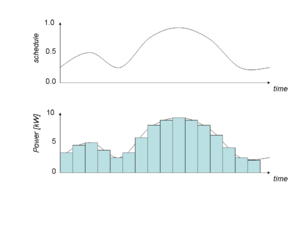
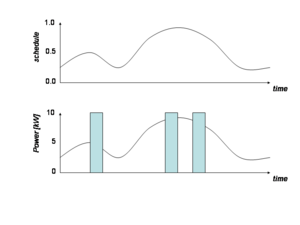
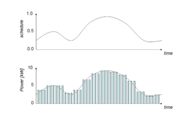
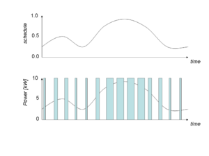
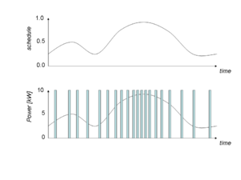
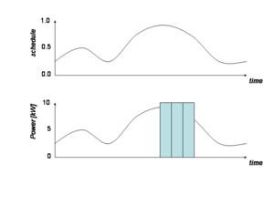
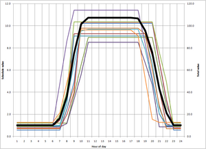

# Loadshape

The loadshape built-in data type is used to represent a finite-state machine that takes on the value of a complex power when synchronized. A loadshape is associated with a schedule, and requires a number of parameters to define its behavior. There are five types of loadshapes, and each has a difference set of parameters that define it: 

 Type | Description
-- | --
**Analog** | Analog load shapes directly compute the power from the values in the schedule.
**Pulsed** | Pulsed load shapes emit one or more pulses at random such that the specified energy is accumulated over the period of the load shape.
**Modulated** | Modulated load shapes emit a sequence of modulated pulses of either constant period and duty-cycle (amplitude) or constant power and off-time (pulse width) or constant power and on-time (frequency).
**Queued** | Queued load shapes emit random pulses whenever a queue accrued from the load shape reaches an on threshold and continues emitting pulses until the queue reaches an off threshold.
**Scheduled** | Scheduled load shapes emit values based on a schedule in a way that incorporates diversity.

## Analog

Analog loadshapes directly compute the power from the values in the schedule.

##### Figure 1 - Example of an analog loadshape

 An analog loadshape is defined using the following terms: 
    
    
     class example {
       loadshape myshape;
     }
     object fixed-energy {
       myshape "type: analog; schedule: _schedule-name_ ; energy: value kWh";
     }
     object scaled-power {
       myshape "type: analog; schedule: _schedule-name_ ; power: value kW";
     }
     object unscaled {
       myshape "type: analog; schedule: _schedule-name_ ";
     }
    

  
The **schedule** parameter specifies which schedule is to be used. When the **energy** is given, the schedule is used to create a shape that consumes the specified energy in each schedule block. The power required is based on the fraction of energy allocated to each time interval by the schedule. 

When the **power** scale is given, the scheduled value is multiplied by the **power** value. 

When neither **energy** nor **power** is given, the schedule value is used directly as the power. 

A standard deviation on the **energy** or **power** value can be given, in which case each instance of the loadshape that is generated will use an error drawn from the triangle distribution from -3 to +3, such that 

value ← value \+ stdev * Triangle[-3,3]

The **stdev** term can be given units and it will be scaled accordingly, e.g., 
    
    
     object stdev-power {
       myshape "type: analog; schedule: schedule-name; power: value kW; stdev error W";
     }
    

## Pulsed

Pulsed loadshapes emit 1 or more pulses at random times such that the total energy specified is accumulated over the period of the loadshape.

##### Figure 2 - Example of a pulsed loadshape

 A pulsed loadshape is defined using the following terms: 
    
    
     class example {
       loadshape myshape;
     }
     object sample {
       myshape "type: pulsed; schedule: schedule-name; energy: value kWh; count: value; duration: value s";
     }
    

or 
    
    
     class example {
       loadshape myshape;
     }
     object sample {
       myshape "type: pulsed; schedule: schedule-name; energy: value kWh; count: value ; power: value kW";
     }
    

The first form defines a series of pulses with constant duration, and the second form defines a series of pulses with constant power. When the duration is constant, the power will vary in response to changes in voltage such that the amount of energy used during a loadshape block is as specified. When the power is constant, the duration will vary in response to changes in voltage such that the amount of energy used is constant. Only one of the two may be specified, and at least one must be specified. 

The **count** parameter determines how many pulses will be generated during a loadshape block. The value is optional and the default value is 1.0. 

A standard deviation on the **duration** or **power** value (as specified by the unit) can be given, in which case each instance of the loadshape that is generated will use an error drawn from the triangle distribution from -3 to +3, such that 

value ← value \+ stdev * Triangle[-3,3]

The **stdev** term can be given units and it will be scaled accordingly, e.g., 
    
    
     object stdev-power {
       myshape "type: analog; schedule: schedule-name; power: value kW; stdev error W";
     }
    

or 
    
    
     object stdev-power {
       myshape "type: analog; schedule: schedule-name ; power: value kW; stdev error s";
     }
    

## Modulated

Modulated loadshapes emit a continuous sequence of modulated pulses with either constant period and duty-cycle (**amplitude**), constant power and off-time (**pulsewidth**), or constant power and on-time (**frequency**).

##### Figure 2a - Example of a amplitude modulated loadshapes

##### Figure 2b - Example of a pulse-width modulated loadshapes

##### Figure 2c - Example of a frequency modulated loadshapes

 A modulated loadshape is defined using the following terms: 
    
    
     class example {
       loadshape myshape;
     }
     object sample {
       myshape "type: modulated; modulation: modulation ; schedule: _schedule-name_ ; energy: value kWh; count: value ; period: value s";
     }
    

or 
    
    
     class example {
       loadshape myshape;
     }
     object sample {
       myshape  "type: modulated; modulation: modulation ; schedule: _schedule-name_ ; energy: value kWh; count: value ; power: value kW";
     }
    

A standard deviation on the **duration** or **power** value can be given, in which case each instance of the loadshape that is generated will use an error drawn from the triangle distribution from -3 to +3, such that 

value ← value \+ stdev * Triangle[-3,3]

The **stdev** term can be given units and it will be scaled accordingly, e.g., 
    
    
     object stdev-power {
       myshape "type: analog; schedule: schedule-name; power: value kW; stdev error W";
     }
    

## Queued

##### Figure 2 - Example of a queued loadshape

Queued loadshapes emit random pulses whenever a queue accrued from the loadshape reaches an on threshold and continues emitting pulses until the queue reaches an off threshold. A queued loadshape is defined using the following terms: 
    
    
     class example {
       loadshape myshape;
     }
     object sample {
       myshape  "type: pulsed; schedule: _schedule-name_ ; energy: value kWh; count: value ; duration: value s; q_on: value ; q_off: value ";
     }
    

or 
    
    
     class example {
       loadshape myshape;
     }
     object sample {
       myshape  "type: pulsed; schedule: _schedule-name_ ; energy: value kWh; count: value ; power: value kW; q_on: value ; q_off: value ";
     }
    

The values of **q_on** and **q_off** are in the same units as the integrals of the normalized loadshape and **q_on** must be greater than **q_off**. 

A standard deviation on the **duration** or **power** value can be given, in which case each instance of the loadshape that is generated will use an error drawn from the triangle distribution from -3 to +3, such that 

value ← value \+ stdev * Triangle[-3,3]

The **stdev** term can be given units and it will be scaled accordingly, e.g., 
    
    
     object stdev-power {
       myshape "type: analog; schedule: _schedule-name_ ; power: value kW; stdev error W";
     }
    

## Scheduled

Scheduled loadshapes control the diversity of a population of objects and affect the aggregate value (heavy black).

Schedule-based loadshapes are provided to enable a simpler and more intuitive way of defining aggregate loadshapes that incorporates diversity. For example: 
    
    
     class example {
       loadshape myshape;
     }
     object sample {
       myshape  "type: scheduled; weekdays: MTWRF; on-time: 6<8~1<10; off-time: 15<16~1<18; on-ramp: 0.5<1~0.5<1.5; off-ramp: 1<2~1<3; low: 1<2~1<3high: 10<15~2<20 kW;
     }
    

will generate a randomized ramped 8-hour pulse at roughly 10 kW Monday through Friday. Weekdays are defined as 

  * U=sunday,
  * M=monday,
  * T=tuesday,
  * W=wednesday,
  * R=thursday,
  * F=friday,
  * S=saturday, and
  * H=holiday.

Values are provided in the format   
    
     min <mean ~stdev <max
    

If the min or the max are omitted, then 3 σ is used. If the stdev is omitted, then 0 is used (meaning the value is invariant). 

The syntax for varying values (mean~stdev) allows the same definition to be used for multiple objects, e.g., 
    
    
     #define SCHEDULE_1="weekdays: MTWRF; on-time: 8~1; off-time: 16~1; on-ramp: 1~0.5; off-ramp: 2~1;"
     object sample {
       myshape  "type: scheduled; SCHEDULE_1; power: 15~2 kW;
     }
    

### Schedule state variables

To define a generic bimodal schedule machine, the follow variables must be defined: 

  * $s = {on,off}$ is the mode
  * $E$ is the energy (in kWh) used during the _on_ mode;
  * $V$ is the supply voltage;
  * $I_{constant}$ is the current of the constant current during the _on_ mode (in amps);
  * $Z_{constant}$ is the impedance of the constant impedance during the _on_ mode (in ohms);
  * $P_{constant}$ is the power of the constant power during the _on_ mode (in kW);
  * $P = P_{constant} + V I_{constant} + V^2 / Z_{constant}$ is the power (in kW) used during the _on_ mode;
  * $\epsilon_{t_{on}}$ is the random variation in the _on_ time (in seconds);
  * $\epsilon_{t_{off}}$ is the random variation in the _off_ time (in seconds);
  * $t_{on} = E / P + \epsilon_{t_{on}}$ is the _on_ time (in seconds);
  * $\phi = t_{on} + t_{off} + \epsilon_{t_{off}}$is the period of _on_ plus _off_ time (in seconds);
  * $\theta = t_{on} / \phi$ is the duty cycle (unitless);
  * $t_{off} = t_{on} / \theta - t_{on}$ is the duration of the _off_ time;
  * $q$ is the value of the internal state variable (unitless)
  * $\delta_{on} + \epsilon_{\delta_{t_{on}}}$ is the threshold value of $q$ at which the mode becomes _on_ ;
  * $\delta_{off} + \epsilon_{\delta_{t_{off}}}$ is the threshold value of $q$ at which the mode becomes _off_ ;
  * $r_{on} = ( \delta_{off} - \delta_{on} ) / t_{on}$ is the rate at which $q$ approaches $\delta_{off}$;
  * $r_{off} = ( \delta_{on} - \delta_{off} ) / t_{off}$ is the rate at which $q$ approaches $\delta_{on}$;
  * $q_0 = Uniform(\delta_{on},\delta_{off})$ is the initial value of the internal state variable
  * $q_{t+dt} = q_t + r_s dt$ is the value of the internal state variable at $dt$ seconds have elapsed

  $$s =\begin{cases} s_t=on: & \begin{cases}    
       q_t \ge \delta_{t_{off}}: & off \\
       q_t < \delta_{t_{off}}: & on 
     \end{cases} \\
s=off: & \begin{cases} 
       q_t \le \delta_{t_{on}}: & on \\
       q_t > \delta_{t_{on}}: & off 
     \end{cases}
\end{cases}$$

## Related Concepts:

  * Built-in types
  * Enduse
  * Schedule
  * Units
  * Loadshape
    * Requirements
    * Specifications
    * Technical support
    * Implementation

