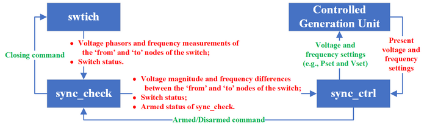
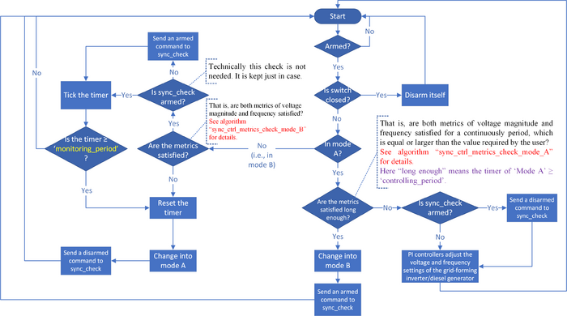

# Synchronization Control

## Background and Motivation

The synchronization control capability in GridLAB-D™ has been designed and implemented to coordinate the connection of distributed generation units to the grid. The `sync_ctrl` object in GridLAB-D™ enables automatic synchronization between two independent power grids by actively adjusting a generation unit's frequency and voltage setpoints to match grid conditions. The controlled generation unit can be either a diesel generator (`diesel_dg` object) or a grid-forming inverter (`inverter_dyn` object in GFM set-up). This functionality supports applications such as paralleling separate power systems or reconnecting microgrids to the bulk power system. During simulation, the `sync_ctrl` continuously monitors frequency and voltage magnitude differences measured by its associated `sync_check` object. When both frequency and voltage differences fall within specified tolerance bounds, the `sync_check` object becomes armed and ready for connection. Until these synchronization criteria are met, the `sync_ctrl` actively controls the generation unit through dual PI controllers to minimize the differences and achieve safe paralleling conditions.

## Functionality

The connection, data, and work flow between the GridLAB-D™ objects connected to enable and simulate the synchronization control are shown in [](#fig:SyncCtrl).Synchronization control actions are enabled through the `sync_ctrl` object in conjunction with `sync_check` and `switch` objects in the `powerflow` module, and `diesel_dg` and `inverter_dyn` objects in the `generators` module.

{ #fig:SyncCtrl }

Specifically, this controller:

1. **Controls grid synchronization** - It works in conjunction with a `sync_check` object to monitor when conditions are appropriate for connecting a generation unit to the grid.

2. **Operates in two modes**:
     - **Mode A** - Active controlling period when both frequency and voltage metrics are satisfied,
     - **Mode B** - Monitoring period when the controller keeps monitoring metrics but the switch is not closed.

3. **Uses dual PI controllers** to adjust generator setpoints:
     - **Frequency PI controller** - Adjusts the frequency setpoint or power setpoint based on frequency differences,
     - **Voltage magnitude PI controller** - Adjusts the voltage setpoint based on voltage magnitude differences.

4. **Controls generation units**, which include specifically for the current GridLAB-D™ implementation:
     - Diesel generators (`diesel_dg`),
     - Dynamic inverters (`inverter_dyn`).

5. **Monitors synchronization metrics**:
     - Frequency tolerance (upper and lower bounds in Hz),
     - Voltage magnitude tolerance (in per unit).

6. **Adjusts setpoints gradually** - The PI controllers incrementally adjust the controlled generation unit's frequency and voltage setpoints to bring them within acceptable tolerance ranges for safe synchronization.

## Synchronization Control Parameters and Implementation Details (`sync_ctrl`)

[](#fig:sync-ctrl-flowchart) details the flowchart for `sync_ctrl` behavior in transient mode.

{ #fig:sync-ctrl-flowchart }

Details on the variable types and units expected by GridLAB-D™ are given along with the code insider documentation in [](#tbl:sync-ctrl-parameters). The following subsections detail the key parameters that GridLAB-D™ implementation offers for modeling the `sync_ctrl` object. This specific object has been designed and implemented to be integrated and used for transient mode analysis, under the assumption the call to transient mode was triggered by either the device arming the `sync_ctrl` object, or by something elsewhere in the system making the adjustments for synchronization to occur. Otherwise, no explicit functions are performed by the `sync_ctrl` object in QSTS mode.

### Control Flags

- `armed`: Global/published flag that enables the synchronization control functionality
- `sct_volt_cv_arm_flag`: Internal (hidden) flag to specifically enable voltage control output
- `sct_freq_cv_arm_flag`: Internal (hidden) flag to enable frequency control output

### Two Operating Modes

Once active, `sync_ctrl` runs in either one of the operating modes:

- **Mode A - Active Controlling Period** during which the controller adjusts the voltage and frequency settings of the controlled generation unit actively. In this mode:

    - Both frequency and voltage PI controllers are running,
    - Actions last for duration `controlling_period[s]`, the user-defined period in seconds when both voltage and frequency metrics are satisfied (default: 1 second).

- **Mode B - Monitoring Period** during which the controller monitors the voltage magnitudes and frequency and counts a timer, determining when to switch to mode A if needed. In this mode:

    - Controllers keep monitoring but switch remains open,
    - Controllers wait for synchronization conditions to be satisfied,
    - Monitoring continues for duration `monitoring_period[s]`, the user-defined period in seconds while both frequency and voltage metrics are not violated and the switch object is not closed (default: 10 seconds).

### Reference Object
- `sync_check_object`: Reference to the `sync_check` object in the `powerflow` module that provides measurement feedback,
- `controlled_generation_unit`: Reference to the controlled generation unit, either diesel generator of dynamic inverter, which represents the actuator of the PI controllers.

### Frequency Tolerance Bounds
- `frequency_tolerance_ub_hz`: Upper frequency tolerance bound in Hz
- `frequency_tolerance_lb_hz`: Lower frequency tolerance bound in Hz

### Voltage Magnitude Tolerance
- `voltage_magnitude_tolerance_pu` - Voltage magnitude tolerance in per unit (default: 0.01 pu = 1%)


### PI Controller Parameters - Frequency/Voltage Magnitude
- `pi_freq_kp`/`pi_volt_mag_kp`: Proportional gains (default: 1)
- `pi_freq_ki`/`pi_volt_mag_ki`: Integral gains (default: 0.1)
- `pi_freq_ub_pu`/`pi_volt_mag_ub_pu`: PI controller output ($P_{\text{set}}$/$f_{\text{set}}$, and $V_{\text{set}}$ respectively) upper bound in per unit (default: 1)
- `pi_freq_lb_pu`/`pi_volt_mag_lb_pu`: PI controller output lower bound in per unit (default: 0)

## Example

The following glm file sample defines a `sync_ctrl` object.

```text    
object sync_ctrl
  {
    name sct_f01f02;
    flags DELTAMODE;

    armed false; //starting as disarmed

    sync_check_object grid_resyncer; //the sync_check object linked to this sync_ctrl object
        
    controlled_generation_unit Diesel_1; // the controlled generation unit can be either a DG or INV
    // controlled_generation_unit Inverter_1;

    controlling_period 2; // control period when in mode A
    monitoring_period 15; // monitoring period when in mode B

    frequency_tolerance_ub_hz -0.7;
    frequency_tolerance_lb_hz -0.1;

    pi_freq_kp -2;
    pi_freq_ki -0.2;

    voltage_magnitude_tolerance_pu 0.02;
    pi_volt_mag_kp -2;
    pi_volt_mag_ki -0.2;

    pi_volt_mag_ub_pu 1.65;
    pi_volt_mag_lb_pu 0.35;

    pi_freq_ub_pu 1.0;
    pi_freq_lb_pu 0;
  }
```

## Summary of Key Parameters

Table: Key Parameters and Variables of the GridLAB-D™ Synchronization Control (`sync_ctrl`) Object { #tbl:sync-ctrl-parameters }

|Published Name|Unit|Type|Description|
|---|---|---|---|
|**armed**||bool|Flag to arm the synchronization control functionality.|
|**sync_check_object**||object|The object reference/name of the sync_check object, which works with this sync_ctrl object.|
|**controlled_generation_unit**||object|The object reference/name of the controlled generation unit (i.e., a diesel_dg/inverter_dyn object), which serves as the actuator of the PI controllers of this sync_ctrl object.|
|**frequency_tolerance_ub_hz**|Hz|double|The user-specified tolerance in Hz for checking the upper bound of the frequency metric.|
|**frequency_tolerance_lb_hz**|Hz|double|The user-specified tolerance in Hz for checking the lower bound of the frequency metric.|
|**voltage_magnitude_tolerance_pu**|pu|double|The user-specified tolerance in per unit for the difference in voltage magnitudes for checking the voltage metric.|
|**controlling_period**|s|double|The user-defined period when both metrics are satisfied and this sync_ctrl object works in mode A.|
|**monitoring_period**|s|double|The user-defined period when this sync_ctrl object keeps on monitoring in mode B, if both metrics are not violated and the switch object is not closed.|
|**pi_freq_kp**||double|The user-defined proportional gain constant of the PI controller for adjusting the frequency setting.|
|**pi_freq_ki**||double|The user-defined integral gain constant of the PI controller for adjusting the frequency setting.|
|**pi_freq_ub_pu**|pu|double|The upper bound of the output (i.e., the control variable 'Pset'/'fset') of the PI controller that adjusts the frequency difference in per unit.|
|**pi_freq_lb_pu**|pu|double|The lower bound of the output (i.e., the control variable 'Pset'/'fset') of the PI controller that adjusts the frequency difference in per unit.|
|**pi_volt_mag_kp**||double|The user-defined proportional gain constant of the PI controller for adjusting the voltage magnitude setting.|
|**pi_volt_mag_ki**||double|The user-defined integral gain constant of the PI controller for adjusting the voltage magnitude setting.|
|**pi_volt_mag_ub_pu**|pu|double|The upper bound of the output (i.e., the control variable 'Vset') of the PI controller that adjusts the voltage magnitude difference in per unit.|
|**pi_volt_mag_lb_pu**|pu|double|The lower bound of the output (i.e., the control variable 'Vset') of the PI controller that adjusts the voltage magnitude difference in per unit|