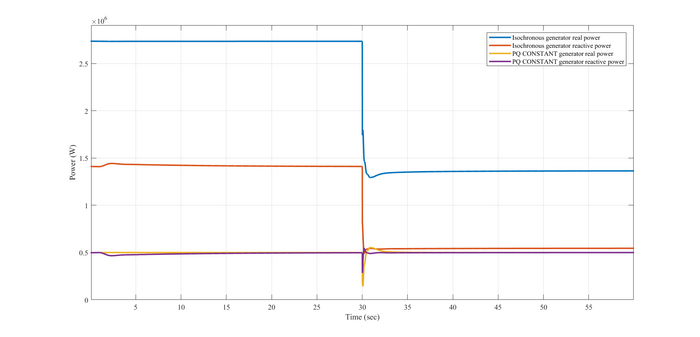

# Diesel dg

The **diesel_dg** object represents a synchronous distributed generation. The model supports both a QSTS-only model and subsecond (transient mode) modes of operation. 

# Properties

It is important to note that the parameter tables below represent variables that _can_ be altered at the GLM level. With a few exceptions, all have a default value and do not need to be populated (but can be overridden with better values, if the user has them). 

The properties are divided into the QSTS and subsecond sets. This mode of operation is determined by the **Gen_type**: 

##### Table 1 - Mode Select  

Property  | Type  | Unit  | Description   
---|---|---|---  
**Gen_type**  | enumeration  | none  | Selects the overall mode of operation for the **diesel_dg** object. Valid selections include:   - `CONSTANT_PQ` \- QSTS-only mode diesel generator   - `DYN_SYNCHRONOUS` \- QSTS and transient mode-compatible diesel generator

# PQ CONSTANT mode diesel dg

This section describes GridLAB-D™ implementation of diesel generator in PQ constant mode.   
  
A **constant_P** mode is implemented in the governor type `P_CONSTANT`: 

In the **constant_P** mode, a time delay is applied to the electric power output from the diesel generator. The delayed electric power output is compared with the constant real power reference, then applied to a PI controller, to get the actuator input. The actuator part and time delay part of the `GGOV01` governor is used in **constant_P** mode. Output of the **constant_P** mode is the mechanical power of the diesel generator.   
  
The **constant_Q** mode is implemented based on the existing exciter SEX_PTI: 

## GridLAB-D™ Implementation

### Diesel Generator in PQ Constant mode example

This diesel generator object is implemented in both constant P and constant Q mode.   
  
By selecting `Governor_type` as `P_CONSTANT`, the constant P mode is selected. This example sets `Pref` value as 0.5 p.u. The PI controller settings for the constant `Pref` mode are 0 for proportional control, and 0.05 for integral control. In addition, parameters of the actuator and time delay part of the `P_CONSTANT` are also defined in the example.   
  
By selecting `Exciter_Q_constant_mode` as true, the constant Q mode is selected. This example sets `Qref` value as 0.6 p.u.. The PI controller settings for the constant Q mode are 0.01 for proportional control, and 0.05 for integral control. 

### Example of Diesel Generator in PQ Constant mode
    
    
    module generators;
    object diesel_dg {
         flags DELTAMODE;
         parent 8;
         name Gen2;
         Rated_V 4156; //Line-to-Line value
         Rated_VA 1000000; // Defaults to 10 MVA
         Gen_type DYN_SYNCHRONOUS;
         rotor_speed_convergence ${rotor_convergence};
         Exciter_type SEXS;
         Governor_type P_CONSTANT;
         // Actuator and time delay parameters for P_CONSTANT mode
         P_CONSTANT_Tpelec 1.0; // Electrical power transducer time constant, sec. (>0.)
         P_CONSTANT_Tact 0.05; //0.5; // Actuator time constant
         P_CONSTANT_Kturb 1.5; // Turbine gain (>0.)
         P_CONSTANT_wfnl 0.2; //0.2; // No load fuel flow, p.u
         P_CONSTANT_Tb 0.01;//0.1; // Turbine lag time constant, sec. (>0.)
         P_CONSTANT_Tc 0.2; // Turbine lead time constant, sec.
         P_CONSTANT_Teng 0.0; // Transport lag time constant for diesel engine
         P_CONSTANT_ropen 050; // Maximum valve opening rate, p.u./sec.
         P_CONSTANT_rclose -050; // Minimum valve closing rate, p.u./sec.
         P_CONSTANT_Kimw 0.0;//0.002; // Power controller (reset) gain 
         inertia 2.5;
         // PI controller parameters of P_CONSTANT mode
         P_CONSTANT_Pref 0.5; // Set P reference, p.u. 
         P_CONSTANT_kp 0;  // ki for the PI controller implemented in P constant transient mode
         P_CONSTANT_ki 0.05;  // kp for the PI controller implemented in P constant transient mode
         Exciter_Q_constant_Qref 0.6; // Set Q reference, p.u. 
         Exciter_Q_constant_mode true; // Flag indicating whether the diesel generator exciter is operating based on Qref given
         Exciter_Q_constant_kp 0.01;  // ki for the PI controller implemented in Q constant transient mode

} 

## Properties

This table lists the properties related to diesel generator in PQ constant mode. Some parameters used by diesel_dg can be found in the diesel_dg documentation page. 

##### Table 2 - diesel_dg property descriptions

Property name | Type | Unit | Description   
---|---|---|---  
**Gen_type** | enumeration | none | Defines type of diesel generator (INDUCTION  , SYNCHRONOUS, DYN_SYNCHRONOUS).   Should choose DYN_SYNCHRONOUS for diesel generator in PQ constant mode.   
**rotor_speed_convergence** | double | rad | Convergence criterion on rotor speed used to determine when to exit transient mode   
**Exciter_type** | enumeration | none | Exciter model for dynamics-capable implementation (NO_EXC , SEXS).   Should choose diesel_dg_type|SEXS for this diesel generator in PQ constant mode.   
**Governor_type** | enumeration | none | Governor model for dynamics-capable implementation (NO_GOV , DEGOV1, GAST, GGOV1_OLD, GGOV1, P_CONSTANT).   Should choose P_CONSTANTfor this diesel generator in PQ constant mode.   
Parameters related to P constant mode 
**P_CONSTANT_Pref** | double | none | Pref value for P constant mode   
**P_CONSTANT_kp** | double | none | Parameter of the proportional control for constant P mode   
**P_CONSTANT_ki** | double | none | Parameter of the integration control for constant P mode   
**P_CONSTANT_Tpelec** | double | s | Electrical power transducer time constant   
**P_CONSTANT_Tact** | double | s | Actuator time constant   
**P_CONSTANT_Kturb** | double | none | Turbine gain   
**P_CONSTANT_wfnl** | double | none | No load fuel flow   
**P_CONSTANT_Tb** | double | s | Turbine lag time constant   
**P_CONSTANT_Tc** | double | s | Turbine lead time constant   
**P_CONSTANT_Teng** | double | s | Transport lag time constant for diesel engine   
**P_CONSTANT_ropen** | double | /s | Maximum valve opening rate   
**P_CONSTANT_rclose** | double | /s | Minimum valve closing rate   
**P_CONSTANT_Kimw** | double | /s | Power controller (reset) gain   
Parameters related to Q constant mode   
**Exciter_Q_constant_Qref** | double | none | Qref value for Q constant mode   
**Exciter_Q_constant_mode** | double | none | True if the generator is operating under constant Q mode   
**Exciter_Q_constant_kp** | double | none | Parameter of the proportional control for constant Q mode   
**Exciter_Q_constant_ki** | double | none | Parameter of the integration control for constant Q mode   
  
## Test cases

In order to verify the implementation of `PQ_CONSTANT` mode diesel generator, a test case in 123-bus feeder with one isochronous mode **diesel_dg** Gen 1, and one `PQ_CONSTANT` mode **diesel_dg** Gen 2 is applied. At 5.001 second, part of the feeder is disconnected. Gen 1 will reduce its generation, and Gen 2 will maintain its generation after the transient. Below diagram shows the generation from the two generators before and after the transient. 

To run this case, please find in the autotest in GridLAB-D™ generator module. 

## QSTS Mode

For **QSTS** mode, the follow properties are valid: 

##### Table 3 - QSTS Parameters  

Property  | Type  | Unit  | Description   
---|---|---|---  
**Rated_VA**  | double  | VA  | Nominal power rating of generator   
**power_out_A**  | complex  | VA  | Scheduled output power of phase A   
**power_out_B**  | complex  | VA  | Scheduled output power of phase B   
**power_out_C**  | complex  | VA  | Scheduled output power of phase C   
**real_power_generation**  | double  | W  | Total real power output   
**real_power_out_A**  | double  | W  | Current real power output for phase A   
**real_power_out_B**  | double  | W  | Current real power output for phase B   
**real_power_out_C**  | double  | W  | Current real power output for phase C   
**reactive_power_generation**  | double  | VAr  | Total reactive power output   
**reactive_power_out_A**  | double  | VAr  | Current reactive power output for phase A   
**reactive_power_out_B**  | double  | VAr  | Current reactive power output for phase B   
**reactive_power_out_C**  | double  | VAr  | Current reactive power output for phase C   
  
## Deltamode

For transient mode-enabled simulations, the following variables are commonly available, or enable the specific controls detailed later: 

##### Table 4 - Deltamode Base/Common Parameters  

Property  | Type  | Unit  | Description   
---|---|---|---  
**Rated_VA**  | double  | VA  | Nominal power rating of generator   
**Rated_V**  | double  | V  | Nominal line-to-line voltage rating. Will pull from attached parent, if not populated.   
**transient mode_only_changes**  | bool  | N/A  | Dynamic equations are only initialized once, on the first QSTS-to-transient mode transition. Assumes all changes occur in transient mode.   
**current_out_A**  | complex  | A  | Output current of phase A   
**current_out_B**  | complex  | A  | Output current of phase B   
**current_out_C**  | complex  | A  | Output current of phase C   
**power_out_A**  | complex  | VA  | Output power of phase A   
**power_out_B**  | complex  | VA  | Output power of phase B   
**power_out_C**  | complex  | VA  | Output power of phase C   
**Convergence criteria variables**  
**rotor_speed_convergence**  | double  | rad/s  | Convergence criterion on rotor speed between transient mode timesteps - must be satisfied (if enabled) to return to QSTS   
**rotor_speed_convergence_enabled**  | bool  | N/A  | Enables the checking of the `rotor_speed_convergence` variable   
**voltage_convergence**  | double  | V  | Convergence criterion on terminal voltage magnitude between transient mode timesteps - must be satisfied (if enabled) to return to QSTS   
**voltage_magnitude_convergence_enabled**  | bool  | N/A  | Enables the checking of the `voltage_convergence` variable   
**General governor variables**  
**Governor_type**  | enumeration  | N/A  | Selects the governor control model applied to the diesel generator. Valid options are:   - `NO_GOV` \- No governor   -  `DEGOV1` \- DEGOV1 Woodward Diesel Governor   - `GAST` \- GAST Gas Turbine Governor   - `GGOV1` \- GGOV1 Governor Model   - `P_CONSTANT` \- P_CONSTANT mode Governor Model 
**P_f_droop_setting_mode**  | enumeration  | N/A  | Defines what variable sets the bias/offset for the P-f droop curve (when enabled). Available choices are:   - `FSET_MODE` \- `fset` defines the curve offset/bias   - `PSET_MODE` \- `Pset` or `Pref` defines the curve offset/bias 
**General exciter variables**  
**Exciter_type**  | enumeration  | N/A  | Selects the exciter/AVR control model applied to the diesel generator. Valid options are:   -`NO_EXC` \- No exciter installed   - `SEXS` \- Simplified Excitation System installed  
**SEXS_mode**  | enumeration  | N/A  | Selects the mode of operation for the simple exciter model. Valid options are:   - `CONSTANT_VOLTAGE` \- Maintains a voltage set point   - `CONSTANT_Q` \- Maintains a desired reactive power set point   - `Q_V_DROOP` \- Implements a Q-V droop functionality
  
##### Table 5 - General set-points/inputs for controls

Parameter | Type | Unit | Description
-- | -- | -- | --
**wref**  | double  | pu  | Reference/setpoint frequency for governor controls   
**w_ref**  | double  | rad/s  | Reference/setpoint frequency for governor controls - takes priority over `wref`  
**vset**  | double  | pu  | Input voltage set-point to AVR controls   
**Vset**  | double  | pu  | Input voltage set-point to AVR controls - overloaded variable of `vset`  
**Pref**  | double  | pu  | Input real power set point to governor controls   
**Pset**  | double  | pu  | Input real power set point to governor controls - overloaded variable of `Pref`  
**fset**  | double  | Hz  | Reference/setpoint frequency for governor controls - takes priority over `wref`  
**Qref**  | double  | pu  | Input reactive power set point for AVR controls (when supported)   
  
!!! note
  
    The individual categories below also each have their own variables. Not all of the input variables are accepted at all times -- certain ones are only enabled with specific control types (exciter or governor). 

The `power_out_A`, `power_out_B`, and `power_out_C` variables are typically output variables. They can be an initial value for the start of the simulation, but if the **diesel_dg** object is attached to a SWING node, it will be initialized by the system powerflow. 

### Base Machine

The underlying synchronous machine dynamics are modeled as a subtransient round-rotor generator model. The unbalanced operation of three phase synchronous machines is modeled using a simplified fundamental frequency model in phasor representation according to [1, 2, 3, 4]. This simplification allows representing the machine in symmetrical components where the positive sequence represents the main electrical torque, and the negative sequence current produces a torque in opposition. The total electrical torque is constant, facilitating the solution and determination of equilibrium. However, the variation of electrical torque due to unbalanced operation reported in [5, 6] is ignored. In addition, typical assumptions for transient stability models are also made: ignoring sub-transient saliency, and neglecting the stator dynamics [7]. 

Parameters specific to the underlying machine model are: 

##### Table 6 - Machine model parameters  

Property  | Type  | Unit  | Description   
---|---|---|---  
**Machine properties**  
**Rated_VA**  | double  | VA  | Nominal power rating of generator   
**overload_limit**  | double  | pu  | per-unit value of the maximum power the generator can provide   
**omega_ref**  | double  | rad/s  | Reference frequency of generator   
**inertia**  | double  | s  | Inertial constant (H) of generator   
**damping**  | double  | pu  | Damping constant (D) of generator   
**number_poles**  | double  | N/A  | Number of poles in the generator (not currently supported)   
**Ra**  | double  | pu  | Stator resistance   
**Xd**  | double  | pu  | d-axis reactance   
**Xq**  | double  | pu  | q-axis reactance   
**Xdp**  | double  | pu  | d-axis transient reactance   
**Xqp**  | double  | pu  | q-axis transient reactance   
**Xdpp**  | double  | pu  | d-axis subtransient reactance   
**Xqpp**  | double  | pu  | q-axis subtransient reactance   
**Xl**  | double  | pu  | Leakage reactance   
**Tdp**  | double  | s  | d-axis short circuit time constant   
**Tdop**  | double  | s  | d-axis open circuit time constant   
**Tqop**  | double  | s  | q-axis open circuit time constant   
**Tdopp**  | double  | s  | d-axis open circuit subtransient time constant   
**Tqopp**  | double  | s  | q-axis open circuit subtransient time constant   
**Ta**  | double  | s  | Armature short-circuit time constant   
**X0**  | complex  | pu  | Zero sequence impedance   
**X2**  | complex  | pu  | Negative sequence impedance   
**State variables**  
**rotor_angle**  | double  | rad  | rotor angle state variable   
**rotor_speed**  | double  | rad/s  | machine rotor speed state variable   
**field_voltage**  | double  | pu  | machine field voltage state variable   
**flux1d**  | double  | pu  | machine transient flux on d-axis state variable   
**flux2q**  | double  | pu  | machine subtransient flux on q-axis state variable   
**EpRotated**  | complex  | pu  | d-q rotated E-prime internal voltage state variable   
**VintRotated**  | complex  | pu  | d-q rotated Vint voltage state variable   
**Eint_A**  | complex  | V  | Unrotated, unsequenced phase A internal voltage   
**Eint_B**  | complex  | V  | Unrotated, unsequenced phase B internal voltage   
**Eint_C**  | complex  | V  | Unrotated, unsequenced phase C internal voltage   
**Irotated**  | complex  | pu  | d-q rotated sequence current state variable   
**pwr_electric**  | complex  | VA  | Current electrical output of machine   
**pwr_mech**  | double  | W  | Current mechanical output of machine   
**torque_mech**  | double  | N*m  | Current mechanical torque of machine   
**torque_elec**  | double  | N*m  | Current electrical torque output of machine   
  
### Governor Models

To control the mechanical power and rotor speeds of the **diesel_dg** object, several governor types have been implemented. Note that most of these have roots in transmission-level models, though can work on distribution-level devices with appropriate parameters. 

#### DEGOV1

The **DEGOV1** governor represents a simple Woodward Diesel Governor model. 

Parameters specific to the **DEGOV1** model are: 

##### Table 7 - **DEGOV1** model parameters  

Property  | Type  | Unit  | Description   
---|---|---|---  
**Governor properties**  
**DEGOV1_R**  | double  | pu  | Governor droop constant   
**DEGOV1_T1**  | double  | s  | Governor electric control box time constant   
**DEGOV1_T2**  | double  | s  | Governor electric control box time constant   
**DEGOV1_T3**  | double  | s  | Governor electric control box time constant   
**DEGOV1_T4**  | double  | s  | Governor actuator time constant   
**DEGOV1_T5**  | double  | s  | Governor actuator time constant   
**DEGOV1_T6**  | double  | s  | Governor actuator time constant   
**DEGOV1_K**  | double  | pu  | Governor actuator gain   
**DEGOV1_TMAX**  | double  | pu  | Governor actuator upper limit   
**DEGOV1_TMIN**  | double  | pu  | Governor actuator lower limit   
**DEGOV1_TD**  | double  | s  | Governor combustion delay   
**State variables**  
**DEGOV1_x1**  | double  | pu  | Governor electric box state variable   
**DEGOV1_x2**  | double  | pu  | Governor electric box state variable   
**DEGOV1_x4**  | double  | pu  | Governor electric box state variable   
**DEGOV1_x5**  | double  | pu  | Governor electric box state variable   
**DEGOV1_x6**  | double  | pu  | Governor electric box state variable   
**DEGOV1_throttle**  | double  | pu  | Governor throttle state variable   
  
#### GAST

The `GAST` governor represents a simple 

Parameters specific to the GAST model are: 

##### Table 8 - GAST model parameters  

Property  | Type  | Unit  | Description   
---|---|---|---  
**Governor properties**  
**GAST_R**  | double  | pu  | Governor droop constant   
**GAST_T1**  | double  | s  | Governor electric control box time constant   
**GAST_T2**  | double  | s  | Governor electric control box time constant   
**GAST_T3**  | double  | s  | Governor temperature limiter time constant   
**GAST_AT**  | double  | s  | Governor Ambient Temperature load limit   
**GAST_KT**  | double  | pu  | Governor temperature control loop gain   
**GAST_VMAX**  | double  | pu  | Governor actuator upper limit   
**GAST_VMIN**  | double  | pu  | Governor actuator lower limit   
**State variables**  
**GAST_x1**  | double  | pu  | Governor electric box state variable   
**GAST_x2**  | double  | pu  | Governor electric box state variable   
**GAST_x3**  | double  | pu  | Governor electric box state variable   
**GAST_throttle**  | double  | pu  | Governor throttle state variable   
  
#### GGOV1

The `GGOV1` governor models represent a combustion or combined cycle turbine governor, particularly one with an embedded PID control. 

Parameters specific to the GGOV1 model are: 

##### Table 9 - GGOV1 model parameters  

Property  | Type  | Unit  | Description   
---|---|---|---  
**Governor properties**  
**GGOV1_Load_Limit_enable**  | bool  | N/A  | Enables/disables load limiter (fsrt) of low-value-select   
**GGOV1_Acceleration_Limit_enable**  | bool  | N/A  | Enables/disables acceleration limiter (fsra) of low-value-select   
**GGOV1_PID_enable**  | bool  | N/A  | Enables/disables PID controller (fsrn) of low-value-select   
**GGOV1_Pset**  | double  | pu  | GGOV1_Pset input to governor controls - overloaded with Pref   
**GGOV1_fset**  | double  | Hz  | fset input to governor controls - overloaded with fset   
**GGOV1_R**  | double  | pu  | Permanent droop   
**GGOV1_Rselect**  | int32  | N/A  | Feedback signal for droop. Options are:   - 1 - selected electrical power   - 0 - none (isochronous governor)   - -1 - fuel valve stroke ( true stroke)   - 2 - governor output ( requested stroke) 
**GGOV1_Tpelec**  | double  | s  | Electrical power transducer time constant   
**GGOV1_maxerr**  | double  | pu  | Maximum value for speed error signal   
**GGOV1_minerr**  | double  | pu  | Minimum value for speed error signal   
**GGOV1_Kpgov**  | double  |  | Governor proportional gain   
**GGOV1_Kigov**  | double  |  | Governor integral gain   
**GGOV1_Kdgov**  | double  |  | Governor derivative gain   
**GGOV1_Tdgov**  | double  | s  | Governor derivative controller time constant   
**GGOV1_vmax**  | double  | pu  | Maximum valve position limit   
**GGOV1_vmin**  | double  | pu  | Minimum valve position limit   
**GGOV1_Tact**  | double  | s  | Actuator time constant   
**GGOV1_Kturb**  | double  |  | Turbine gain   
**GGOV1_wfnl**  | double  | pu  | No load fuel flow   
**GGOV1_Tb**  | double  | s  | Turbine lag time constant   
**GGOV1_Tc**  | double  | s  | Turbine lead time constant   
**GGOV1_Fuel_lag**  | int32  | N/A  | Switch for fuel source characteristic. Options are:   - 0 - fuel flow independent of speed   - 1- fuel flow proportional to speed  
**GGOV1_Teng**  | double  | s  | Transport lag time constant for diesel engine   
**GGOV1_Tfload**  | double  | s  | Load Limiter time constant   
**GGOV1_Kpload**  | double  |  | Load limiter proportional gain for PI controller   
**GGOV1_Kiload**  | double  |  | Load limiter integral gain for PI controller   
**GGOV1_Ldref**  | double  | pu  | Load limiter reference value   
**GGOV1_Dm**  | double  | pu  | Speed sensitivity coefficient   
**GGOV1_ropen**  | double  | pu/s  | Maximum valve opening rate   
**GGOV1_rclose**  | double  | pu/s  | Minimum valve closing rate   
**GGOV1_Kimw**  | double  |  | Power controller (reset) gain   
**GGOV1_Pmwset**  | double  | MW  | Power controller setpoint   
**GGOV1_aset**  | double  | pu/s  | Acceleration limiter setpoint   
**GGOV1_Ka**  | double  |  | Acceleration limiter Gain   
**GGOV1_Ta**  | double  | s  | Acceleration limiter time constant   
**GGOV1_db**  | double  |  | Speed governor dead band   
**GGOV1_Tsa**  | double  | s  | Temperature detection lead time constant   
**GGOV1_Tsb**  | double  | s  | Temperature detection lag time constant   
**State variables**  
**GGOV1_fsrt**  | double  |  | Load limiter block input to low-value-select   
**GGOV1_fsra**  | double  |  | Acceleration limiter block input to low-value-select   
**GGOV1_fsrn**  | double  |  | PID block input to low-value-select   
**GGOV1_speed_error**  | double  | pu  | Speed difference in per-unit for input to PID controller   
**GGOV1_x1**  | double  |  | Unlabeled state variable   
**GGOV1_x2**  | double  |  | Unlabeled state variable   
**GGOV1_x2a**  | double  |  | Unlabeled state variable   
**GGOV1_x3**  | double  |  | Unlabeled state variable   
**GGOV1_x3a**  | double  |  | Unlabeled state variable   
**GGOV1_x4**  | double  |  | Unlabeled state variable   
**GGOV1_x4a**  | double  |  | Unlabeled state variable   
**GGOV1_x4b**  | double  |  | Unlabeled state variable   
**GGOV1_x5**  | double  |  | Unlabeled state variable   
**GGOV1_x5a**  | double  |  | Unlabeled state variable   
**GGOV1_x5b**  | double  |  | Unlabeled state variable   
**GGOV1_x6**  | double  |  | Unlabeled state variable   
**GGOV1_x7**  | double  |  | Unlabeled state variable   
**GGOV1_x7a**  | double  |  | Unlabeled state variable   
**GGOV1_x8**  | double  |  | Unlabeled state variable   
**GGOV1_x8a**  | double  |  | Unlabeled state variable   
**GGOV1_x9**  | double  |  | Unlabeled state variable   
**GGOV1_x9a**  | double  |  | Unlabeled state variable   
**GGOV1_x10**  | double  |  | Unlabeled state variable   
**GGOV1_x10a**  | double  |  | Unlabeled state variable   
**GGOV1_x10b**  | double  |  | Unlabeled state variable   
**GGOV1_ValveStroke**  | double  |  | Unlabeled state variable   
**GGOV1_FuelFlow**  | double  |  | Unlabeled state variable   
**GGOV1_GovOutPut**  | double  |  | Unlabeled state variable   
**GGOV1_RselectValue**  | double  |  | Unlabeled state variable   
**GGOV1_fsrtNoLim**  | double  |  | Unlabeled state variable   
**GGOV1_err2**  | double  |  | Unlabeled state variable   
**GGOV1_err2a**  | double  |  | Unlabeled state variable   
**GGOV1_err3**  | double  |  | Unlabeled state variable   
**GGOV1_err4**  | double  |  | Unlabeled state variable   
**GGOV1_err7**  | double  |  | Unlabeled state variable   
**GGOV1_LowValSelect1**  | double  |  | Unlabeled state variable   
**GGOV1_LowValSelect**  | double  |  | Unlabeled state variable   
  
#### P_CONSTANT

The `P_CONSTANT` governor model represents a governor to dispatch a desired real power value into the grid. It is built off a modified version of a typical DEGOV1 governor. 

Parameters specific to the P_CONSTANT model are: 

##### Table 10 - P_CONSTANT model parameters  

Property  | Type  | Unit  | Description   
---|---|---|---  
**Governor properties**  
**P_CONSTANT_Pref**  | double  | pu  | Pref input to governor controls - overloaded with Pref   
**P_CONSTANT_ki**  | double  | pu  | parameter of the integration control for constant P mode   
**P_CONSTANT_kp**  | double  | pu  | parameter of the proportional control for constant P mode   
**P_CONSTANT_Tpelec**  | double  | s  | Electrical power transducer time constant   
**P_CONSTANT_Tact**  | double  | s  | Actuator time constant   
**P_CONSTANT_Kturb**  | double  | pu  | Turbine gain   
**P_CONSTANT_wfnl**  | double  | pu  | No load fuel flow   
**P_CONSTANT_Tb**  | double  | s  | Turbine lag time constant   
**P_CONSTANT_Tc**  | double  | s  | Turbine lead time constant   
**P_CONSTANT_Teng**  | double  | s  | Transport lag time constant for diesel engine   
**P_CONSTANT_ropen**  | double  | pu/s  | Maximum valve opening rate   
**P_CONSTANT_rclose**  | double  | pu/s  | Minimum valve closing rate   
**State variables**  
**P_CONSTANT_x1**  | double  | pu  | Governor electric box state variable   
**P_CONSTANT_x4**  | double  | pu  | Governor electric box state variable   
**P_CONSTANT_x4a**  | double  | pu  | Governor electric box state variable   
**P_CONSTANT_x4b**  | double  | pu  | Governor electric box state variable   
**P_CONSTANT_x5**  | double  | pu  | Governor electric box state variable   
**P_CONSTANT_x5a**  | double  | pu  | Governor electric box state variable   
**P_CONSTANT_x5b**  | double  | pu  | Governor electric box state variable   
**P_CONSTANT_x_Pconstant**  | double  | pu  | Initial bias/power offset - for delta controls   
**P_CONSTANT_err4**  | double  | pu  | Error between desired governor output and current output   
**P_CONSTANT_ValveStroke**  | double  | pu  | Governor throttle position   
**P_CONSTANT_FuelFlow**  | double  | pu  | Governor fuel consumption value   
**P_CONSTANT_GovOutPut**  | double  | pu  | Current mechanical power output   
  
### Exciter Models

Output voltage/reactive power on the **diesel_dg** object is controlled via a simple exciter (SEXS) model. Unlike the governor controls, with distinct governor operations for each model, all voltage/reactive power modes are built on top of the simple exciter. As such, the parameters below are generally utilized by every operating mode listed in this section. 

Parameters specific to the SEXS model are: 

##### Table 11 - SEXS model parameters  

Property  | Type  | Unit  | Description   
---|---|---|---  
**Exciter properties**  
**KA**  | double  | pu  | Exciter gain   
**TA**  | double  | s  | Exciter time constant   
**TB**  | double  | s  | Exciter transient gain reduction time constant   
**TC**  | double  | s  | Exciter transient gain reduction time constant   
**EMAX**  | double  | pu  | Exciter upper limit   
**EMIN**  | double  | pu  | Exciter lower limit   
**State variables**  
**bias**  | double  | pu  | Exciter bias state variable   
**xe**  | double  | pu  | Exciter state variable   
**xb**  | double  | pu  | Exciter state variable   
  
#### CONSTANT_VOLTAGE

By default, the simple exciter is in `CONSTANT_VOLTAGE` operation mode, which regulates the positive-sequence terminal voltage of the **diesel_dg** (note the positive sequence measure there - massive unbalance can occur, but still be "regulated on average" to the proper value). 

Parameters specific to the CONSTANT_VOLTAGE operation mode are: 

##### Table 12 - CONSTANT_VOLTAGE mode parameters  

Property  | Type  | Unit  | Description   
---|---|---|---  
**Vterm_max**  | double  | pu  | Upper voltage limit for super-second   
**Vterm_min**  | double  | pu  | Lower voltage limit for super-second   
  
The voltage reference is set through the common property of `vset` or `Vset`, defined above. 

#### CONSTANT_Q

The `CONSTANT_Q` mode of operation allows the **diesel_dg** object to maintain a set reactive power output. This is accomplished through a simple PI controller that adjusts the exciter set points. 

Parameters specific to the CONSTANT_Q operation mode are: 

##### Table 13 - CONSTANT_Q mode parameters  

Property  | Type  | Unit  | Description   
---|---|---|---  
**Exciter_Q_constant_Qref**  | double  | pu  | Qref input to AVR controls   
**Exciter_Q_constant_ki**  | double  | pu  | Integration gain for constant Q mode   
**Exciter_Q_constant_kp**  | double  | pu  | Proportional gain for constant Q mode   
  
#### Q_V_DROOP

The `Q_V_DROOP` mode of operation apply a droop curve to the voltage/reactive power output, allowing for a proportional response to deviations and coordination with other generators. 

Parameters specific to the Q_V_DROOP operation mode are: 

##### Table 14 - Q_V_DROOP mode parameters  

Property  | Type  | Unit  | Description   
---|---|---|---  
**mq_QV_Droop**  | double  | pu  | Q-V droop slope   
**SEXS_Q_V_droop**  | double  | Q-V droop slope - overload of `mq_QV_Droop`  
**Vset_QV_droop**  | double  | pu  | Voltage setpoint/offset of QV droop   
**SEXS_Vset**  | double  | pu  | Voltage setpoint/offset of QV droop - overload of `Vset_QV_droop`  
**Vref_SEXS**  | double  | pu  | Voltage reference for SEXS exciter - overload of `vset` or `Vset` above   
  
### Other Operations/Operating modes

There are a couple supplementary modes of operation or outputs for the **diesel_dg** object. 

#### CVR Operations

The exciter also supports an extension to all of the above operating modes, though its use is primarily aimed at the `CONSTANT_VOLTAGE` and `Q_V_DROOP` modes of operation. The overall idea is when the frequency drops or rises on the system, the voltage is decreased or increased (respectively) to try and decrease or increase the load (for voltage-dependent load sources, like impedance and current). Details on the approach and the impacts can be found in [this paper](https://doi.org/10.1109/TPWRS.2018.2859742). 

Parameters specific to the CVR operation mode are: 

##### Table 15 - CVR mode parameters  

Property  | Type  | Unit  | Description   
---|---|---|---  
**Exciter properties**  
**Vref**  | double  | pu  | Exciter CVR control voltage reference value   
**CVR_mode**  | enumeration  | N/A  | Determines the CVR mode in Exciter model. Valid options are:   - `HighOrder` \- High order control mode   - `Feedback` \- First order control mode with feedback loop  
**CVR_enabled**  | bool  | N/A  | True to enable CVR control in the exciter   
**CVR_ki_cvr**  | double  | pu  | parameter of the integration control for CVR control   
**CVR_kp_cvr**  | double  | pu  | parameter of the proportional control for CVR control   
**CVR_kd_cvr**  | double  | pu  | parameter of the deviation control for CVR control   
**CVR_kt_cvr**  | double  | pu  | parameter of the gain in feedback loop for CVR control   
**CVR_kw_cvr**  | double  | pu  | parameter of the gain in feedback loop for CVR control   
**CVR_PI**  | bool  | N/A  | True if the PI controller is implemented in CVR control   
**CVR_PID**  | bool  | N/A  | True if the PID controller is implemented in CVR control   
**CVR_Kd1**  | double  |  | parameter of the second order transfer function for CVR control   
**CVR_Kd2**  | double  |  | parameter of the second order transfer function for CVR control   
**CVR_Kd3**  | double  |  | parameter of the second order transfer function for CVR control   
**CVR_Kn1**  | double  |  | parameter of the second order transfer function for CVR control   
**CVR_Kn2**  | double  |  | parameter of the second order transfer function for CVR control   
**vset_delta_MAX**  | double  | pu  | Maximum delta Vset limit   
**vset_delta_MIN**  | double  | pu  | Minimum delta Vset limit \-   
**State variables**  
**vadd**  | double  | pu  | Delta Vset   
**vadd_a**  | double  | pu  | Delta Vset before going into bound check   
**x_cvr1**  | double  | pu  | Exciter state variable - CVR mode   
**x_cvr2**  | double  | pu  | Exciter state variable - CVR mode   
  
#### Fuel Emissions Calculation

The **diesel_dg** model has some very simple fuel, emissions, and "frequency metrics" calculations. The frequency deviation and frequency-related metrics in Table 14 aren't really emissions-related, but are only computed when emissions capabilities are activated. 

Parameters specific to the fuel emissions capabilities are: 

##### Table 16 - Fuel emissions calculations parameters  

Property  | Type  | Unit  | Description   
---|---|---|---  
**fuelEmissionCal**  | bool  | N/A  | flag to enable if the fuel and emission calculations   
**outputEnergy**  | double  | kWh  | Total energy(kWh) output from the generator   
**FuelUse**  | double  | gal  | Total fuel usage based on kW power output   
**efficiency**  | double  | kWh/gal  | Total energy output per fuel usage   
**CO2_emission**  | double  | lb  | Total CO2 emissions based on fuel usage   
**SOx_emission**  | double  | lb  | Total SOx emissions based on fuel usage   
**NOx_emission**  | double  | lb  | Total NOx emissions based on fuel usage   
**PM10_emission**  | double  | lb  | Total PM-10 emissions based on fuel usage   
**frequency_deviation**  | double  | pu  | Frequency deviation of **diesel_dg**   
**frequency_deviation_energy**  | double  | pu  | Frequency deviation accumulation of **diesel_dg**   
**frequency_deviation_max**  | double  | pu  | Frequency deviation of **diesel_dg**   
**realPowerChange**  | double  | W  | Real power output change of **diesel_dg**   
**ratio_f_p**  | double  | pu  | Ratio of frequency deviation to real power output change of **diesel_dg**   
  
# References

  1. Kundur, P. “Power system stability and control” New York: McGraw-hill, 1994.
  2. Harley, R. G., E. B. Makram, and E. G. Duran. "The effects of unbalanced networks on synchronous and asynchronous machine transient stability." Electric power systems research 13, no. 2 (1987): 119-127.
  3. Makram, E. B., V. O. Zambrano, and R. G. Harley. "Synchronous generator stability due to multiple faults on unbalanced power systems." Electric power systems research 15, no. 1 (1988): 31-39.
  4. Makram, E. B., V. O. Zambrano, R. G. Harley, and Juan C. Balda. "Three-phase modeling for transient stability of large scale unbalanced distribution systems." Power Systems, IEEE Transactions on 4, no. 2 (1989): 487-493.
  5. Salim, R. H., and R. A. Ramos. "A Model-Based Approach for Small-Signal Stability Assessment of Unbalanced Power Systems." IEEE Transactions on Power Systems, November 2012.
  6. Krause, P., O. Wasynczuk, and S. Scott. "Analysis of electric machinery." IEEE Power Eng. Soc 15, no. 3 (1995).
  7. Kundur, P., and P. L. Dandeno. "Implementation of advanced generator models into power system stability programs." Power Apparatus and Systems, IEEE Transactions on 7 (1983): 2047-2054.
  
# Related Concepts:

  *  Early diesel_dg documentation
  *  Constant PQ modes for diesel
  * Generator Module Guide
  * Generators (module)
    * Battery
    * Diesel dg
    * Energy storage
    * inverter
    * Microturbine
    * Power electronics
    * Rectifier
    * Solar
    * Windturb dg

