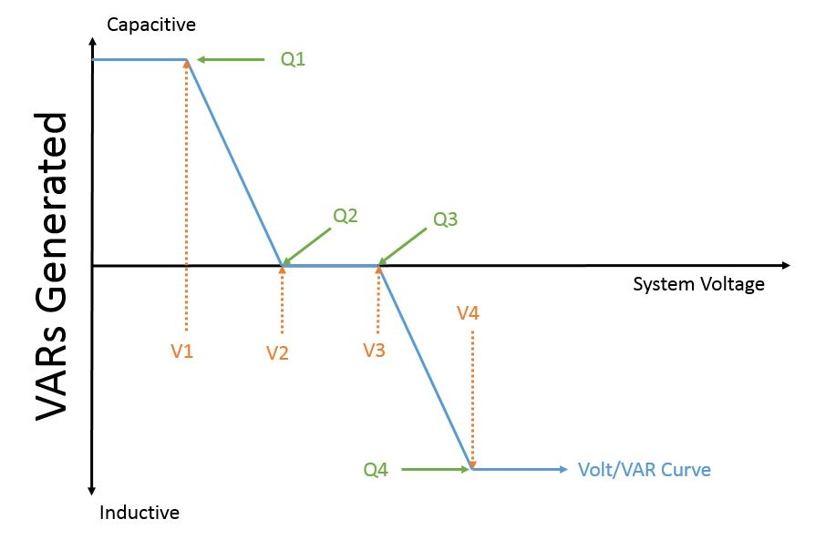
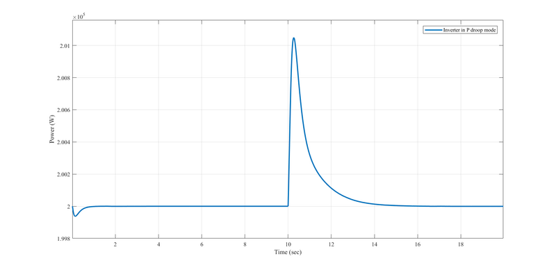

!!! warning

    The droop inverter model is a very early steady-state model, which has been succeeded by the [inverter_dyn](../Inverters/Spec_inverter_dyn.md) model.

This document describes GridLAB-D™ implementation of the **CONSTANT_PQ** mode inverter with droops. The implementation is based on the existing inverter **CONSTANT_PQ** mode source codes. In the original **CONSTANT_PQ** mode inverter, during event mode simulation, the inverter current outputs are computed based on the reference power values and the terminal voltage values; During transient mode simulation, the inverter real and reactive power outputs are compared with the reference values in each delta time step, and a PI controller is connected after the comparison, for the calculation of the updated current injection `Iout` from inverter. 

{ #fig:inverter-pi-control }

With the droop mode inverter implemented inside the **CONSTANT_PQ** mode inverter, the reference power values will be updated by checking the measured feeder frequency and the inverter terminal voltage with the droop curve setpoints. 

{ #fig:invert-p-f-top-and-q-v-bottom-droop-control }

The capability to run in transient mode is implemented in battery object. The battery can be attached to the droop inverter. 

## GridLAB-D™ implementation

### PQ constant mode inverter with droop curves example

This inverter object is a **CONSTANT_PQ** mode inverter with droop curves. The inverter is implemented under the inverter type `four_quadrant_control_mode`. The **CONSTANT_PQ** mode is chosen by selecting `four_quadrant_control_mode` as **CONSTANT_PQ**. The droop curves are implemented only when dynamic_model_mode is selected as PI. The droops are by default not selected for the **CONSTANT_PQ** mode inverter, user has to set `inverter_droop_fp` as true for p/f droop, and set `inverter_droop_vq` as `true` for q/v droop. The delay time are by default the same as the delta time step defined, user can define the delay time with larger values.   
  
In this example, the delay time of seeing the measured frequency and terminal voltage is set as 0.01 s. The droop of f/p curve is set as 0.000001, and the droop of v/q curve is set as 0.005. 
    
    
    module generators;
    object inverter {
         parent 1370;
         name const_pq_inv1;
         inverter_type FOUR_QUADRANT;
         use_multipoint_efficiency FALSE;
         four_quadrant_control_mode CONSTANT_PQ;
         generator_status ONLINE;
         inverter_efficiency 0.99;
         rated_power 300 kVA;
         P_Out 200000;
         Q_Out 100000;
         V_In 1000+0j;
         I_In 1000+0j;
         flags DELTAMODE;
         dynamic_model_mode PI; 
         inverter_convergence_criterion 0.001;
         // PI controller parameters
         kpd 0.001;
         kid 0.09;
         kpq 0.001;
         kiq 0.09;
         // Droop curve parameters
         inverter_droop_fp true;
         Tfreq_delay 0.01;
         R_fp 0.000001;
         inverter_droop_vq false;
         Tvol_delay 0.01;
         R_vq 0.005;
    }

## Synopsis
    
    
    module generators;
    class inverter {
            enumeration {FOUR_QUADRANT=4, PWM=3, TWELVE_PULSE=2, SIX_PULSE=1, TWO_PULSE=0} inverter_type;
            enumeration {NONE=0,CONSTANT_PQ=1,CONSTANT_PF=2, VOLT_VAR=4  , LOAD_FOLLOWING=5, GROUP_LOAD_FOLLOWING=6} four_quadrant_control_mode;
            enumeration {INCLUDED,EXCLUDED} [pf_reg]
            enumeration {ONLINE=2, OFFLINE=1} generator_status;
            enumeration {SUPPLY_DRIVEN=5, CONSTANT_PF=4, CONSTANT_PQ=2, CONSTANT_V=1, UNKNOWN=0} generator_mode;
            complex V_In[V];
            complex I_In[A];
            complex VA_In[VA];
            complex VA_Out[VA]
            complex Vdc[V];
            complex phaseA_V_Out[V];
            complex phaseB_V_Out[V];
            complex phaseC_V_Out[V];
            complex phaseA_I_Out[A];
            complex phaseB_I_Out[A];
            complex phaseC_I_Out[A];
            complex power_A[VA];
            complex power_B[VA];
            complex power_C[VA];
            complex P_Out[VA];
            complex Q_Out[VAr];
            complex power_factor[unit];
            double power_in[W]; 
            double rated_power[VA]; 
            double rated_battery_power[W]; 
            double inverter_efficiency; 
            double battery_SOC[pu]; 
            double soc_reserve[pu]; 
            bool use_multipoint_efficiency; 
            enumeration {XANTREX=3, SMA=2, FRONIUS=1, NONE=0} inverter_manufacturer;
            double maximum_dc_power[W];
            double maximum_dc_voltage[V];
            double minimum_dc_power[W];
            double c_o[1/W];
            double c_1[1/V];
            double c_2[1/V];
            double c_3[1/V];
            set {S=112, N=8, C=4, B=2, A=1} phases;
            object sense_object;
            double max_charge_rate[W];
            double max_discharge_rate[W];
            double charge_on_threshold[W];
            double charge_off_threshold[W];
            double discharge_on_threshold[W];
            double discharge_off_threshold[W];
            double excess_input_power[W];
            double charge_lockout_time[s];
            double discharge_lockout_time[s];
            double pf_reg_activate;
            double pf_reg_deactivate;
            double pf_reg_activate_lockout_time[s];
            double charge_threshold[W];
            double discharge_threshold[W];
            double group_max_charge_rate[W];
            double group_max_discharge_rate[W];
            double group_rated_power[W];
            double V_base[V]; 
            double V1[pu]; 
            double V2[pu]; 
            double V3[pu]; 
            double V4[pu]; 
            double Q1[pu]; 
            double Q2[pu]; 
            double Q3[pu]; 
            double Q4[pu]; 
    }
    

## Properties

### User-Defined

Table: User-Defined Properties { #tbl:Properties }

Property name | Type | Unit | Description   
---|---|---|---  
**inverter_type** | enumeration | none | Defines type of inverter technology and efficiency of the unit (FOUR_QUADRANT , PWM, TWELVE_PULSE, SIX_PULSE, TWO_PULSE)   
**generator_status** | enumeration | none | Defines if generator is in operation or not (ONLINE, OFFLINE)   
**generator_mode** | enumeration | none | Control mode of the inverter (SUPPLY_DRIVEN, CONSTANT_PF, CONSTANT_PQ, CONSTANT_V, UNKNOWN)   
**four_quadrant_control_mode** | enumeration | none | Control mode of the inverter when FOUR_QUADRANT (NONE, CONSTANT_PQ, CONSTANT_PF, CONSTANT_V, VOLT_VAR)   
**V_In** | complex | V | DC voltage passed in by the DC object (e.g. solar panel or battery)   
**I_In** | complex | A | DC current passed in by the DC object (e.g. solar panel or battery)   
**Vdc** | complex | V | _Not used at this time_  
**power_factor** | double | unit | Defines desired power factor in generator mode CONSTANT_PF mode and in four quadrant control mode CONSTANT_PF  
**P_Out** | double | VA | Value to output in four quadrant control mode CONSTANT_PQ  
**Q_Out** | double | VAr | Value to output in four quadrant control mode CONSTANT_PQ  
**use_multipoint_efficiency** | bool | none | A boolean flag to toggle using Sandia National Laboratory's multipoint efficiency model   
**inverter_efficiency** | double | none | One-way (not round-trip) constant efficiency of the inverter   
**inverter_manufacturer** | enumeration | none | Defines default parameters for the multipoint efficiency model for an inverter from manufacturer (NONE, FRONIUS, SMA, XANTREX)   
**maximum_dc_power** | double | W | The maximum DC power rating of the inverter, only used when use_multipoint_efficiency is TRUE  
**maximum_dc_voltage** | double | V | The maximum DC voltage rating of the inverter, only used when use_multipoint_efficiency is TRUE  
**minimum_dc_power** | double | W | The minimum DC voltage rating of the inverter, only used when use_multipoint_efficiency is TRUE  
**c_o** | double | 1/W | The coefficient descibing the parabolic relationship between AC and DC power of the inverter, only used when use_multipoint_efficiency is TRUE  
**c_1** | double | 1/V | The coefficient allowing the maximum DC power to vary linearly with DC voltage, only used when use_multipoint_efficiency is TRUE  
**c_2** | double | 1/V | The coefficient allowing the minimum DC power to vary linearly with DC voltage, only used when use_multipoint_efficiency is TRUE  
**c_3** | double | 1/V | The coefficient allowing c_0 to vary linearly with DC voltage, only used when use_multipoint_efficiency is TRUE  
**sense_object** | object | none | FOUR QUADRANT MODEL: name of the object the inverter is trying to mitigate the load on (node/link) in LOAD_FOLLOWING and supplement mode pf_reg   
**max_charge_rate** | double | W | FOUR QUADRANT MODEL: name of the object the inverter is trying to mitigate the load on (node/link) in LOAD_FOLLOWING   
**max_discharge_rate** | double | W | FOUR QUADRANT MODEL: maximum rate the battery can be discharged in LOAD_FOLLOWING   
**charge_on_threshold** | double | W | FOUR QUADRANT MODEL: power level of the sense_object at which the inverter should try charging the battery in LOAD_FOLLOWING   
**charge_off_threshold** | double | W | FOUR QUADRANT MODEL: power level of the sense_object at which the inverter should cease charging the battery in LOAD_FOLLOWING   
**discharge_on_threshold** | double | W | FOUR QUADRANT MODEL: power level of the sense_object at which the inverter should try discharging the battery in LOAD_FOLLOWING   
**discharge_off_threshold** | double | W | FOUR QUADRANT MODEL: power level of the sense_object at which the inverter should cease discharging the battery in LOAD_FOLLOWING   
**excess_input_power** | double | W | FOUR QUADRANT MODEL: Excess power at the input of the inverter that is otherwise just lost, or could be shunted to a battery   
**charge_lockout_time** | double | s | FOUR QUADRANT MODEL: Lockout time when a charging operation occurs before another LOAD_FOLLOWING dispatch operation can occur   
**discharge_lockout_time** | double | s | FOUR QUADRANT MODEL: Lockout time when a discharging operation occurs before another LOAD_FOLLOWING dispatch operation can occur   
**pf_reg_activate** | double | none | FOUR QUADRANT MODEL: Lowest acceptable power-factor level of the sense_object below which power-factor regulation will activate. Default value is 0.8.   
**pf_reg_deactivate** | double | none | FOUR QUADRANT MODEL: Lowest acceptable power-factor of the sense_object above which no power-factor regulation is needed. Default value is 0.95.   
**pf_reg_activate_lockout_time** | double | s | FOUR QUADRANT MODEL: Mandatory pause between the deactivation of power-factor regulation and it reactivation. Default value is 60s.   
**charge_threshold** | double | W | FOUR QUADRANT MODEL: Level at which all inverters in the group will begin charging attached batteries. Regulated minimum load level   
**discharge_threshold** | double | W | FOUR QUADRANT MODEL: Level at which all inverters in the group will begin discharging attached batteries. Regulated maximum load level   
**group_max_charge_rate** | double | W | FOUR QUADRANT MODEL: Sum of the charge rates of the batteries involved in the group load-following   
**group_max_discharge_rate** | double | W | FOUR QUADRANT MODEL: Sum of the discharge rates of the batteries involved in the group load-following   
**group_rated_power** | double | W | FOUR QUADRANT MODEL: Sum of the inverter power ratings of the inverters involved in the group power-factor regulation   
**V_base** | double | V | FOUR QUADRANT MODEL: The base voltage on the grid side of the inverter. Used in VOLT_VAR control mode   
**V1** | double | pu | FOUR QUADRANT MODEL: voltage point 1 in volt/var curve. Used in VOLT_VAR control mode   
**V2** | double | pu | FOUR QUADRANT MODEL: voltage point 2 in volt/var curve. Used in VOLT_VAR control mode   
**V3** | double | pu | FOUR QUADRANT MODEL: voltage point 3 in volt/var curve. Used in VOLT_VAR control mode   
**V4** | double | pu | FOUR QUADRANT MODEL: voltage point 4 in volt/var curve. Used in VOLT_VAR control mode   
**Q1** | double | pu | FOUR QUADRANT MODEL: VAR point 1 in volt/var curve. Used in VOLT_VAR control mode   
**Q2** | double | pu | FOUR QUADRANT MODEL: VAR point 2 in volt/var curve. Used in VOLT_VAR control mode   
**Q3** | double | pu | FOUR QUADRANT MODEL: VAR point 3 in volt/var curve. Used in VOLT_VAR control mode   
**Q4** | double | pu | FOUR QUADRANT MODEL: VAR point 4 in volt/var curve. Used in VOLT_VAR control mode   
  
### Not User-Defined

Table: Not User-Defined Properties{ #tbl:N_prop
 }
Property name | Type | Unit | Description   
---|---|---|---  
**VA_In** | complex | VA | Power passed in by the DC object (e.g. solar panel or battery) – V_In * I_In  
**phaseA_V_Out** | complex | V | AC voltage coming from the interconnection point   
**phaseB_V_Out** | complex | V | AC voltage coming from the interconnection point   
**phaseC_V_Out** | complex | V | AC voltage coming from the interconnection point   
**phaseA_I_Out** | complex | A | AC current being delivered to the interconnection point   
**phaseB_I_Out** | complex | A | AC current being delivered to the interconnection point   
**phaseC_I_Out** | complex | A | AC current being delivered to the interconnection point   
**power_A** | complex | VA | Calculation of power delivered to interconnection node   
**power_B** | complex | VA | Calculation of power delivered to interconnection node   
**power_C** | complex | VA | Calculation of power delivered to interconnection node   
**phases** | set | none | Not used at this time-- phases assumed from interconnection point(A,B,C,N,S)   
  
## Default Inverter

The minimum definition for an inverter is 
    
    
    object inverter {
            generator_mode CONSTANT_PF;
            << implied child that provides a DC power input >>
    }
    

## Example
    
    
    module generators;
    object inverter {
         generator_mode CONSTANT_PF;
         generator_status ONLINE;
         inverter_type PWM;
         power_factor 1.0;
         parent triplex_meter2;
         << implied child that provides a DC power input >>
    }
    
    

## Volt/Var Control Mode 

The VOLT_VAR mode is used to have the inverter generate/absorb VARs based off of the system voltage seen at the inverter terminals. The output on each phase determined on the system voltage measured on said phase. for example, in a three phase inverter, the output on phase A is based off of the phase A voltage measurement, the output on phase B is based off of the phase B voltage measurement, and the output on phase C is based off of the phase C voltage measurement. The inverter determines how much VARs are generated or absorbed by a volt/VAR curve that the user creates by setting the V1, V2, V3, V4, Q1, Q2, Q3, and Q4 parameters. See the illustration below showing curve generated by these parameters. 

{ #fig:VoltVARcurve }

The values of these parameters is per unit. V_base is used to convert the voltage measurement to a per unit value. The rated_power parameter is used to convert the per unit value of VAR output into VARs. Note that rated_power is a per-phase limit, so for three-phase inverters, the overall limit will be three-times that value. The inverter will try to output the amount of VARs determined from the curve without exceeding the power curve of the inverter. 
    
    
    object inverter {
        name volt_var_inv;
        parent inv_meter;
        inverter_type FOUR_QUADRANT;
        four_quadrant_control_mode VOLT_VAR;
        generator_status ONLINE;
        generator_mode SUPPLY_DRIVEN;
        phases ABC;
        rated_power 70 kVA;// per phase;
        inverter_efficiency 0.87;
        //Volt Var parameters;
        V_base 7200;
        V1 0.90;
        Q1 0.7;
        V2 0.95;
        Q2 0.0;
        V3 1.05;
        Q3 0.0;
        V4 1.10;
        Q4 -0.8;
    }

## Test cases

In IEEE 123-bus feeder, one diesel generator of isochronous mode is placed at the swing bus, and one inverter of p/f droop and **constant_Q** mode is placed at node 54.

At 2001-08-01 12:00:10.001 PST, three-phase load 49 increases based on the given players. The diesel generator increases its power to maintain the feeder frequency. Although there is f/p droop enabled in the inverter, since no speed change is detected, inverter real power outputs are kept the same as the reference value after transient.   

{ #fig:inverter-droop }

To run this case, please find in the autotest in GridLAB-D™ generator module. 

## Four Quadrant Control Mode

The value for `four_quadrant_control_mode` determines the value at which `VA_Out` is set. The default value for `four_quadrant_control_mode` is `NONE`.

        module generators;
        class inverter {
            enumeration {} four_quadrant_control_mode;
        }
        object inverter {
            four_quadrant_control_mode value;
        }

Value | Description
-- | --
NONE | The value for `VA_Out` is left as the result of its initial calculation using VA_In, efficiency, and losses. 
CONSTANT_PQ | The value for `VA_Out` is comprised of the values for P_Out and Q_Out.
CONSTANT_PF | The value for `VA_Out` is calculated such that the value for power_factor remains constant.
CONSTANT_V | This mode is not yet implemented.
VOLT_VAR | This mode is not yet implemented.
LOAD_FOLLOWING | The output of the inverter is based on the real power defined by the sense_object, seeking to shave the peaks and fill the valleys by modulating its own power output. The parameters for this control mode assume an energy storage device is attached to the inverter.
VOLTAGE_SOURCE | The inverter is acting as a voltage source with two modes available, isochronous mode and droop mode.

## Related Concepts:

  * Modules
    * generators
      * inverter
        * Droop inverter
        * Voltage source inverter (VSI)
