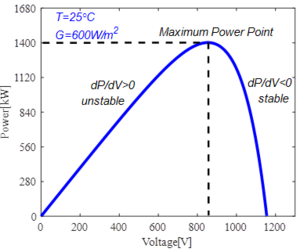

# Solar Panel

A solar panel (also known as solar module or photovoltaic module/panel) is an assembly of solar cells. Solar objects are typically parented to `inverter` or `inverter_dyn`, but can also run headless with internal default voltage/current placeholders (with warnings).

A minimal model could be created via:

    object solar {
        panel_type SINGLE_CRYSTAL_SILICON;
        SOLAR_POWER_MODEL DEFAULT;
        efficiency 0.2;
        parent inverter1;
        area 2500;
    }

## Properties

Property name | Type | Unit | Description | Default
---|---|---|---|---
**pvc_Pmax_calc_simp_mode** | bool | n/a | If true, PV-curve max power is approximated as `pvc_U_m_V * pvc_I_m_A`. | TRUE
**t_ref_cels** | double | degC | Reference cell temperature for PV-curve equations. | 25
**S_ref_wpm2** | double | W/m^2 | Reference insolation for PV-curve equations. | 1000
**pvc_a1_inv_cels** | double | 1/degC | PV-curve temperature coefficient for current term `dI`. | 0
**pvc_b1_inv_cels** | double | 1/degC | PV-curve temperature coefficient for voltage term `dU`. | 0
**pvc_U_oc_V** | double | V | PV open-circuit voltage parameter. | 0 (auto-derived in PV_CURVE mode if needed)
**pvc_I_sc_A** | double | A | PV short-circuit current parameter. | 0 (auto-derived in PV_CURVE mode if needed)
**pvc_U_m_V** | double | V | PV voltage at maximum power point. | 0 (auto-derived in PV_CURVE mode if needed)
**pvc_I_m_A** | double | A | PV current at maximum power point. | 0 (auto-derived in PV_CURVE mode if needed)
**MAX_NR_ITERATIONS** | int16 | n/a | Maximum Newton-Raphson iterations for PV_CURVE solver. | 32767
**x0_root_rt** | double | n/a | Initial guess offset ratio for Newton-Raphson root search. | 0.15
**DOA_NR_ITERATIONS** | double | n/a | Newton-Raphson degree-of-accuracy threshold. | 1e-5
**panel_type** | enumeration | n/a | Panel technology. Values: SINGLE_CRYSTAL_SILICON, MULTI_CRYSTAL_SILICON, AMORPHOUS_SILICON, THIN_FILM_GA_AS, CONCENTRATOR. | SINGLE_CRYSTAL_SILICON
**SOLAR_TILT_MODEL** | enumeration | n/a | Tilt/irradiance model. Values: DEFAULT, SOLPOS, PLAYERVALUE. | DEFAULT
**SOLAR_POWER_MODEL** | enumeration | n/a | Power model. Values: DEFAULT, FLATPLATE, PV_CURVE. | DEFAULT
**a_coeff** | double | n/a | Module temperature correction coefficient `a`. | -2.81
**b_coeff[s/m]** | double | s/m | Module temperature correction coefficient `b`. | -0.0455
**dT_coeff[m*m*degC/kW]** | double | m*m*degC/kW | Module temperature correction coefficient `dT`. | 0.0
**T_coeff[%/degC]** | double | %/degC | Maximum-power temperature coefficient. | -0.5
**NOCT[degF]** | double | degF | Nominal operating cell temperature. | 118.4
**Tmodule[degF]** | double | degF | Module temperature used in legacy power calculations. | Computed
**Tambient[degC]** | double | degC | Ambient temperature used in model calculations. | 25.0
**wind_speed[mph]** | double | mph | Ambient wind speed (used in FLATPLATE mode). | 0.0
**ambient_temperature[degF]** | double | degF | Ambient air temperature input. | 77
**Insolation** | double | W/sf | Effective incident irradiance. | 0
**Rinternal** | double | Ohm | Internal resistance (legacy placeholder). | 0.05
**Rated_Insolation** | double | W/sf | Rated insolation value used in scaling. | 92.902
**Pmax_temp_coeff** | double | n/a | Temperature coefficient for power output. | Panel-dependent (set during init)
**Voc_temp_coeff** | double | n/a | Temperature coefficient for open-circuit voltage. | Panel-dependent (set during init)
**V_Max** | double | V | Maximum operating voltage of the PV module. | 27.1
**Voc_Max** | double | V | Maximum open-circuit voltage of the module. | 34.0
**Voc** | double | V | Current open-circuit voltage value. | 34.0
**efficiency** | double | unit | Conversion efficiency from insolation to DC power. | Panel-dependent (defaults from panel type)
**area** | double | sf | PV array area. | 0
**soiling** | double | pu | Array soiling factor. | 0.95
**derating** | double | pu | Panel derating factor. | 0.95
**Tcell** | double | degC | PV cell temperature. | 21.0
**rated_power** | double | W | Rated array power (`Max_P`). | 0 (auto-derived if omitted)
**P_Out** | double | kW | DC power output to inverter. | Computed
**V_Out** | double | V | DC output voltage to inverter. | Computed
**I_Out** | double | A | DC output current to inverter. | Computed
**weather** | object | n/a | Optional climate object reference. | auto-discovered if available
**shading_factor** | double | pu | Irradiance scaling factor for shading. | 1.0
**tilt_angle** | double | deg | PV array tilt angle. | 45
**orientation_azimuth** | double | deg | Cardinal azimuth (0=N, 90=E, 180=S, 270=W). | 180
**latitude_angle_fix** | bool | n/a | If true, tilt is set from climate latitude. | FALSE
**default_voltage_variable** | double | n/a | Hidden placeholder voltage for headless operation. | hidden
**default_current_variable** | double | n/a | Hidden placeholder current for headless operation. | hidden
**default_power_variable** | double | n/a | Hidden placeholder power for headless operation. | hidden
**orientation** | enumeration | n/a | Orientation type. Values: DEFAULT, FIXED_AXIS (others reserved/not implemented). | DEFAULT

## Example

    object solar {
        parent inverter1;
        panel_type SINGLE_CRYSTAL_SILICON;
        SOLAR_POWER_MODEL FLATPLATE;
        SOLAR_TILT_MODEL SOLPOS;
        orientation FIXED_AXIS;
        tilt_angle 30;
        orientation_azimuth 180;
        shading_factor 0.95;
        efficiency 0.2;
        area 2500;
    }
  
## Orientation

Type of panel orientation. The documented and implemented operating modes are DEFAULT and FIXED_AXIS.

- DEFAULT: ideal-tracking style insolation path.
- FIXED_AXIS: uses fixed `tilt_angle` and `orientation_azimuth` with the selected `SOLAR_TILT_MODEL`.

`ONE_AXIS`, `TWO_AXIS`, and `AZIMUTH_AXIS` are enum placeholders but are not implemented for runtime calculations.
    
    object solar {
            orientation FIXED_AXIS;
    }
    

This orientation uses ideal insolation. Insolation is calculated by 
    
    Insolation = solar_flux * shading_factor
    

where the value for solar_flux comes from mapped climate calculations when weather/climate data is available. Without climate data, the model falls back to static behavior and warns.

* **FIXED_AXIS** -
When orientation is set as FIXED_AXIS, weather, tilt_angle, orientation_azimuth, SOLAR_TILT_MODEL, and shading_factor are all used to calculate the solar radiation. 

* **ONE_AXIS** - _Placeholder only; not implemented_
* **TWO_AXIS** - _Placeholder only; not implemented_
* **AZIMUTH_AXIS** - _Placeholder only; not implemented_

## Solar Tilt Model

Underlying solar position and tilt model used to calculate irradiance on the panel. Implemented model types include **DEFAULT** and **SOLPOS** for fixed-axis calculations, with **PLAYERVALUE** for player-driven insolation workflows.

    object solar {
        SOLAR_TILT_MODEL SOLPOS;
    }

* **DEFAULT** - 
The incident solar radiation on a tilted array is calculated using algorithms from Solar Energy Thermal Processes by Duffie and Beckman (1974).

* **SOLPOS** - 
The incident solar radiation on a tilted array is calculated using algoirthms from the [NREL SOLPOS] page and from "Modeling Daylight Availability and Irradiance Components from Direct and Global Irradiance" in Solar Energy volume 44, number 3 by Perez et al.

* **PLAYERVALUE** -
Bypasses internal tilt-position calculations and expects externally provided/played values (for example `Insolation`, `ambient_temperature`, `wind_speed`).

## Model with DC Bus Model

The solar panel, when properly interfaced with an inverter_dyn object in grid-forming mode, will provide DC bus changes and some minor transient detail. A behavioral model of PV cell is adopted here, the advantage of this model is that it only needs parameters of output characteristics of PV cell such as open-circuit voltage ($U_{oc}$), short-circuit current ($I_{sc}$), voltage and current at maximum power operating point ($U_m$ and $I_m$). 

The formulas which describe the behavioral model are given as below: 

$\displaystyle{}I=I_{sc}\left[1-C_1\left(\exp{\frac{U-dU}{C_2U_{oc}}}-1\right)\right]+dI$ | (1)   
---|---  
$\displaystyle{}C_1=\left(1+\frac{I_m}{I_{sc}}-\right)\exp{\frac{-U_m}{C_2U_{oc}}}$ | (2)   
$\displaystyle{}C_2=\left(\frac{U_m}{U_{oc}}-1\right)\left[\ln{1-\frac{I_m}{I_{sc}}}\right]^{-1}$ |  (3)   
$\displaystyle{}dU=-b_1U_{oc}(t-t_{ref})$ | (4)   
$\displaystyle{}dI=I_{sc}\left[a_1\frac{S}{S_{ref}}\left(t-t_{ref}\right)+\left(\frac{S}{S_{ref}}-1\right)\right]$ | (5)   
  
Where $S_{ref}$ and $t_{ref}$ are light intensity and temperature in standard environment ($S_{ref}=1000\frac{w}{m^2}$, $t_{ref}=25^{\circ}C$), $S$ and $t$ are real light intensity and temperature, $a_1$ and $b_1$ are parameters that used to revise the output characteristics of PV panel in different environment. $a_1$ and $b_1$ are set zero in this instance. 

A real PV panel has been modeled according to the formulas above, the output parameters of which are given in Table 1: 

##### Table 1 - Output Parameters of 

PV Panel  Variable | Units | Value   
---|---|---  
$\displaystyle{}U_{oc}$ | V | 1005   
$\displaystyle{}I_{sc}$ | A | 100   
$\displaystyle{}U_{m}$ | V | 750   
$\displaystyle{}I_{m}$ | A | 84   
  
In GridLAB-D™ simulation, the PV panel is modeled as a controllable current source, with the light intensity ($S$), temperature ($t$) and voltage of PV panel as inputs. The output of the model is the current of PV panel. 

The P-V curve of this PV panel is given in Figure 1, the maximum power is about 1400kW and the voltage at maximum power point is 850V. ($t=25^{\circ}C, S=600\frac{w}{m^2}$). 

##### Figure 1 - P-V Curve of PV Panel

