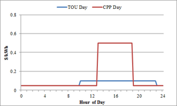

# Market User Guide 

The **market module** is defined primarily by the bidding market capability it creates on the system. The actual market is created inside the `auction` object. The `auction` object is an object within the **market module**. The `auction` object accepts bids from supply and demand devices within a system (sellers and buyers). After a set interval, the auction will resolve the supply and demand quantities and prices in a double-auction style to clear the market. This price will become the relevant cleared price after a specified latency interval.

## Market Objects

Current market objects (non-deprecated) include: 

  * Auction objects (bid collection and market clearing):  
    * Auction
    * Stubauction  

  * Controller objects (modify behavior of controlled object and may bid into market):  
    * Controller  
    * Passive Controller
    * Generator Controller

  * Bidding objects (bids into a market, but does not control the response of any other object):  
    * Stub Bidder  

  * Functional objects (contain functions for use by auction and controller objects - not described here) 
    * Bid
    * Curve

TODO - Deprecated? - defs from Market (module) marked deprecated. Keep?

### Classes

Class | Description
-- | --
**Auction** | The auction class, usually referred to as a market, is the primary class in the Market module. It provides a double-auction for producers and consumers to establish auction clearing prices and quantities, along with calculating average and standard deviation for the clearing prices. 
**Auction Stub (stubauction)** | The **stubauction class** is similar to the Auction class, but has been stripped of the market-clearing and bidding logic. It is used to provide a controllable framework for situations in which there is already market price information to be fed into a simulation verbatim. 
**Controller** | The **controller class** is a basic price-responsive, finite-output appliance controller. It adjusts a set point in order to optimize the cost of energy consumption against the energy needs of the appliance and the price of energy. 
**Controller2** | The secondary controller provides more generic appliance responsiveness, allowing for devices to either be finitely controlled or forced into an on or off state. The controller is not currently expected to be an active power bidder, but is being designed to be responsive to uncontrollable input, whether price, frequency, voltage, water pressure, or other published properties. 
**Double_Controller** | The **double-setpoint controller** is designed primarily to control thermostats that have demand responsive cooling and heating on the same device. It is specifically able to properly bid up the energy demand and the price for the proper mode of the thermostat at a given time, and manages the setpoints to prevent overlap and optimize use of heating or cooling under typical conditions. 

## Auction Object

The auction provides a means for different objects within the GridLAB-D™ program to base their supply or demand on a dynamic or real time price. The market implemented in the auction object is implemented as a double-auction market. A double-auction market is one where suppliers and demanders (sellers and bidders) submit their bids of desired price for a set quantity simultaneously. Once the bidding submission period ends, the market "clears" by selecting the intersection point of the supply and demand curves. After the market clears and the relevant latency interval expires, the market price becomes active. At this point, devices that bid into the market will respond appropriately based on internal logic comparing their bid price to the market clearing price. The auction object does not provide any book-keeping or enforcement of the market, it simply provides a central market for buyers and sellers to bid their respective prices and quantities. 

Further information describing clearing mechanisms and basic operation can be found at **Market_module**. 

### Auction Parameters

Input Name  | Unit/Type  | Description   
---|---|---  
`period` | seconds | Defines the time between market clearings. This is also the valid bidding period for the market.   
`unit` | unit | This describes the unit the auction is expecting to have information provided and delivered (input and output) for quantities. If a variable has units assigned to it, the auction will check to verify units are correct and convert where necessary (e.g. W->kW). If the variable does NOT have a unit assigned, such as a schedule or player file, the auction will assume the values are in this unit. Typical units are kW or MWh.   
`latency` | seconds | Defines the time between the market clearing and the price becoming active. For example, if the latency was set to 300 seconds (5 minutes), once the market clears, the current price would be "active" 5 minutes later.   
`special_mode` | enumeration | Enables different market type modes. The default is the normal double-blind auction scenario. With SELLERS_ONLY set, the market assumes no buyers will bid into the market and uses a fixed price or quantity (defined by `fixed_price` or `fixed_quantity` below) for the buyer's market. This is implemented as a single-blind auction scenario. BUYERS_ONLY is the converse scenario with the assumption that no sellers are on the system. The seller's market is then defined by the `fixed_price` or `fixed_quantity` inputs.  - NONE (default)  - SELLERS_ONLY  - BUYERS_ONLY
`fixed_price` | currency | Defines the fixed price for special market bids. If `special_mode`; is defined as something other than_ NONE _, the market will use this price as the bidding price of the absent party (buyer or seller) for all market clearing scenarios._  
`fixed_quantity` | units | Defines the fixed quantity for special market bids. If `special_mode` is defined as something other than NONE, the market will use this quantity as the bidding quantity of the absent party (buyer or seller) for all market clearing scenarios.   
`capacity_reference_object` | object | Defines an object in the current system that contains a cumulative "units" property. This property represents the total demand on the market and is to be used to help estimate unresponsive buyers on the system. The secondary variable, `capacity_reference_property` is the specific property of the object use. In a power system market, `capacity_reference_object` would be the feeder-level transformer object, and `capacity_reference_property` would be a property like `power_in`.   
`capacity_reference_property` | property | Defines the property of an object in the current system that contains a cumulative "units" value. This value represents the total demand on the market and is to be used to help estimate unresponsive buyers on the system. This property is read from the object specified in `capacity_reference_object`. In a power system market, `capacity_reference_object` would be the feeder-level transformer object, and `capacity_reference_property` would be a property like `power_in`.   
`capacity_reference_bid_price` | units | Defines the price that the capacity reference should be bid at (typically `price_cap`).   
`max_capacity_reference_bid_quantity` | units | Defines the maximum quantity that the capacity reference should be bid at (e.g. the maximum rated power at the sustation).   
 `capacity_reference_bid_quantity` | - | Not used at this time.   
`linkref` | units | This is a deprecated value that has similar properties to * `capacity_reference_object` , but is no longer supported.   
`price_cap` | currency | Defines a maximum allowable bid price on the system. This bid effectively represents an infinite bid (this buyer must be satisfied first, or this seller must only be used as a last resort). Any bids above (or below the negative of) the amount will be truncated to this value and generate a warning message.   
`init_price` | currency | Defines the initial value to populate the market statistic buffer with. This will result in a mean of `init_price` for all starting intervals. For example, if `init_price` is 5.0, then `current_mean_1d` would be 5.0. The calculated means will immediately become "valid" and slowly update toward the actual mean as the initial buffer is fully populated with clearing prices.   
`init_stdev` | currency | Defines the initial value for populating any uninitialized standard deviations. If the standard deviation is not initialized on `auction` creation, it will revert to this value until the statistics interval is valid. For example, with a 1-hour market period, `current_stdev_1d` would remain at `init_stdev` until 24 market clearing prices are obtained. At this point, the `current_stdev_1d` value will represent the calculated standard deviation, not the value in `init_stdev`. This value **must** be specified, or the explicit `past_stdev_xx` or `current_stdev_xx` **must** be initialized to a user specified value. If unspecified, the `auction` will refuse to start and return an error.   
`warmup` | 0 or 1 | Activates or de-activates bidding during the first 24 hours of the market to assist in "boot-strapping" of the market. If =1, bids will be ignored during first 24 hours of simulation.   
`market_id` | int64 | This value is a unique identifier for each market frame, and is used to track bids across multiple time frames.   
`margin_mode` | enumeration | Controls the way in which a market’s marginal devices behave, when `use_override` is ON. NORMAL indicates that marginal bidders will run normally. DENY will send a ‘turn off’ signal to marginal bidders. PROB indicates that the market has an X% chance of controlling the device to run, where X is the ratio of the marginal quantity to the bid quantity. (a 4.5kW HVAC has an 80% chance of running should the marginal quantity be 3.6kW)  - NORMAL (default)  - DENY   - PROB
`ignore_pricecap` | enumeration | Tells the auction that market cycles that clear at the `price_cap` shall not be used to calculate the mean price and its standard deviation. This prevents moments of market failure or similar price shocks from destabilizing the auction with wildly swinging price statistics.  - TRUE - FALSE (default) 
`verbose` | boolean | Enables verbose output of the market. This will output all individual bid submissions, as well as information about the market clearing. Useful for debugging market interactions, or getting a more thorough view of the market proceedings   
`network` | object | Future implementation and is not currently supported. Will be used to define the communications network to support market operations.   

The following variables define how to create various statistic calculations for the market. More than one can be created per auction.   

Input Name  | Unit/Type  | Description   
---|---|--- 
`statistic_mode` | enumeration | By default, this is ON, and activates the calculation of market statistics a la Olympic Peninsula demonstration.  - ON - OFF
`yyyy_price_mean_x` | currency | Represents the average price associated with the `x` interval defined previously (defined as a module global or a through a property scanning list). `yyyy` represents the interval of this statistic, `current` or `past`. For example, if `x` was "1d" and `yyyy` was "current", `current_price_mean_1d` would represent the mean clearing price of the market for the last 24 hour period.   
`yyyy_price_stdev_x` | currency | Represents the standard deviation associated with the `x` interval defined previously (defined as a module global or a through a property scanning list). `yyyy` represents the interval of this statistic, `current` or `past`. For example, if `x` was "1d" and `yyyy` was "current", `current_price_stdev_1d` would represent the standard deviation of the clearing price of the market for the last 24 hour period.   
`use_future_mean_price` | boolean | By default, this is deactivated (0). If activated, ignores mean value calculations and uses `future_mean_price` as the mean to calculate the standard deviation around. This is used when "day-ahead" markets are considered.   
`future_mean_price` | currency | Value of the mean, if representing a day-ahead market.   

The following variables have special rules for defining various definitions across different frame of time, whether the previous market, current market, or the market being determined. These variables can be called by `market`frame.market`variable`. 

Input Name  | Unit/Type  | Description   
---|---|---   
`.start_time` | - | Represents the time this market becomes active.   
`.end_time` | - | Represents the time this market becomes inactive.   
`.clearing_price` | currency | Represents this market's clearing price.   
`.clearing_quantity` | units | Represents this market's clearing quantity.   
`.clearing_type` | enumeration | Represent the type of clearing situation that has occurred in the current market.  - MARGINAL_SELLER - MARGINAL_BUYER - MARGINAL_PRICE - EXACT - FAILURE - NULL
 `.marginal_quantity`  
`.marginal_quantity_load` | units | Represents the marginal quantity of this market. Useful for debugging, as well as providing information for marginal buyers and sellers to handle proportional responses.   
`.marginal_quantity_bid` | currency | Represents the marginal bid of this market. Useful for debugging, as well as providing information for marginal buyers and sellers to handle proportional responses.   
`.marginal_quantity_frac` | - | Represents the fraction of the bid quantity at the marginal quantity of this market. Useful for debugging, as well as providing information for marginal buyers and sellers to handle proportional responses.   
`.seller_total_quantity` | units | Represents the cumulative quantity of all sellers in the seller curve, corresponding to the upper right corner.   
`.buyer_total_quantity` | units | Represents the cumulative quantity of all buyers in the buyer curve, corresponding to the lower right corner.   
`.seller_min_price` | currency | Represents the price of the lowest seller in the market.   
`.buyer_total_unrep` | units | Represents the total load of the unresponsive buyers in the current market, as defined by those who bid at the price cap.   
`.cap_ref_unrep` | units | Represents the total load of the unresponsive buyers in the current market as it was estimated within the capacity reference object.   
`past_market.` | - | Represents information in the previous market clearing frame.   
`current_market.` | - | Represents information in the current market clearing frame (i.e. it is already a cleared market).   
`next_market.` | - | Represents information in the upcoming market clearing frame (i.e. it is forming a market and collecting information to be cleared at some future time).   

The following variables are used to create logs of the market over time. Note, these files can severely slow down simulation time and create large outputs, however, they are extremely useul for debugging and for understanding of market evolution.   

Input Name  | Unit/Type  | Description   
---|---|---  
`transaction_log_file` | file name | By default, this is off. If given a file name, this log will record every bid (market id, time, price, quantity, state, and object) for both buyers and sellers up to a limit defined by `transaction_log_limit`.   
`transaction_log_limit` | - | Defines how many market cycles to capture in the * `transaction_log_file` in terms of number of unique market ids. By default, this will capture every market from beginning to end of simulation.   
`curve_log_file` | file name | By default, this is off. If given a file name, this log will record the final buyer and seller curve at the end of each market clearing.   
`curve_log_limit` | - | Defines the number of market cycles to capture in the `curve_log_file` in terms of number of uniqure market ids. By default, this will capture every market from beginning to end of simulation.   
`curve_log_info` | enumeration | Determines how much information to record in the `curve_log_file`. If NORMAL, this will only record the buyer and seller curves. If EXTRA, it will also record a number of additional values of interest, such as `.clearing_type` , `.marginal_quantity` , responsive and unresponsive loading, etc.  - NORMAL - EXTRA

Additionally, the auction objects has published functions that can be used in runtime classes or other objects to get bid information into the auction object (`submit_bid` and `submit_bid_state`). The two are similar, except the latter has an additional input to define whether the state or if the load is currently ON or OFF (1 or 0) when the bid occurs. This is used for accounting in the `capacity_reference_bid_quantity`. The format is: 

*   `submit_bid( market object, bidding object, quantity, price, market id )`  

*   `submit_bid_state( market object, bidding object, quantity, price, current state, market id )`

### Examples of Auction Use

This is an auction setup for a single-sided market that allows controllers to respond to changes in price relative to the standard deviation and mean of the previous 24 hours: 
    
    
    class auction {
        double current_price_mean_24h;
        double current_price_stdev_24h;
    }
    
    object auction {
        name Market_1;
        period 900;
        special_mode BUYERS_ONLY;
        unit kW;
         object player {
             file price.player;
             loop 10;
             property current_market.clearing_price;
         };
    }
    

You could also set up your own static values and not use the built-in statistics: 
    
    
    class auction {
        double my_avg;
        double my_std;
    }
    
    object auction {
        name Market_1;
        period 900;
        special_mode BUYERS_ONLY;
        unit kW;
        statistic_mode OFF;
        my_avg 0.110000;
        my_std 0.037953;
         object player {
             file price.player;
             loop 10;
             property current_market.clearing_price;
         };
    }
    

To set up a congestion object with a full double-auction market, where the capacity object could bid in the LMP of the feeder, with a power limit of 1200 kW, and starts collecting bids immediately: 
    
    
    class auction {
        double current_price_mean_24h;
        double current_price_stdev_24h;
    }
    
    object auction {
        name Market_1;
        period 900;
        unit kW;
        capacity_reference_object Substation_Transformer;
        capacity_reference_property power_out_real;
        max_capacity_reference_bid_quantity 1200; //Defaults to 1200 kW
        init_price 0.10;
        init_stdev 0.03;
        warmup 0;
         object player {
             file price.player;
             loop 10;
             property capacity_reference_bid_price;
         };    
    }
    

### Auction State of Development

This model has been well tested and validated, however, as it is used for current and future applications, additional features are added continuously. 

## Controller Object

The `controller` is loosely based upon the design used in the Olympic Peninsula Project. This controller provides price-responsive controls (or other control inputs) to individual objects, typically appliances, within GridLAB-D™. The controller compares the current price signal to the average market price, each delivered by the auction object, and bids the appliance’s current demand as a function of price back into the auction. After the market clears all bids within the system and determines the next market price, the controller modifies the appliance’s set points to reflect operation at the new current price, often related to the standard deviation from the average set point. The set point that is modified depends upon the object to which the controller is modifying. At this time, only devices with continuous temperature set points may be used with the `controller` object. As this object is expanded, additional controls may added that align with the general design principles. 

Further information describing bidding mechanisms and basic operation can be found at **Transactive Control Specifications**. 

### Controller Parameters

**Table 1: Controller inputs.** 

_**Property**_ | **Unit** | **Description**  
---|---|---  
`market` | name | This references the market that provides the price signal to the controller, and generates the rolling average and standard deviations seen by the object. This is also the object into which the controller will bid its price. It is typically specified as an auction or stubauction object, and is typically referenced by the name of the object.   
`parent` | name | This is the object that is being affected by the controller object. To operate with a controller object, the parent object must have a set point that can be monitored and modified by the controller. Since the controller is modifying set points, the parent object should be designed as a state machine, with the ability to determine its load at certain operating conditions. At this time, only the HVAC system (house_e) and the hot water heater object can be used with the controller object.   
`period` | seconds | The period of time for which the controller operates. This signals how often the controller will update the state of the set point and how often the controller will bid into the market. Ideally, this should be identical to, or a multiple of, the auction object’s time period. While this is not required, if the supply bid and demand bids do not coincide, odd behavior may occur. Must be a positive, non-zero value.   
`setpoint`   `heating_setpoint`   `cooling_setpoint` | property | The name of the set point to be modified by the controller object. Within the HVAC system, this would include heating_setpoint or cooling_setpoint. Heating and cooling versions of variable are used in DOUBLE_RAMP mode.   
`base_setpoint`   `heating_base_setpoint`   `cooling_base_setpoint` | - degF degF | This is the temperature set point of the system were there no controller present, or the original set point prior to the controller's input. Future implementations will allow this to control set points other than the temperature. No limit to value. Heating and cooling versions are used in the double_ramp mode.   
`control_mode` | name | This specifies between the various control modes available. These will be further described in the specification documentation.  - RAMP  - DOUBLE_RAMP
`resolve_mode` | name | In certain control modes, multiple set points are controlled simultaneously. This specifies how to resolve a conflict between multiple control modes. This will be described in more detail, but will include `deadband` and `sliding` resolution modes. When multiple control set points are controlled, typically variables such as range and ramp will need to be specified multiple times, independent of each other.  - DEADBAND  - SLIDING
`range_low`   `range_high`   `heating_range_high`   `heating_range_low`   `cooling_range_high`   `cooling_range_low` | - | These are the maximum bounds of variability allowed by the controller. For example, the heating_setpoint may vary +/- 5 degrees, but no more. These are relative to the base_setpoint (+5 F), not absolute (72 F). Range_high must be zero or greater and range_low must be zero or less. Heating and cooling versions are used in the double_ramp mode.   
`ramp_low`   `ramp_high`   `heating_ramp_low`   `heating_ramp_high`   `cooling_ramp_low`   `cooling_ramp_high` | degF | This specifies the slope of the linear control algorithm as a function of the average price, the current price, and the standard deviation from the average, and determines the controllers operation and bid. This will be further discussed later. No limit to value. Heating and cooling versions are used in the double_ramp mode.   
`slider_setting`   `slider_setting_heat`   `slider_setting_cool` | 0 - 1 | These variables are simplified means of assigning value to ramp_low, ramp_high, range_low, and range_high, where 1 is an approximation of the most responsive level. The heat and cool versions are used in the double_ramp mode to specify both sides of the curve.   
`deadband` | property | This is used to point the object property that contains the deadband variable. This is used in DEADBAND resolve_mode.   
`demand`   `cooling_demand`   `heating_demand` | property | The property name within the parent object that specifies the amount of power demanded by the controllable object at that time. For HVAC systems, this is heating_demand or cooling_demand. The heating and cooling versions are used in double_ramp mode.   
`load` | property | The property name within the parent object that specifies the amount of power actually being used by the controllable object at the specified time. For HVAC systems, this is hvac_load.   
`state` | property | The property name within the parent object that specifies the current conditional state of the controllable object. For the HVAC system, this signifies on or off, however, future implementations may include multi-state objects.   
`total` | property | The property name within the parent object that specifies, if any, all uncontrollable loads within that object in addition to the controllable load. For the HVAC model, this includes such things as circulation fan power or standby power settings, and is specified with total_load. It does not include additional panel demand from other appliances.   
`bid_price` | price/energy | This specifies the bidding price for the controller at the given operating points. Must be between negative and positive price cap, or will be cut off by the auction. This is typically a calculated value.   
`bid_quantity` | power | This specifies the amount of power demanded by the object at the determined bid_price. Must be a non-zero positive number. This is typically a calculated value.   
`set_temp` | degF | This specifies the final determined temperature of the controlled set point after the market has been cleared. Future implementations will allow for multi-state objects to be controlled.   
`average_target`   `avg_target` | property | This value points to the property within the auction object which will be used to provide the rolling average price. This is usually determined by a rolling 24 hour average (avg24), a rolling 3-day (avg72), or a rolling week (avg168). Future implementations will allow this rolling average to be determined at any window length. Future implementations will also include the ability to look at variables other than average price and standard deviation.   
`standard_deviation_target`   `std_target` | property | Similar to average_target, but specifies the rolling standard deviation.   
`simple_mode` | enumeration | This will set all of the default parameters for the controller object to automatically control certain pre-defined objects. When using this function, only the properties pertaining to the auction object will need to be set.  - HOUSE_HEAT  - HOUSE_COOL  - HOUSE_PREHEAT  - HOUSE_PRECOOL  - WATERHEATER
`sliding_time_delay` | seconds | This value will allow the user to set a time delay within the sliding resolution mode. It will determine how long the controller stores the previous state when transitions only occur between HEAT/COOL and OFF. At the end of the time delay, the controller will update to the current system mode. If a transition occurs between HEAT <-> COOL (directly or indirectly), then the resolution should be updated to the current state and the time delay re-set.   
`bid_mode` | enumeration | This value is used to turn the bidding strategies on or off. Note: Not currently operational.  - ON  - OFF
`bid_delay` | seconds | This value is used to describe how "early" the controller will bid into the next market cycle. While the name is deceptive, a 10 second delay would mean that the object bids in 10 seconds before the close of the market.   
`use_override` | enumeration | This value is enforce a bidding strategy by commanding a unit to turn on when the bid is "won", or turn off when the bid is "lost", overriding the standard controls of the unit.  - ON  - OFF  
`set_temp` | degF | Calculated value that represents the modified setpoint.   
`override` | property | Used in conjunction with OVERRIDE mode, and assigns a property in the parent object which follow the `override` rules to short-circuit normal operation.   
  
### Examples of Controller Use

Assume an `auction` setup of: 
    
    class auction {
        double current_price_mean_24h;
        double current_price_stdev_24h;
        double my_avg;
        double my_std;
    }
    
    object auction {
        name Market_1;
        period 300;
        unit kW;
        capacity_reference_object Substation_Transformer;
        capacity_reference_property power_out_real;
        max_capacity_reference_bid_quantity 1200; //Defaults to 1200 kW
        init_price 0.10;
        init_stdev 0.03;
        my_avg 0.15;
        my_std 0.05;
        warmup 0;
         object player {
             file price.player;
             loop 10;
             property capacity_reference_bid_price;
         };    
    }
    

Then, a bidding `controller` for an HVAC system in `DOUBLE_RAMP` and `SLIDING` modes, which bids 60 seconds prior to the market closing and uses the previous 24 hours of cleared prices to determine that statistics for responsiveness, could be setup as: 
    
    
    object controller {
        name testController_1;
        parent house_1;
        market Market_1;
        control_mode DOUBLE_RAMP;
        resolve_mode SLIDING;
        bid_mode ON;
        heating_base_setpoint 65;
        cooling_base_setpoint 75;
        target air_temperature;
        deadband thermostat_deadband;
        average_target current_price_mean_24h;
        standard_deviation_target current_price_stdev_24h;
        period 300;
        cooling_setpoint cooling_setpoint;
        heating_setpoint heating_setpoint;
        heating_demand last_heating_load;
        cooling_demand last_cooling_load;
        bid_delay 30;
        heating_range_high 0.265;
        cooling_range_high 0.442;
        heating_range_low -0.442;
        cooling_range_low -0.265;
        heating_ramp_high -2.823;
        cooling_ramp_high 2.823;
        heating_ramp_low -2.823;
        cooling_ramp_low 2.823;
        total total_load;
        load hvac_load;
        state power_state;
    };
    

A similar HVAC `controller` for `RAMP` mode, controlling only the cooling load and bidding immediately prior to market closing, but uses predefined values for average and standard deviation, would be: 
    
    
    object controller {
        name testController_3;
        market Market_1;
        parent house_3;
        bid_mode ON;
        control_mode RAMP;
        base_setpoint 75;
        setpoint cooling_setpoint;
        target air_temperature;
        deadband thermostat_deadband;
        average_target my_avg;
        standard_deviation_target my_std;
        period 300;
        demand last_cooling_load;
        range_high 0.431;
        range_low -0.258;
        ramp_high 2.828;
        ramp_low 2.828;
        //slider_setting 0.2; //This could replace range_high, range_low, ramp_high, and ramp_low.
        total total_load;
        load hvac_load;
        state power_state;
    };
    

### Controller State of Development

This model has been well tested and validated, however, as it is used for current and future applications, additional features are added continuously. 

## Controller2 Object

Deprecated to **Passive Controller**. 

## Double Controller Object

Deprecated to **Controller**. 

## Generator Controller Object

TODO - Status? - Generator Controller Object In development. 

### Generator Controller Parameters

TODO - Status? - Generator Controller Parameters In development. 

### Examples of Generator Controller Use

**TODO** - Empty - Examples of generator controller use

### Generator Controller State of Development

TODO - Status? - Generator Controller State of Development In development. 

## Passive Controller Object

This controller is similar to the `controller` object, except without the capability to bid back into an auction. It is designed as a passive demand response controller, which only receives price (or other) signals, generally from an `auction` or `stubauction` object, and responds accordingly. Additionally, it is used as a test bed for future transactive controller strategies, as it is easier to implement a passive response than an active bidding market. 

Further information describing bidding mechanisms and basic operation can be found at **Transactive Control Specifications**. 

### Passive Controller Parameters

The following table describes available properties of the passive controller 

_**Property**_ | **Unit** | **Description**  
---|---|---  
`setpoint`    `setpoint_prop` | property | Defines the property to be modified by the controller.   
`base_setpoint` | value | This is the value of the set point were the controller not to exist, or the original set point prior to the controller's input. No limit to value.   
`expectation_object`    `expecation_obj` | object | This is the name of the object where the expectation property is found.   
`expectation_property`    `expectation_prop` | property | This is the property of the defined object that the observed property is compared against. In the transactive controller, this would be the average price of the market, while for a frequency control this might be 60 Hz.   
`observation_object`   `observation_obj` | object | The observed object requires that a current value and a standard deviation from the expected value be compared. This is the object where the observed value and the mean and standard deviation of the observed value are to be found.   
`observation_property`   `observation_prop` | property | Observation property is the value to be compared against the expected value.   
`mean_observation_prop` | property | This is the name of the variable which contains the mean of the observed value.   
`stdev_observation_property` `stdev_observation_prop` | property | Standard deviation is the number of deviations away from the expectation property the observation property is currently.   
`observation` | - | When the previous variables are used, this is where the observed value is assigned.   
`mean_observation` | - | When the previous variables are used, this is where the mean value is assigned.   
`stdev_observation` | - | When the previous variables are used, this is where the standard deviation value is assigned.   
`expected` | - | When the previous variables are used, this is where the expected value is assigned.   
`output_setpoint` | - | When the previous variables are used, this is where the updated setpoint value is assigned.   
`state_prop`   `state_property` | property | The property name within the parent object that specifies the current conditional state of the controllable object. For the HVAC system, this signifies on or off, however, future implementations may include multi-state objects.   
`output_state` | - | When the previous variable is assigned, the output state value goes here.   
`parent` | name | This is the object that is being affected by the controller object. To operate with a controller object, the parent object must have a set point that can be monitored and modified by the controller. Since the controller is modifying set points, the parent object should be designed as a state machine, with the ability to determine its load at certain operating conditions. At this time, only the HVAC system (house_e) and the hot water heater object can be used with the controller object.   
`period` | seconds | The period of time for which the controller operates. This signals how often the controller will update the state of the set point and how often the controller will bid into the market. Ideally, this should be identical to, or a multiple of, the auction object’s time period. While this is not required, if the supply bid and demand bids do not coincide, odd behavior may occur. Must be a positive, non-zero value.   
`control_mode` | name | This specifies between the various control modes available. These are further described in the specification documentation.  - NONE   - RAMP   -  DUTYCYCLE   - PROBABILITY_OFF   - ELASTICITY_MODEL
`distribution_type` | name | This specifies between the various distributions available in PROBABILITY_OFF mode. These are further described in the specification documentation.   - NORMAL  - EXPONENTIAL  - UNIFORM  

The following parameters are used in conjunction with PROBABILITY_OFF, a common control mode used with water heaters a la Olympic Peninsula.   

_**Property**_ | **Unit** | **Description** 
---|---|---
`comfort_level` | 0 - 1 | This value is currently only used in conjunction with PROBABILITY_OFF to describe the level of responsiveness of the customer to a high price signal (1 equates to high responsiveness, 0 is low).   
`prob_off` | - | This value is used in conjunction with PROBABILITY_OFF to determine if the appliance should be randomly turned off. It is a calculated value, not an assigned value.   

The following parameters are used in conjunction with RAMP, a common control mode used with HVAC systems, or other continuous control regimes, a la Olympic Peninsula.  

_**Property**_ | **Unit** | **Description** 
---|---|--- 
`range_low`   `range_high`  | - | These are the maximum bounds of variability allowed by the controller. For example, the heating_setpoint may vary +/- 5 degrees, but no more. These are relative to the base_setpoint (+5 F), not absolute (72 F). Range_high must be zero or greater and range_low must be zero or less.   
`ramp_low`    `ramp_high`  | - | This specifies the slope of the linear control algorithm as a function of the average price, the current price, and the standard deviation from the average, and determines the controllers operation and bid. This will be further discussed later. No limit to value.

The following parameters are used in conjunction with `DUTYCYCLE` and `ELASTICITY_MODEL` modes, control modes designed for the FY2011 SGIG analysis. 

_**Property**_ | **Unit** | **Description**  
---|---|--- 
`critical_day` | 1/0 | This is an integer flag. It needs to be set to 1 to specify a Critical (Event) Day and to 0 to specify a Non-Event day.   
`two_tier_cpp` | 1/0 | This is a Boolean flag. It needs to be set to true if a two tier pricing needs to be specified for both Event and Non-Event Days. If using three-tier pricing for Event Days, this flag needs to be set to false.   
`daily_elasticity` | - | This field can be used to specify the value of the Daily Elasticity coefficient. The Daily Elasticity coefficient specifies the factor by which the daily energy consumption changes given a change in the TOU pricing scheme.   
`sub_elasticity_first_second` | - | This field can be used to specify the value of the Substitution Elasticity coefficient between the Peak pricing and the Off Peak pricing. The Substitution Elasticity coefficient specifies the factor by which the average Peak energy consumption is substituted to average off-peak energy consumption, given a change in the TOU pricing scheme. If using Two tier pricing schemes (`two_tier_cpp` is true), for CPP (Event) days (critical_day is 1), this value will be ignored for substitution calculation on CPP days.   
`sub_elasticity_first_third` | - | This field can be used to specify the value of the Substitution Elasticity coefficient between the Critical pricing and the Off Peak pricing. The Substitution Elasticity coefficient specifies the factor by which the average Critical energy consumption is substituted to average off-peak energy consumption, given a change in the TOU pricing scheme. If using Two tier pricing schemes (`two_tier_cpp` is true), for non-CPP (non-Event) days (critical_day is 0), will be ignored for Substitution calculation on non-CPP days.   
`first_tier_hours` | hours | This field can be used to specify the duration of the off peak price (first tier) in hours. If not specified, the system will calculate it based on the number of hours given for the peak price hours and/or CPP hours.   
`second_tier_hours` | hours | This field can be used to specify the duration of the peak price (second tier) in hours. If using two tier pricing schemes (`two_tier_cpp` is true), this field should be used **only** to specify the duration of the peak price hours for non-CPP days (critical_day is 0). It should not be used to specify the CPP price hours for CPP (critical_day is 1) days.   
_third_tier_hours_ | hours | This field can be used to specify the duration of the critical price (third tier) in hours. If using Two tier pricing schemes (`two_tier_cpp` is true), **only** this field should be used to specify the duration of the CPP price hours for CPP (critical_day is 1) days and `second_tier_hours` field should be used to specify the duration of the peak price hours for non-CPP days (critical_day is 0).   
_first_tier_price_ | currency | This field can be used to specify the off peak price in TOU/CPP pricing scheme.   
_second_tier_price_ | currency | This field can be used to specify the peak price in TOU/CPP pricing scheme. If using two tier pricing schemes (`two_tier_cpp` is true), this field should be used **only** to specify the peak price for non-CPP days (critical_day is 0). It should not be used to specify the CPP price for CPP (critical_day is 1) days.   
`third_tier_price` | currency | This field can be used to specify the critical price in TOU/CPP pricing scheme. If using Two tier pricing schemes (`two_tier_cpp` is true), **only** this field should be used to specify the CPP price for CPP (critical_day is 1) days and `second_tier_price` field should be used to specify the peak price for non-CPP days (critical_day is 0).   
`old_first_tier_price` | currency | This field describes the first tier price for the previous billing structure to estimate customer change in behavior.   
`old_second_tier_price` | currency | This field describes the second tier price for the previous billing structure to estimate customer change in behavior.   
`old_third_tier_price` | currency | This field describes the third tier price for the previous billing structure to estimate customer change in behavior.   
`Percent_change_in_price` | - | This variable defines the ratio of the change in the daily average price between the old and new pricing schemes or rate structures. This is an output variable only, mainly used for diagnostics.   
`Percent_change_in_peakoffpeak_ratio` | - | This variable defines the ratio of peak to off-peak prices between the old and new pricing schemes or rate structures. This is an output variable only, mainly used for diagnostics.   
`Percent_change_in_Criticalpeakoffpeak_ratio` | - | This variable defines the ratio of the critical peak to off-peak prices between the old and new pricing schemes or rate structures. This is an output variable only, mainly used for diagnostics.   
`linearize_elasticity` | boolean | This option allows the user to activate the "linearized" version of the elasticity model. If TRUE, the model becomes linear and only examines a single data point. If FALSE (default), it assumes that the elasticity values are on a continuous curve with different prices for different price to load ratios.   - TRUE   - FALSE
`price_offset` | currency | This value is used as a floating point precision value. When the controller is comparing current price to the preset tier prices, this is the error allowed. Default is 10E-6.   
`pool_pump_model` | boolean | Activates the pool pump version of the DUTYCYCLE control mode, which has specific rules described in the FY2011 report to DOE on DR in SGIG.   
`base_duty_cycle` | 0 - 1 | Describes natural duty cycle of the controlled object in DUTYCYCLE mode.   
`input_state` | int32 | Not used at this time.   
`input_setpoint` | double | Not used at this time.   
`input_chained` | boolean | Not used at this time.   
`sensitivity` | double | Not used at this time.   
`cycle_length` | int32 | Not used at this time.   
  
### Examples of Passive Controller Use

Assume an `auction` setup of: 
    
    
    class auction {
       double current_price_mean_24h;
       double current_price_stdev_24h;
       double my_avg;
       double my_std;
    }
    
    object auction {
       name Market_1;
       period 300;
       unit kW;
       capacity_reference_object Substation_Transformer;
       capacity_reference_property power_out_real;
       max_capacity_reference_bid_quantity 1200; //Defaults to 1200 kW
       init_price 0.10;
       init_stdev 0.03;
       my_avg 0.15;
       my_std 0.05;
       warmup 0;
        object player {
            file price.player;
            loop 10;
            property capacity_reference_bid_price;
        };    
    }
    

To create an HVAC `passive_controller`, similar to a `controller` in RAMP mode that does not bid: 
    
    
    object passive_controller {
         period 300; 
         parent house1;
         control_mode RAMP;
         observation_object Market_1;
         observation_property current_market.clearing_price;
         stdev_observation_property current_price_stdev_24h;
         expectation_object Market_1;
         expectation_property current_price_mean_24h;
         range_low -0.005;
         range_high 3;
         ramp_low 2.4;
         ramp_high 2.4;
         base_setpoint 75;
         setpoint_property cooling_setpoint;
         state_property power_state;
    };
    

A `passive_controller`, modifying the behavior of an analog **ZIPload** by using the `ELASTICITY_MODEL` with a 2-tier TOU and no CPP, would look like: 
    
    
    object passive_controller {
         period 300;
         parent ZIPload1;
         control_mode ELASTICITY_MODEL;
         two_tier_cpp false;
         observation_object Market_1;
         observation_property past_market.clearing_price;
         state_property multiplier;
         linearize_elasticity true;
         price_offset 0.01;
         critical_day 0;
         first_tier_hours 12;
         second_tier_hours 12;
         first_tier_price 0.076351;
         second_tier_price 0.152702;
         old_first_tier_price 0.124300;
         old_second_tier_price 0.124300;
         daily_elasticity -0.1305;
         sub_elasticity_first_second -0.0198;
         sub_elasticity_first_third -0.0290;
    };
    

The same `passive_controller`, again in `ELASTICITY_MODEL` modifying a **ZIPload****, in a situation with TOU and CPP (price pattern shown in the following figure) would be: 

Two-tier TOU and CPP, where 2nd tier TOU is replaced by CPP.
    
    
    object passive_controller {
         period 300;
         parent ZIPload1;
         control_mode ELASTICITY_MODEL;
         two_tier_cpp true;
         observation_object Market_1;
         observation_property past_market.clearing_price;
         state_property multiplier;
         linearize_elasticity true;
         price_offset 0.01;
         critical_day critical_day_schedule.value; //schedule with a 1 on critical days, and 0 on normal days
         first_tier_hours 12;
         second_tier_hours 12;
         third_tier_hours 6;
         first_tier_price 0.076351;
         second_tier_price 0.152702;
         third_tier_price 0.76351;
         old_first_tier_price 0.124300;
         old_second_tier_price 0.124300;
         old_third_tier_price 0.124300;
         daily_elasticity -0.1305;
         sub_elasticity_first_second -0.0198;
         sub_elasticity_first_third -0.0290;
    };
    

A `passive_controller` modifying the behavior of a `waterheater` in a manner similar to the Olympic Peninsula Demonstration project, using `PROBABILITY_OFF`, would look like: 
    
    
    object passive_controller {
         period 900; // Note period is a multiple of auction period.
         parent waterheater1;
         control_mode PROBABILITY_OFF;
         distribution_type NORMAL;
         observation_object Market_1;
         observation_property past_market.clearing_price;
         stdev_observation_property my_std;
         expectation_object Market_1;
         expectation_property my_avg;
         comfort_level 0.82;
         state_property override;
    };
    

A `passive_controller` in `DUTYCYCLE` mode, modifying the behavior of a **ZIPload** (which has a `duty_cycle` defined), would look like: 
    
    
    object ZIPload {
         name pool_pump1;
         parent house1;
         // Representative of Pool Pump operation
         base_power 1400 W;
         duty_cycle 0.22;
         phase 0.26;
         period 4.96;
         heatgain_fraction 0.0;
         power_pf 1.0;
         current_pf 1.0;
         impedance_pf 1.0;
         impedance_fraction 0.2;
         current_fraction 0.4;
         power_fraction 0.4;
         is_240 TRUE;
         recovery_duty_cycle 0.27;
         object passive_controller {
              period 900;
              control_mode DUTYCYCLE;
              pool_pump_model true;
              observation_object Market_1;
              observation_property past_market.clearing_price;
              state_property override;
              base_duty_cycle 0.22;
              setpoint duty_cycle;
              first_tier_hours 12;
              second_tier_hours 12;
              third_tier_hours 6;
              first_tier_price 0.070489;
              second_tier_price 0.140979;
              third_tier_price 0.704894;
         };
    };
    

### Passive Controller State of Development

This model has been well tested and validated, however, as it is a testbed for future applications, additional features are added continuously. 

## Stubauction Object

This object performs in a similar manner to an `auction` object in the BUYERS_ONLY mode. This object will most likely be deprecated in versions 3.0 and greater. 

### Stubauction Parameters

_**Property**_ | **Unit** | **Description**  
---|---|---  
`period` | seconds | Defines the time between market clearings. This is also the valid bidding period for the market.   
`unit` | unit | This describes the unit the auction is expecting to have information provided and delivered (input and output) for quantities. If a variable has units assigned to it, the auction will check to verify units are correct and convert where necessary (e.g. W->kW). If the variable does NOT have a unit assigned, such as a schedule or player file, the auction will assume the values are in this unit. Typical units are kW or MWh.   
`market_id` | int64 | This value is a unique identifier for each market frame, and is used to track bids across multiple time frames.   
`verbose` | boolean | Enables verbose output of the market. This will output all individual bid submissions, as well as information about the market clearing. Useful for debugging market interactions, or getting a more thorough view of the market proceedings.   
`current_market.clearing_price`   `next.P` | currency | This is the current market's clearing price, similar to `auction`.   
`past_market.clearing_price`    `last.P` | currency | This is the previous market's clearing price, similar to `auction`.   
`avg24`    `avg72`    `avg168` | currency | Unlike the `auction` object, statistics are not customizable in the `stubauction`. These values calculate the mean price over the previous day, 3-day, and 1-week periods.   
`std24`    `std72`    `std168` | currency | Unlike the `auction` object, statistics are not customizable in the `stubauction`. These values calculate the standard deviation of price over the previous day, 3-day, and 1-week periods.   
`control_mode` | enumeration | Turns the statistic calculations on and off (NORMAL or on by default).  - NORMAL - DISABLED
  
### Examples of Stubauction Use

**TODO** - Empty - Examples of Stubauction Use

### Stubauction State of Development

This model has been fully tested and validated. 

## Stub Bidder Object

This object is a "fake" bidder into the market. It can perform price and quantity bids (both buy and sell), but will not be directly reflected on the power system solution. Additionally, it is not able to control another device as a response to the price. This object is generally used for testing purposes, or to "fill out" a market that doesn't have enough buyers or sellers to be stable. According to its design, it is only able to use the `submit_bid` function, and does not support `submit_bid_state`. 

### Stub Bidder Parameters

_**Property**_ | **Unit** | **Description**  
---|---|---  
`bid_period` | seconds | Describes how long between bids. Should generally align, or be a multiple of, with the `auction` market period.   
`count` | int16 | Determines how many market periods the `stub_bidder` should bid. After count decrements to zero, the `stub_bidder` will no longer bid into the market.   
`market` | name | This references the market that provides the price signal to the controller, and generates the rolling average and standard deviations seen by the object. This is also the object into which the controller will bid its price. It is typically specified as an auction or stubauction object, and is typically referenced by the name of the object.   
`role` | enumeration | Describes whether the device should be bidding into the `market` on the BUYER or SELLER curve.  - BUYER - SELLER
`price` | currency | This specifies the bidding price for the bidder at the given operating points. Must be between negative and positive price cap, or will be cut off by the auction.   
`quantity` | units | This specifies the amount of power demanded by the object at the determined `price`. Must be a non-zero positive number.   
  
### Examples of Stub Bidder Use

**TODO** - Empty - Examples of Stub Bidder Use 

### Stub Bidder State of Development

This model has not been fully tested or validated. 

# See also

[Market_module]

[Market Specifications]

[Controller Specifications]

[Wholesale_Markets]

