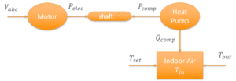

# Composition Motor

As part of the DistribuDyn project funded by the U.S. Department of Energy Solar Energy Technology Office (SETO), the integrated thermal-electrical models to represent behind-the-meter (BTM) building loads devices that are driven by electrical motors in the modern power system. The model in motor.cpp represents an induction motor. This page describes the simplified models of air-source heat pump and refrigerator that have been added into “motor.cpp,” respectively. 

The composite motor model implements the conventional Motor W model as well as the new Motor A/B/C/D models specified by the WECC Composite Load Model. The motor model may be instantiated as a single motor or an aggregate N-motor model.

## Introduction

Among various end-use loads, building loads account for approximately 74% of total electricity consumption in the U.S. Therefore, accurately representing building load dynamics is critical when studying the dynamic response of the power grid. However, most power grid simulations adopt aggregated load models such as PQ (real and reactive power) or ZIP (constant impedance, current and/or power) models to represent the approximated load demand at specific buses. While the PQ and ZIP models offer computational efficiency, they are not sufficient for accurately describing the dynamics of building loads such as HVAC systems, refrigeration units, pumps, and industrial machinery, which are largely driven by motors. These motor-driven loads operate based on both electrical and mechanical principles, with power consumption influenced by torque demand, speed control, and thermal conditions. By neglecting these interactions, existing aggregated load models are too simplified to capture transient load behaviors, thermal dependencies, and demand-side flexibility, leading to inaccuracies in grid simulations. To bridge this gap, we propose an integrated thermal-electrical modeling approach that explicitly characterizes the coupling between electrical and mechanical components in motor-driven building loads. By incorporating both the physical and behavioral dynamics of buildings, our approach enables more accurate load representation in grid simulations, ultimately improving demand forecasting, grid resilience, and control strategies for behind-the-meter resources. This guide provides a step-by-step process for developing gray-box models of motor-driven loads including air-source heat pump and refrigerator, respectively. The goal is to capture the complex interactions among the electrical, mechanical, and thermal dynamics of motor-driven building loads to the greatest extent possible, while minimizing the impact on computational efficiency. This document will also provide guides on the integration and implementation of such models in the open-source power distribution simulation and analysis tool, GridLAB-D™. 

### Air-source Heat Pump

The heat pump consists of a compressor, an indoor heat exchanger unit, an outdoor heat exchanger unit, an expansive device and a four-way valve. When operating in the cooling model, it extracts heat via indoor heat exchanger and eject it into ambient air through outdoor heat exchanger unit. Under heating model operation, heat pump moves the heat from outdoor heat exchanger unit and ejects to room air through indoor heat exchanger unit. To integrate the thermal system (heat pump) modeling with electrical motor modeling, a transitional device is modeled to connect the shaft in the rotor with that in heat pump compressor. This transitional device is to transfer the torque from motor rotor to the compressor. 

  

### Refrigerator

The dynamics of refrigerator is similar to that of heat pump in principle because both heat pump and refrigerator are operating the same thermodynamic cycle with similar main components: compressor, condenser, expansion valve and evaporator. Beside the difference in the power rating, there are also some other differences. For example, the refrigerator uses fixed speed compressor, instead of variable speed compressor of the heat pump in this project, also refrigerator only operates in cooling model, while heat pump can operate both cooling and heating modes. The refrigerator is operating under the same vapor compression cycles as heat pumps with on/off control to maintain the compartment air temperature. 

## Gry-box Modeling Framework

The integrated thermal-electrical modeling of behind-the-meter motor-driven building loads can accurately characterize the coupling between the electrical and mechanical components. However, the detailed models of thermal components are not ready for direct integration into the power grid simulations yet. Although they can accurately capture the complex dynamics of individual motor-driven building loads, this is achieved at the price of significant simulation time due to high model fidelity. As a result, the simulation of power grid operations with a large population of motor-driven building loads becomes infeasible. In other words, the resulting model has very poor scalability for any practical simulation applications. Furthermore, many parameters of the resulting model are not directly available, which prevent it from the wide applications through model generalization. In order to improve the practicality and generality of the resulting model for integrated power grid simulations, further model simplification becomes necessary to enable scalable building load aggregation. As a result, a gray-box modeling framework is proposed. 

### Simplified Heat Pump Models

Although there are many variables associated with the mechanical components of any given heat pump, it turns out that only two quantities should be really concerned from the perspective of power grid simulations. The first quantity is the compressor power consumption Pcomp, which together with the shaft speed ωr determines the mechanical torque τm applied to the motor shaft as 

$τm=Pcomp/ωr$ (1.3 1) 

The mechanical torque τm is related to the motor electric torque τe via the shaft speed ωr as $τe - τm=J(dωr)/dt+Kωr$, (1.3 2) where J is the rotational inertia and K is the friction constant of the shaft, respectively. The second quantity is the compressor thermal capacity Qcomp supplied into the interior environment of the building. The thermal capacity required by the interior environment is driven by the thermal preferences of building occupants as specified through the indoor air temperature set point Tset and affected by the current indoor air temperature Tin and outdoor air temperatures Tout, respectively. Take the heating for example. The higher Tset or the lower Tin and Tout will lead to higher Qcomp. Although Qcomp still depends on those inherent attributes of the given heat pump, only Tset, Tin and Tout are practically available to the building occupants. 

[]

##### Figure 1. Basic diagram of the motor load model.

  
Note that the time constant of all the building thermodynamics usually ranges from minutes to hours. However, the duration of power grid transient studies is only seconds. As a result, only two operation scenarios need to be considered for heat pump simulations. One is the steady-state operation when the indoor air temperature meets the set point, that is, $T_{in}=T_{set}$. In this scenario, the compressor power consumption Pcomp is constant. The other one is the set point change when more heating/cooling is desired to change unsatisfactory indoor air temperature. In this scenario, the compressor power consumption Pcomp will vary as the temperature control system drives up the motor aiming to bring the indoor air temperature to the set point. Therefore, it is proposed to simplify the mechanical part of the developed thermal-electrical model by approximating the compressor power consumption Pcomp and thermal capacity Qcomp with the following functions of only available variables, $(a0 + a1 PLR + a2 PLR2) × (b0 + b1 T_{in} + b2 T_{in2} + c0 T_{out} + c1 T_{out2} + c2 T_{in} T_{out})$ (1.3-3) where _PLR_ is the ratio between the shaft speed ωr and the rated speed ωrated, and _a i_, _b i_, and _c i_, _i_ = 0, 1, 2, are constant coefficients to be determined for _P comp_ and _Q comp_, respectively. In practice, the size of the heat pump that can be described by the maximum _Q comp_ should match the size of the building it serves. Hence, the calibrated model coefficients above will differ for different buildings, with building attributes embedded. 

  
For constant speed HPs, the thermal-electrical model can be expressed as: $a0 + a1 T_{in} + a2 T_{in2} + b0 T_{out} + b1 T_{out2} + b2 T_{out} T_{in}$ (1.34) 

During the stead-state operation, the current indoor and outdoor air temperatures along with the motor shaft speed can determine the required compressor power consumption. When the set point changes, the temperature control system, usually a PID control, will determine the motor speed reference based on the different between indoor air temperature and set point, and then send it to the variable frequency drive system for speed control. 

### Simplified Refrigerator Model

Besides the heat pump, an integrated thermal-electrical model was also developed for refrigerator with both high-fidelity and simplified models. In principle, the dynamics of refrigerator is similar to that of heat pump because both heat pump and refrigerator are operating the same thermodynamic cycle with similar main components: compressor, condenser, expansion valve and evaporator. Beside the difference in the power rating, there are also some other differences. For example, the refrigerator uses fixed speed compressor, instead of variable speed compressor of the heat pump in this project, also refrigerator only operates in cooling model, while heat pump can operate both cooling and heating modes. The refrigerator is operating under the same vapor compression cycles as heat pumps with on/off control to maintain the compartment air temperature. The proposed simplified model of the refrigerator model is given as: $Y = (a0 + a1 T_{indoor} + a2 T_{indoor2} + a3 T_{case} + a4 T_{case2} + a5 T_{indoor} T_{case})$ (1.35) 

### Representative Heat Pumps

In practice, the HP sizes vary significantly as the building sizes change. In other words, there are many different sizes of HPs available in the market. However, it is not practical to model every single size of HPs. In this quarter, we continued our load modeling efforts by defining a set of representative HP sizes that will be modeled and later used in the integrated power grid simulation. According to the DOE prototype building , existing buildings can be classified as commercial or residential. Commercial buildings are those for commercial purposes, for example, school or office. There are a total of 16 types of commercial buildings. Residential buildings are mainly including single-family houses, townhouses, and etc. For residential buildings, there are 4 sub-types including Electric Resistance, Gas Furnace, Oil Furnace or Heat Pump. Different buildings have different thermal needs according to their sizes and usage. For example, the school building might have sudden high-power demands from air-conditioning, due to many students rushing into the classroom. For single-family house, the home power demands for cooling and heating are low in the daytime for weekdays, assuming the residents are out for work. After checking all possible HP sizes, we decided the following set of representative HP sizes for residential and commercial buildings, respectively as shown in Table 1.3 1 and Table 1.3 2. Note that the HP capacity is also often expressed in terms of ton, where 1 ton is equal to 12,000 BTU/hr. Both residential and commercial buildings are classified into three sizes including small, medium and large. Then the HP size is defined accordingly for each category. 

##### Table 1.3 1 – Representative HP Sizes for Residential Buildings  
Residential HP | Thermal Capacity (BTU/hr) | Electric Power (kW) | Type   
---|---|---|---  
**Small** | 12,000 | 1.2 | On/Off   
**Medium** | 36,000 | 3.6 | On/Off   
**Large** | 60,000 | 6.0 | On/Off   
  

##### Table 1.3 2 – Representative HP Sizes for Commercial Buildings  

Commercial HP | Thermal Capacity (BTU/hr) | Electric Power (kW) | Type   
---|---|---|---  
**Small** | 60,000 | 6.0 | On/Off   
**Medium** | 360,000 | 36.0 | On/Off   
**Medium** | 360,000 | 36.0 | VFD   
**Large** | 720,000 | 72.0 | On/Off   
  
  

### Model Coefficient Determination

The heat pump of higher capacity is composed of multiple heat pumps of smaller capacity with the inherent modular configuration. Heat pumps of smaller capacity are used more for residential buildings. For example, a one-bedroom apartment may need a 1-ton heat pump, and two-bedroom apartment may need a 3-ton heat pump. A two-story residential building of 3,000 square feet usually needs a 5-ton heat pump, or a combination of both 2-ton and 3-ton heat pumps. Heat pumps of larger capacity are mainly for commercial building use. For example, a 30-ton heat pump usually consists of six 5-ton heat pumps. As a result, it is only necessary to determine the coefficients of proposed simplified model for HPs of five capacities including 1, 3, 5, 30 and 60 tons. Based on the HP specifications from manufacturers, the training data were generated, and the coefficients were determined. The system performance, including thermal capacity and power demands, is depending multiple factors: indoor air temperature, speed, outdoor air temperature. 

##### Table 1.3 3 – Coefficients of Simplified Models for HPs of Five Capacities Without VFD  

Items | a0 | a1 | a2 | b0 | b1 | b2  
---|---|---|---|---|---|---  
**Power_1ton** | 2.334615 | -0.01424 | -2.29E-05 | -0.0101 | 6.47E-05 | 0.000126   
**Power_3ton** | 6.468402 | -0.03595 | -2.93E-05 | -0.05391 | 0.000251 | 0.000328   
**Power_5ton** | 10.79241 | -0.12613 | 0.000433 | -0.03799 | 0.000226 | 0.000422   
**Power_30ton** | 403.4185 | -8.81078 | 0.04939 | 0.120489 | 0.002637 | -0.00301   
**Power_60ton** | 249.5494 | -3.98427 | 0.018492 | -0.29325 | -0.0003 | 0.005542   
**Qdot_1ton** | 54719.85 | -1263.58 | 8.109572 | 417.4573 | -2.14597 | -1.1667   
**Qdot_3ton** | 119103.7 | -2242.67 | 13.22822 | 354.4577 | -3.18679 | 0.580697   
**Qdot_5ton** | 210805 | -4702.95 | 29.12454 | 1253.792 | -6.84752 | -2.77137   
**Qdot_30ton** | 3038057 | -58644.8 | 272.0959 | 2369.129 | -66.1801 | 88.66186   
**Qdot_60ton** | 4156829 | -93353.6 | 562.8317 | 23748.97 | -98.7728 | -109.738   
  
  
For 30-ton heat pumps, there is an option using the variable frequency drives (VFD). The system can adjust the motor speed to meet the desired cooling and heating demands. 

##### Table 1.3 4 – Coefficients of Simplified Models for HPs of 30-Ton Capacity With VFD  

Items | a0 | a1 | a2 | b0 | b1 | b2 | c0 | c1 | c2  
---|---|---|---|---|---|---|---|---|---  
**Power_30ton** | 0.00199 | 0.014617 | -0.00566 | 10616.39 | -209.944 | 1.253299 | 6.629284 | 0.119733 | -0.14444   
**Qdot_30ton** | 9.934418 | 25.53192 | -14.9159 | 102899.6 | -2052.23 | 10.38361 | 284.4066 | -2.93893 | 1.680521   

### Integration with GLD

Below is an example model in GridLAB-D™ 

  * C++ motor class simulation for HVAC and refrigeration power and torque estimation
  * Code includes device selection, regression-based power models, and total torque calculation
      
        void motor::calc_num_devices(double power_tot)
        {
            double power_map[7] = {527, 2230, 4100, 6720, 31290, 31719, 70500};
            int n_1ton=0, n_3ton=0, n_5ton=0, n_30ton=0, n_30tonVFD=0, n_60ton=0;
            int n_max_1ton = floor(power_tot / (power_map[1] + power_map[0]));
    
        if (n_max_1ton > 0) {
            n_1ton = rand() % n_max_1ton + 1;
            double power_remain = power_tot - n_1ton * (power_map[1] + power_map[0]);
            if (power_remain >= 0) {
                // Continue to calculate other devices...
            }
        }
    
        double actual_power = n_1ton * power_map[1] + n_3ton * power_map[2] + n_5ton * power_map[3] +
                              n_30ton * power_map[4] + n_30tonVFD * power_map[5] + n_60ton * power_map[6] +
                              (n_1ton + n_3ton + n_5ton + n_30ton + n_30tonVFD + n_60ton) * power_map[0];
        
        num_devices[0] = n_1ton + n_3ton + n_5ton + n_30ton + n_30tonVFD + n_60ton;
        num_devices[1] = n_1ton;
        num_devices[2] = n_3ton;
        num_devices[3] = n_5ton;
        num_devices[4] = n_30ton;
        num_devices[5] = n_30tonVFD;
        num_devices[6] = n_60ton;
        }
    
        double motor::model_power_refrigerator(double *coeffs, double Tamb, double Tcase) {
            return coeffs[0] + coeffs[1] * Tamb + coeffs[2] * Tamb * Tamb +
                  coeffs[3] * Tcase + coeffs[4] * Tcase * Tcase + coeffs[5] * Tamb * Tcase;
        }
        
        double motor::model_HP_power(double *coeffs, double Tindoor, double Toa) {
            return coeffs[0] + coeffs[1] * Tindoor + coeffs[2] * Tindoor * Tindoor +
                  coeffs[3] * Toa + coeffs[4] * Toa * Toa + coeffs[5] * Tindoor * Toa;
        }
        
        double motor::model_HPVFD_power(double *coeffs, double Tindoor, double Toa, double PLR) {
            double poly1 = coeffs[0] + coeffs[1] * PLR + coeffs[2] * PLR * PLR;
            double poly2 = coeffs[3] + coeffs[4] * Tindoor + coeffs[5] * Tindoor * Tindoor +
                          coeffs[6] * Toa + coeffs[7] * Toa * Toa + coeffs[8] * Tindoor * Toa;
            return poly1 * poly2;
        }
    
        double motor::torque_tot(double power_tot, double wr, double Tindoor, double Toa, double Tcase, double Tamb) {
            double coeffs_rfgt[6] = {...}; // Refrigeration coefficients
            double coeffs_1ton[6] = {...};
            double coeffs_30ton[6] = {...};
            double coeffs_30tonVFD[9] = {...};
            // other coeff arrays
    
        double power_rfgt = model_power_refrigerator(coeffs_rfgt, Tcase, Tamb);
        double power_1ton = model_HP_power(coeffs_1ton, Tindoor, Toa);
        double power_30ton = model_HP_power(coeffs_30ton, Tindoor, Toa);
        double power_30tonVFD = model_HPVFD_power(coeffs_30tonVFD, Tindoor, Toa, wr / wbase);
        // other power computations
    
        double TQbase = Pbase / wbase;
        double TQmech = (wr > 0.1) ? (num_devices[0] * power_rfgt +
                          num_devices[1] * power_1ton +
                          // ... other terms ...
                          num_devices[5] * power_30tonVFD) / wr / TQbase : 0.0;
        return TQmech;
        }

  
