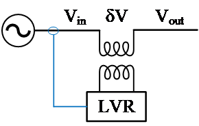
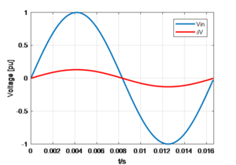
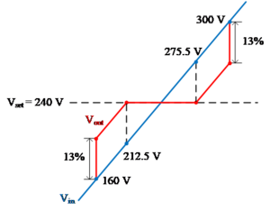
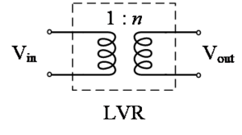
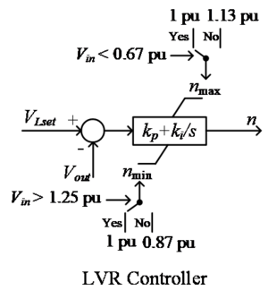
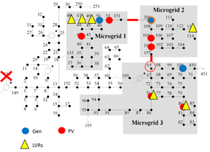
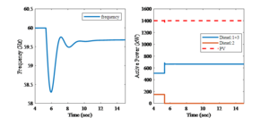
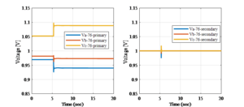
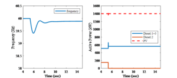
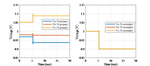

# Series compensator

This page introduces the models of power-electronics-based series compensators and a frequency controller designed for it. Some simulation examples are included to explain the model and the frequency control strategy. 

## Introduction of a Series Compensator

The one-line diagram of the series compensator is provided in Figure 1. When a voltage sag occurs at the upstream caused by disturbances like faults and the starting of large motors, the series compensator rapidly generates a voltage ΔV to mitigate the voltage sag, so the critical load does not experience any voltage disturbances. 

[]

##### Figure 1 - One-Line Diagram of a Series Compensator

As shown in Figure 2, the series compensator generates a voltage δV, which has the same frequency and phase angle as the input voltage Vin,. The magnitude of δV can be either positive or negative. By changing the magnitude of δV, the load side voltage Vout can be compensated. 

[]

##### Figure 2 Input voltage and output voltage of LVR

Figure 3 shows the control range of the series compensator. For example, when the input voltage Vin is between 212.5 V and 275.5 V, the compensator can always bring the output voltage Vout back to 240V. When the input voltage is between 160 V to 212.5 V, or between 275.5 V to 300 V, the compensator can only increase or decrease the output voltage Vout by 13% of the input voltage Vin. When the input voltage is lower than 160 V or is larger than 300 V, the compensator will be bypassed. 

[]

##### Figure 3 Control range of the series compensator

  
## Modeling of the Series Compensator in GridLAB-D

Figure 4 and Figure 5 show the main circuit and controller of the series compensator modeled in GridLAB-D™, respectively. As shown in Figure 4, the main circuit of the compensator is modeled as a regulator with a controllable turn ratio, n. By changing the turns ratio n quickly, the output voltage can be maintained constant when there is a disturbance at the input voltage. 

[]

##### Figure 4 Modeling of the main circuit of the series compensator in GridLAB-D

Figure 5 shows the controller designed to control the series compensator. It is a PI controller with maximum and minimum anti-wind-up limiters (nmax and nmin). VLset is the set point voltage, Vout is the load side voltage, Vin is the input voltage. kp and ki are the proportional and integrator gains, respectively. (In most of the cases kp is set 0) The function of the controller can be explained as follows: When the input voltage Vin is between 0.87 pu to 1.13 pu, the controller can always find a turns ratio n to maintain the output voltage at VLset. When the Vin is below 0.87 pu or is above 1.13 pu, the saturation limit of the controller will be reached. The turn ratio will be fixed at nmax=1.13pu or at nmin=0.87pu. Further, if the Vin is below 0.67 pu or is above 1.25 pu, the nmax or nmin will be changed to 1, which represents that the series compensator is bypassed. 

[]

##### Figure 5 Modeling of the controller of the series compensator in GridLAB-D

## Frequency Control

The main purpose of the series compensator is to maintain the load voltage at the set point during disturbance. However, with more and more such devices installed in distribution systems, they can potentially be used to improve the frequency stability during contingencies. An additional frequency controller is designed and added on the series compensator to improve the frequency stability during contingencies such as loss of generation in an islanded distribution system. The idea of the frequency control very simple. When the frequency increases or decreases after contingencies, the frequency controller quickly increases or decreases the voltage set point to adjust the power consumption of the load. For example, when a generator is tripped, the system frequency drops quickly, and the series compensator measures the frequency drop locally and quickly reduces the voltage set point from 1 pu to 0.9 pu to reduce the power consumption of the load. The idea is similar to the under-frequency load shedding, but being different from the load being tripped, the series compensator reduces the load voltage set point instead. Simulation results in a modified islanded IEEE 123-Node test feeder show that the frequency stability can be improved by the frequency controller of series compensators. 

### Frequency Controller Design

Figure 7 shows the frequency controller designed for the series compensator. It measures the frequency, and once the frequency is higher or lower than the specified value, the controller will quickly change the voltage set point to adjust the power consumption of the load. The voltage set point is usually set as 1 pu, but with the frequency controller enabled the voltage set point is allowed to change between 0.9 pu to 1.1 pu during contingencies. 

[]

##### Figure 7 Frequency controller for the series compensator

### Simulation

The frequency controller is simulated in a modified islanded IEEE 123-Node test feeder. The studied system is shown in Figure 8. As can be seen the substation voltage source is assumed to be out of service due to extreme weather events, and the three microgrids in the shaded area work together as an islanded networked microgrid. There are three diesel generators in the system as marked by the blue dots, and there are six PV inverters in the system as marked by the red dots. In addition, there are six series compensators installed in the system to regulate the voltages of the critical loads. The total capacity of the three diesel generators are 3 * 600 = 1800 kW, and the total capacity of the PV inverters are 1400 kW. The total loads in the networked microgrid is 2060 kW. There are 780 kW loads installed with series compensator, which accounts for 36% of the total loads in the islanded system. It should be noted that the loads are modeled as constant impedance loads and constant current loads. 

[]

##### Figure 8 A modified islanded IEEE 123-Node test feeder

The simulation scenario is loss of one diesel generator. A comparative study is conducted with the frequency controller enabled and disenabled, respectively. The simulation results are shown below. 

Figure 9 and Figure 10 show simulation results with the frequency controller disenabled for all six series compensators. When Diesel Generator 2 is tripped, there is a significant frequency drop during transient. As shown in Figure 9, the frequency nadir is around 58.2 Hz. There are also some voltage transients as shown in Figure 10. Because the frequency controller is disenabled, the series compensator maintains the output voltage at 1 pu. Therefore, although the primary voltage changes due to the loss of one generator, the output voltages of the series compensator are maintained at 1 pu. Although the voltage is well maintained, there is significant frequency drop during transient. 

[]

##### Figure 9 System frequency and the output power from the diesel generators and PV inverters (frequency control disabled)

[]

##### Figure 10 The three-phase voltages of the input and output of the series compensator installed load 76 (frequency control disabled)

Figure 11 and 12 show simulation results with the frequency controller enabled for all six series compensators. During the same loss of generation event, being different from the previous case, the devices quickly reduce the voltage set points from 1 pu to 0.9 pu to reduce the power consumption of the load. As shown in Figure 11, the voltage at the primary side is not affected, but the voltage at the secondary side is reduced to 0.9 pu. This reduces about 4.8% of the total load of the system. Because of this sudden load reduction, we can see a major improvement in frequency response compared to previous case. As shown in Figure 11, the frequency nadir is improved from around 58.2 HZ to around 59.4 Hz. 

[]

##### Figure 11 System frequency and the output power from the diesel generators and PV inverters (frequency control enabled)

[]

##### Figure 12 System frequency and the output power from the diesel generators and PV inverters (frequency control enabled)

## GridLAB-D™ Model Example
    
    
    object series_compensator {	
           name ser_comp; // Name of the series compensator
           phases AN;  // In this example the device is a single phase device
           kp 0.4;  // Proportional gain of the voltage controller
           ki 200;  // Integral gain of the voltage controller
           kpf 2;   // proportional gain of the frequency controller
           from 37; // The device is connected between Node 37 and Node 3701
           to 3701; // The device is connected between Node 37 and Node 3701
           f_db_max 0.05;  // Upper limiter of the deadband of the frequency controller, unit: Hz.
           f_db_min -0.05; // Lower limiter of the deadband of the frequency controller, unit: Hz.
           delta_Vmax 0.058; // Upper limiter of the voltage set point, unit: per unit
           delta_Vmin -0.083; // Lower limiter of the voltage set point, unit: per unit
           n_max_ext_A 1.3; // Maximum turn ratio of the series compensator, phase A
           n_max_ext_B 1.3; // Maximum turn ratio of the series compensator, phase B
           n_max_ext_C 1.3; // Maximum turn ratio of the series compensator, phase C
           n_min_ext_A 0.7; // Minimum turn ratio of the series compensator, phase A
           n_min_ext_B 0.7; // Minimum turn ratio of the series compensator, phase B
           n_min_ext_C 0.7; // Minimum turn ratio of the series compensator, phase C
           frequency_regulation true;
    }
    

