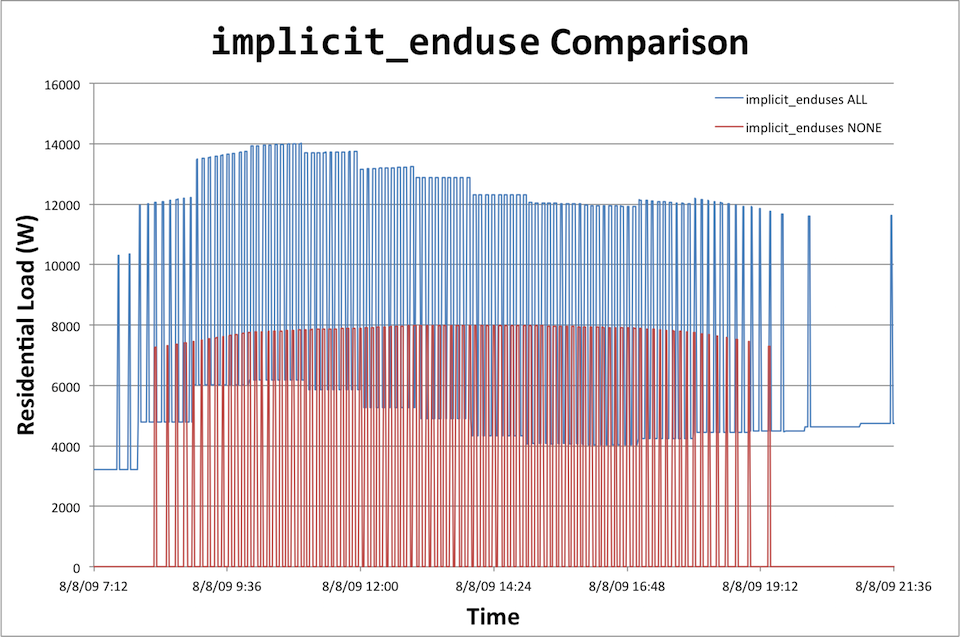
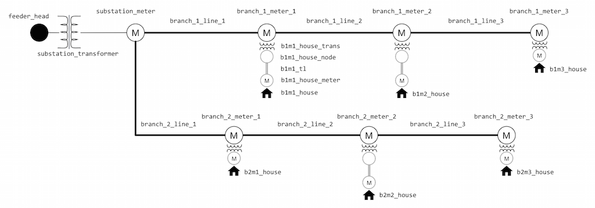
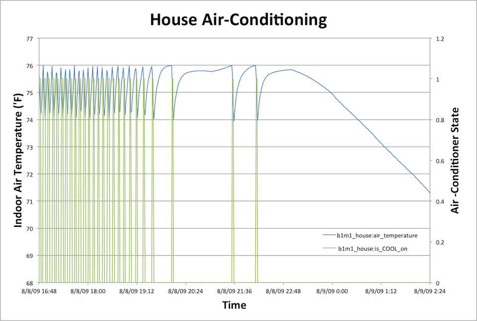
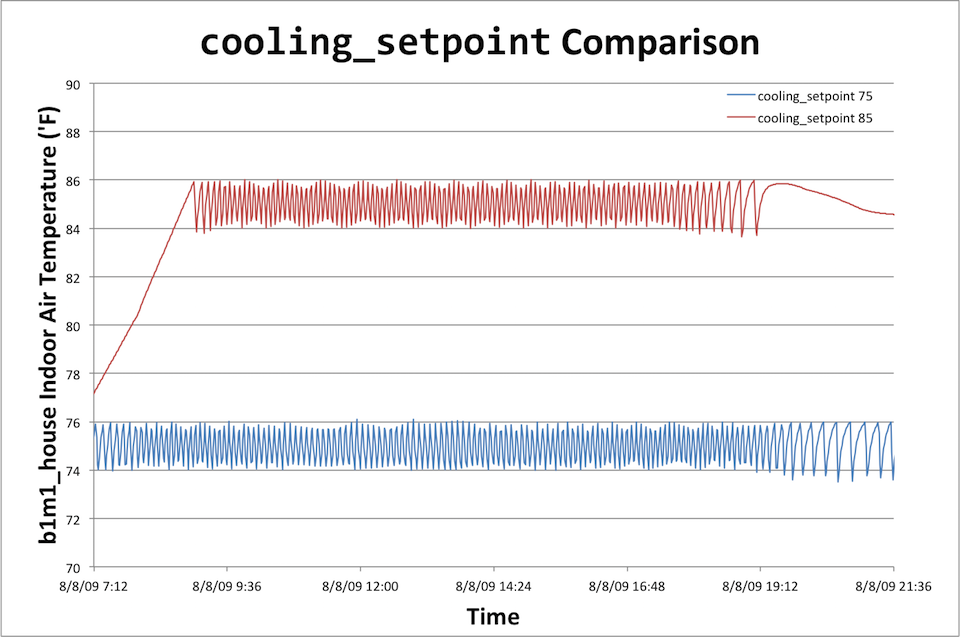
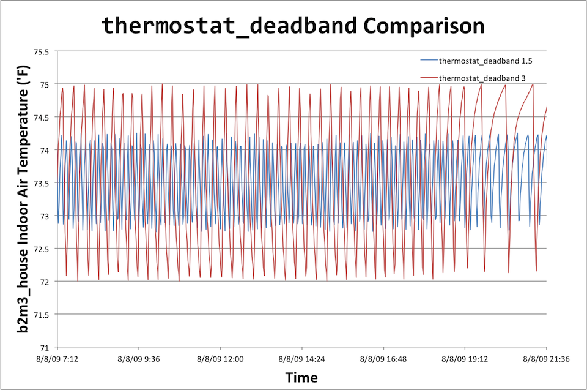
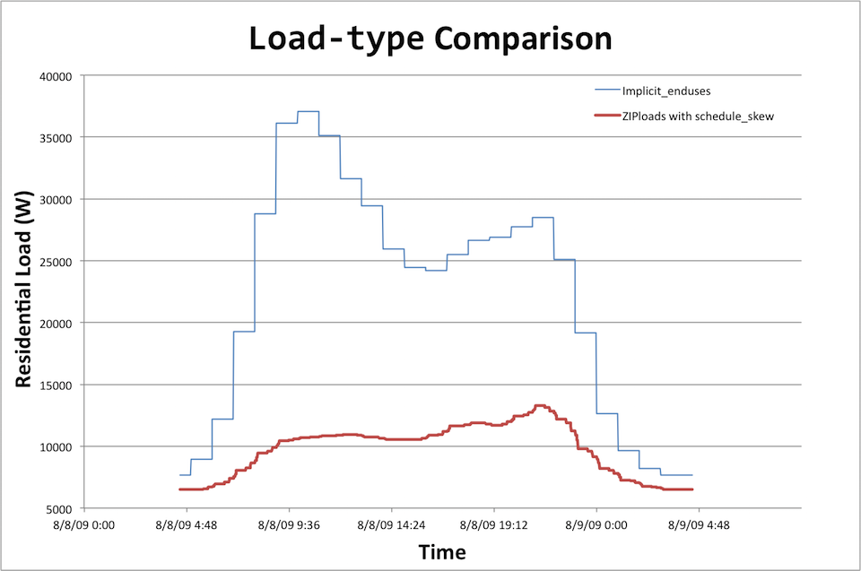

# End Use Loads

Residential loads can be explicit object definitions such as a water heater or EV charger that are added directly to the parent house as child objects or ZIP loads. Loads can also be modeled as implicit end uses, described here. Individual objects and ZIP loads have their own documentation pages, like the [water heater](../Residential/Waterheater.md) and [EV Charger](../Objects/Distributed%20Energy%20Resources/Evcharger_det.md), and [ZIP Loads](../Residential/ZIPload.md).

**TODO - Review - Is this true? End use loads can be either implicitly modeled or explicitly defined (as in not the objects but still end use definitions)** 

### Implicit End Use Loads

The `implicit_enduse` load and it is identical for each house residence. The load defined by `implicit_enduse` is meant to cover all the other types of loads not explicitly modeled as part of the total residential load. These loads are on by default but can be turned off by adding a statement to the residential module declaration:

```
module residential {
  implicit_enduses NONE;
};
```

The differences a given house's load with and without the use of `implicit_enduse` is very clear:



Generic end uses can be implemented using the **residential_enduse** object. This object requires a schedule and a loadshape definition (see [Built in schedules and loadshapes](../../../2.0%20-%20New%20Users/2.5%20-%20Intro%20to%20Modeling/2.5.5%20-%20Schedules%20and%20Loadshapes.md)). All other end uses are (or will soon be) inheriting the properties and methods of the **residential_enduse** object. 

## Enduse Structure

**TODO - Question - Are these then explicit end use definitions??**

Objects that need to use the _enduse_ structure can either inherit the needed properties from an object that already includes one, e.g. _residential_enduse_ , or include one of their own. 

When the _enduse_ structure is inherited, it is strongly recommend that it's name be set during object creation. Usually the name given to the end use is the same of the class implementing the end use. The name can be assigned during _create_ by using the command 
    
    
     load.name = "lights";
    

However, when an object implements multiple end uses, then each one is embedded and the name of the property should be given when the end-use is published, i.e., 
    
    
     PT_enduse, "lights", PADDR(end use),
    

In addition, the corresponding shape must be defined and linked. When inheriting the end use structure, this is already done. However, when defining the end use structure in an object, it must done explicitly during _create_ using the command 
    
    
     lights.shape = lighting_shape;
    

where _shape_ is a property of type _loadshape_ and can be published as 
    
    
     PT_loadshape, "shape", PADDR(lighting_shape),
    

It is recommended that shape for embedded end uses be published with the end use name as a prefix, e.g., 
    
    
     PT_loadshape, "lights.shape", PADDR(lighting_shape),
    

The following updates are made before any _presync_ calls are made 

* shape->schedule
    the schedule is updated to adjust the schedule value according to the target time of the sync event. The value _next_t' is updated to give the time of the next expected schedule change._

* shape
    the shape is updated to make the state of the loadshape correspond to the schedule value. The value t2 is updated to correspond to the expected time of the next change in demand.

* end use
    this end use energy is updated to include the power consumed up to the target time of the sync event.

In addition, during _sync_ events, objects that use _enduse_ properties must explicitly update their end use structures using the _gl_enduse_sync_. 

Important: 
    omitting _gl_enduse_sync_ after _enduse_ values are updated will result in erroneous output.

## Lights

Residential lighting tends to be a mixture of several different types of lighting that is distributed somewhat randomly throughout the house and across the two circuit phases. Very little residential lighting is controlled by timers, although some outdoor lighting may be controlled by daylight sensors. 

Depending on its location, the heat produced by a light fixture may go entirely into the conditioned space or may be partly dumped to an unconditioned space such as an attic or directly outdoors. 

### Modeling Assumptions

* power_factor
    If the _power_factor_ is not set by the user, then the power factor depends on the lighting type:

  * Incandescent: 1.00
  * Fluorescent: 0.95
  * CFL: 0.92
  * SSL: 0.90
  * HID: 0.97

* voltage_factor
    If the lights are not connected to a house circuit from which voltage can be determined, then the _voltage_factor_ is 1.0.

* shape.type
    Only **analog** load shapes are supported. Any of three load shape scales are permitted

  * Absolute (neither _shape.power_ nor _shape.energy_ are specified) and the schedule value is used as is
  * Fixed energy (_shape.energy_ is given) and the total energy used by any schedule block is made to made the _shape.energy_ value.
  * Scaled power (_shape.power_ is given or _installed_capacity_ is set) and the schedule value is multiplied by the _power_. This value must be provided if no schedule is given, and if missing, the _power_density_ is used to compute the _installed_capacity_ based on the _floor_area_. If the _floor_area_ is not available, a default 2500 sf is used.

* power_density
    The default installed power density of each lights object is based on an assumed power density randomly chosen between 0.75 and 1.25 Watts/sf using a triangle distribution.

* Note
    The default installed power density approximates the lighting in a whole house, so is unlikely to be correct unless there is only one lights object in the model. Because most homes have a mixture of lighting types, and thus need more than one lights object, the default density may need to change in the future to be type-specific (which would imply that several lights objects would have to be specified to get a correct set of defaults).

* heatgain_fraction
    The fraction of lighting consumption that ends up as heat in the house defaults to 1.0.

* curtailment
    The fractional curtailment of the lighting (if any). The default value is 1.0 (i.e., no curtailment).

### Modeling Approach

Each lights object will have a single type (incandescent, fluorescent, CFL, SSL, or HID) but may represent multiple fixtures in the house. It is expected that most models will contain one lights object for each type of lighting present in the house, although nothing constrains that. 

Each object will have an installed capacity that represents its total consumption when all fixtures represented by the object are on. The scheduling of the lights object (on/off) is based on a simple demand multiplier (p.u.) that is read in from a tape . Future enhancements may give the lights module the ability to generate demand schedules in an intelligent (yet random) way. 

Each object will have a constant power factor and each object will have a constant fraction of heat that enters the conditioned space. Thus, the real energy consumption is calculated as 

$$P[kVA] = installed\_power[W] \times shape.load[pu] \times curtailment[pu] \frac{1[kw]}{1000[W]}$$

$$Q[kVAR] = P[kVA] \sqrt {\frac{1}{power\_factor^2}-1}$$


## Loads and Weather

### Weather Basics

If GridLAB-D™only allowed users to represent loads as ZIP loads, it would not be that distinctive from other distribution system simulators. One of the big advantages of GridLAB-D™, though, is that is contains models (classes) for loads that take into account things like the weather in which the load is operating. We’ll look at these types of loads in more detail in the following section but first, let’s examine how GridLAB-D™represents the weather that these other types of loads will end up using.

The object type used to represent weather in GridLAB-D™is called “climate” and it contains a large number of parameters such as temperature, humidity, wind speed and direction, solar radiation, air pressure, and many more (see the source code in “climate.cpp” to see the full list). It is up to the individual GridLAB-D™classes to determine which, if any of these, will be used and in what manner. For example, though you would expect the solar panel class in GridLAB-D™to care about the solar radiation values in the weather data, it may surprise you to know that it also looks at the windspeed and ambient air temperature when calculating the energy production of the panel.

### How does the wind influence solar panels? 
 A slightly off-topic exercise in digging through GridLAB-D™source code

As you might expect, to determine which climate parameters are important to any other class, you’ll have to look on the [solar panels](../Objects/Distributed%20Energy%20Resources/Solar.md) and/or the source code (.../generators/solar.cpp). The documentation page makes it clear that these types of weather data are used by the solar PV object but to determine why they would be needed, we need to dig into the source code. Opening up “solar.cpp” we find the familiar table listing the class parameters with their names as they would appear in the model file and their default units; for example:

```
...
  PT_double, "Tmodule[degF]", PADDR(Tmodule), //Temperature of PV module
  PT_double, "Tambient[degC]", PADDR(Tambient), //Ambient temperature for cell efficiency calculations
  PT_double, "wind_speed[mph]", PADDR(wind_speed), //Wind speed
  PT_double, "ambient_temperature[degF]", PADDR(Tamb), PT_DESCRIPTION, "Current ambient temperature of air",
  PT_double, "Insolation[W/sf]", PADDR(Insolation),
  PT_double, "Rinternal[Ohm]", PADDR(Rinternal),
  PT_double, "Rated_Insolation[W/sf]", PADDR(Rated_Insolation),
...
```

Since we are trying to determine how something like wind speed is used by this class, we are going to also need to know how the code for this class internally refers to that same parameter. In the case of wind speed, the next portion of the statement for the wind speed declaration looks like `PADDR(wind_speed)`. The text inside the parenthesis is that internal variable name, in this case, `wind_speed`.

Now we just search the file for that string and see what pops up. We see that in the `create` method for this class the wind_speed is set to zero which is likely an initialization to a default value. 

```
int solar::create(void) 
{
...
  Tambient = 25.0; //degC
  Tamb = 77;	//degF
  wind_speed = 0.0;
  Insolation = 0;
...
}
```

Next is some kind of pointer definition using wind_speed as an input to define `pWindSpeed` 

```
...
  pSolarD = (double*)GETADDR(obj,gl_get_property(obj,"solar_direct"));
  pSolarH = (double*)GETADDR(obj,gl_get_property(obj,"solar_diffuse"));
  pSolarG = (double*)GETADDR(obj,gl_get_property(obj,"solar_global"));
  pAlbedo = (double*)GETADDR(obj,gl_get_property(obj,"ground_reflectivity"));
  pWindSpeed = (double*)GETADDR(obj,gl_get_property(obj,"wind_speed"));
...
```

and then further down, we see the opposite happening where the value pointed to by `pWindSpeed` is saved as wind_speed. 

```
...
  //Update windspeed - since it's being read and has a variable
  wind_speed = *pWindSpeed;
  Tamb = *pTout;
...
```

A page or two later we see a commented equation that uses wind_speed; this obviously doesn’t influence the behavior of the solar panel module but it might give us a hint about how wind_speed has been or is still being used. Lastly, we see wind_speed is used to define `corrwindspeed`.

```
...
  //Convert wind speed from mph to m/s
  corrwindspeed = wind_speed*0.44704;
...
```

Not as enlightening as you might hope but we’re not done yet. Let’s ignore the weird relationship between `wind_speed` and `pWindSpeed` for the moment and just follow the trail related to `corrwindspeed`. Just a few lines after that variable is defined we can see that it is used to define `Tback` and a few lines after that `Tback` is used to define `Tcell`. Similarly `Tcell` helps define `Tmodule` and `Ftempcorr`; the later is just one of many variables used to define `P_out` (which equals `VA_out`). 


```
...
  //Calculate the "back" temperature of the array
  Tback = (insolwmsq*exp(module_acoeff + module_bcoeff*corrwindspeed) + Tambient);

  //Now compute the cell temperature, based on the back temperature
  Tcell = Tback + insolwmsq/1000.0*module_dTcoeff;

  //TCell is assumed to be Tmodule from old calculations (used in voltage below) - convert back to Fahrenheit
  Tmodule=Tcell*9.0/5.0 + 32.0;

  //Calculate temperature correction value
  Ftempcorr = 1.0 + module_Tcoeff*(Tcell-25.0)/100.0;

  //Place into the DC value - factor in area, derating, and all of the related items
  //P_Out = Insolation*soiling_factor*derating_factor*area*efficiency*Ftempcorr;
  P_Out = Insolation*soiling_factor*derating_factor*(Max_P / Rated_Insolation)*Ftempcorr;
...
```

There are clearly a lot of details here that are important that we haven’t looked at closely but, assuming the source code is not intentionally trying to trick us, it looks like the wind speed from the weather file has the ability to influence the temperature of the solar panel which has some kind of effect on the power output. And we have found a string of equations that explicitly defines those relationships if we need to dig deeper into the behavior of the solar panel. This level of detail is quite useful and doubly so considering how quickly we were able to find it.

But this isn’t bulletproof, at all. For example, looking up a dozen or so lines from where `wind_speed` is used to define `corrwindspeed`, we see an `else if` statement that makes it clear this relationship only applies if we are using the `FLATPLATE` solar power model. A quick search on that shows `solar_power_model` is a class parameter and there are only two values `FLATPLATE` and `DEFAULT`. So if we don’t explicitly use the `FLATPLATE` model, the windspeed probably doesn’t matter. Again we’d have to dig into the source code further to be sure of this but considering `wind_speed` didn’t show up anywhere else, its probably a good bet.

The big fly in the ointment with all the digging we’ve done is that weird relationship between `pWindSpeed` and `wind_speed`. Searching through the file for `pWindSpeed` may give us some insight. That search shows in the same `create` method we looked at previously, `pWindSpeed` is set to `NULL`, and further down we see if `weather == NULL` that `pWindSpeed` is defined to point to the value of `wsout` which had just been set to zero. 

```
int solar::create(void) 
{
...
  pSolarD = NULL;
  pSolarH = NULL;
  pSolarG = NULL;
  pAlbedo = NULL;
  pWindSpeed = NULL;
...
}

int solar::init_climate()
{
...
  if (weather == NULL)
  {
        ...
    static double tout=59.0, rhout=0.75, solar=92.902, wsout=0.0, albdefault=0.2;
    pTout = &tout;
    pRhout = &rhout;
                pSolarD = &solar;	//Default all solar values to normal "optimal" 1000 W/m^2
    pSolarH = &solar;
    pSolarG = &solar;
    pAlbedo = &albdefault;
    pWindSpeed = &wsout;
        ...
        }
..
}
```

Continuing the search we see the same assignment of `pWindSpeed` we saw previously followed by a test on `pWindSpeed`; if that pointer is `NULL` (which is what was set to in the `create` method) then we see some kind of error message is posted indicating GridLAB-D™was unable to map the wind speed. (And the last result is `wind_speed` being defined by `pWindSpeed`.)


And that’s it. The only remaining mystery, then, is statement we’ve been ignoring this whole time:

```
pWindSpeed = (double*)GETADDR(obj,gl_get_property(obj,"wind_speed"));
```

This statement is clearly not precisely understandable without some additional effort but thinking through what GridLAB-D™generally needs to do might give us enough understanding to be satisfied. Jumping ahead just a little bit, GridLAB-D™reads in the weather data from an external file to define the climate object, kind of like a player file. And the exploration we’ve done in "solar.cpp" is sufficient to tell that this reading in of the weather data is not happening here. This is “solar.cpp”, after all, and we would hope that such functionality would be in another file, maybe “climate.cpp” or something like that. This means that for the solar class to use the wind data that some other function has read in, it needs a way to access it and our mystery statement here is doing something related to getting the address of the wind speed object. Again, we don’t know exactly what this means but it is highly suggestive. Furthermore, we know that if this statement fails to change the value being pointed at, then the default value of the pointer will still be `NULL` and we’ll get an error about failing to map to the windspeed, further verifying our theory about the nature of our mystery statement.

So we don’t have proof, just a theory that fits the facts as presented in this file. To really know with 100% certainty we’d have to dig fully into our mystery statement and understand this `GETADDR()` function but we have a good guess that is not obviously contradicted by anything in the code we’ve looked at so far. And what did we learn? We saw not only the general way in which the wind speed influences the power output of a solar panel but we have the exact equations the (`FLATPLATE`) model is using. And what did it take to gain this understanding? We searched through one file a few times with only an understanding of how variables are assigned and knowing a little bit about pointers. The point in all of this? Sometimes digging into the source code isn’t so painful and if you have a question about how something works in GridLAB-D™, you might be able to get your answer (or at least a good guess) with only a little bit of searching.

### TMY Datasets

Getting back to where we started, weather data is not typically defined by hand but instead is played into the model using a special player-like function of the climate class. The input file typically used to define all of these weather parameters is the commonly available TMY2 and TMY3 data files. TMY stands for “typical meteorological year” and these collections of data files define a comprehensive set of weather parameters for a given geographic location. The data in these files has been assembled from multiple years of data with each month being actual recorded hourly data from the year deemed to be most typical for the dataset. (A little bit of smoothing is applied at the month boundaries to make the dataset continuous). TMY2 is the slightly older set of files with more limited geographic coverage and a somewhat cryptic file format that is technically human readable but not easily so. TMY3 is the latest version of the data files which provides a much broader range of geographic locations and is in the more conventional CSV format. Further documentation is available on the [TMY2](http://rredc.nrel.gov/solar/old_data/nsrdb/1961-1990/tmy2/) and [TMY3](http://rredc.nrel.gov/solar/old_data/nsrdb/1991-2005/tmy3/) datasets are available from [NREL](http://www.nrel.gov/). (One additional note on the TMY3 datasets: the file extension of an TMY3 data files must be changed to .tmy3 otherwise GridLAB-D™assumes it is a normal CSV file and won't read in all the values correctly.)

Though the number of weather stations supported in the TMY3 dataset is drastically enlarged as compared to the TMY2 dataset, there may arise situations where more customized weather data needs to be used than what TMY3 supports. Because the TMY3 data files are CSV formatted, altering their contents is simply a matter of finding the correct parameter and/or date-range and pasting in the new weather data. (A similar edit can be made to the TMY2 datasets but with much more difficulty. The TMY2 datasets are not delimited which means, on a practical level, a script to parse and edit the files will be necessary. Using the TMY2 documentation this is not difficult but certainly more complicated than pasting values into a spreadsheet. Extra care should be taken as the smallest error will likely result in an improperly formatted file.)

Though all the TMY datasets contain hourly values for a whole year, GridLAB-D™allows users to interpolate between these hourly data points; both linear and quadratic interpolation are supported. The interpolation function is useful as it can prevent large step changes in climate from occurring at the top of each hour, particularly in models that are running a finer time step than hourly. Depending on the other types of objects included in a model and their settings, having large step changes in things like solar radiation or temperature can create a ringing response throughout the system as a while that are not reflective of reality. The environment being modeled by the climate class does not contain step changes every sixty minutes.

And to be clear, interpolation is not creating detail at this finer time scale. Some climate variables, such as the solar radiation parameters, may change frequently and widely between the stated hourly values in the TMY data; clouds being the biggest cause of such variation. Turning on GridLAB-D's interpolation function does not generate these more frequent variations, it simply provides a smooth transition between the given hourly data points. If these frequent changes in solar radiation parameters are needed and [such data is available](http://www.nrel.gov/midc/oahu_archive/), using player files to play this data in is a good option.

## Residential Loads

This is it; this is what makes using GridLAB-D™so fantastic for modeling residential-heavy distribution circuits. Unlike the abstracted ZIP loads, the “house” class in GridLAB-D™is a thermodynamic load with integrated heating and cooling models. As the outdoor temperature rises, the indoor temperature will (gradually) follow suit, eventually triggering the air-conditioner to turn on, presenting an increased load to the electrical system. If residence is modeled with very little insulation, then the indoor temperature will rise much more quickly and the air-conditioner will run much more often and for longer periods of time. Larger house will require larger air-conditioner which will generate larger loads on the system. In the winter, the impact on the distribution system of due to electrical resistance furnaces and heat-pumps will be seen. And it doesn’t end there. Supplemental classes (models) for electric water heaters, occupant loads, and lighting loads are also available as well as more general so-called `plug` and `residential_enduse` loads.

With this class it is possible to build a branch, lateral, or even an entire feeder of a distribution system with individual house objects, each behaving in a unique way with air-conditioners turning on and off as defined by their thermodynamics. This in turn causes the distribution system to respond with voltages sagging in the afternoon heat and rising again into the early morning hours. And this system will behave differently when exposed to winter weather as compared to summer weather and Seattle summers as compared to Miami summers.

The electrical connection of the house model to the rest of the electrical distribution system is accomplished through slightly different electrical devices than those we've used so far in defining the electrical distribution system. In North America, the connection from the main electrical distribution system to residences involves both a step down to service voltage (nominally 120V) as well as a conversion from three-phase to split-phase. Split phase gets its name as it center-taps one of the distribution system's three phases providing two voltages that are 180 degrees out of phase. The potential between the two conductors is 240V while the voltage to neutral is 120V. 

These lower voltage classes in GridLAB-D™all have the prefix "triplex_" appended to their names: `triples_node`, `triplex_line`, `triplex_meter`. The phase names at these nodes are `AS`, `BS`, or `CS` and a transformer with a `connect_type` of `SINGLE_PHASE_CENTER_TAPPED` must be used to connect the main distribution system to a triplex system.

There are many, many parameters defined by the house class: square footage of the house, size of the air-conditioner and its efficiency, type of heater (electric vs gas, resistance vs heat-pump), square footage of windows and their insulation levels, number of floors.... Many of these factors interact as well; for example, `air_volume` is the product of `ceiling_height` and `floor_area`. If inconsistent values are defined, GridLAB-D™may or may not throw a warning or error. (In this case no error is thrown and an examination of the source code in "house_e.cpp" is necessary to determine that the directly specified `air_volume` value effectively overrides the other two. In the case of `solar_heatgain-factor`, setting that parameter throws an error.) Because of the large number of model parameters, if detailed modeling is necessary, it will certainly be necessary to dig into the details via the [house](../Residential/2.0%20-%20house-e.md) documentation page and the source code.

### Example - Triplex Components and Residential Basics

Open up [residential_load_basics.glm](https://github.com/gridlab-d/course/blob/master/Tutorial/Chapter%205%20-%20Loads/Residential%20Loads%20-%20Basics/residential_load_basics). Before digging into the specifics of how the houses are modeled in this model file, notice that at the very top of the file there are two new `module` declarations:

```
  module powerflow {
    solver_method NR;
    NR_iteration_limit 50;
  };
  module tape;
  module climate;
  module residential;
```

The inclusion of these modules ties-in the GridLAB-D™ functionality for a number of classes in each of these modules. Without these declarations, running this model in GridLAB-D™ will through an error the first time it finds an object that is an instantiation of one of the classes defined in those modules.


##### Figure. Residential Basics

Looking at the rest of the model file, find one of the definitions of a `house` object. All the house objects in this file have been defined using a variety of parameters to describe the thermal characteristics of the building. The diversity of parameters provides a variety of ways to describe a house; use whichever ones are most useful to describe the particular residence you are trying to model. 

Running a simulation using this model file generates several output files (generated by `recorder` objects in the model) including two house-specific files and one all-house temperature file. Looking at the "b1m1_house_data.csv" shows data for several different thermal parameters for that residence.  The model file shows that we are running this model using Spokane's weather on Aug. 8th so we would expect the air-conditioner to run some of the time but not necessarily continuously; looking at the `is_COOL_on` parameter we can see that this is the case, particularly in the afternoon.


##### Figure. Residential Air Conditioner

The model file also shows that the air temperature of the house was set to 72.5 'F. This parameter is technically an output parameter; that is, the thermodynamic model of the system will calculate the indoor air temperature and we shouldn't be able to externally define it to a fixed value. Though this is generally the case, the equations of the residential thermodynamic model need an initial condition and this statement is used to provide this. Looking at the data file for that house, we see that the indoor air temperature does indeed start at the specified value.

Lastly, and most importantly from a power systems perspective, looking at the power consumption of this house shows dramatic changes when the air-conditioner runs. The thermodynamics of the house we've defined with our few parameters show that it has very little insulation which leads to frequent cycling of the air-conditioner. 

You can also see that even when the air-conditioner is off, there is still a load the house places on the electrical system. 

### Example - Thermostat Settings

Because the HVAC system is such a big part of the total energy use of a house, the thermostat settings can make a big difference in the energy footprint of a given residence. Let's make a few small changes. Open up the [residential_load_thermostats.glm](https://github.com/gridlab-d/course/blob/master/Tutorial/Chapter%205%20-%20Loads/Residential%20Loads%20-%20Thermostats/residential_load_thermostats) where we've changed the definitions of the two houses being measured as shown below, commenting out the old statements:

```
object house {
  name b1m1_house;
  parent b1m1_house_meter;
  thermal_integrity_level LITTLE;
  hvac_power_factor 0.97;
  cooling_COP 3.90;
  floor_area 1040;
  //cooling_setpoint 75;
  cooling_setpoint 85;
  thermostat_deadband 2;
  air_temperature 72.5;
}
...
object house {
  name b2m3_house;
  parent b2m3_house_meter;
  window_frame ALUMINUM;
  aspect_ratio 3;
  airchange_per_hour 0.8;
  cooling_setpoint 73.5;
  //thermostat_deadband 1.5;
  thermostat_deadband 3;
  air_temperature 73;
}
```

Running the simulation and comparing the results to those from the "residential_load_basic.glm" model confirms an intuitive understanding of these two parameters. The thermostat setpoint parameter defines the center of the deadband of the thermostat. When the temperature rises above the upper limit of the deadband the air-conditioner engages and begins cooling the house until the indoor temperature reaches the lower end of the deadbad, at which point the air-conditioner shuts off. Comparing a change in set-point (while keeping the deadband constant) shows the air conditioner operating over the same temperature range (the two degree deadband) just at a higher temperature.



The second change in the model increases the deadband size while keeping the setpoint constant. We can see from the simulation results that, indeed, the indoor temperature is centered about 73.5 degrees but under the basic model the range for the temperature is 74.25 to 72.75 'F (total deadband size of 1.5 'F); in the model we just modified the temperature ranges from 72 to 75 'F.



We can also see the effect that changing these two parameters has on total energy consumption of the house for the day. Comparing the data  for the two cases, there is a column in the data file showing the total energy consumption and the last entry in each column will be the total for the day.

```
Thermostat setpoint = 73'F: 118 kWh
Thermostat setpoint = 85'F: 106 kWh

Thermostat deadband = 1.5'F: 127.2 kWh
Thermostat deadband = 3'F: 126.6 kWh
```

We can see that in both cases, the new thermostat settings did reduce the energy consumption with the bigger effect being the change in thermostat setpoint.

### Example - Location

Clearly the outdoor weather has a profound affect on the cooling load. Open up [residential_load_location.glm](https://github.com/gridlab-d/course/blob/master/Tutorial/Chapter%205%20-%20Loads/Residential%20Loads%20-%20Location/residential_load_location) and you'll see that the weather file we're using has moved from Spokane, WA to Fort Worth, TX. Running the simulation and looking at the results files, we can see the outdoor temperature gets hotter and as a consequence the air-conditioner runs a lot more frequently. Comparing the air-condition data from `b1m1_house`, we can add up the number of 5-minute periods the air-conditioner was running to see what an impact the temperature has made.

```
Location = Spokane, WA: 7.36 hrs
Location = Fort Worth, TX: 10.65 hrs
```

### Example - Adding Other Residential Loads

As you've seen, the implicit end use that is active by default for each residence is nice as it fills in the load profile of a residence without requiring a lot of extra effort when trying to build up the model. The downside of using implicit end uses is that this built-in load profile is identical for each house and changes only on the hour. GridLAB-D™actually has different simple models for each of the `implcit_enduses` that can be turned on and off for the whole system model.  For example, to only use the water heater, lights, and microwave implicit end use models the residential statement would look like this:

```
module residential{
  implicit_enduses LIGHTS|MICROWAVE|WATERHEATER;
};
```

These loads still change on the hour and apply to all the houses in the model equally. 

To create a more realistic and non-uniform model of all the other loads in a residence requires a more complex description of the residential loads.  Open up [residential_load_other_loads.glm](https://github.com/gridlab-d/course/blob/master/Tutorial/Chapter%205%20-%20Loads/Residential%20Loads%20-%20Other%20loads/residential_load_other_loads) and take a look at one way this could be done in GridLAB-D™.

Near the top of the file you'll see two particular statements that set-up this alternative means of modeling other types of residential loads:

```
module residential{
  implicit_enduses NONE;
};

#include "appliance_schedules.glm";
```

The first statement turns off all the `implcit_enduses`; if we left did nothing else the only load in each house would be the HVAC unit with no energy being consumed when the HVAC was off, as we've seen in an earlier example. To replace all those other loads we're going to use a combination of [ZIPloads](../Residential/ZIPload.md), [schedules](../../../2.0%20-%20New%20Users/2.5%20-%20Intro%20to%20Modeling/2.5.5%20-%20Schedules%20and%20Loadshapes.md) and a new statement called `schedule_skew`.

First, to explain a tiny bit `#include` is a simple way to split up models into multiple files. It is entirely possible to never use them and simply put the entire model definition, all ten, twenty, or one hundred thousand lines in a single file; this has been done. The other extreme, which also is done, is to make the main model file a list of `#include`s with virtually no other content in that file. Which definitions go in which files is somewhat a matter of style but there is a strong case to made to separate out parts of the model that do lend themselves to modularity. In this case, having a single file that defines appliance schedules is very convenient as it can be copied and used by multiple models simply by `#include`-ing it. 

Opening up [appliance_schedules.glm](https://github.com/gridlab-d/course/blob/master/Tutorial/Shared%20Model%20Files/appliance_schedules), as the name implies, revelas a number of schedule definitions for each appliance. Remember **schedules** are defined by indicating what time of day and week a the referenced object will take on the given value. For example, looking at the first definition in the file for `LIGHTS`, we see that during all minutes, when the hour is zero, during months 4 though 9 (April through September), when the day of the week is 1-5 (Monday through Friday), the value of `LIGHTS` takes a value of 0.380. The comment in the schedule file, `weekday-summer` matches this definition and we can see that there are unique values defined for each hour of the day and four blocks to describe weekend and weekday summer and winter. In addition to the load definition for `LIGHTS`, we have `PLUGS`, `CLOTHESWASHER` `REFRIGERATOR`, `DRYER`, `FREEZER`, `DISHWASHER`, `RANGE` and `MICROWAVE`, the most common `implcit_enduses` loads we turned off.

Having these definitions for appliance usage patterns is great but we still have to put them to use in the main model file; here is where ZIP loads come in handy. In "residential_load_other_loads.glm" jump down to where the first house (`b1m1_house`) is defined and you'll see after all the statements you've seen before describing the thermodynamic properties of the house is a list of `ZIPload`s parented to the house object. Each of these `ZIPload`s references one of the schedules defined for a given load type (`PLUGS`, `CLOTHESWASHER` `REFRIGERATOR`, etc) and then multiples that referenced value by a specific factor. In this way, a common hourly time-series of values can be scaled in magnitude for each particular residence.

The other way these common schedules can be customized for each residence is through the use of `schedule_skew`. The `schedule_skew` statement, as the name implies, allows the pre-defined timing of a schedule to be shifted in time so that the object takes on the specified value but does so some amount of time earlier or later than defined in the schedule. For examples, we can see in `b1m1_house`, all the `ZIPload`s that use the schedules have a `schedule_skew` of -685, indicating they will take on the scheduled values 685 seconds (about 11.5 minutes) earlier than is indicated in the "appliance_schedules.glm" file. 

With all the `implcit_enduses` loads in the model now defined uniquely, both respective to the amount of energy and the timing of the energy, we would expect the total load of the feeder to look more diversified and smoothed out in time. In fact, you may have noticed that we have taken out the HVAC system in all the residences of this model so we can more clearly see the difference. Running the model with and without the `implicit_enduses NONE;` and `ZIPload`s in all the houses commented out shows us just the difference in these methods of modeling these types of loads.



Using the  `ZIPload`s and `schedule_skew` results in a much smoother load shape, even when only running a system with six houses. The difference in magnitude may or may not be appropriate; it would be up to the modeler to determine if the factors used when scaling the base values define the in "appliance_schedules.glm" are realistic or not.

## Load Shedding

*A Python script that parses the .glm file and adds GFA devices for load shedding can be found here:*
  [GridLAB-D™ Tools in Python] (https://github.com/gridlab-d/tools/tree/master/python_scripts) and [GridLAB-D™ Parser Script](https://github.com/wsu-smartcity/tool-scripts/tree/master/gridlabd%20parser)
