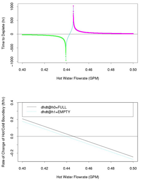
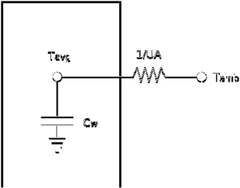

## Waterheater

Typical residential electric water heaters range in size from about 30 gallons up to 120 gallons or so, with most tanks falling in the range of about 40 to 80 gallons. Hot water is drawn from the top of the tank to service the home’s water loads, with cold make-up water injected near the bottom of the tank. When a hot water draw is in progress, the tank will tend to have a layer of cold water at the bottom. 

Water is typically heated by two elements, one located near the bottom of the tank and one located higher in the tank, usually halfway to two-thirds of the way to the top. The lower element shoulders most of the heating load, with the upper element engaging only when the cold water layer has reached it. The two elements are controlled by independent thermostats, but only one is permitted to be on at a time, the upper element having priority. The design is intended to allow rapid (re)heating of the smaller volume of water above the top element so that full-temperature water is available as soon as possible after a depletion. Water heater elements range in capacity from about 1500 Watts to 6000 Watts, with 4500 Watts being common. 

Thermostatic controls have a “dead band” associated with the setpoint, which prevents rapid cycling of power to the elements which would result if the turn-on temperature equaled the turn-off temperature. The dead band is typically a few degrees above and below the nominal setpoint. 

Most heaters are shipped with both the upper and lower thermostats set to the same temperature (often 120 degrees-F), but they may be modified at installation or a later time. Some manufacturers recommend that if hotter water is desired, only the lower element be set to a higher temperature. This will maintain the entire tank at the higher temperature but allow for rapid recovery of the upper volume to the lower setting following a depletion. The net effect on energy use is negligible if the upper thermostat is set to a lower setting. However, some homeowners wrongly set the upper element to a higher temperature than the lower one, which results in somewhat different behavior. Because of thermal stratification, the upper volume will be maintained at a higher temperature than the lower volume, resulting in somewhat lower standby losses than when the entire tank is heated to the higher setting. 

The waterheater is modeled as either a one-node or a two-node body of heat with thermal resistance between the interior and the exterior of the model. 

### Default Waterheater

An empty waterheater object, along the lines of 
    
    
    object waterheater { }
    

will be constructed into a semi-consistant state. The "default waterheater" ends up being similar to 
    
    
    object waterheater {
       tank_volume 50.0 gal;
       tank_diameter 1.5 ft;
       inlet_water_temperature 60.0 degF;
       location GARAGE;
       heat_mode ELECTRIC;
       tank_setpoint random.normal(130,10); // bound [100, 160]
       thermostat_deadband (1 + random.normal(2,1)); // bound [1, 10]
       tank_UA random.normal(2.0, 0.2); // bound (1, inf)
       heating_element_capacity 4.5 kW;
    }
    

Any properties that are not set explicitly will carry these default values. 

### Waterheater Properties

Property Name  | Type  | Unit  | Description   
---|---|---|---  
**tank_volume**  | double  | gallons  | The water volume of the water tank.   
**tank_UA**  | double  | BTU/hour  | The product of the U-value of the tank's insulation and the surface area of the tank, assuming R values of about 13.   
tank_diameter  | double  | feet  | The diameter of the water tank, influences heat loss calculations.   
**water_demand**  | double  | gallons/minute  | Hot water consumption. Constant unless controlled by a Player object.   
**heating_element_capacity**  | double  | kW  | The rate at which the waterheater heating element will dump thermal energy into the water tank in kilowatts.   
**inlet_water_temperature**  | double  | degF  | The temperature of the cold water entering the bottom of the waterheater to replace any hot water drawn out the top of the tank.   
**heat_mode**  | enumeration  |  | "ELECTRIC" or "GASHEAT". Determines the method that heat is added to the water tank.   
**location**  | enumeration  |  | "INSIDE" or "GARAGE". Placement determines if thermal losses from the water heater wind up heating up the house, and if the outside temperature influences the effective temperature for heat loss.   
**tank_setpoint**  | double  | degF  | The target temperature at which the heating elements will click on and off in the waterheater.   
thermostat_deadband  | double  | degF  | The number of degrees to heat the water when needed. Influences when the water heating element will turn on and turn off.   
meter  | double  | kilowatt-hours  | The total power consumed by the water heater during the simulation.   
**temperature**  | double  | degF  | The temperature of the hot water in the tank.   
height  | double  | feet  | The height of the hot water tank.   
**enduse_load**  | complex  | kilowatts  | The current power draw of the water heater. Required by the house to attach the water heater to the circuit panel.   
**constant_power**  | complex  | kilowatts  | The constant power draw of the water heater. No effect ~ modify the heating_element_capacity.   
**constant_current**  | complex  | amps  | The constant current draw of the water heater. No effect.   
constant_admittance  | complex  | 1/Ohm  | The constant admittance of power across the water heater. No effect.   
**internal_gains**  | double  | kilowatts  | The heat loss for the current timestep from the water heater to the water tank's location.   
**gas_fan_power**  | double  | kW  | The load of a running gas waterheater, primarily from any venting fan.   
**gas_standby_power**  | double  | kW  | The load of a gas waterheater in standby mode ~ digital logic attached to the thermostat, etc.   

### Modeling Assumptions

The GridLAB-D™ approach to modeling electric water heaters is designed to be computationally fast yet reasonably accurate. It accommodates the common two-element design and the possibility for “inverted” thermostat settings, wherein the upper element maintains a higher temperature than the lower element. 

To achieve the necessary computational speed, we make the following assumptions: 

  1. Thermal stratification in the tank is not directly modeled. Depending on the situation, the water will be considered to be either of uniform temperature throughout the tank or “lumped” into two temperature regions (hot and cold layers).
  2. The injection of cold inlet water at the bottom of the tank results in either complete mixing with the hot water in the tank or no mixing at all, depending on the volumetric flow rate.

The water heater simulation uses two very different models depending on the state of the tank at any given moment. The two models are: 

  1. One-Node Model – This is a simple, lumped-parameter electric analogue model that considers the entire tank to be a single “slug” of water at a uniform temperature. This model concerns the temperature of the water at any given time and/or the time required for the temperature to move between two specified points.
  2. Two-Node Model – This model, which applies when the heater is in a state of partial depletion, considers the heater to consist of two slugs of water, each at a uniform temperature. The upper “hot” node is near the heater’s setpoint temperature, while the lower “cold” node is near the inlet water temperature. This model concerns the location of the boundary between the hot and cold nodes, calculating the movement of that boundary as hot water is drawn from the tank and/or heat is added to the tank.
The water heater simulation keys on two primary “states” of the water heater: 

  * Tank State – The tank can be in one of three states: 
    * **FULL** – All the water in the tank is at a uniform temperature near the heater’s setpoint. The One-Node model applies.
    * **PARTIAL** – The tank is in a state of partial depletion, where some of the hot water has been (or is being) drawn out, leaving hot and cold layers of water in the tank. The Two-Node model applies.
    * **EMPTY** – The tank has been completely depleted; all the water is at a uniform temperature near the water inlet temperature. The One-Node model applies.
  * Load State – This refers to the current water load on the heater; that is, whether and how fast hot water is being drawn from the top of the tank. Formally, this load state applies only when the tank state is **PARTIAL** , but is useful for the **FULL** and **EMPTY** tank states because it tells whether the tank will begin to move toward a **PARTIAL** state or stay in the current state. There are three possible load states: 
    * **DEPLETING** – Hot water is being drawn at a rate sufficient to move the boundary between the hot and cold zones upward. That is, hot water is being drawn out faster than the heating element can warm the incoming cold water, so the upper layer of hot water is getting smaller and the lower layer of cold water is getting larger.
    * **RECOVERING** – Hot water is either not being drawn from the tank or begin drawn at a low enough level that the boundary between the hot and cold layers is moving downward. That is, the hot water is being drawn out at a rate low enough that the heating element can warm the replacement water faster than it is being introduced, causing the upper layer of hot water to get larger and the lower layer of cold water to get smaller.
    * **STABLE** – Simplistically, this state implies that hot water is being drawn at a rate that matches the heating element’s ability to warm the incoming cold water. Actually, the hot water draw does not have to exactly match the warming rate for this state to apply. Because there are other heat flows acting on the water (e.g., jacket losses to surrounding air), in any given situation where the tank state is **PARTIAL** there is a range of hot water flow rates for which the tank will never reach either the **FULL** or the **EMPTY** state.

For example, if the tank begins near the **FULL** state and hot water is drawn from it at a rate slightly higher than the heating element can match, the hot/cold boundary will begin to move upward. However, as the boundary moves up, the size of the hot layer gets smaller, reducing the area of warm tank that is exposed to the surrounding air. The lowered area means lowered heat losses, which may tip the balance so that the heating element eventually can keep up with the hot water draw. Similarly, starting with an almost empty tank, the heating element’s capacity may exceed a small hot water draw and move the hot/cold boundary downward until jacket losses tip the balance. When the load state is **STABLE** , the calculated time to transition is infinite. 

This **STABLE** state is illustrated in Figure 1. For an example water heater, the figure shows the time required to deplete an initially full tank (“time to transition”) at various hot water flow rates. Note that flow rates above roughly 0.45 gpm result in positive and finite times to transition. Flow rates below about 0.44 gpm are finite and negative, meaning the tank is not depleting at all, but is actually recovering (i.e., the heating element can more than keep up with the heat removed by the water draw). In between those two points—between the positive and negative spikes to infinity—the tank is in the **STABLE** state that will never reach either the **FULL** or the **EMPTY** state. 

These two critical flow rates depend on many factors, including the tank size and shape, tank $UA$, heating element capacity, and the hot and cold layer temperatures. They are identified in the GridLAB-D™ water heater model by calculating the rate of change of the hot/cold boundary position $h$ with respect to time $(dh/dt)$. Note in the lower graphic of Figure 1 that the time to transition is positive when $dh/dt$, calculated at the **FULL** starting point $h0$, is negative (meaning the tank is depleting). Also note that the time to transition is negative (meaning the tank is really recovering and will remain **FULL**) when $dh/dt$, calculated at the target **EMPTY** state, is positive. The area between the two critical flow rates is identified by differing signs between $dh/dt$ calculated at **FULL** and $dh/dt$ calculated at **EMPTY**. 

##### Figure 1 – Illustration of using dh/dt to identify the **STABLE** state

### Modeling Approach

##### Figure 2 shows a schematic representation of the water heater model in which Tavg is the average water temperature throughout the tank and Tamb is the ambient temperature. The thermal capacitance of the water Cw is a function of the tank volume: 

$$C_w = V(gal) \frac{1(ft^3)}{7.48(gal)} \frac{62.4(lb_m)}{1(ft^3)} \frac{1(Btu)}{1(lb_m \dot F)}$$

The thermal conductance of the tank shell (or “jacket”) $UA$ is calculated from the known R-values of the sides and top of the tank divided into their corresponding areas. 

##### Figure 2: Water heater model schematic representation

#### One-Node Model

Considering Figure 2 and treating the water heater as a single node with thermal capacitance $C_w$, a conductance $UA$ to ambient conditions, with mass flow rate and heat input rate of $Q_{elec}$, a heat balance on the water node is as follows: 

$$Q_{elec} - \dot m C_p \left ( T_w - T_{inlet} \right ) + UA \left ( T_{amb} - T_w \right ) = C_w \frac{dT_w}{dt}$$

or, 

$$
dt = \frac{
  C_w
}{
  \dot{m} C_p T_{\text{inlet}}
  + U A T_{\text{amb}}
  - \left( U A + \dot{m} C_p \right) T_w
  + Q_{\text{elec}}
} \, dT_w
$$

  
The time required to change the tank’s temperature from an initial temperature $T_0$ to a new temperature $T_1$ is given by integrating that equation. 

$$
t_1 - t_0
= \int_{T_0}^{T_1}
\frac{1}{
  \dfrac{
    \dot{m} C_p T_{\text{inlet}}
    + U A T_{\text{amb}}
    + Q_{\text{elec}}
  }{C_w}
  - \dfrac{
    U A + \dot{m} C_p
  }{C_w} T_w
}\, dT_w
$$

That is an integral of the form $dx/(a+bx)$, which has solution $\log(a+bx)/b$ . Therefore, the final model of the time required to raise (or lower) the tank’s temperature is 

$$t_1 - t_0 = \frac{1}{b} \log \left ( a + b T_w \right ) \bigg|_{T_0}^{T_1}$$

Where 

  * $a = \frac{\dot m C_p T_{inlet} + U A T_{amb} + Q_{elec}}{C_w}$
  * $b = \frac{ U A + \dot m C_p }{C_w}$

The reverse problem of calculating the new temperature of the tank from a known initial temperature and time difference, $t1-t0$, follows directly: 

$$T_1 = -\frac{a}{b} + \left ( \frac{a}{b} + T_0 \right ) e^{b \left( t_1 - t_0 \right ) }$$

#### Two-Node temperature model

**TODO**:  The two-node equations listed are incorrect, even though the repository code is correct. The latter should be parsed for the former. --[Mhauer] 20:11, 5 February 2009 (UTC) 

This model, which applies when the heater is in a state of partial depletion, considers the heater to consist of two slugs of water, each at a uniform temperature. The upper “hot” node is near the heater’s setpoint temperature, while the lower “cold” node is near the inlet water temperature. The time required to change the tank’s hot water column from an initial height of $h_0$ to a final height of $h_1$ is given by the following equation: 

$$t_1 - t_0 = \frac{1}{b} \log \left ( \frac{dh_w}{dt}\right ) \bigg |_{h_0}^{h_1}$$

  
Where $dh/dt$ is the location of temperature boundary along the height of the water column. This is calculated as a function of mass flow rate and the temperature difference across between the upper and lower interface layers of the water column, as given by the following: 

$$\frac{dh}{dt} = a + b h$$

where 

  * $a = \frac{Q_{elec}+U A T_{amb}}{C_w T_lower} - \frac{\dot m C_p}{C_w}$
  * $b = \frac{U A}{C_w}$

In the two-node model, during each synchronization cycle, the height the hot water column is calculated based on the mass flow rate, using the following equation: 

$$h_1 = \frac{e^{b T_w} \left ( a + b h_0 \right ) - a}{b}$$

### Simulation Sequence

**TODO**:  Move this section to [Dev:Residential] \--[Dchassin] 20:22, 24 November 2011 (UTC) 

Each time the water heater is sync’d, the simulation follows four steps: 

  1. Calculate the energy consumed since the last iteration. The heater remembers whether it was heating and simply computes the consumption based on the time interval since the last sync.
  2. Update the tank temperature or the location of the hot/cold boundary, depending on whether the tank was previously **FULL** , **PARTIAL** , or **EMPTY**.
  3. Discern whether the tank needs heat. If the tank is in (or has reached) a **FULL** state at the thermostat setting, the power will be turned off. Otherwise the element will be turned on. Note that, for the Single-Node model, the heater state remains unchanged from its previous state when the water temperature is between the heating cut-off and cut-on temperatures (the deadband around the thermostat setpoint).
  4. Calculate and post the time to next transition. For example, if the heater is on, this is either the time for the water to reach the cut-off temperature or for the hot/cold boundary to reach the bottom of the tank, depending on the tank state.

### Complicating Factors

Several factors complicate the simulation. First, switching models between **FULL** , **PARTIAL** , and **EMPTY** states requires careful attention to not only what’s happening now, but what state(s) things were in previously. Second, identifying when the load state is **STABLE** can be difficult. Finally, each of the models (One-Node and Two-Node) has two incarnations—one to calculate time to transition, and a second “inverted” one to calculate temperature/boundary location after a given amount of time. Because of limitations on floating point precision, the inverted model may not show that the water heater has actually reached the state it was anticipating. For example, the time model may show that the tank will reach the cut-off temperature of, say, 135 degreees in 12 minutes. After 12 minutes have elapsed, the core updates the water heater as expected. The temperature model may calculate that the final temperature is in fact 134.95 degrees. In a worst case the simulation could go into an infinite loop and never actually change states. 

### Waterheater State of Development

Waterheater is considered a stable model, with a fair amount of functionality. 