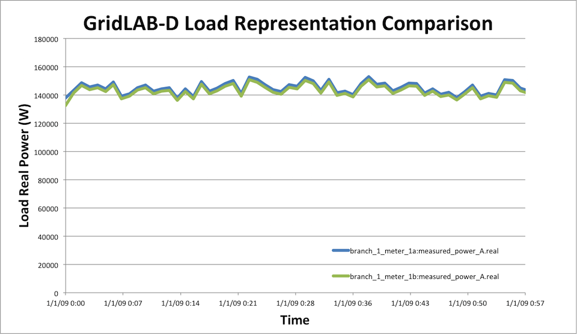

# ZIPload

Thus far the loads on the systems we’ve been modeling have been fairly abstract and relatively simple, with only a constant power load on a single phase being specified. A more general form of this type of load is often referred to as a **ZIP** load which is represented as a load with three distinct parts: 

 - a constant impedance portion $Z$, 
 - a constant current portion $I$, and
 - a constant power portion $P$. 
 
  Each of these portions respond differently to changes in load voltage based on their first-principles models: $P=I^2Z$, $P = IV$, and $P = P$. For a reduction in system voltage, we would expect the following:

* For constant impedance ($Z$), the power would be reduced as the square of the voltage change, and the current ($I$) would be reduced linearly according to the voltage change.

* For constant current ($I$), both the power and the current would be reduced linearly with the voltage change.

* For constant power ($P$), the power will remain unchanged and the current will increase linearly with the voltage change.

{ #fig:zipload-model }

In parallel with the real power components, ZIP loading can also be applied to the reactive power component; that is, these loads can all be expressed as complex values in GridLAB-D™, as you have seen in previous examples. In a three phase system, the load on each phase can be described independently, giving a total of nine complex load values to fully define a three-phase load.

GridLAB-D™ also has an alternative and perhaps slightly more complex means of representing the same load using the same principles. Rather than specifying the portions of the load directly as three individual complex loads (per phase), a nominal “base” complex load value can be given and is then modified with three power-factor values (constant impedance, current and power power-factors) and an additional three load-fraction values (what portion of the load is constant impedance, current, and power). Mathematically, these two means of defining ZIP loads are identical.

### Example - ZIP loads

Open the model [zip_loads.glm](https://github.com/gridlab-d/course/blob/master/Tutorial/Chapter%205%20-%20Loads/ZIP%20Loads/zip_loads.glm) you'll see a slight variation on a version of the model we've used in the [tutorial](../../../2.0%20-%20New%20Users/Tutorial/2.2.1%20-%20Overview.md). The main modification made to the file is the creation of an additional load at `branch_1_meter_1` in parallel to the original. These two loads have both been moved downstream of the main branch by the creation of `load_node` which connects to each of the two loads' meters through very short overhead lines.

        ...

        object load {
                parent branch_1_meter_1a;
                name b1m1_load_a;
                nominal_voltage 7216.88;
                phases ABC;
                        constant_power_A 30000+40000j;
                        constant_current_A 10+10j;
                        constant_impedance_A 1000+500j;
        }

        ...

        object load {
                parent branch_1_meter_1b;
                name b1m1_load_b;
                nominal_voltage 7216.88;
                phases ABC;
                        base_power_A 190 kVA;
                        power_fraction_A 0.26;  
                        current_fraction_A 0.51;  
                        impedance_fraction_A 0.23;   
                        power_pf_A 0.60;
                        current_pf_A -0.71;
                        impedance_pf_A 0.91;
        }

Looking at the two loads, you'll see that `b1m1_load_a` is defined in terms of the `constant_power`, `constant_current`, and `constant_voltage`. The default units for these value are W, A, and Ohms, respectively. Load `b1m1_load_b` has a very similar composite load but it is defined in the alternative style mentioned above. Running a simulation using this model and opening ["*meter_powers.csv*"](https://github.com/gridlab-d/course/blob/master/Tutorial/Chapter%205%20-%20Loads/ZIP%20Loads/meter_powers.csv) reveals that both of these loads have similar power over the duration of the simulation, at least to the precision of the values entered.

{ #fig:zipload-real-power-comparison-from-meter-powers-csv }

### Modeling Approach

The ZIPload model is designed to provide a means to access the **residential enduse** class at a fundamental level and from a "power engineer" perspective. It uses a classic ZIP load model (constant impedance, current, and power) where "base power" is specified, then the ZIP fractions and power factors are assigned. The ZIP model equations can be defined as: 

$$P_i = \frac{|V_a^2|}{|V_n^2|}*|S_n|*Z_{\%}*cos(Z_{\theta}) + \frac{|V_a|}{|V_n|}*|S_n|*I_{\%}*cos(I_{\theta}) + |S_n|*P_{\%}*cos(P_{\theta})$$

$$Q_i = \frac{|V_a^2|}{|V_n^2|}*|S_n|*Z_{\%}*sin(Z_{\theta}) + \frac{|V_a|}{|V_n|}*|S_n|*I_{\%}*sin(I_{\theta}) + |S_n|*P_{\%}*sin(P_{\theta})$$

where: 

* $P_i$: Real power consumption of the *i*th load
* $Q_i$: Reactive power consumption of the *i*th load
* $V_a$: Actual terminal voltage
* $V_n$: Nominal terminal voltage
* $S_n$: Apparent Power consumption at nominal voltage
* $Z_\%$: Percent of load that is constant impedance
* $I_\%$: Percent of load that is constant current
* $P_\%$: Percent of load that is constant power
* $Z_\theta$: Phase angle of constant impedance fraction
* $I_\theta$: Phase angle of constant current fraction
* $P_\theta$: Phase angle of constant power fraction

In a time-variant load representation, the coefficients of the ZIP model, $V_n, S_n, Z_\%, I_\%, P_\%, Z_\theta, I_\theta$, and $P_\theta$ remain constant, but the power consumption, $P_i$ and $Q_i$, of the *i*th load varies with the actual terminal voltage, $V_a$. The ZIP model is similar to the polynomial representation used in many commercial software packages. In the polynomial representation of the ZIP load, the constant coefficient is roughly equivalent to the P fraction, the linear coefficient is roughly equivalent to the I fraction, and the quadratic coefficient is roughly equivalent to the Z fraction. The ZIP model only varies the power consumption as a function of actual terminal voltage, $V_a$. Note also that the sum of $Z_\%, I_\%,$ and $P_\%$ must equal one. 

Internally, the model performs all of the proper phase rotations and scaling for various voltage levels (e.g., the model would look the same for a house attached on Phase A versus Phase C). The ZIPload model applies ZIP voltage scaling using the attached circuit voltage magnitude and the default line voltage. Currently, it is assumed that nominal voltage is either 120 or 240 V. 

## Parameters

Table: ZIPload Parameters { #tbl:table-ZIP }

Property Name  | Type  | Unit  | Description   
---|---|---|---  
**base_power**  | double  | kW  | Base real power of the total load at nominal voltage.   
**power_pf**  | double  | pu  | Power factor for constant power portion of load.   
**current_pf**  | double  | pu  | Power factor for constant current portion of load.   
**impedance_pf**  | double  | pu  | Power factor for constant impedance portion of load.   
**actual_power**  | complex  | kVA  | [read only] Variable to monitor total power of load as a function of voltage.   
**heatgain_only**  | boolean  | \-  | Toggles the zipload to generate heat only (no kW), is deactivated (false) by default   
**is_240**  | boolean  | \-  | Toggles between a 120 V (unbalanced) vs. a 240 V (balanced) connection.   *true* indicates it is a 240 V load.   
_These variables are inherited from the end use load structure._  
**power_fraction**  | double  | pu  | The fraction of the load that is constant power.   
**current_fraction**  | double  | pu  | The fraction of the load that is constant current.   
**impedance_fraction**  | double  | pu  | The fraction of the load that is constant impedance.   
**heatgain_fraction**  | double  | pu  | The fraction of the total load (kW) that produces waste heat.   
_These variables are used for creating cyclic load behavior._  
**duty_cycle**  | double  | pu  | Fraction of time the device is in the _on_ state.   
**period**  | double  | hours  | Time interval over which duty cycle is applied.   
**phase**  | double  | pu  | Indicates percentage of phase that the object is currently in; running period is assumed to be from 0.0 until percent of duty cycle. To create a distribution of devices, this variable should be randomized between 0 and 1.   
_These variables are used for various aggregate and demand response modes._  
**demand_response_mode**  | boolean  | \-  | Activates equilibrium dynamic representation of demand response.   
**number_of_devices**  | int16  | \-  | [Used with `demand_response_mode` only.] Number of devices to model - base power is the total load of all devices.   
**thermostatic_control_range**  | int16  | K  | [Used with `demand_response_mode` only.] Range of the thermostat's control operation.   
**number_of_devices_off**  | double  | \-  | [Used with `demand_response_mode` only.] Total number of devices that are off.   
**number_of_devices_on**  | double  | \-  | [Used with `demand_response_mode` only.] Total number of devices that are on.   
**rate_of_cooling**  | double  | K/h  | [Used with `demand_response_mode` only.] Rate at which devices cool down.   
**rate_of_heating**  | double  | K/h  | [Used with `demand_response_mode` only.] Rate at which devices heat up.   
**temperature**  | int16  | K  | [Used with `demand_response_mode` only.] Temperature of the device's controlled media (e.g., air temp or water temp).   
**phi**  | double  | pu  | [Used with `demand_response_mode` only.] Duty cycle of the device(s).   
**demand_rate**  | double  | 1/h  | [Used with `demand_response_mode` only.] Consumer demand rate that prematurely turns on a device or population.   
**nominal_power**  | double  | kW  | [Used with `demand_response_mode` only.] Rated amount of power demanded by devices that are on.   
**recovery_duty_cycle**  | double  | pu  | [Used with cycling mode and `passive_controller` duty cycle mode.] Fraction of time in the on state, while in recovery interval.   
**multiplier**  | double  | pu  | [Used with cycling mode and `passive_controller` duty cycle mode.] This variable is used to modify the base power as a function of multiplier times `base_power`.   
  
### Mode behavior

The ZIPload object supports several operating modes that can be combined. 

#### Base ZIP behavior

- The object computes three complex power terms each sync: constant-power, constant-current, and constant-impedance.

  - `base_power` is split by `power_fraction`, `current_fraction`, and `impedance_fraction`.
  - `power_pf`, `current_pf`, and `impedance_pf` set each term's reactive component.
  - `actual_power` is voltage-adjusted as:

$$S_{actual}=S_P+S_I\cdot V_f+S_Z\cdot V_f^2$$

where $V_f$ is the per-unit terminal voltage (`load.voltage_factor`).

#### Cycling mode 

Enabled by `duty_cycle`/`period`/`phase`

- Cycling is enabled when `duty_cycle != -1`.
- Validation rules in `init`:
  - `duty_cycle` must be in `[0,1]`,
  - `period > 0`,
  - `phase` must be in `[0,1]`.
- Internally, the model advances **phase** each sync and toggles **multiplier** between `0` and `1` as the on/off window changes.
- `next_time` is scheduled to the next transition boundary, so event timing aligns with cycle edges.

#### Demand response equilibrium mode [*Experimental*]

Enabled by `demand_response_mode=true`

- The object represents a population of devices using `N` devices across `L` temperature bins.
- Per-sync updates compute transitions between `drm.on` and `drm.off` using:
	- `ron` (rate of heating),
    - `roff` (rate of cooling),
    - `eta` (demand rate disturbance).
- Aggregate state outputs are updated:
    - `number_of_devices_on` (`N_on`),
    - `number_of_devices_off` (`N_off`),
    - `phi = roff/(ron+roff)`,
    - `nominal_power = base_power * N_on / N`.
- In this mode, electrical demand uses `nominal_power` rather than `multiplier * base_power`.

#### Aggregate interpretation

- In practice, aggregate mode is the same population formulation used by `demand_response_mode`.
- Can model many similar devices as one ZIPload object by setting `number_of_devices` and DR parameters, then observe aggregate variables (`N_on`, `N_off`, `nominal_power`, `phi`).
- Setting `eta = 0` yields the no-disturbance equilibrium update path (uniform behavior); nonzero `eta` applies a demand disturbance.

#### Override and recovery interaction

- ZIPload inherits `override` (`NORMAL`, `ON`, `OFF`) from `residential_enduse`.
- In duty-cycle operation, override changes how the cycle is applied:
    - `NORMAL`: follow `duty_cycle`,
    - `OFF`: use `recovery_duty_cycle` transition logic,
    - `ON`: hold load suppressed behavior according to override branch logic.
- This is why controller examples often bind `state_property` to `multiplier` or `override`.

## Example models

### Simple ZIPload with Schedule

This model is representative of a simple ZIPload with scheduled load behavior. 
    
    
	object ZIPload {
			name house1_load;
			parent house1;
			base_power responsive_loads*1.06;
			heatgain_fraction 0.90;
			power_pf 1.0;
			current_pf 1.0;
			impedance_pf 1.0;
			impedance_fraction 0.20;
			current_fraction 0.40;
			power_fraction 0.40;
	};
    

### ZIPload using Cycling Mode
This model is representative of a ZIPload used in cycling mode to roughly represent a schedule pool pump (note, `pool_pump_season` is a schedule comprised of `0` or `1` values). 
    
    
	object ZIPload {
			name house1_poolpump;
			parent house1;
			base_power pool_pump_season*1.44;
			duty_cycle 0.22;
			phase 0.26;
			period 4.96;
			heatgain_fraction 0.0;
			power_pf 1.0;
			current_pf 1.0;
			impedance_pf 1.0;
			impedance_fraction 0.20;
			current_fraction 0.40;
			power_fraction 0.40;
			is_240 TRUE;
	};
    
### ZIPload with Passive Controller

!!! note

	The passive controller is part of the market module, which has been deprecated. See [market module](../../../6.0%20References/Unimplemented/Market/1.0%20-%20Market_User_Guide.md) for more information.

This model is representative of a ZIPload with a passive controller used to implement the elasticity model out of the market module. 
    
    
	object ZIPload {
			name house1_load;
			parent house1;
			base_power responsive_loads*1.06;
			heatgain_fraction 0.90;
			power_pf 1.0;
			current_pf 1.0;
			impedance_pf 1.0;
			impedance_fraction 0.20;
			current_fraction 0.40;
			power_fraction 0.40;
			object passive_controller {
				period 900;
				control_mode ELASTICITY_MODEL;
				two_tier_cpp true;
				observation_object Market_1;
				observation_property past_market.clearing_price;
				state_property multiplier;
				linearize_elasticity true;
				price_offset 0.01;
				critical_day CPP_days_R1.value;
				first_tier_hours 12;
				second_tier_hours 12;
				third_tier_hours 6;
				first_tier_price 0.060483;
				second_tier_price 0.120965;
				third_tier_price 0.604826;
				old_first_tier_price 0.124300;
				old_second_tier_price 0.124300;
				old_third_tier_price 0.124300;
				daily_elasticity daily_elasticity_wtech*1.1731;
				sub_elasticity_first_second -0.1783;
				sub_elasticity_first_third -0.2604;
			};
	};
    
### Demand Response Enabled ZIPload with Pool Pump
This model is representative of a "pool pump" or cycling model that is using a DR control from the market module. 
    
    
	object ZIPload {
			name house1_poolpump;
			parent house1;
			base_power pool_pump_season*1.44;
			duty_cycle 0.22;
			phase 0.26;
			period 4.96;
			heatgain_fraction 0.0;
			power_pf 1.0;
			current_pf 1.0;
			impedance_pf 1.0;
			impedance_fraction 0.20;
			current_fraction 0.40;
			power_fraction 0.40;
			is_240 TRUE;
			recovery_duty_cycle 0.27;
			object passive_controller {
				period 900;
				control_mode DUTYCYCLE;
				pool_pump_model true;
				observation_object Market_1;
				observation_property past_market.clearing_price;
				state_property override;
				base_duty_cycle 0.22;
				setpoint duty_cycle;
				first_tier_hours 12;
				second_tier_hours 12;
				third_tier_hours 6;
				first_tier_price 0.060483;
				second_tier_price 0.120965;
				third_tier_price 0.604826;
			};
	};
    

### Cycling-only ZIPload (no market controller)

This mode uses an internal on/off cycle with no external controller. The load toggles by updating `multiplier` from the cycle state.

	object ZIPload {
				name zip_cycling_only;
				parent house1;
				base_power 1.8;
				duty_cycle 0.35;
				period 2.0;
				phase 0.15;
				power_pf 0.98;
				current_pf 0.98;
				impedance_pf 0.98;
				impedance_fraction 0.20;
				current_fraction 0.30;
				power_fraction 0.50;
	};

### ZIPloads in Aggregate population mode (equilibrium, no disturbance)

This represents many similar devices as one aggregate ZIPload using the DR state equations with `eta = 0`.

	object ZIPload {
				name zip_aggregate;
				parent house1;
				base_power 75.0;
				demand_response_mode TRUE;
				number_of_devices 300;
				thermostatic_control_range 20;
				rate_of_cooling 1.2;
				rate_of_heating 1.8;
				phi 0.45;
				demand_rate 0.0;
				power_pf 0.95;
				current_pf 0.95;
				impedance_pf 0.95;
				impedance_fraction 0.20;
				current_fraction 0.30;
				power_fraction 0.50;
	};

### ZIPload in Aggregate demand-response mode (disturbance enabled)

This applies a nonzero demand disturbance and lets the model evolve `number_of_devices_on/off` and `nominal_power` over time.

	object ZIPload {
				name zip_aggregate_dr;
				parent house1;
				base_power 75.0;
				demand_response_mode TRUE;
				number_of_devices 300;
				thermostatic_control_range 20;
				rate_of_cooling 1.2;
				rate_of_heating 1.8;
				phi 0.45;
				demand_rate 0.15;
				power_pf 0.95;
				current_pf 0.95;
				impedance_pf 0.95;
				impedance_fraction 0.20;
				current_fraction 0.30;
				power_fraction 0.50;
	};

For DR runs, monitor `number_of_devices_on`, `number_of_devices_off`, `phi`, and `nominal_power` to verify aggregate state evolution.

## ZIPload State of Development

ZIPload is considered a simple, stable model, with many layers of functionality. 

## Related Concepts:

  * Powerflow User Guide
  * Residential module
    * house class – Single-family home model.
    * `residential_enduse` class – Abstract residential end use class.
    * `occupantload` – Residential occupants (sensible and latent heat).
    * ZIPload – Generic constant impedance/current/power end use load.
