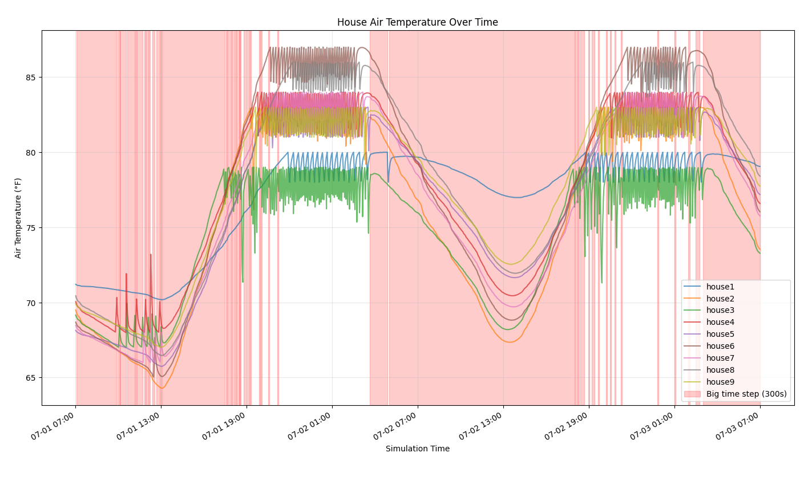

# Reading Data from the Model

**Example file:** [`docs/examples/api/example_reading_data.py`](../../../../examples/api/example_reading_data.py)

Historically, GridLAB-D™ has provided dedicated objects for getting data out of a running GridLAB-D™ model: [recorders](../../Modules/Tape/3.0%20-%20Recorder.md), [group recorders](../../Modules/Tape/3.1%20-%20Group%20Recorder.md), and [collectors](../../Modules/Tape/5.0%20-%20Collector.md), among others. These objects allow users to select other objects and attributes by various means and write values out in a tabular format to a CSV file. Though these objects supply some ability to determine the timing of the data collection, the flexibility is limited and constrained by defining their parameter values to configure them.

The GridLAB-D™ API provides direct access to all exposed model parameters in arbitrary ways an in doing so, provides arbitrary means of collecting data and writing it out to file. Not only is the output format user-definable (and implementable), but the logical used to define which objects and parameters to collect and under what conditions is arbitrary and practically speaking unconstrained. Whereas prior to the API existing, it would have been a significant undertaking to implement data collection that, say, gathered the indoor air temperature after the air-conditioners have been off for more than five minutes and write it out to a parquet file, now this is not a significant challenge.

Using the API, data collection largely consists of defining which objects and corresponding parameters need to be read, calling to appropriate APIs that give access to said parameters, constructing them into a data structure that is most convenient for the analysis at hand, and writing them out to disk (or passing them to another Python object) in a convenient format. `get_object_properties()`, `get_all_objects()`, `get_property()`, `get_properties_by_class()` or even `get_model()` provide access to parameter values for objects. The APIs generally return the objects in a Python-appropriate data type for that parameter.

As data is read from the model after completing a time step, to perform programmatic data collection it is necessary to advance simulation time using `step()` or `step_to()`. If using `run()`, control is never returned to the calling code until the model has completed the simulation. Using `step()` and/or `step_to()` allows your user code to evaulate the state of the model and perform any necessary data collection. This does have some (usually modest) cost on overall performance; if performance is of highest concern and the necessary data collection can be achieved via the traditional built-in GridLAB-D™ objects then you should use them instead of writing your own custom data collection code.

## Data-Reading Example

To demonstrate the flexibility of reading data from the model via the API, we wrote the [`example_reading_data.py`](../../../../examples/api/example_reading_data.py), showing how data can be easily read from the model and, in this case, be used to control simulation timing . In this example, after every time step the code evaluates how long all of the house HVAC systems have been idling (not cooling). If they've been in that state for a long enough period of time, the simulation step size is switched to a larger size under the assumption that they will continue to idle and it isn't necessary to collect data at such a high temporal resolution. As soon as any of the HVAC systems on any of the houses kicks on, the time step size shrinks back down and data is collected on a finer temporal resolution.  This dynamic sampling period allows for fine-grained data collection when the modeled system as a whole is more active and coarser-grained data collection when the system is less active.

In addition to demonstrating the use of data collection to control simulation time, we also used this example to show the use of writing the output data to an [HDF5 file](https://www.hdfgroup.org/solutions/hdf5/). GridLAB-D™ has supported this output format for a number of years but in a limited way through the "metrics_collector" and "metrics_writer" objects. These objects have only supported collecting specific data and were not user configurable. With the API, these limitations are removed and writing arbitrary data to HDF5 is now possible.

When running "example_reading_data.py", the final result is a graph that plots the collected data. Note that for this example, the plot is made by reading the HDF5 that contains the collected data. That is, the output of the simulation is written to disk in the HDF5 file and then the file is read to produce the plot; no simulation results are passed in-memory. The graph is shown in Figure 1 with the red background indicating the periods where larger time steps were taken. This shading now only confirms that the larger steps were taken during periods of non-activity of the HVAC system (no spikes in indoor air temperature), but it also shows how much of the simulated time was covered with these larger steps and the simulation speed-up that was possible with dynamic data collection.

{ #fig:data-reading-example-with-red-shaded-areas-showing-larger-time-steps}