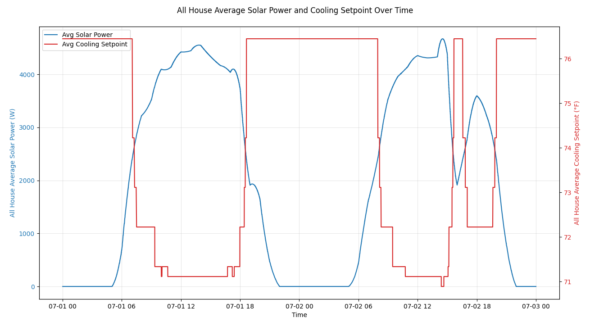

# Writing Data to the Model

!!! warning "Incomplete Documentation"

    The documentation on this page is incomplete at this time. All of the documentation written is correct (to the best of our knowledge) but you will see "**TODO**" items on this page that are serving as reminders and placeholders to be addressed at a future time.

**Example file:** [`docs/examples/api/example_read_write_data.py`](../../../../examples/api/example_read_write_data.py)

GridLAB-D™ traditionally has had limited means of writing data into the model. The most basic method has been using time-series data that plays in a single value to define a particular parameter on a particular object; this data is stored in what is called a "player" file. Though this data can be used on multiple objects' (they all get the same value) which can be subject to a linear transformation, it is still very static data and thus is more limited in its application.

To get true dynamic interaction with a GridLAB-D™ model has required using [HELICS](https://helics.org) to perform a co-simulation. Running a co-simulation allows an external program (often another Python script) to send and receive data with a GridLAB-D™ model during runtime and thus allow arbitrary funcionality as realized in the Python script to impact the GridLAB-D™ model. This has been a good way of implementing custom controllers on, say, inverter objects or EV charger to test out a new control strategy. The downside of this using HELICS to implement such a controller is increased complexity; running co-simulations always takes more work than running a single GridLAB-D™ model. With the GridLAB-D™ API, it is now possible to write that same kind of control logic (for example) in a Python script that directly interacts with the GridLAB-D™ model; no need for HELICS. 

One catch with writing to object parameters in GridLAB-D™: not all parameters are effectively writeable. Some parameters are calculated by GridLAB-D™ every time step and are effectively "read-only". The API provides a means of testing whether a write to these parameters is valid or not. (**TODO** - API docs - Waiting on resultion to [Github #1565](https://github.com/gridlab-d/gridlab-d/issues/1565); it was fixed but now is not? I'm hoping we get both an error return code and a console message when writing to read-only parameter.)

Others are only read by GridLAB-D™ on model initialization and further updates to the parameters do not impact the model. The bad news in these cases is that no error or console message is generated and the only way to see if the parameter is read after object initialization is to look at the [source code](https://github.com/gridlab-d/gridlab-d).

## Data-Writing Example

This example ([`example_read_write_data.py`](../../../../examples/api/example_read_write_data.py)) shows the use of the GridLAB-D™ APIs to both read values out of the model and then write model parameters back in. In this example, we use the simple `set_property()` API to change a single property of a specific object but the API also provides `set_property_by_class()` to do the same for a single parameter in all objects of a specific class. 

In this example, a simple controller is implemented that reads in the rooftop solar production for each house. If the production for that house it greater than 50% of the rating of the panel, the air-conditioning system is forced on by setting the thermostat's cooling setpoint to a very low value; when the solar production is not sufficiently high, the nominal setpoint is used. This control strategy seeks to make good use of on-site generation when available. This strategy results in more aggressive cooling during the sunny middle of the day and less so in the evenings, nights, and mornings. Figure 1 shows the results of this controller, with the average solar production and its impact on the average house cooling setpoint.

{ #fig:data-reading-writing-example}