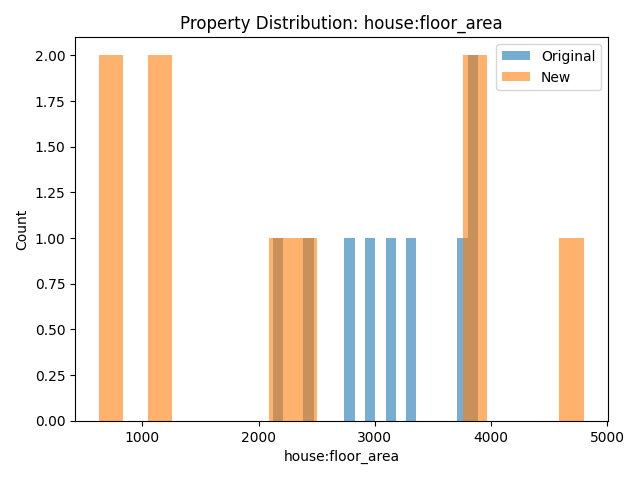
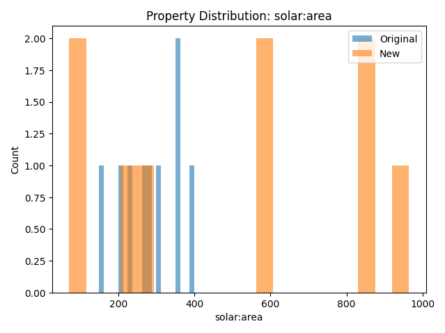

# GUI for Model Modification

!!! warning "Incomplete Documentation"

    The documentation on this page is incomplete at this time. All of the documentation written is correct (to the best of our knowledge) but you will see "**TODO**" items on this page that are serving as reminders and placeholders to be addressed at a future time.

**Example file:** [`docs/examples/api/example_app_model_edit_gui.py`](../../../../examples/api/example_app_model_edit_gui.py).

This code has been tested to create a GUI that is reasonable but the model output has not been tested.

- **TODO** - API docs - Test model produced by model configuration GUI [Github issue #1713](https://github.com/gridlab-d/gridlab-d/issues/1713)
- **TODO** - API docs - Narrative of exmaple is [Github issue #1761](https://github.com/gridlab-d/gridlab-d/issues/1761) 
- **TODO** - API docs - waiting on checkpoint working to test whether the model runs or not.

Outline:
- Allows you to load a model, identify parameters of existing objects you want to randomize, and export a new model
- Exports model as a checkpoint JSON
- Run the model with the runtime monitoring app (next example)

{ #fig:example-model-edit-floor-area-distribution}

{ #fig:example-model-edit-solar-area-distribution}