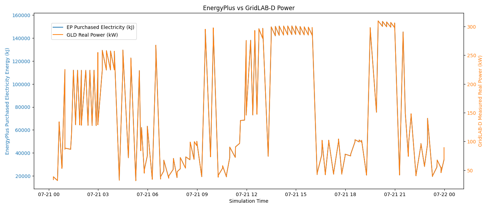

# EnergyPlus Integration

GridLAB-D™'s `house` objects do well at modeling the thermodynamics of single zone structures in a computationally efficient manner but work less well for larger, multi-zone and/or multi-story structures. For these kinds of systems, a better choice is EnergyPlus. EnergyPlus was originally developed for evaluating energy efficiency standards and thus well-captures many of the physical nuances of thermal envelopes and centralized heating and cooling systems. Being more of a thermodynamic tool, it doesn't model some of the things a power systems engineer might be interested in such as voltage sensitivity or reactive power of the HVAC system.

As of this writing, EnergyPlus has a Python API which can be used in conjuction with the GridLAB-D™ Python API to build an integrated simulation of an electrical distribution system where one or more static loads can be effectively replaced by an EnergyPlus model and updated as simulation time progresses. This example does exactly that using a modified version of the "houses.glm" model where a large three-phase electrical load has its power values updated at every EnergyPlus timestep.

The softare architecture of EnergyPlus requires the use of a callback method that is called as every time step is completed; there is no way to explicitly control the simulation time in EnergyPlus via the Python API as there is in GridLAB-D™. Because of this, EnergyPlus effectively dictates the advancement of simulation time and GridLAB-D™ comes along for the ride, taking its simulation step after EnergyPlus and with the same step size as EnergyPlus. As can be seen in the "cb_begin_zone_timestep()" method (which is registered as the callback method trigged when EnergyPlus takes a simulated timestep), the total load of the building is read from the EnergyPlus model using it's Python API, a unit conversion takes place, and then the `load` object in GridLAB-D™ is updated to use this load. The power factor of the building is assumed to be a static value, allowing the reactive power of the load object in GridLAB-D™ to be defined. After updating this load object, GridLAB-D™ advances in simulation time, ending the callback.

The EnergyPlus load and the GridLAB-D™ load as measured by a meter immediately upstream of the load representing GridLAB-D™ are shown in the figure below. As expected, these values are identical.

{ #fig:example-gld-ep-results}