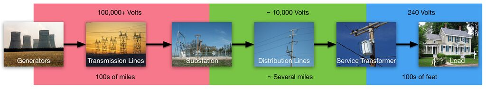
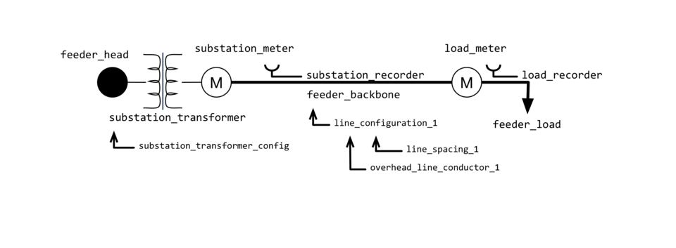

# 3.1.1 Basic Distribution System Modeling

For those you coming to GridLAB-D™ with that are new to the field, here's how the power system has worked for the past several decades. 

Generators, often but not always located a fair distance from any population centers, take some form of fuel, burn it, heat water, produce steam, and turn an electrical generator, producing electrical energy. Because these generators are so far from the places where the energy will be consumed, the energy first travels through the high-voltage (sometimes called "bulk") transmission system. To minimize losses in the transmission lines, the voltage on these lines is very high, usually many hundreds of kilovolts and these lines can run hundreds of miles. 

Once the energy reaches a city, town, or factory where it will be used, the energy enters a substation where, among other things, it is stepped down to a less dangerous but still relatively high voltage, often somewhere between ten and twenty kilovolts. Once leaving the substation, the energy travels through the distribution system, sometimes for several miles winding its way through one or more neighborhoods. Many times along this path connections to individual houses are made and to accomplish this, the voltage is lowered once again through a service transformer to 120/240V. A relatively short line of tens or even hundreds of feet is run from the service transformer to the house where the end consumer, acting as a load on the system, will use the energy for lighting, cooling, or some other purpose. 

GridLAB-D™ was originally designed as a distribution system simulator and deals most directly with the electrical system from the substation on down (green and blue boxes). As you'll see in coming chapters, this entails building systems that include both the electrical distribution system wiring (green) but also representations of the the end-user loads (blue). By including both in the system, it is possible to cleanly capture their effects on each other. This can be very powerful as it allows us to explore interactions that may not be initially obvious at first. For example, what happens to the distribution system line losses if everybody in the neighborhood lowers their thermostat one degree in the summer? As we'll see, GridLAB-D can answer that. 

## Model Overview - Distribution System Basics

So let's start by looking at how a simple distribution system is represented in GridLAB-D. The example we’ll be using is [distribution_system_basics.glm](https://github.com/gridlab-d/course/blob/master/Tutorial/Chapter%203%20-%20Basic%20Electrical%20Distribution%20Systems/Distribution%20system%20basics/distribution_system_basics.glm) go ahead and open it up with any text editor. (You can download the entire example repository [here](https://github.com/gridlab-d/course/)) A quick read through the document should be, largely self-explanatory. There are objects that define a substation node, a substation transformer, a substation meter, an overhead line, a meter for a load, and the load itself; the figure below provides a graphical representation of the model. 

### Nodes and Meters

The topology of an electrical distribution is like many other networks in that it is largely defined by two types of objects: nodes and lines. In GridLAB-D™ a node is used as a connection point between two lines and is used by the powerflow solver as it finds the voltages and currents in the network. As such, nodes have parameters that define the basic electrical information in the network such as the voltage, current, and power flowing through that node. 

Looking at our example, we can see that `feeder_head` is a `node` object with a few parameters defined. 

  * `name` \- All GridLAB-D objects support user names to help the user document the model.
  * `bustype` \- We won’t get into this here but for the type of solver we’re using, one node in the system must be able to be freely defined and in this example, we have designated this node for that purpose.
  * `phases` \- Defines which of the three phases pass through this node. Inconsistency in the use of phase information on lines and nodes makes GridLAB-D™ grumpy and it will let you know if the model you’ve defined has these kinds of problems.
  * `nominal_voltage` \- Though it is a voltage, this parameter does not define the actual voltage at that node; that’s the job of the powerflow solver. Instead, this nominal value is used as a starting point for the solver and can be helpful for a user to ensure the network is constructed properly and nodes that are supposed to be at 12.47 kV are not directly connected to nodes at 230 kV. Note that node voltages are defined as line-to-neutral values.
  
Because nodes contain much of the essential electrical information for the network, a special sub-class (literally a C++ sub-class in the GridLAB-D source code) of the node object type is a meter. As a sub-class it contains all the same parameters as a node; any information you want from a node you can also get from a meter. Additionally, it has a bunch of extra parameters that might be useful for a meter such as billing information, total monthly energy, and special “measured” values for power, voltage and current. In fact, looking at our example, you can see the two meter objects have recorder objects embedded in them (covered in more detail in the following sections) that are acting on these special measured values. 

### Lines

The other half of any topology definition is a line object. As in any network, lines connect nodes and in the case of an electrical distribution system, they are the paths along which electrical energy flows. As with any simulator that solves powerflows, the parameters of these lines can make a significant difference in the values of that solution and GridLAB-D provides the ability to define many of those parameters. In the `overhead_line` object for this model, there are expected parameters like which two objects this line connects and how long the line is but we also see that there is a `configuration` parameter which refers to another object called `line_configuration_1`. This object in turn refers to two other objects: `overhead_line_conductor_1` and `line_spacing_1`. If you have experience in dealing with powerflow equations then the parameters defined in all these objects might ring some bells; if you haven’t, then let’s just simply say that these details matter and will have an impact on how the electrical system performs. 

### Recorders

Though we have discussed these already as a means of demonstrating the discrete-time nature of GridLAB-D, its worth giving recorders a little bit more attention. Recorders are the primary means of getting data out of GridLAB-D™ simulations. As the name implies (and as you have seen) recorders allow any parameters of an object to be written out to a file at regular time intervals. Recorders are attached to objects in parent/child relationships (discussed below) and log the indicated parameter of that object to a CSV file with a few header lines of metadata about the source of the simulation data. 

The parameters of the recorder object are mostly self-explanatory: a name for the recorder object itself, the file that the recorded data will be written to, the time interval between recordings in seconds (GridLAB-D™’s fundamental time unit is one second), and a list of parameter values to be recorded. As you might expect, the parameters must be parameters of the parent object; asking a recorder to log the temperature of a node will not work as the GridLAB-D™ model of a node does not include temperature as a variable. 

### Supporting Objects and Their Relationships

Though many of the objects in this model are relatively easily understood, there are a few whose purpose, though not difficult to understand, have implementations in the model that seem a bit odd. These objects, `line_configuration`, `line_spacing`, `transformer_configuration`, and `recorder` all play a sort of supporting role, either completing the definition of other objects or providing additional functionality to specific objects. The reason behind the fragmentation of these object definitions will become obvious later (particularly once we start looking at very large models) but for now it is enough to say that splitting the definition for some objects provides modularity that makes the user’s job in building the model easier. 

In examining these supporting objects, it becomes clear that there are a variety of ways in which the relationship between objects can be defined. 

  * **From/To** \- Both the `transformer` and the `overhead_line` objects have explicit parameters that define which two other objects they reside between. Note that for `transformer` objects, the `from` and `to` define the direction of the turns ratio; `from` being the primary side and `to` being the secondary. For lines, switching the `from` and `to` makes no difference.
  * **Parent/Child** \- Some objects can be related to each other in a parent/child fashion where the child object has direct access to the parent object parameters it needs to function properly. The syntax for this relationship has two forms: 
    * Explicit - Objects contain a `parent` parameter that indicates which object it is a child of. In this example, the `feeder_load` object explicitly lists the `load_meter` object as its parent.
    * Implicit - Within the definition of an object is the definition of another object. Looking at our example, the `load_recorder` object is an implicit child of the `load_meter`.
  * **Configurations and spacings** \- Line objects require other objects to complete their definitions; these supplemental definitions are the `line_configuration`, `line_spacing`, and `overhead_line_conductor` object types. Similarly, a `transformer` object requires a `transformer_configuration` object. Without these additional definitions the powerflow cannot be solved and GridLAB-D will throw an error message telling you so. A single `line_configuration` can be referenced by multiple `overhead_line` objects and a single `line_spacing` object can be used by multiple `line_configuration` objects but the converse is not true; a `line_configuration` object can only reference one `line_spacing object`.

Note that the above relationships are unique to each object type and thus have variations in syntax. That is to say, though it seems like you should be able to embed the `line_configuration` object for a line in the `overhead_line` object, defining it as a parent/child relationship, this is not acceptable for GridLAB-D. Configurations much be defined as their own objects. 

## Results from Simulation

Given that overview of the this example model, let’s run GridLAB-D using that model and take a look at the results as produced by the two recorder objects in the model. From the command line type (assuming you are in the "Distribution systems alternative forms" folder): 
    
    
    gridlabd distribution_system_base.glm --profile

GridLAB-D will run the indicated model file and `--profile` spits out summary information about the simulation run itself. Assuming the simulation completed without trouble, there should now be two new files in the same folder as the .glm: “load_data.csv” and “substation_data.csv”. Open up both of these files (they are just text CSV so a text editor will work fine) and take a look at the results. 

Both files start with some self-explanatory meta-data beginning each line with the `#` symbol. The last of these is acts as column headers for the various data that was logged by the recorder. The first entry is a timestamp showing the local time of the recorded events; this matches the time of the simulation defined by the “clock” command at the beginning of the file. The next three values are the measured complex voltages, currents, and powers recorded by the meter. Because this model has nothing that varies with time, all the recorded values are identical. This static case is neither typical or interesting and we’ll be discussing in later section both how to play data into the simulation and how to build models that do have inherently dynamic elements in them. 

Another item of note is that the power measured at the substation meter is slightly larger than that measured at the load. This change in load is due to the losses in overhead distribution line that we connected between the two meters. You can see in the `overhead_line` object the length of the line is 10,000 (feet) and looking in the `overhead_line_conductor` the resistance is 0.1 (ohms/mile). Even though very little current is flowing in this line (approximately 48 A, from looking at the values in the CSVs generated by the recorder), the resistance of the line does produce a small voltage drop of about 100 V. 

## Distribution System Alternative Form

Many aspects of GridLAB-D™ support alternative representations that do not affect the simulation results. As a means of demonstrating this, open [distribution_system_alternative.glm](https://github.com/gridlab-d/course/blob/master/Tutorial/Chapter%203%20-%20Basic%20Electrical%20Distribution%20Systems/Distribution%20systems%20alternative%20forms/distribution_system_alternative.glm) take a look: 

  * Spaces in object names, parameters, files, pretty much anywhere can be supported by quoting the string in question. This can be seen in the name of the substation `meter`, the name of the `line_configuration` object, and the name of the CSV files generated by the recorders.
  * Speaking of recorders, as discussed previously, the recorder object can be alternatively expressed as a child of the meter by moving it out of the meter object and defining its parent as that meter object. This model keeps the `load_recorder` as an implicit child while changing the `substation_recorder` to an explicit child.
  * Both recorders now record the complex phase A voltage, current and power as separate real and imaginary parts. This ability to split the two complex halves apart is a parameter of the complex data type in GridLAB-D™ and is available wherever complex values are used in the simulation. (TODO Is this true?)
  * Several of the parameter values have been altered and a unit has been added. The line length was 10000 (feet) and and is now 3.048 km, the load is now in kVA rather than VA, and the substation meter `nominal_voltage` is now in kV.
  * The phases of `feeder_head` are now indicated using `|` delimiters.

Re-running the simulation and comparing its results files and those of the "distribution_system_base.glm" shows no difference. These and other differences in style will arise as we work through this tutorial and when examining models built by others. Being able to identify which small changes in the model are meaningful and which are stylistic differences will be helpful as the size of the models increases. 

