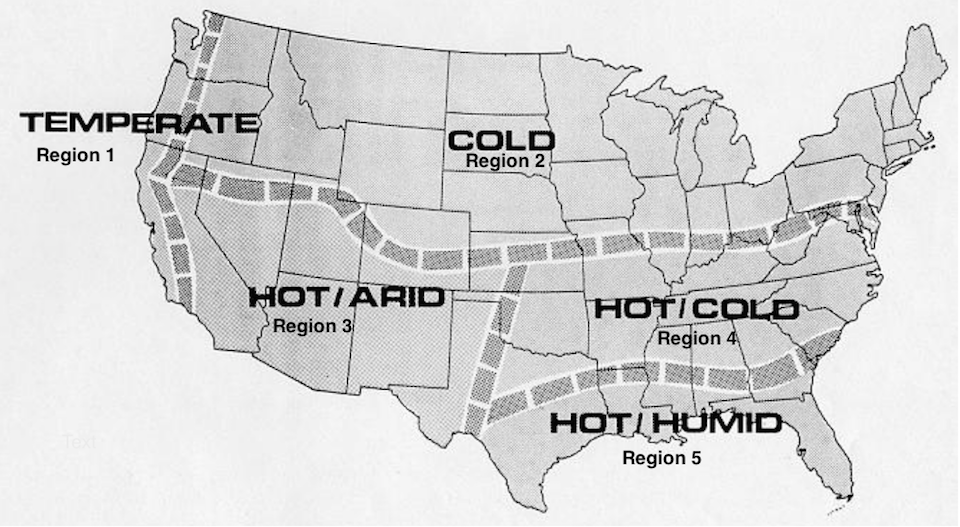

# 3.1.8 Built-In Distribution Models

As you can likely see by this point, GridLAB-D has the capability of representing very large distributions with a high degree of fidelity, replicating unique behaviors for each residence in the network and driving load as the weather changes through the day and year. This is a powerful capability with one crucial flaw: the actual models need to built that connect all these pieces together appropriately. So far, the example models we’ve been using have been relatively small in size with a handful of nodes, a few loads and a bit of supporting infrastructure in the distribution system like voltage regulators and capacitors. A realistic distribution system would have hundreds, if not thousands of objects, each uniquely defined. Creating a model like this by hand would be a herculean effort. 

Fortunately, the GridLAB-D developers have addressed this with what are called the Taxonomy Feeders. Found [here](https://sourceforge.net/p/gridlab-d/code/HEAD/tree/Taxonomy_Feeders/) these models are the second secret weapon of GridLAB-D, after the residential class. This collection of about two dozen models are the result of an extensive study in which models of actual distribution systems from across the United States were collected and analyzed. The results from this analysis was used to identify typical features of these distribution systems based on region and type of feeder and subsequently used to define typical feeders, the so-called taxonomy feeders. An entire report on this analysis process and further details on the specific feeder models can be found at in [the report that was generated](http://www.gridlabd.org/models/feeders/taxonomy_of_prototypical_feeders.pdf). 

The naming of the feeder models follows the form of: 

  * R<region number> \- The regions are based on common weather patterns and are roughly defined by the following map:

  * xx.xx - Primary voltage of feeder in kV
  * x - Serial number of feeder
  
For example, R5-12.47-1 is a model for a distribution feeder commonly found in the coastal SE portion of the United States. The main distribution voltage is 12.47 kV and this is serial number 1 of such models. (Looking at the report, we see there are a total of five models.) 

In their stock form, these feeders are very useful for examining the powerflow in a distribution system but come built with static loads. Through the use of schedules and players it is possible to create more realistic loading on the network but doing so would miss out on so much of the functionality GridLAB-D has to endogenously produce using loads from the residential class. To fully realize this kind of model for a distribution system, the GridLAB-D developers have written a MATLAB script that takes one or more of these taxonomy feeders and replaces the static loads with one or more residential loads of the appropriate size. 

The script is called “Feeder_Generator.m” and is found in the GridLAB-D distribution at `.../Taxonomy_Feeders/PopulationScript/`. Using the script requires defining a few variables internal to the script: 

  * TechnologyToTest - This value defines which technology will be implemented in the feeder. The base case simply does the load conversion, filling the feeders with residences. Other technologies do things like add market functionality with variable pricing, adding solar PV, or implementing a CVR scheme.
  * user_configuration - This function is implemented in a supplemental file (“user_configuration.m”) and allows customization of the conversion to be supported based on user. Each user defines a few variables such as which taxonomy feeders to populate, where the taxonomy feeder models are and where the populated models should be placed. Either modify one of the existing user’s settings or make your own branch of the if/else statement and set the variables as you
  
Once these two are set, running “Feeder_Generator.m” should generate the populated feeders. These are large files, tens of thousands of lines long with cryptic names for all the feeder objects. If further modification of the model is needed, a separate post-processing script can be run on the generated model, searching for appropriate strings and replacing as necessary. Alternatively, with careful editing the “Feeder_Generator.m” script can be modified so that the changes occur as an integral part of the population process. 

## Other Sample Models

### PGE Models

As a part of a project PNNL completed with Pacific Gas and Electric (PG&E), a number of distribution system models were converted into GridLAB-D format. These models have been made available as a part of the GridLAB-D distribution and offer the same benefits as the taxonomy feeder models: they are constructed from real-world systems and thus have some degree of realism built into them. 

The models are broken into two portions. The first is the primary model and it represents the distribution system up to the point of the individual distribution transformers. The loads are expressed as generic ZIP loads at this higher voltage and use schedules and schedule transforms to generate the changes in load level over time. There are twelve different primary-side distribution models available. 

In conjuction with these primary models, a few secondary system models have also been assembled, these representing the loads attached to a single distribution transformer, typically multiple houses. A number of scenarios for this model have been created to examine the effects of new distribution system load such as transients due to variability in solar PV output and loading due to EV charging. These models use `house` objects as well as some of the more experimental models such as dishwashers, ranges, and clothes driers. 

The models can be found at <https://sourceforge.net/p/gridlab-d/code/HEAD/tree/Taxonomy_Feeders/PGE_Models/> and can be downloaded from the GridLAB-D repository just like the Taxonomy Feeder models or the GridLAB-D source code. There are a number of "readme.txt" files that provide more details and clarification on the use of the models. 

### Auto-test Models

One slightly sneaky way to understand how a particular class or feature in GridLAB-D is to look at the simple models the GridLAB-D developers have written to test the functionality of the feature. These models are part of the auto-test functionality built into GridLAB-D that developers use to ensure that development or modification in one part of the code doesn't inadvertently break some other portion of functionality. 

The first step, if you haven't already, is to download the source code; instructions are in the [Installation Guide]. Alternatively, you can browse the [online repository](https://sourceforge.net/p/gridlab-d/code/HEAD/tree/). 

Next, you'll need to find the portion of the source code that contains the feature of interest; the module names are mostly self-explanatory. Once inside the module folder is another folder named "autotest" and inside this folder is a number of model files and their supporting data files (weather, players, schedules, etc) needed to run those models. Now the moment of truth: do any of these autotest models contain the particular feature needed? Examining the names of the model files should be helpful but the only way to know for sure is looking into the files themselves. 

If you do happen to find a model that contains what you're looking for, it will be important to strip out any `assert` object and their related parameter statements. These objects are what makes these models autotests; the `assert` object forces GridLAB-D to compare the values of the specified parameters as they are generated in simulation to pre-recorded values in a player file. If they differ by more than a specified amount, the simulation crashes, alerting the developer that something is wrong. For educational purposes, there is no need for such a comparison to be made. 

There's no guarantee what you're looking for will be in an autotest. Not all features have autotests and those that do may or may not be helpful in getting your model to work. The nice thing about the autotests, though, is that they are guaranteed to run correctly, since they must pass as a part of the release process. 

### Training Course Models

There has been previous training on GridLAB-D provided by developers over the years. Not only are the presentations used in that training provided but the models used as demonstrations and in-class exercises are as well. Perusing through these examples may reveal a whole or partial model that is useful. The training materials can be found at <https://sourceforge.net/p/gridlab-d/code/HEAD/tree/course/>. 

