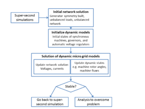

# Microgrids

**TODO**: 
This was a "Dev_" page. Review and rework to update

Microgrids are useful 

# Implementation

Implementation details 

## Sub-second Implementation (Dynamic)

The GridLAB-D dynamic simulations represent electro-mechanic transients of unbalanced micro grid operation. The synchronous machines models are in fundamental frequency phasor representation considering unbalanced operation. The network and loads are represented with a full abc model. Additionally, diesel governor control and automatic voltage regulators are modeled. Figure 1 briefly presents the overall algorithm. Each model in the algorithm is explained in detail below. 

Figure 1. Overall algorithm of sub-second implementation

### Notation

The following variables and parameters are used in the dynamic model equations below. 

Table 1 - Equation Notation  

| Variable                          | Definition                           
|-|-|
| $i$ | Generator connected to bus i
| $E^\prime_{d,qi}$                 | Transient voltages for direct and quadrature axis
| $E^{\prime\prime}_{d,qi}$         | Subtransient voltages for direct and quadrature axis              
| $\psi_{1d,2qi}$                   | Flux linkages of direct and quadrature axis dampers               
| $T^\prime_{do,qoi}$               | Open circuit transient time constants for direct and quadrature axis                           
| $T^{\prime\prime}_{do,qoi}$       | Open circuit subtransient time constants for direct and quadrature axis                        
| $x^\prime_{d,qi}$                 | Transient reactances for direct and quadrature axis               
| $x^{\prime\prime}_{d,qi}$         | Subtransient reactances for direct and quadrature axis            
| $x_{li}$                          | Leakage reactance                   
| $R_{0,1,2i}$                      | Zero, positive, and negative sequence resistances                
| $I_{d,qi}$                        | Currents for direct and quadrature axis                          
| $I_{0,1,2i}$                      | Zero, positive, and negative sequence stator currents            
| $E_{fd}$                          | Field voltage                      
| $\omega_{i}$                      | Rotor mechanical speed             
| $\omega_{s}$                      | Rated rotor mechanical speed       
| $\delta_i$                        | Rotor angular position             
| $T_{mechi}$                       | Mechanical torque                  
| $H_{i}$                           | Inertia constant                   
| $D_{i}$                           | Machine damping                    
| $\left[ E^{\prime\prime}_{a,b,c} \right]$ | Vector of internal machine subtransient voltages in abc coordinates                           
| $V_{a,b,c}$                       | Network bus voltages in abc coordinates                         
| $I_{a,b,c}$                       | Network bus current injections in abc coordinates               
| $\left[ Jac \right]$              | Jacobian matrix of three-phase power flow solution              
| $\left[ Y_{Ga,b,ci} \right]$      | Matrix of machine subtransient admittances in abc coordinates   
| $Y_{G0,1,2i}$                     | Machine subtransient admittances in symmetrical components coordinates                        
| $\left[ I_{GSa,b,ci} \right]$     | Vector of machine Norton current sources in abc coordinates     
| $P_{T}, Q_{T}$                    | Total terminal active and reactive generated power              
| $I_{GS 0,1,2}$                    | Machine Norton current sources in symmetrical component coordinates                           
| $\left[ V_{Ga,b,c} \right]$       | Vector of generator phase terminal voltages                     
| $V_{R}$                           | Regulator voltage                  
| $V_{set}$                         | Voltage setting of automatic voltage regulator (AVR)            
| $V_{err}$                         | Control error for AVR             
| $x_{b}$                           | State variable of AVR transient gain reduction                  
| $T_{B}$                           | Time constant of AVR transient gain reduction                   
| $T_{C}$                           | Time constant of AVR transient gain reduction                   
| $T_{A}$                           | Exciter time constant              
| $K_{A}$                           | Exciter gain                      
| $E_{MAX,MIN}$                     | Exciter limits                    
| $\omega_{set}$                    | Governor speed setting            
| $R$                               | Governor droop                    
| $x_{1,2}$                         | Governor electric control box state variables                  
| $T_{1,2,3}$                       | Governor electric control box time constants                   
| $y_{gov}$                         | Governor electric control box output                           
| $K$                               | Governor actuator gain           
| $x_{4,5,6}$                       | Governor actuator state variables
| $T_{4,5,6}$                       | Governor actuator time constants 
| $y_{throttle}$                    | Governor actuator output (throttle)      

### Three-phase synchronous machine model

Unbalanced operation of three phase synchronous machines is modeled using a simplified fundamental frequency model in phasor representation according to [1, 2, 3, 4]. This simplification allows representing the machine in symmetrical components where the positive sequence represents the main electrical torque, and the negative sequence current produces a torque in opposition. The total electrical torque is constant, facilitating the solution and determination of equilibrium. However, the variation of electrical torque due to unbalanced operation reported in [5, 6] is ignored. In addition, typical assumptions for transient stability models are also made: ignoring sub-transient saliency, and neglecting the stator dynamics [7]. 

The machine electrical dynamic equations are: 

$$T^{\prime}_{doi} \frac{d E^{\prime}_{qi}}{dt}=E_{fd}- E^{\prime}_{qi}- (x_{di}-x^{\prime}_{di}) \left[I_{di}- \frac{(x^{\prime}_{di}-x^{\prime\prime}_{di})}{( x^{\prime}_{di}-x_{li})^2} \left[\psi_{1di}+ (x^{\prime}_{di}-x_{li}) I_{di}- E^{\prime}_{qi}\right] \right]$$

$$T^{\prime\prime}_{doi} \frac{d \psi_{1di}}{dt}=- \psi_{1di}+ E^{\prime}_{qi}- (x^{\prime}_{di}-x_{li}) I_{di}$$

$$T^{\prime}_{qoi} \frac{d E^{\prime}_{di}}{dt}=- E^{\prime}_{di}+ (x_{qi}-x^{\prime}_{qi}) \left[I_{qi}- \frac{(x^{\prime}_{qi}-x^{\prime\prime}_{qi})}{( x^{\prime}_{qi}-x_{li})^2} \left[\psi_{2qi}+ (x^{\prime}_{qi}-x_{li}) I_{qi}+ E^{\prime}_{di}\right] \right]$$

$$T^{\prime\prime}_{qoi} \frac{d \psi_{2qi}}{dt}=- \psi_{2qi}- E^{\prime}_{di}- (x^{\prime}_{qi}-x_{li}) I_{qi}$$

$$E^{\prime\prime}_{di}=-\frac{(x^{\prime\prime}_{qi}-x_{li})}{(x^{\prime}_{qi}-x_{li})} E^{\prime}_{di}+ \frac{(x^{\prime}_{qi}-x^{\prime\prime}_{qi})}{(x^{\prime}_{qi}-x_{li})} \psi_{2qi}$$

$$E^{\prime\prime}_{qi}= \frac{(x^{\prime\prime}_{di}-x_{li})}{(x^{\prime}_{di}-x_{li})} E^{\prime}_{qi}+ \frac{(x^{\prime}_{di}-x^{\prime\prime}_{di})}{(x^{\prime}_{di}-x_{li})} \psi_{1di}$$

The machine mechanical dynamic equations are: 

$$\frac{d\delta_{i}}{dt}=\omega_{i}-\omega_{s}$$

$$\frac{2 H_{i}}{\omega_{s}} \frac{d\omega_{i}}{dt}=T_{mechi}- \frac{(x^{\prime\prime}_{qi}-x_{li})}{( x^{\prime}_{qi}-x_{li})} E^{\prime}_{di} I_{di}- \frac{(x^{\prime\prime}_{di}-x_{li})}{( x^{\prime}_{di}-x_{li})} E^{\prime}_{qi} I_{qi}- \frac{(x^{\prime}_{di}-x^{\prime\prime}_{di})}{( x^{\prime}_{di}-x_{li})} \psi_{1di} I_{qi}+ \frac{(x^{\prime}_{qi}-x^{\prime\prime}_{qi})}{( x^{\prime}_{qi}-x_{li})} \psi_{2qi} I_{di}- (x^{\prime\prime}_{qi}-x^{\prime\prime}_{di}) I_{di} I_{qi}- (R_{2i}-R_{si}) I_{2i}^2- D_{i}(\omega_{i}- \omega_{s}) $$

  
### Network solution: initial static power flow and network solution during dynamic simulations

The network and loads are represented in full abc coordinates. The abc representation allows a complete representation of line and load unbalances. The network solution is anextension the method proposed in [8]. 

  
To adequately initialize the dynamic simulation, the static power flow solution of three-phase synchronous generator buses should consider the symmetry built features of generators. In other words the phase voltage and power unbalance of the generator buses cannot be freely determined. Even though the phase powers and voltages can be still unbalanced, they are subject to a generator symmetry built constraint. The symmetry built constraint was first introduced in [9] for PQ generator buses in a distribution network power flow solution. In [10], the symmetry built constraint is also applied to slack and PV buses, allowing for an adequate initialization of dynamic simulation from the static power flow solution. The symmetry constraints are applied to the initial static power flow as follows. 

  
The following equations describe the network solution model in compact form, for more details see [8]. 

$$\left[ \Delta I_{a,b,c} \right] = \left[ Jac \right] \left[ \Delta V_{a,b,c} \right]$$

Where the matrix $\left[ Jac \right]$ is equal to the bus admittance matrix, except for the diagonal elements that have additional terms to represent ZIP loads [8]. The full generator admittances are incorporated to the bus admittance matrices to represent the machine characteristics. The generator admittance matrices are, according to [9]: 

 $$\left[ Y_{Ga,b,ci} \right] = \frac{1}{3}\begin{bmatrix} 1 & 1 & 1 \\ 1 & e^{j 4\pi /3} & e^{j 2\pi /3} \\ 1 & e^{j 2\pi /3} & e^{j 4\pi /3} \\ \end{bmatrix} \begin{bmatrix} Y_{G0i} & 0 & 0 \\ 0 & Y_{G1i} & 0 \\ 0 & 0 & Y_{G2i} \\ \end{bmatrix} \begin{bmatrix} 1 & 1 & 1 \\ 1 & e^{j 2\pi /3} & e^{j 4\pi /3} \\ 1 & e^{j 4\pi /3} & e^{j 2\pi /3} \\ \end{bmatrix}$$ 
 
 The symmetry constraint applied to generator buses in the initial static power flow solution is given by [9]: 

$$I_{GS1}= \frac{P_{T}+jQ_{T} + \left[ V_{Ga,b,c} \right]^{*T} \left[ Y_{Ga,b,ci} \right] \left[ V_{Ga,b,ci} \right]} {V_{Ga}^{*}+ e^{j 4\pi /3} V_{Gb}^{*}+ e^{j 2\pi /3} V_{Gc}^{*}}$$

$$\left[ I_{GSa,b,ci} \right] = \frac{1}{3}\begin{bmatrix} 1 \\ e^{j 4\pi /3} \\ e^{j 2\pi /3} \\ \end{bmatrix} I_{GS1}$$ 

Due to generator symmetry built, there are no negative and zero sequence current sources [9]: 

$$\displaystyle{} I_{GS0}= I_{GS2}=0$$

The symmetry built constraint was applied to PQ generator buses in [9]. The application to Slack and PV generator buses in a micro grid setting is reported in [10]. The symmetry constraint is no longer applied during the dynamic simulations, where the symmetric generator’s current source injection depend on the dynamic states as explained in the following point. 

### Interface between machine model and network solution

The synchronous machine dynamic models are linked to the network solution by using Norton current source equivalents with shunt generator impedances, as suggested in [9, 11]. The current sources are symmetric balanced current injections to respect the generator symmetry built (windings symmetrically distributed in stator and rotor), and the generator impedances account for the effect of unbalanced terminal voltages. It is important to notice that the total generator current (current source minus current derived through generator shunt impedance) can also be unbalanced. The interface is formulated as: 

$$\left[ I_{GSa,b,ci} \right]= \left[ E^{\prime\prime}_{a,b,c} \right] \left[ Y_{Ga,b,ci} \right] $$

Where $\left[ E^{\prime\prime}_{a,b,c} \right]$ is a balanced voltage calculated by transforming $E^{\prime\prime}_{di}$ and $E^{\prime\prime}_{qi}$ to network reference frame and then to abc reference frame. 

### Synchronous machine controllers: governor and automatic voltage regulator

Generator control models are also defined in the GridLAB-D dynamic simulations. The generator control models are: 

  * Woodward diesel governor (DEGOV1) that modifies the mechanical power of the diesel generator proportionally to the generator speed deviation
  * Simplified exciter system (SEXS) that modifies the generator field voltage (and hence its reactive power) to control the generator^\prime s terminal voltage (average voltage magnitude of all phases)
DEGOV1 and SEXS models are commonly used in power system industry-grade transient stability programs such as GE PSLF and PSS/E.Block diagrams for DEGOV1 and SEXS can be found at: <http://www.powerworld.com/files/Block-Diagrams-16.pdf>. DEGOV1 is on page 123 and SEXS is on page 88. 

  
The simplified exciter system (SEXS) equations are: 

$$V_{err} = V_{set}- average \left( |\left[ V_{Ga,b,c} \right] | \right)$$

$$ T_{B} \frac{d x_{b}}{dt} = V_{err}- x_{b}$$

$$V_{R}= x_{b}+ T_{C} \frac{d x_{b}}{dt}$$

$$T_{A} \frac{d E_{fd}}{dt} = K_{A} V_{R}- E_{fd}$$

$$E_{MIN} \leq E_{fd} \leq E_{MAX}$$

The diesel governor DGOV1 equations are: 

  * Electric control box

  $$T_{1} T_{2} \frac{d x_{2}}{dt} = \omega_{set}- \omega_{i}- R \cdot y_{throttle}- x_{1}- x_{2}$$

  $$ \frac{d x_{1}}{dt} = x_{2}$$

  $$\displaystyle{} y_{gov} = T_{3} x_{2}+ x_{1}$$

  * Actuator

  $$T_{5} \frac{d x_{5}}{dt} = K \cdot y_{gov}- x_{5}$$

  $$T_{6} \frac{d x_{6}}{dt} = x_{5}- x_{6}$$

  $$\frac{d x_{4}}{dt} = x_{6}$$

  $$T_{MIN} \leq x_{4} \leq T_{MAX}$$

  $$\displaystyle{} y_{throttle}= T_{4} x_{6}+ x_{4}$$

  * Diesel engine
  
  $$T_{mechi} = delay \left( y_{t}, T_{D} \right)$$

### References

  1. Kundur, P. “Power system stability and control” New York: McGraw-hill, 1994.
  2. Harley, R. G., E. B. Makram, and E. G. Duran. "The effects of unbalanced networks on synchronous and asynchronous machine transient stability." Electric power systems research 13, no. 2 (1987): 119-127.
  3. Makram, E. B., V. O. Zambrano, and R. G. Harley. "Synchronous generator stability due to multiple faults on unbalanced power systems." Electric power systems research 15, no. 1 (1988): 31-39.
  4. Makram, E. B., V. O. Zambrano, R. G. Harley, and Juan C. Balda. "Three-phase modeling for transient stability of large scale unbalanced distribution systems." Power Systems, IEEE Transactions on 4, no. 2 (1989): 487-493.
  5. Salim, R. H., and R. A. Ramos. "A Model-Based Approach for Small-Signal Stability Assessment of Unbalanced Power Systems." IEEE Transactions on Power Systems, November 2012.
  6. Krause, P., O. Wasynczuk, and S. Scott. "Analysis of electric machinery." IEEE Power Eng. Soc 15, no. 3 (1995).
  7. Kundur, P., and P. L. Dandeno. "Implementation of advanced generator models into power system stability programs." Power Apparatus and Systems, IEEE Transactions on 7 (1983): 2047-2054.
  8. Garcia, Paulo AN, Jose Luiz R. Pereira, Sandoval Carneiro Jr, Vander M. da Costa, and Nelson Martins. "Three-phase power flow calculations using the current injection method." Power Systems, IEEE Transactions on 15, no. 2 (2000): 508-514.
  9. Chen, T-H., M-S. Chen, Toshio Inoue, Paul Kotas, and Elie A. Chebli. "Three-phase cogenerator and transformer models for distribution system analysis." Power Delivery, IEEE Transactions on 6, no. 4 (1991): 1671-1681.
  10. Elizondo M, F Tuffner, K Schneider, “Network solution for initialization and simulation of transient stability model of unbalanced microgrid,” to be submitted
  11. Stott, B.. "Power system dynamic response calculations." Proceedings of the IEEE 67, no. 2 (1979): 219-241.

## Super-second Implementation

Super-second implementation details will go here - AVR and Drooping 

  

# See also

  * [User's manual]
  * [Requirements]
  * [Specifications]
  * [Grizzly (Version 2.3)]
