# Three Phase Induction Motors

Implement three phase induction motor dynamic phasor model into GridLAB-D. 

## Synopsis

This work will incorporate the ability to model three phase induction motor and other more advanced power flow capabilities into GridLAB-D. 

## Classes

## Variables

Variable | Definition   
---|---  
$V_{p}$ | Positive sequence voltage   
$V_{n}^{*}$ | Complex conjugate of negative sequence voltage   
$r_{s}$ | Stator resistance   
$L_{s}$ | Stator inductance   
$w_{s}$ | Angular speed   
$L_{m}$ | Magnetizing inductance   
$L_{r}$ | Rotor inductance   
$\Omega _{r,0}$ | Mechanical speed dc component   
$\Omega _{r,2}$ | Mechanical speed second harmonic component   
$I_{P}^{s}$ | Positive sequence of stator current   
$I_{n,s}^{*}$ | Complex conjugate of negative sequence stator current   
$I_{n,r}^{*}$ | Complex conjugate of negative sequence rotor current   
$J$ | Inertia   
$B$ | Damping constant   
$\psi _{f}^{R} + j. \psi _{f}^{I}$ | Forward rotating flux   
$\psi _{f}^{R} + j. \psi _{f}^{I}$ | Backward rotating flux   
$\phi $ | Voltage phasor angle   
  
## Dynamic Phasor Equations

$$V_{p} = \Big[r_{s} + j \cdot \omega_{s} \cdot L_{s} + L_{s} \frac{\mathrm{d} }{\mathrm{d} t} \Big] I_{P}^{s} + \Big[j \cdot \omega_{s} \cdot L_{m} + L_{m} \frac{\mathrm{d}}{\mathrm{d} t} \Big] I_{P}^{r}$$

$$0 = \Big[r_{r} + j \cdot \omega_{s} \cdot L_{r} + L_{r} \frac{\mathrm{d} }{\mathrm{d} t} \Big] I_{P}^{r} + \Big[j \cdot \omega_{s} \cdot L_{m} + L_{m} \frac{\mathrm{d} }{\mathrm{d} t} \Big] I_{P}^{s} - j \cdot \Omega_{r,0} \frac{\mathrm{P}}{2} \Big[L_{m} I_{P}^{s} + L_{r} I_{P}^{r} \Big] - j \cdot \Omega_{r,2} \frac{\mathrm{P}}{2} \Big[L_{m} I_{n,s}^{*} + L_{r} I_{n,r}^{*} \Big]$$

$$V_{n}^{*} = \Big[r_{s} - j \cdot \omega_{s} \cdot L_{s} + L_{s} \frac{\mathrm{d} }{\mathrm{d} t} \Big] I_{n,s}^{*} + \Big[-j \cdot \omega_{s} \cdot L_{m} + L_{m} \frac{\mathrm{d} }{\mathrm{d} t} \Big] I_{n,r}^{*}$$

$$0 = \Big[-j \cdot \omega_{s} \cdot L_{m} + L_{m} \frac{\mathrm{d} }{\mathrm{d} t} \Big] I_{n,s}^{*} + \Big[r_{r} - j \cdot \omega_{s} \cdot L_{r} + L_{r} \frac{\mathrm{d} }{\mathrm{d} t} \Big] I_{n,r}^{*} - j \cdot \Omega_{r,0} \frac{\mathrm{P}}{2} \Big[L_{m} I_{n,s}^{*} + L_{r} I_{n,r}^{*}\Big] - j \cdot \Omega_{r,2}^{*} \frac{\mathrm{P}}{2} \Big[L_{m} I_{P}^{s} + L_{r} I_{P}^{r} \Big]$$

$$J \frac{\mathrm{d} }{\mathrm{d} t} \Omega_{r,0} = \frac{\mathrm{P}}{2} \cdot L_{m} \Big(I_{P}^{s} I_{P}^{r} + I_{n,s}^{*} I_{n,r}^{*} \Big) - B \cdot \Omega_{r,0} - T_{L}$$

$$J \frac{\mathrm{d} }{\mathrm{d} t} \Omega_{r,2} = \frac{\mathrm{P}}{4} \cdot L_{m} \Big(I_{P}^{s} I_{n}^{r} + I_{n,s}^{*} I_{p,r} \Big) - \Big(B + j \cdot 2 \cdot J \cdot \omega_{s} \Big) \cdot \Omega_{r,2}$$

## Simulation study

### Case 1

Case 1 simulates a step change in mechanical torque at constant grid voltage. A torque step is applied at time t=10 sec. Fig 1. demonstrates constant quadrature axis voltage. Fig.2 indicates step change in torque. Following are the simulation results. Fig. 3 shows the impact of a step change in torque on direct axis current. Fig. 4 shows the impact of a step change in torque on quadrature axis current. Fig. 5 and Fig.6 show dc and second harmonic component of speed respectively. 

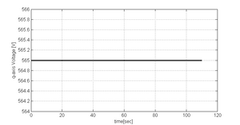

Figure 2. Q axis voltage

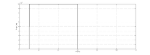

Figure 2. Step change in torque

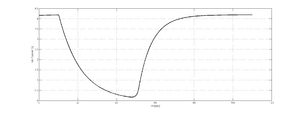

Figure 3. Direct axis current

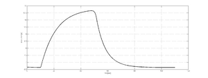

Figure 4. Quadrature axis current

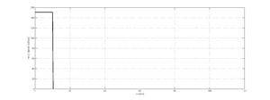

Figure 5. Speed

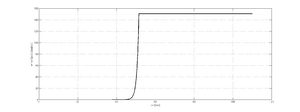

Figure 6. Second harmonic component of Speed

### Case 2

Case 2 simulates a step change in grid voltage. A constant load torque is considered. Following are the simulation results. Fig. 9 shows impact of step change in voltage on direct axis current. Fig. 10 shows impact of step change in voltage on quadrature axis current. Fig.11 and Fig.12 shows dc and second harmonic component of speed respectively. 

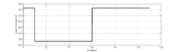

Figure 7. Q axis voltage

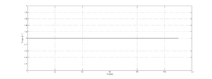

Figure 8. Step change in torque

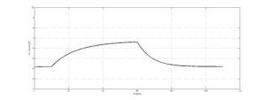

Figure 9. Direct axis current

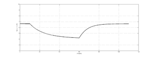

Figure 10. Quadrature axis current

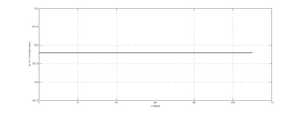

Figure 11. Speed

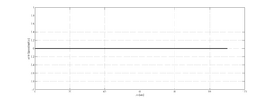

Figure 12. Second harmonic component of Speed

# References

P. Krause et al. Analysis of electric machinery and drive systems. Vol. 75. John Wiley & Sons, 2013. 

