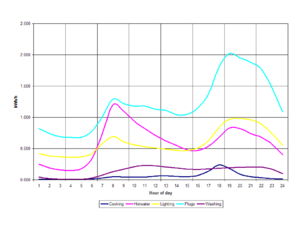
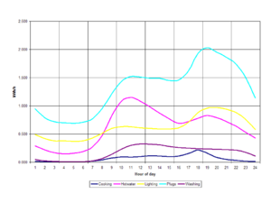
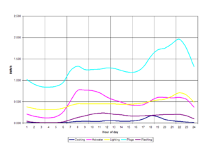
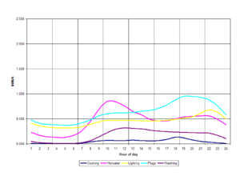
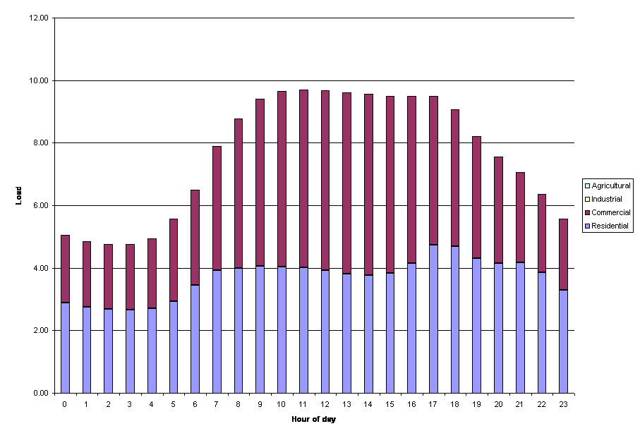
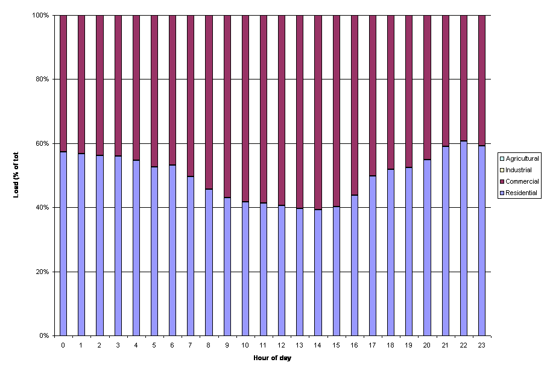
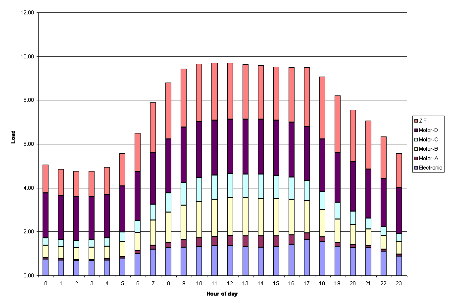
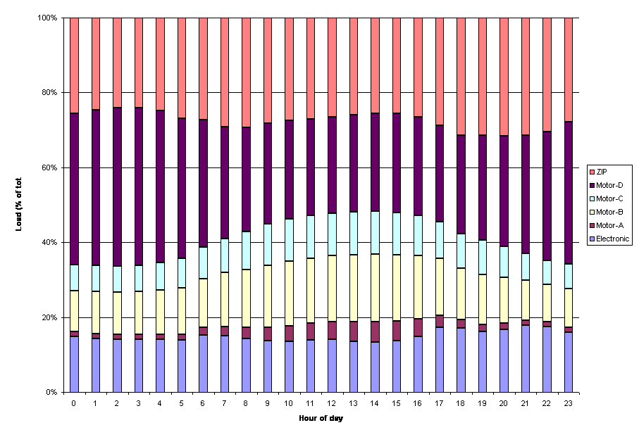

# Load Composition

This document describes the load composition methodology for estimating the load on a feeder. This methodology is important to identifying the response of the feeder to voltage changes. 

The methodology is implemented **Load composition.xls** spreadsheet locating in the [Load Composition download](http://sourceforge.net/project/showfiles.php?group_id=233096&package_id=309739). If you want to load different TMY data files, you will also need to extract the TMY files from the TMY folders using the **Load TMY Data** button on the **Conditions** worksheet. 

# Aggregation method

Load composition is the term used to describe the breakdown of end-use load according to the nature of the load. The current load composition breakdown is as follows. 

  1. **Electronic $P_E$** loads are those that use power electronics. These loads typically have constant power requirements, but often have adverse harmonic characteristics that make them appear to have poor power factors.
  2. **Motor A $P_A$** are three-phase induction motors that drive constant torque loads, such as industrial and commercial compressors and refrigerators.
  3. **Motor B $P_B$** are three-phase induction motors that drive speed-squared loads with high inertia, such as fans.
  4. **Motor C $P_C$** are three-phase induction motors that drive speed-squared loads with low inertia, such as pumps.
  5. **Motor D $P_D$** are single-phase induction motors that drive constant torque load such as residential A/C compressors, refrigerators and heat-pumps.
  6. **ZIP $I_p$** is the real part of constant current loads.
  7. **ZIP $I_q$** is the reactive part of the constant current loads.
  8. **ZIP $P_p$** is the real part of constant power loads (often denoted as _P_).
  9. **ZIP $P_q$** is the reactive part of constant power loads (often denoted as _Q_).
  10. **ZIP $Z_p$** is the resistance part of constant impedance loads (often denoted as _G_)
  11. **ZIP $Z_q$** is the reactance part of constant impedance loads (often denoted as _B_)

Each load type has a contribution from residential, commercial, industrial and agricultural components. The residential includes single-family homes and multi-family buildings. Commercial loads include small and large offices, small and large retail, hotels, and motels. Industrial and agricultural loads are idiosyncratic and are not modeled in detail. 

Taken together the combined power factor of the constant loads is 

$$PF = \begin{cases} P_q + I_q + Z_q = 0 & 1 \\\ P_q + I_q + Z_q > 0 & \frac{P_p+I_p+Z_p}{\sqrt{(P_p+I_p+Z_p)^2+(P_q+I_q+Z_q)^2}} \\\ P_q + I_q + Z_q < 0 & -\frac{P_p+I_p+Z_p}{\sqrt{(P_p+I_p+Z_p)^2+(P_q+I_q+Z_q)^2}} \end{cases}$$

The total power (magnitude) $P_{total}$ of the composite load is 

$$P_{total} \approx |P_E| + |P_A| + |P_B| + |P_C| + |P_D| + \sqrt{(P_p+I_p+Z_p)^2+(P_q+I_q+Z_q)^2}$$

# Climate

TMY2 climate data [[1]](http://rredc.nrel.gov/solar/old_data/nsrdb/tmy2/) is used to determine the weather conditions for any particular month, day of week, and hour of day.

In the TMY2 file, the following data is used 

  1. **Dry Bulb Temperature [1/10 °C]** , which is converted to °F;
  2. **Wind speed [tenths m/s]** , which is converted to miles/hour;
  3. **Relative humidity [%]** ;
  4. **Diffuse Horizontal Radiation [Wh/m^2]** , which is converted to Btu/sf.h; and
  5. **Direct normal Radiation [Wh/m^2]** , which is converted to Btu/sf.h.

In addition, the following data is either extracted from the TMY2 data or looked up elsewhere 

  1. **Latitude** , which is obtained using the city;
  2. **Heating design temperature [F]** , which is the minimum TMY2 observation;
  3. **Cooling design temperature [F]** , which is the maximum TMY2 observation; and
  4. **Peak solar radiation [Btu/sf.h]** , which is the maximum direct normal observation.

# Residential loads

Single and multi family dwellings are represented by typical loads, which are used to characterize a population of homes on a feeder. If multiple characteristics are needed, multiple models must be used and the results summed before computing the composite load. The load contribution to the feeder is always multiplied by the number of dwellings having those characteristics. 

## Single-family dwellings

The basic characteristics of single-family residences are shown in Table 1. 

Table 1 - Single-family residential model  Parameter | Unit | Default | Description   
---|---|---|---  
Floor area | sf | 2200 | The total conditioned floor area of the dwelling   
Building height | ft | 10 | The exterior wall height   
Wall area | sf | $3 \sqrt{2 Floorarea} Buildingheight = $ 1990 | Exterior wall area   
Wall R-value | °F.h/Btu.sf | 19 | From local building code   
Roof R-value | °F.h/Btu.sf | 60 | From local building code   
Window R-value | °F.h/Btu.sf | 3.5 | From local building code   
Window-wall ratio | % | 15% | From local building code   
Ventilation rate | puV/h | $\dot V_{thermal} + \dot V_{wind}$ (see Notes 1 & 2) | Typically between 0.5 and 5 air-changes per hour   
Balance temperature | °F | $T_{setpoint} - \frac{Heatgains}{UA}$ | Temperature at which neither heating nor cooling is required   
Heating design temperature | °F | $T_{min}\,\\!$ | Usually set to the lowest dry-bulb temperature in the TMY data, but can be adjusted to oversize equipment or account for TMY's lack of extremes   
Cooling design temperature | °F | $T_{max}\,\\!$ | Usually set to the highest dry-bulb temperature in the TMY data, but can be adjusted to oversize equipment or account for TMY's lack of extremes   
Heating capacity | Btu/h | $UA \left ( T_{setpoint} - T_{heatingdesign} \right )$ | Oversizing of heating can also be done here   
Cooling capacity | Btu/h | $UA \left ( T_{setpoint} - T_{coolingdesign} \right ) + Q_{peaksolar} $ (see Note 3) | Oversizing of cooling can also be done here   
Thermostat setpoint | °F | 72 | Typically between 68°F and 72°F in the winter and between 72°F and 78°F in summer   
Building UA | Btu/°F.h | $H_{vent} + UA_{wall} + UA_{window} + UA_{roof}\,\\!$ (see Notes 4,5,6,7) | Typically around 500 Btu/°F.h   
Internal heat gains | Btu/h | $\sum_{x=enduse}{r_x Q_x}\,\\!$ | $r_x\,\\!$ is the fraction of heat from all fuel sources that goes to indoor air   
External shading | % | 20% | Fraction of solar radiation that is blocked by external shading (tree, overhangs, etc.)   
Solar gains | Btu/h | $Directnormal \times Solarexposure$ (see Note 8) | Directnormal include atmospheric losses (clouds, haze, etc.)   
Latent load | Btu/h | $0.3 \frac{Internalheatgains + Solargains}{1+e^{4-10RH}}$ | Latent gains account for humidity effect on cooling coils   
Heating duty cycle | % | $\left [ 0 , \frac{T_{balance}-T_{out}}{T_{balance}-T_{heat}}, 1 \right ]$ | This is the diversified heating duty cycle   
Cooling duty cycle | % | $\left [ 0 , \frac{T_{out}-T_{balance}}{T_{cool}-T_{balance}}, 1 \right ]$ | This is the diversified cooling duty cycle   
  
Notes
    

  1. $\dot V_{thermal} \approx 1.877 Floorarea \sqrt{Buildingeight|T_{in}-T_{out}|/T_{in}}/Airvolume$ in puV/h
  2. $\dot V_{wind} \approx Floorarea \times Windspeed \times 10^{-5}$ in puV/h
  3. $Q_{peaksolar} = Peaksolar \times Windowarea \times Shading \times Exposurefraction/8$ in Btu/h with $Exposurefraction = \begin{cases} Solarelevation > 0 & : \sqrt{2} \cos(Solarelevation) \sin(Solarelevation) \\\ Solarelevation \le 0 & : 0 \end{cases}$
  4. $H_{vent} = 0.182 Ventilationrate \times Airvolume$
  5. $UA_{wall} = Wallarea(1-Windowwallratio)/Wallrvalue\,\\!$
  6. $UA_{roof} = Flooarea/Roofrvalue\,\\!$
  7. $UA_{window} = Wallarea \times Windowallratio \times Windowrvalue$
  8. $Solarexposure = Windowarea (1-Externalshading)Exposurefraction/8 \,\\!$

The end-use electricity is used to determine what fraction of the end-use load ends up as electric load, as shown in Table 2. 

Table 2 - Single-family residential end-use electrification  End-use | Default   
---|---  
Resistive heating | 20%   
Heat-pump | 40%   
Hotwater | 50%   
Cooking | 50%   
Clothesdrying | 50%   
  
The system efficiency is used to determine that operating load of the end-uses, as shown in Table 3. 

Table 3 - Single-family residential end-use efficiency  End-use | Default   
---|---  
Heating efficiency | 4.6 (COP)   
Cooling efficiency | 10.0 (SEER)   
  
The installed capacity is used to determine the total end-use load capacity per unit floor area, as shown in Table 4. 

Table 4 - Single-family residential end-use installed capacity (W/sf)  End-use | Default   
---|---  
Cooking | 3.00   
Hotwater | 2.50   
Lighting | 1.00   
Plugs | 1.50   
Washing | 2.50   
Heating | $\frac{Heatingcapacity}{3.412 Floorarea \times Heatingefficiency}$  
Cooling | $\frac{Coolingcapacity}{Floorarea \times Coolingefficiency}$  
Refrigeration | 0.20   
  

Figure 1 - ELCAP winter/weekday end-use load shapes

Figure 2 - ELCAP winter/weekend end-use load shapes

Figure 3 - ELCAP summer/weekday end-use load shapes

Figure 4 - ELCAP summer/weekend end-use load shapes

Before computing the diversified load, the end-use load shapes for the 5 demand-based end-uses (cooking, hotwater, lighting, plugs and washing) are used to determine the fraction of the load operating at a given time. For end-use load shapes are used for winter/summer and weekend/weekday conditions, as shown in Figures 1-4. 

The ELCAP end-use load shape are rescaled according to the daily energy use estimates, as shown in Table 5. The estimates used a approximately 50% of the original daily ELCAP consumption. 

Table 5 - Single-family residential daily end-use energy demand (kWh/day)  End-use | Winter weekday | Winter weekend | Summer weekday | Summer weekend   
---|---|---|---|---  
Cooking | 0.67 | 0.82 | 0.56 | 0.59   
Hotwater | 7.08 | 7.40 | 5.64 | 5.52   
Lighting | 7.15 | 7.45 | 5.52 | 5.47   
Plugs | 14.56 | 15.81 | 15.56 | 7.54   
Washing | 1.66 | 2.02 | 1.66 | 1.99   
  
The non-demand end-uses (heating, cooling and refrigeration) are computed directly from the power density and the end-use duty-cycle (if any) 

$$Q_x = DC_x \times PD_x \times Floorarea/1000 
$$

The final diversified end-use load is computed by looking up the rescaled ELCAP demand for the season (winter/summer) and day type (weekday/weekend), multiplying by the power density and the floor area. The final diversified load is weighted between the winter and summer values based on the day of year. 

$$Q_{winter} = Q_{ELCAP_{winter}}\frac{E_{daily_{winter}}}{E_{ELCAP_{winter}}} \times PD_x \times Floorarea/1000$$

  

$$Q_{summer} = Q_{ELCAP_{summer}}\frac{E_{daily_{summer}}}{E_{ELCAP_{summer}}} \times PD_x \times Floorarea/1000$$

  

$$\begin{align} Q_{diversified}& = Q_{winter}(1-|\sin(\frac{3.14}{12}(month-1.5))|) \\\    
    & + Q_{summer}|\sin(\frac{3.14}{12}(month-1.5))|
\end{align}$$

Finally, the end-use load composition is determined by multiplying by the end-use composition matrix for single-family residential dwellings: 

Table 5 - Single-family residential load composition matrix  End-use | Electronic | Motor-D | Ip (Iq) | Pp (Pq) | Zp (Zq)   
---|---|---|---|---|---  
Cooking | 0.25 |  |  | 0.25 |   
Hotwater |  |  |  | 0.50 |   
Lighting | 0.50 |  |  | 0.50 |   
Plugs | 0.75 |  |  |  | 0.25 (0.10)   
Washing |  | 0.35 |  | 0.15 |   
Heating |  | 0.40 |  | 0.20 |   
Cooling |  | 1.00 |  |  |   
Refrigeration |  | 0.80 |  | 0.20 |   
  
## Multi-family dwellings

Multi-family buildings are very similar to single family dwellings, except that some of the default parameters are different or calculated differently. Specifically 

Floor area
    The floor area per dwelling unit is used as the basic parameter. When combined with the **floors per building'_and_ units per floor** this give a rough approximation of the total building floor area (excluding conditioned circulation space).
Floor to floor height
    The floor height is used to compute the total building height and air volume.

The load composition matrix for multi-family buildings is shown in Table 6. 

Table 6 - Multi-family residential load composition matrix  End-use | Electronic | Motor-D | Ip (Iq) | Pp (Pq) | Zp (Zq)   
---|---|---|---|---|---  
Cooking | 0.40 |  |  | 0.40 |   
Hotwater |  |  |  | 0.80 |   
Lighting | 0.50 |  |  | 0.50 |   
Plugs | 0.75 |  |  |  | 0.25 (0.10)   
Washing |  | 0.35 |  | 0.15 |   
Heating |  | 0.20 |  | 0.80 |   
Cooling |  | 1.00 |  |  |   
Refrigeration |  | 0.80 |  | 0.20 |   
  
# Commercial loads

All commercial load composition models are developed using the [California End-Use Survey (CEUS)](http://www.energy.ca.gov/ceus/) results. These results are largely valid for the WECC, but care should be take to account to differences in construction types and building codes in regions not covered by the survey. 

Note
    The CEUS data used is for the whole state of California. There is CEUS data available for specific utilities, but that was not deemed helpful for load compositions that would apply WECC-wide.

The CEUS data from the the [Itron CEUS results website](http://capabilities.itron.com/CeusWeb/Chart.aspx) was used to obtain the commercial load tables. The _exp16day_ data set is used because it is more compact than the 8760 data set, but provides end-use load shapes for each season, day type, and hour. 

The load densities for the following end-uses are estimated for each building type. 

  * Heating
  * Cooling
  * Ventilation
  * Water heating
  * Cooking
  * Refrigeration
  * Exterior lighting
  * Interior lighting
  * Office equipment
  * Miscellaneous
  * Process equipment
  * Motors
  * Air compression
  
The basic method for determining commercial load composition is to estimate the hourly load density (W/sf) using the hourly CEUS energy data. The load densities are then multiplied by the average building **floor area** to yield the load (MW). 

The heating and cooling loads are interpolated based on the building's **balance temperature**. The heating load is multiplied by the heating duty cycle 

$$\rho_{heating} = \begin{cases} T_{out}< T_{balance}& : \frac{T_{balance}-T_{out}}{T_{balance}-T_{design_{heating}}} \\\ T_{out}\ge T_{balance}& : 0 \end{cases}$$

and similarly the cooling load is multiplied by the cooling duty cycle 

$$\rho_{cooling} = \begin{cases} T_{out}> T_{balance}& : \frac{T_{out}-T_{balance}}{T_{design_{cooling}}-T_{balance}} \\\ T_{out}\le T_{balance}& : 0 \end{cases}$$

## Small office

Each small office load vector is multiplied by the small office end-use composition map to determine the end-use load composition for small offices, as shown in Table 7. 

Table 7 - Small office end-use composition map  End-use | Load component   
---|---  
Electronic | Motor-A | Motor-B | Motor-C | Motor-D | ZIP Ip | ZIP Iq | ZIP (P) | ZIP (Q) | ZIP (G) | ZIP (B)   
Heating |  | 0.40 |  |  | 0.50 |  |  |  |  | 0.10 | 0.02   
Cooling |  | 0.75 |  |  | 0.25 |  |  |  |  |  |   
Ventilation | 0.30 |  | 0.70 |  |  |  |  |  |  |  |   
Water heating |  |  |  |  |  |  |  |  |  | 1.00 | 0.15   
Cooking | 0.20 |  | 0.20 |  |  |  |  |  |  | 0.60 |   
Refrigeration | 0.20 |  |  |  | 0.80 |  |  |  |  |  |   
Exterior lighting |  |  |  |  |  |  |  | 1.00 |  |  | -0.35   
Interior lighting |  |  |  |  |  | 1.00 |  |  |  |  | -0.35   
Office equipment | 1.00 |  |  |  |  |  |  |  |  |  |   
Miscellaneous |  |  |  |  |  |  |  |  |  | 1.00 |   
Process equipment |  |  | 0.50 | 0.50 |  |  |  |  |  |  |   
Motors |  |  | 0.50 | 0.50 |  |  |  |  |  |  |   
Air compression |  | 1.00 |  |  |  |  |  |  |  |  |   
  
## Large office

Each large office load vector is multiplied by the large office end-use composition map to determine the end-use load composition for large offices, as shown in Table 8. 

Table 8 - Large office end-use composition map  End-use | Load component   
---|---  
Electronic | Motor-A | Motor-B | Motor-C | Motor-D | ZIP Ip | ZIP Iq | ZIP (P) | ZIP (Q) | ZIP (G) | ZIP (B)   
Heating |  |  |  |  |  |  |  |  |  | 0.50 |   
Cooling |  | 0.25 | 0.75 |  |  |  |  |  |  |  |   
Ventilation |  |  | 0.70 |  |  |  |  |  |  |  |   
Water heating |  |  |  |  |  |  |  |  |  | 0.50 |   
Cooking | 0.50 |  |  |  |  |  |  |  |  | 0.50 |   
Refrigeration | 0.20 |  |  |  | 0.80 |  |  |  |  |  |   
Exterior lighting |  |  |  |  |  |  |  | 1.00 |  |  | -0.35   
Interior lighting |  |  |  |  |  | 1.00 |  |  |  |  | -0.35   
Office equipment | 1.00 |  |  |  |  |  |  |  |  |  |   
Miscellaneous |  |  |  |  |  |  |  |  |  | 1.00 |   
Process equipment |  |  | 0.50 | 0.50 |  |  |  |  |  |  |   
Motors |  |  | 0.50 | 0.50 |  |  |  |  |  |  |   
Air compression |  | 1.00 |  |  |  |  |  |  |  |  |   
  
## Retail

Each retail load vector is multiplied by the retail end-use composition map to determine the end-use load composition for retail buildings, as shown in Table 9. 

Table 9 - Retail end-use composition map  End-use | Load component   
---|---  
Electronic | Motor-A | Motor-B | Motor-C | Motor-D | ZIP Ip | ZIP Iq | ZIP (P) | ZIP (Q) | ZIP (G) | ZIP (B)   
Heating |  | 0.40 |  |  | 0.50 |  |  |  |  | 0.10 | 0.02   
Cooling |  | 0.50 |  |  | 0.50 |  |  |  |  |  |   
Ventilation | 0.30 |  | 0.70 |  |  |  |  |  |  |  |   
Water heating |  |  |  |  |  |  |  |  |  | 1.00 | 0.15   
Cooking | 0.20 |  | 0.20 |  |  |  |  |  |  | 0.60 |   
Refrigeration | 0.20 |  |  |  | 0.80 |  |  |  |  |  |   
Exterior lighting |  |  |  |  |  |  |  | 1.00 |  |  | -0.35   
Interior lighting |  |  |  |  |  | 1.00 |  |  |  |  | -0.35   
Office equipment | 1.00 |  |  |  |  |  |  |  |  |  |   
Miscellaneous |  |  |  |  |  |  |  |  |  | 1.00 |   
Process equipment |  |  | 0.50 | 0.50 |  |  |  |  |  |  |   
Motors |  |  | 0.50 | 0.50 |  |  |  |  |  |  |   
Air compression |  | 1.00 |  |  |  |  |  |  |  |  |   
  
## Lodging

Each lodging load vector is multiplied by the lodging end-use composition map to determine the end-use load composition for lodging buildings, as shown in Table 10. 

Table 10 - Lodging end-use composition map  End-use | Load component   
---|---  
Electronic | Motor-A | Motor-B | Motor-C | Motor-D | ZIP Ip | ZIP Iq | ZIP (P) | ZIP (Q) | ZIP (G) | ZIP (B)   
Heating |  | 0.40 |  |  | 0.50 |  |  |  |  | 0.10 | 0.02   
Cooling |  | 0.25 |  |  | 0.75 |  |  |  |  |  |   
Ventilation | 0.30 |  | 0.70 |  |  |  |  |  |  |  |   
Water heating |  |  |  |  |  |  |  |  |  | 1.00 | 0.15   
Cooking | 0.20 |  | 0.20 |  |  |  |  |  |  | 0.60 |   
Refrigeration | 0.20 |  |  |  | 0.80 |  |  |  |  |  |   
Exterior lighting |  |  |  |  |  |  |  | 1.00 |  |  | -0.35   
Interior lighting |  |  |  |  |  | 1.00 |  |  |  |  | -0.35   
Office equipment | 1.00 |  |  |  |  |  |  |  |  |  |   
Miscellaneous |  |  |  |  |  |  |  |  |  | 1.00 |   
Process equipment |  |  | 0.50 | 0.50 |  |  |  |  |  |  |   
Motors |  |  | 0.50 | 0.50 |  |  |  |  |  |  |   
Air compression |  | 1.00 |  |  |  |  |  |  |  |  |   
  
## Grocery

Each grocery load vector is multiplied by the grocery end-use composition map to determine the end-use load composition for grocery stores, as shown in Table 11. 

Table 11 - Grocery store end-use composition map  End-use | Load component   
---|---  
Electronic | Motor-A | Motor-B | Motor-C | Motor-D | ZIP Ip | ZIP Iq | ZIP (P) | ZIP (Q) | ZIP (G) | ZIP (B)   
Heating |  | 0.40 |  |  | 0.50 |  |  |  |  | 0.10 | 0.02   
Cooling |  | 0.25 |  |  | 0.75 |  |  |  |  |  |   
Ventilation | 0.30 |  | 0.70 |  |  |  |  |  |  |  |   
Water heating |  |  |  |  |  |  |  |  |  | 1.00 | 0.15   
Cooking | 0.20 |  | 0.20 |  |  |  |  |  |  | 0.60 |   
Refrigeration | 0.20 |  |  |  | 0.80 |  |  |  |  |  |   
Exterior lighting |  |  |  |  |  |  |  | 1.00 |  |  | -0.35   
Interior lighting |  |  |  |  |  | 1.00 |  |  |  |  | -0.35   
Office equipment | 1.00 |  |  |  |  |  |  |  |  |  |   
Miscellaneous |  |  |  |  |  |  |  |  |  | 1.00 |   
Process equipment |  |  | 0.50 | 0.50 |  |  |  |  |  |  |   
Motors |  |  | 0.50 | 0.50 |  |  |  |  |  |  |   
Air compression |  | 1.00 |  |  |  |  |  |  |  |  |   
  
## Restaurant

Each restaurant load vector is multiplied by the restaurant end-use composition map to determine the end-use load composition for restaurants, as shown in Table 12. 

Table 12 - Restaurant end-use composition map  End-use | Load component   
---|---  
Electronic | Motor-A | Motor-B | Motor-C | Motor-D | ZIP Ip | ZIP Iq | ZIP (P) | ZIP (Q) | ZIP (G) | ZIP (B)   
Heating |  | 0.40 |  |  | 0.50 |  |  |  |  | 0.10 | 0.02   
Cooling |  | 0.50 |  |  | 0.50 |  |  |  |  |  |   
Ventilation | 0.30 |  | 0.70 |  |  |  |  |  |  |  |   
Water heating |  |  |  |  |  |  |  |  |  | 1.00 | 0.15   
Cooking | 0.20 |  | 0.20 |  |  |  |  |  |  | 0.60 |   
Refrigeration | 0.20 |  |  |  | 0.80 |  |  |  |  |  |   
Exterior lighting |  |  |  |  |  |  |  | 1.00 |  |  | -0.35   
Interior lighting |  |  |  |  |  | 1.00 |  |  |  |  | -0.35   
Office equipment | 1.00 |  |  |  |  |  |  |  |  |  |   
Miscellaneous |  |  |  |  |  |  |  |  |  | 1.00 |   
Process equipment |  |  | 0.50 | 0.50 |  |  |  |  |  |  |   
Motors |  |  | 0.50 | 0.50 |  |  |  |  |  |  |   
Air compression |  | 1.00 |  |  |  |  |  |  |  |  |   
  
## School

Each school load vector is multiplied by the school end-use composition map to determine the end-use load composition for schools, as shown in Table 13. 

Table 13 - School end-use composition map  End-use | Load component   
---|---  
Electronic | Motor-A | Motor-B | Motor-C | Motor-D | ZIP Ip | ZIP Iq | ZIP (P) | ZIP (Q) | ZIP (G) | ZIP (B)   
Heating |  | 0.40 |  |  | 0.50 |  |  |  |  | 0.10 | 0.02   
Cooling |  | 0.75 |  |  | 0.25 |  |  |  |  |  |   
Ventilation | 0.30 |  | 0.70 |  |  |  |  |  |  |  |   
Water heating |  |  |  |  |  |  |  |  |  | 1.00 | 0.15   
Cooking | 0.20 |  | 0.20 |  |  |  |  |  |  | 0.60 |   
Refrigeration | 0.20 |  |  |  | 0.80 |  |  |  |  |  |   
Exterior lighting |  |  |  |  |  |  |  | 1.00 |  |  | -0.35   
Interior lighting |  |  |  |  |  | 1.00 |  |  |  |  | -0.35   
Office equipment | 1.00 |  |  |  |  |  |  |  |  |  |   
Miscellaneous |  |  |  |  |  |  |  |  |  | 1.00 |   
Process equipment |  |  | 0.50 | 0.50 |  |  |  |  |  |  |   
Motors |  |  | 0.50 | 0.50 |  |  |  |  |  |  |   
Air compression |  | 1.00 |  |  |  |  |  |  |  |  |   
  
## Health

Each health load vector is multiplied by the health end-use composition map to determine the end-use load composition for health care facilities, as shown in Table 14. 

Table 14 - Health end-use composition map  End-use | Load component   
---|---  
Electronic | Motor-A | Motor-B | Motor-C | Motor-D | ZIP Ip | ZIP Iq | ZIP (P) | ZIP (Q) | ZIP (G) | ZIP (B)   
Heating |  | 0.40 |  |  | 0.50 |  |  |  |  | 0.10 | 0.02   
Cooling |  | 0.50 |  |  | 0.50 |  |  |  |  |  |   
Ventilation | 0.30 |  | 0.70 |  |  |  |  |  |  |  |   
Water heating |  |  |  |  |  |  |  |  |  | 1.00 | 0.15   
Cooking | 0.20 |  | 0.20 |  |  |  |  |  |  | 0.60 |   
Refrigeration | 0.20 |  |  |  | 0.80 |  |  |  |  |  |   
Exterior lighting |  |  |  |  |  |  |  | 1.00 |  |  | -0.35   
Interior lighting |  |  |  |  |  | 1.00 |  |  |  |  | -0.35   
Office equipment | 1.00 |  |  |  |  |  |  |  |  |  |   
Miscellaneous |  |  |  |  |  |  |  |  |  | 1.00 |   
Process equipment |  |  | 0.50 | 0.50 |  |  |  |  |  |  |   
Motors |  |  | 0.50 | 0.50 |  |  |  |  |  |  |   
Air compression |  | 1.00 |  |  |  |  |  |  |  |  |   
  
# Industrial and agricultural loads

Industrial and agricultural loads are considered idiosynchratic and must be entered directly as an end-use load composition on their respective worksheets. 

# Analysis results

A number of analysis results are provided with the worksheets. The **Feeders** analysis enumerates the load component compositions for residential, commercial, and mixed (50/50) feeders. The Loadshapes worksheets provides daily load component shapes for Portland OR. The sensitivity analysis provides the sensitivities of component loads to temperature. 

## Feeder compositions

The feeder component compositons were computed for winter peak, typical shoulder, and summer peak conditions at 6:00, 9:00, 15:00, and 18:00 hours for a 100% single-family residential feeder, 50% single-family residential/small-office commercial mixed feeder, and a 100% small-office commercial feeder in each of the cities for which climate data was available. The tables were generated using Version 1.6.3. 

### Winter peak (6:00) component compositions

Table 1 - Winter peak 6:00 residential feeder load composition  City ST | Electronic | Motor-A | Motor-B | Motor-C | Motor-D | ZIP | PF   
---|---|---|---|---|---|---|---  
Albuquerque NM | 6.4% | 0.0% | 0.0% | 0.0% | 38.7% | 54.9% | 1.000   
Bakersfield CA | 11.5% | 0.0% | 0.0% | 0.0% | 32.8% | 55.8% | 1.000   
Boise ID | 7.5% | 0.0% | 0.0% | 0.0% | 37.0% | 55.5% | 1.000   
Cheyenne WY | 6.3% | 0.0% | 0.0% | 0.0% | 38.0% | 55.7% | 1.000   
Denver CO | 6.4% | 0.0% | 0.0% | 0.0% | 37.9% | 55.7% | 1.000   
Eugene OR | 9.6% | 0.0% | 0.0% | 0.0% | 35.3% | 55.1% | 1.000   
Fresno CA | 12.0% | 0.0% | 0.0% | 0.0% | 32.4% | 55.6% | 1.000   
Helena MT | 4.3% | 0.0% | 0.0% | 0.0% | 40.3% | 55.5% | 1.000   
Las Vegas NV | 11.1% | 0.0% | 0.0% | 0.0% | 33.2% | 55.7% | 1.000   
Long Beach CA | 15.5% | 0.0% | 0.0% | 0.0% | 29.2% | 55.3% | 1.000   
Los Angeles CA | 17.5% | 0.0% | 0.0% | 0.0% | 27.8% | 54.7% | 1.000   
Phoenix AZ | 12.3% | 0.0% | 0.0% | 0.0% | 32.0% | 55.7% | 1.000   
Portland OR | 9.6% | 0.0% | 0.0% | 0.0% | 35.3% | 55.1% | 1.000   
Redmond OR | 4.4% | 0.0% | 0.0% | 0.0% | 40.2% | 55.4% | 1.000   
Reno NV | 6.6% | 0.0% | 0.0% | 0.0% | 37.8% | 55.5% | 1.000   
Sacramento CA | 13.4% | 0.0% | 0.0% | 0.0% | 30.8% | 55.8% | 1.000   
San Diego CA | 16.7% | 0.0% | 0.0% | 0.0% | 28.3% | 55.0% | 1.000   
San Francisco CA | 14.2% | 0.0% | 0.0% | 0.0% | 30.1% | 55.8% | 1.000   
Santa Maria CA | 11.6% | 0.0% | 0.0% | 0.0% | 32.9% | 55.6% | 1.000   
Seattle WA | 10.9% | 0.0% | 0.0% | 0.0% | 33.8% | 55.3% | 1.000   
Spokane WA | 6.2% | 0.0% | 0.0% | 0.0% | 38.1% | 55.7% | 1.000   
Yakima WA | 7.3% | 0.0% | 0.0% | 0.0% | 37.1% | 55.5% | 1.000   
  
  

Table 2 - Winter peak 6:00 residential feeder load composition  City ST | Electronic | Motor-A | Motor-B | Motor-C | Motor-D | ZIP | PF   
---|---|---|---|---|---|---|---  
Albuquerque NM | 8.2% | 1.5% | 7.2% | 4.9% | 29.1% | 49.1% | -0.999   
Bakersfield CA | 11.7% | 2.2% | 8.6% | 5.9% | 23.1% | 48.5% | -0.998   
Boise ID | 8.9% | 1.7% | 6.5% | 4.5% | 28.4% | 50.1% | -0.999   
Cheyenne WY | 7.8% | 1.5% | 5.7% | 3.9% | 30.3% | 50.9% | -0.999   
Denver CO | 7.9% | 1.5% | 5.8% | 4.0% | 30.0% | 50.8% | -0.999   
Eugene OR | 10.5% | 1.9% | 7.7% | 5.2% | 25.8% | 48.9% | -0.998   
Fresno CA | 12.3% | 1.5% | 10.0% | 6.9% | 20.9% | 48.5% | -0.997   
Helena MT | 6.2% | 0.7% | 5.5% | 3.9% | 32.6% | 51.2% | -0.999   
Las Vegas NV | 11.5% | 2.1% | 8.5% | 5.8% | 23.5% | 48.6% | -0.998   
Long Beach CA | 14.2% | 1.7% | 11.5% | 8.0% | 17.5% | 47.2% | -0.996   
Los Angeles CA | 15.1% | 1.8% | 12.2% | 8.5% | 16.0% | 46.4% | -0.996   
Phoenix AZ | 12.5% | 1.5% | 10.1% | 7.0% | 20.5% | 48.4% | -0.997   
Portland OR | 10.5% | 1.9% | 7.7% | 5.2% | 25.8% | 48.9% | -0.998   
Redmond OR | 6.2% | 1.1% | 5.4% | 3.8% | 32.6% | 50.9% | -0.999   
Reno NV | 8.3% | 1.0% | 6.8% | 4.7% | 28.6% | 50.7% | -0.999   
Sacramento CA | 12.9% | 2.4% | 9.5% | 6.5% | 21.0% | 47.9% | -0.998   
San Diego CA | 14.8% | 1.8% | 12.0% | 8.3% | 16.6% | 46.7% | -0.996   
San Francisco CA | 13.3% | 2.5% | 9.8% | 6.7% | 20.3% | 47.6% | -0.997   
Santa Maria CA | 12.1% | 1.4% | 9.8% | 6.8% | 21.5% | 48.6% | -0.997   
Seattle WA | 11.6% | 1.4% | 9.4% | 6.5% | 22.5% | 48.7% | -0.998   
Spokane WA | 7.7% | 1.4% | 5.7% | 3.9% | 30.4% | 50.9% | -0.999   
Yakima WA | 8.7% | 1.6% | 6.4% | 4.4% | 28.7% | 50.2% | -0.999   
  
  

Table 3 - Winter peak 6:00 commercial feeder load composition  City ST | Electronic | Motor-A | Motor-B | Motor-C | Motor-D | ZIP | PF   
---|---|---|---|---|---|---|---  
Albuquerque NM | 12.3% | 4.8% | 23.3% | 16.1% | 7.3% | 36.8% | -0.971   
Bakersfield CA | 12.1% | 5.6% | 22.3% | 15.2% | 7.7% | 37.8% | -0.971   
Boise ID | 12.1% | 5.6% | 22.3% | 15.2% | 7.7% | 37.8% | -0.971   
Cheyenne WY | 12.1% | 5.6% | 22.3% | 15.2% | 7.7% | 37.8% | -0.971   
Denver CO | 12.1% | 5.6% | 22.3% | 15.2% | 7.7% | 37.8% | -0.971   
Eugene OR | 12.1% | 5.6% | 22.3% | 15.2% | 7.7% | 37.8% | -0.971   
Fresno CA | 12.8% | 3.6% | 24.2% | 16.8% | 4.5% | 39.0% | -0.968   
Helena MT | 12.9% | 3.4% | 24.9% | 17.6% | 5.3% | 36.7% | -0.969   
Las Vegas NV | 12.1% | 5.6% | 22.3% | 15.2% | 7.7% | 37.8% | -0.971   
Long Beach CA | 12.8% | 3.6% | 24.2% | 16.8% | 4.5% | 39.0% | -0.968   
Los Angeles CA | 12.8% | 3.6% | 24.2% | 16.8% | 4.5% | 39.0% | -0.968   
Phoenix AZ | 12.8% | 3.6% | 24.2% | 16.8% | 4.5% | 39.0% | -0.968   
Portland OR | 12.1% | 5.6% | 22.3% | 15.2% | 7.7% | 37.8% | -0.971   
Redmond OR | 12.3% | 4.8% | 23.3% | 16.1% | 7.3% | 36.8% | -0.971   
Reno NV | 12.8% | 3.6% | 24.2% | 16.8% | 4.5% | 39.0% | -0.968   
Sacramento CA | 12.1% | 5.6% | 22.3% | 15.2% | 7.7% | 37.8% | -0.971   
San Diego CA | 12.8% | 3.6% | 24.2% | 16.8% | 4.5% | 39.0% | -0.968   
San Francisco CA | 12.1% | 5.6% | 22.3% | 15.2% | 7.7% | 37.8% | -0.971   
Santa Maria CA | 12.8% | 3.6% | 24.2% | 16.8% | 4.5% | 39.0% | -0.968   
Seattle WA | 12.8% | 3.6% | 24.2% | 16.8% | 4.5% | 39.0% | -0.968   
Spokane WA | 12.1% | 5.6% | 22.3% | 15.2% | 7.7% | 37.8% | -0.971   
Yakima WA | 12.1% | 5.6% | 22.3% | 15.2% | 7.7% | 37.8% | -0.971   
  
### Summer peak (15:00) component compositions

Table 4 - Summer peak 15:00 residential feeder load composition  City ST | Electronic | Motor-A | Motor-B | Motor-C | Motor-D | ZIP | PF   
---|---|---|---|---|---|---|---  
Albuquerque NM | 17.5% | 0.0% | 0.0% | 0.0% | 60.7% | 21.9% | 0.999   
Bakersfield CA | 15.1% | 0.0% | 0.0% | 0.0% | 65.8% | 19.1% | 0.999   
Boise ID | 15.7% | 0.0% | 0.0% | 0.0% | 64.3% | 20.0% | 0.999   
Cheyenne WY | 17.1% | 0.0% | 0.0% | 0.0% | 61.2% | 21.7% | 0.999   
Denver CO | 16.3% | 0.0% | 0.0% | 0.0% | 63.1% | 20.7% | 0.999   
Eugene OR | 16.9% | 0.0% | 0.0% | 0.0% | 61.8% | 21.4% | 0.999   
Fresno CA | 15.1% | 0.0% | 0.0% | 0.0% | 65.8% | 19.1% | 0.999   
Helena MT | 17.9% | 0.0% | 0.0% | 0.0% | 59.8% | 22.4% | 0.999   
Las Vegas NV | 14.4% | 0.0% | 0.0% | 0.0% | 67.4% | 18.2% | 0.999   
Long Beach CA | 16.4% | 0.0% | 0.0% | 0.0% | 62.8% | 20.8% | 0.999   
Los Angeles CA | 16.9% | 0.0% | 0.0% | 0.0% | 61.8% | 21.3% | 0.999   
Phoenix AZ | 14.0% | 0.0% | 0.0% | 0.0% | 68.2% | 17.8% | 0.999   
Portland OR | 17.4% | 0.0% | 0.0% | 0.0% | 60.7% | 22.0% | 0.999   
Redmond OR | 18.2% | 0.0% | 0.0% | 0.0% | 59.2% | 22.7% | 0.999   
Reno NV | 16.2% | 0.0% | 0.0% | 0.0% | 63.3% | 20.5% | 0.999   
Sacramento CA | 15.5% | 0.0% | 0.0% | 0.0% | 64.8% | 19.7% | 0.999   
San Diego CA | 17.8% | 0.0% | 0.0% | 0.0% | 59.7% | 22.5% | 0.999   
San Francisco CA | 16.9% | 0.0% | 0.0% | 0.0% | 61.8% | 21.4% | 0.999   
Santa Maria CA | 16.6% | 0.0% | 0.0% | 0.0% | 62.6% | 20.9% | 0.999   
Seattle WA | 16.6% | 0.0% | 0.0% | 0.0% | 62.5% | 21.0% | 0.999   
Spokane WA | 16.1% | 0.0% | 0.0% | 0.0% | 63.6% | 20.4% | 0.999   
Yakima WA | 16.1% | 0.0% | 0.0% | 0.0% | 63.6% | 20.4% | 0.999   
Table 5 - Summer peak 15:00 mixed residential/commercial feeder load composition  City ST | Electronic | Motor-A | Motor-B | Motor-C | Motor-D | ZIP | PF   
---|---|---|---|---|---|---|---  
Albuquerque NM | 13.1% | 8.1% | 15.1% | 8.9% | 33.4% | 21.4% | -0.995   
Bakersfield CA | 12.9% | 5.0% | 16.8% | 10.6% | 30.8% | 24.2% | -0.987   
Boise ID | 12.5% | 7.6% | 17.1% | 9.8% | 29.9% | 23.3% | -0.988   
Cheyenne WY | 12.9% | 7.8% | 17.7% | 10.2% | 27.4% | 24.1% | -0.988   
Denver CO | 12.7% | 7.7% | 17.4% | 10.0% | 28.9% | 23.6% | -0.988   
Eugene OR | 12.9% | 7.8% | 17.6% | 10.1% | 27.9% | 23.9% | -0.988   
Fresno CA | 12.9% | 5.0% | 16.8% | 10.6% | 30.8% | 24.2% | -0.987   
Helena MT | 14.0% | 4.8% | 14.7% | 9.7% | 33.8% | 23.2% | -0.995   
Las Vegas NV | 12.6% | 4.9% | 16.5% | 10.4% | 32.2% | 23.7% | -0.987   
Long Beach CA | 12.7% | 7.7% | 17.4% | 10.0% | 28.7% | 23.7% | -0.988   
Los Angeles CA | 12.9% | 7.8% | 17.6% | 10.1% | 27.9% | 23.9% | -0.988   
Phoenix AZ | 12.5% | 4.8% | 16.3% | 10.3% | 33.0% | 23.4% | -0.987   
Portland OR | 13.7% | 5.3% | 17.8% | 11.2% | 26.6% | 25.6% | -0.987   
Redmond OR | 13.3% | 8.3% | 15.4% | 9.1% | 32.2% | 21.8% | -0.995   
Reno NV | 12.7% | 7.7% | 17.3% | 10.0% | 29.1% | 23.5% | -0.988   
Sacramento CA | 12.4% | 7.5% | 17.0% | 9.8% | 30.3% | 23.1% | -0.988   
San Diego CA | 13.8% | 5.3% | 18.0% | 11.3% | 25.9% | 25.9% | -0.987   
San Francisco CA | 12.9% | 7.8% | 17.6% | 10.1% | 27.8% | 23.9% | -0.988   
Santa Maria CA | 13.2% | 6.0% | 17.6% | 10.9% | 27.9% | 24.6% | -0.987   
Seattle WA | 12.8% | 7.7% | 17.5% | 10.1% | 28.4% | 23.8% | -0.988   
Spokane WA | 12.6% | 7.6% | 17.3% | 9.9% | 29.3% | 23.5% | -0.988   
Yakima WA | 12.6% | 7.6% | 17.3% | 9.9% | 29.3% | 23.5% | -0.988   
  
  

Table 6 - Summer peak 15:00 commercial feeder load composition  City ST | Electronic | Motor-A | Motor-B | Motor-C | Motor-D | ZIP | PF   
---|---|---|---|---|---|---|---  
Albuquerque NM | 8.8% | 16.1% | 29.9% | 17.6% | 6.7% | 21.5% | -0.967   
Bakersfield CA | 11.1% | 8.8% | 29.8% | 18.8% | 3.6% | 28.5% | -0.965   
Boise ID | 10.2% | 13.0% | 29.5% | 17.0% | 4.9% | 26.1% | -0.964   
Cheyenne WY | 10.2% | 13.0% | 29.5% | 17.0% | 4.9% | 26.1% | -0.964   
Denver CO | 10.2% | 13.0% | 29.5% | 17.0% | 4.9% | 26.1% | -0.964   
Eugene OR | 10.2% | 13.0% | 29.5% | 17.0% | 4.9% | 26.1% | -0.964   
Fresno CA | 11.1% | 8.8% | 29.8% | 18.8% | 3.6% | 28.5% | -0.965   
Helena MT | 9.7% | 10.0% | 30.9% | 20.3% | 5.1% | 24.6% | -0.967   
Las Vegas NV | 11.1% | 8.8% | 29.8% | 18.8% | 3.6% | 28.5% | -0.965   
Long Beach CA | 10.2% | 13.0% | 29.5% | 17.0% | 4.9% | 26.1% | -0.964   
Los Angeles CA | 10.2% | 13.0% | 29.5% | 17.0% | 4.9% | 26.1% | -0.964   
Phoenix AZ | 11.1% | 8.8% | 29.8% | 18.8% | 3.6% | 28.5% | -0.965   
Portland OR | 11.1% | 8.8% | 29.8% | 18.8% | 3.6% | 28.5% | -0.965   
Redmond OR | 8.8% | 16.1% | 29.9% | 17.6% | 6.7% | 21.5% | -0.967   
Reno NV | 10.2% | 13.0% | 29.5% | 17.0% | 4.9% | 26.1% | -0.964   
Sacramento CA | 10.2% | 13.0% | 29.5% | 17.0% | 4.9% | 26.1% | -0.964   
San Diego CA | 11.1% | 8.8% | 29.8% | 18.8% | 3.6% | 28.5% | -0.965   
San Francisco CA | 10.2% | 13.0% | 29.5% | 17.0% | 4.9% | 26.1% | -0.964   
Santa Maria CA | 10.9% | 10.2% | 29.7% | 18.3% | 3.9% | 27.6% | -0.964   
Seattle WA | 10.2% | 13.0% | 29.5% | 17.0% | 4.9% | 26.1% | -0.964   
Spokane WA | 10.2% | 13.0% | 29.5% | 17.0% | 4.9% | 26.1% | -0.964   
Yakima WA | 10.2% | 13.0% | 29.5% | 17.0% | 4.9% | 26.1% | -0.964   
  
## Load component shapes

Figure 1 - Daily clustomer type shape (Portland OR, weekday, summer peak) 

Figure 2 - Daily customer type composition (Portland OR, weekday, summer peak) 

Figure 3 - Daily load component shape (Portland OR, weekday, summer peak) 

 
Figure 4 - Daily Customer component composition (Portland OR, weekday, summer peak) 

## Sensitivities analysis

The load composition sensitivity analysis computes the changes in important output values with respect to changes in certain input values. The output values considered load (MW) and composition (%) for each of the building types. The input values considered are the temperature (F) and the number of buildings. 

In the spreadsheet, the sensitivity analysis is performed only when the **Update sensitivities** button on the _Composition_ worksheet is pressed. 

The following load sensitivities were calculated with Version 1.6.2 using a –1 °F perturbation on peak cooling conditions. 

Notation
    The value 0 indicates that no change was detected. The value 0.000 indicates the change was less than 0.0005. The value - indicates that the difference is between two very small or zero values.
Table 1 - Single-family residential temperature sensitivities  Output | Summer peak   
---|---  
Phoenix AZ | San Francisco CA | Portland OR   
Load type | Load (kW/F) | Comp. (%/F) | Load (kW/F) | Comp. (%/F) | Load (kW/F) | Comp. (%/F)   
Electronic | 0 | -0.15% | 0 | -0.19% | 0 | -0.20%   
Motor-A | - | - | - | - | - | \-   
Motor-B | - | - | - | - | - | \-   
Motor-C | - | - | - | - | - | \-   
Motor-D | +0.0526 | +0.32% | +0.0507 | 0.43% | +0.0486 | 0.44%   
ZIP (Ip) | - | - | - | - | - | \-   
ZIP (Iq) | - | - | - | - | - | \-   
ZIP (P) | 0 | -0.15% | 0 | -0.21% | 0 | -0.21%   
ZIP (Q) | - | - | - | - | - | \-   
ZIP (G) | 0 | -0.02% | 0 | -0.03% | 0 | -0.03%   
ZIP (B) | 0 | -0.01% | 0 | -0.01% | 0 | -0.01%   
ZIP PF | 0 | (na) | 0 | (na) | 0 | (na)   
Total | +0.0526 | 0% | +0.0507 | 0% | +0.0486 | 0%   
  
  

Table 2 - Multi-family residential temperature sensitivities  Output | Summer peak   
---|---  
Phoenix AZ | San Francisco CA | Portland OR   
Load type | Load (kW/F) | Comp. (%/F) | Load (kW/F) | Comp. (%/F) | Load (kW/F) | Comp. (%/F)   
Electronic | 0 | -0.15% | 0 | -0.20% | 0 | -0.23%   
Motor-A | - | - | - | - | - | \-   
Motor-B | - | - | - | - | - | \-   
Motor-C | - | - | - | - | - | \-   
Motor-D | +0.9444 | +0.33% | +0.9949 | 0.49% | +0.9685 | 0.51%   
ZIP (Ip) | - | - | - | - | - | \-   
ZIP (Iq) | - | - | - | - | - | \-   
ZIP (P) | 0 | -0.15% | 0 | -0.26% | 0 | -0.26%   
ZIP (Q) | - | - | - | - | - | \-   
ZIP (G) | 0 | -0.02% | 0 | -0.03% | 0 | -0.03%   
ZIP (B) | 0 | -0.01% | 0 | -0.01% | 0 | -0.01%   
ZIP PF | 0 | (na) | 0 | (na) | 0 | (na)   
Total | +0.9444 | 0% | +0.9948 | 0% | +0.9685 | 0%   
  
  

Table 3 - Small-office commercial temperature sensitivities  Output | Summer peak   
---|---  
Phoenix AZ | San Francisco CA | Portland OR   
Load type | Load (kW/F) | Comp. (%/F) | Load (kW/F) | Comp. (%/F) | Load (kW/F) | Comp. (%/F)   
Electronic | 0 | -0.06% | 0 | -0.08% | 0 | -0.06%   
Motor-A | +0.0223 | +0.10% | +0.1107 | +0.06% | +0.0383 | +0.17%   
Motor-B | 0 | -0.02% | 0 | -0.06% | 0 | -0.04%   
Motor-C | 0 | -0.01% | 0 | -0.03% | 0 | -0.02%   
Motor-D | +0.0074 | +0.03% | +0.0369 | +0.08% | +0.0128 | +0.05%   
ZIP (Ip) | 0 | -0.05% | 0 | -0.12% | 0 | -0.08%   
ZIP (Iq) | - | - | - | - | - | \-   
ZIP (P) | - | - | - | - | - | \-   
ZIP (Q) | - | - | - | - | - | \-   
ZIP (G) | 0 | -0.02% | 0 | -0.04% | 0 | -0.03%   
ZIP (B) | 0 | -0.01% | 0 | -0.04% | 0 | -0.03%   
ZIP PF | 0 | (na) | 0 | (na) | 0 | (na)   
Total | +0.0295 | 0% | +0.1469 | 0% | +0.0508 | 0%   
  
  

Table 4 - Large-office commercial temperature sensitivities  Output | Summer peak   
---|---  
Phoenix AZ | San Francisco CA | Portland OR   
Load type | Load (kW/F) | Comp. (%/F) | Load (kW/F) | Comp. (%/F) | Load (kW/F) | Comp. (%/F)   
Electronic | 0 | -0.03% | 0 | -0.05% | 0 | -0.05%   
Motor-A | +0.1097 | +0.03% | +0.3423 | +0.06% | +0.1782 | +0.05%   
Motor-B | +0.3292 | +0.06% | +1.0268 | +0.12% | +0.5345 | +0.10%   
Motor-C | 0 | -0.01% | 0 | -0.06% | 0 | -0.04%   
Motor-D | 0 | +0.00% | 0 | +0.00% | +0.0128 | +0.00%   
ZIP (Ip) | 0 | -0.03% | 0 | -0.06% | 0 | -0.04%   
ZIP (Iq) | - | - | - | - | - | \-   
ZIP (P) | 0 | +0.00% | 0 | +0.00% | 0 | +0.00%   
ZIP (Q) | - | - | - | - | - | \-   
ZIP (G) | 0 | -0.02% | 0 | -0.01% | 0 | -0.01%   
ZIP (B) | 0 | +0.01% | 0 | +0.02% | 0 | -0.02%   
ZIP PF | 0 | (na) | 0 | (na) | 0 | (na)   
Total | +0.4380 | 0% | +1.3663 | 0% | +0.7111 | 0%   
  
# Other sources

  * [California Statewide Residential Appliance Saturation Study; Volume 2, Study Result; Final Report; June 2004](http://www.energy.ca.gov/reports/400-04-009/2004-08-17_400-04-009VOL2B.PDF)
