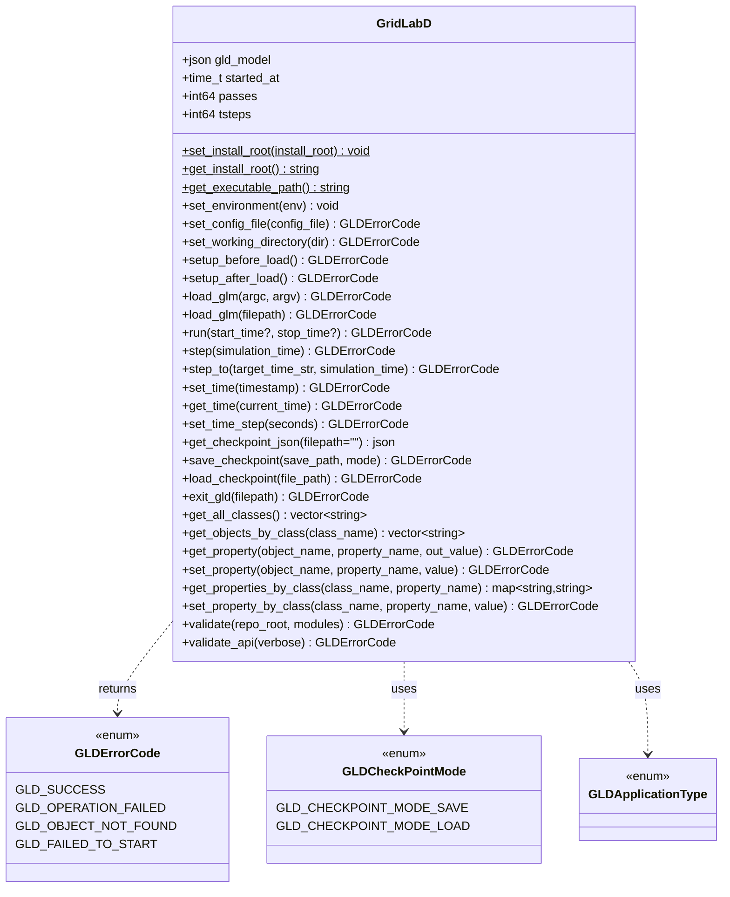

# Introduction
TODO: Welcome to software architecture and design section

## Roles of GLDcore

## System Modeling

### Modules

### Objects
Generally device models but also covers things like "recorder" for getting data out of the model

### Parameters
Lots of parameters per object. 

Sufficient parameters to fully define the state of the device and support checkpointing

### Basic C/C++ API

GridLAB-D™’s basic C/C++ API (via `gldapi`) provides an embeddable, in-process interface to the simulation engine. Instead of orchestrating runs by shelling out to the `gridlabd` executable and exchanging state through files/stdout, a host application can construct a `GridLabD` instance, load a model using GridLAB-D™’s existing argument parsing, execute the simulation (to completion or step-by-step), inspect/mutate object properties, and export a structured JSON checkpoint of the current simulation state. This API is intended as a native integration surface for tooling, language bindings, co-simulation harnesses, and automated workflows.

#### Motivation

GridLAB-D™ is often used as one component in larger pipelines (co-simulation, parameter sweeps, optimization/calibration loops, automated regression testing, and interactive tooling). Subprocess-based integration works, but it tends to be slow (process startup overhead), brittle (parsing logs or ad-hoc text), and limiting (hard to single-step, hard to inspect/modify state mid-run, awkward error propagation). A basic C/C++ API is valuable because it enables tighter coupling and lower-latency control for developers building higher-level interfaces (Python bindings, services, GUIs, or HPC orchestration), while keeping GridLAB-D™’s core engine execution model intact.

#### Feature Objective

Provide a minimal, stable, developer-oriented API that enables external code to:

- Initialize and run GridLAB-D™ in-process.
- Load a GLM model (in .glm or .json format) and view/edit the model prior to simulation.
- Execute simulations either end-to-end (`run`) or incrementally (`step`, `step_to`).
- Locate objects and read/write property values programmatically.
- Export simulation state as a structured JSON checkpoint for inspection or downstream processing.
- Validate core API functionality (`validate_api`) and optionally run the repository autotests (`validate`).

#### Developer Goals

- A small, well-scoped header surface (`gldcore/gldapi.h`) with explicit error codes (`GLDErrorCode`).
- A lifecycle that is easy to embed in other programs and expose via language bindings.
- Support for both batch-style runs and stepping for integration with external control loops.
- Deterministic state exchange without relying on log parsing (JSON checkpoint export).
- A self-contained health check suitable for CI and packaging (`validate_api`).

#### User Goals

For this feature, “users” are typically tool authors and workflow builders (not modelers writing GLMs directly). They want:

- Faster automation loops by avoiding subprocess orchestration where possible.
- Programmatic access to model state and results during a run.
- The ability to modify selected parameters/properties between steps or between runs.
- Straightforward error handling for long-lived integrations.

#### Functionality

This feature is a **native C++ interface** exposed as the `GridLabD` class in `gldcore/gldapi.h`.

Developers interact with it by:

- Constructing an instance (`GridLabD gld;`).
- Optionally setting install root / working directory (`set_install_root`, `set_working_directory`).
- Loading a model:
  - `load_glm(int argc, char* argv[])` (CLI-style), or
  - `load_glm(const std::string& filepath)` (convenience overload).
- Running a simulation:
  - `run(start_time?, stop_time?)` to run to completion.
  - `step(sim_time)` to advance a single step.
  - `step_to(target_time, sim_time)` to advance until a timestamp.
- Inspecting/mutating state:
  - Object/class queries (`get_all_classes`, `get_objects_by_class`).
  - Property access by object name (`get_property`, `set_property`) and by class (`get_properties_by_class`, `set_property_by_class`).
- Exporting state as JSON (`get_checkpoint_json`).
- Validating the integration (`validate_api`, `validate`).

#### Class/Sequence Diagram

The diagram below reflects the current `gldapi` public surface (conceptual; types are simplified).

#### Links to any relevant source code for the feature as it is developed.

- [gldapi.h](https://github.com/gridlab-d/gridlab-d/blob/feature/1478/gldcore/gldapi.h): brief description
- [gldapi.cpp](https://github.com/gridlab-d/gridlab-d/blob/feature/1478/gldcore/gldapi.cpp): implementation of `GridLabD`

