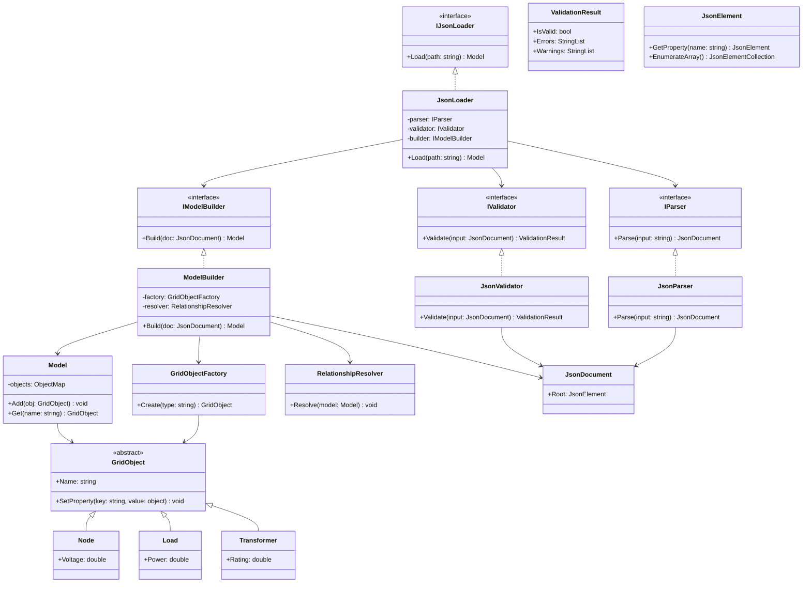

# JSON Loader

The GridLAB-D™ JSON Loader is a component used to read and interpret GridLAB-d models that are stored in JSON format, instead of the traditional .glm text files.

In brief, it:

* pARSES json MODEL FILES THAT DESCRIBE GridLAB-D™ objects (e.g., loads, nodes, transformers, schedules).
* Instantiates simulation objects in memory based on the JSON structure.
* Maps properties and relationships (such as parent/child links and connectivity between commponents).
* Validates data to ensure required fiels and types are correct.
* Initializes the simulation environment so the model can be executed by the GridLAB-D™ engine.

Essentially, the JSON loader acts as bnridge between a structured JSON representation of a power system model and the internal object model used by GridLAB-D™ for simulation.

## Motivation

The motivation behind the GridLAB-D™ JSON Loader is to modernize how simulation models are defined, exchanged, and integrated with other software systems.

Traditionally, GridLAB-D™ uses .glm files, which are powerful but can be difficult to parse programmatically and integrate into automated workflows. The JSON loader addresses these limitations by introducing a more structured and widely supported format.

Key motivations include:

* **Improved interoperability** - JSON is a standard format used across many platforms and programming languages, making it easier to exchange models between tools, services, and teams.
* **Easier automation and tooling**- JSON can be easily generated, modified, and validated by scripts, APIs, and modern development frameworks, enabling automated model creation and processing.
* **Better integration with web and cloud systems** - JSON is native to web services and REST APIs, allowing GridLAB-D™ models to be incorporated into cloud-based simulations, dashboards, and distributed workflows.
* **Enhanced readability and structure** - Compared to .glm, JSON provides a more explicit and hierarchical representation of objects and their properties, reducing ambiguity.
* **Support for validation and schema enforcement** - JSON enables the use of schemas (e.g., JSON Schema) to validate models before execution, improving reliability and catching errors earlier.

Overall, the JSON loader was introduced to make GridLAB-D™ more accessible, extensible, and compatible with modern software ecosystems, especially for large-scale, automated, or integrated simulation environments.

## Feature Objective

What problem will this feature solve?

### Developer Goals

The developers’ goals for the **GridLAB-D™ JSON Loader** go beyond just supporting another file format—they’re aiming for broader improvements in how GridLAB-D™ is used and integrated.

In general, developers want to see:

* **Wider adoption in modern workflows**
  The JSON format should make GridLAB-D™ easier to plug into pipelines involving APIs, microservices, and automated simulation systems.

* **Programmatic model generation and manipulation**
  Developers expect users to build, modify, and validate models entirely through code (e.g., Python, C#, web services) without relying on manual `.glm` editing.

* **Improved reliability and validation**
  By leveraging structured data and schemas, they want fewer runtime errors and more issues caught early during model loading.

* **Easier integration with other tools**
  The feature should enable seamless interaction with databases, visualization tools, optimization engines, and co-simulation platforms (like HELICS).

* **Better maintainability and extensibility**
  A structured format makes it easier to evolve the model definition over time, add new object types, and maintain backward compatibility.

* **Consistent and reproducible simulations**
  JSON-based models can be version-controlled, diffed, and audited more easily, supporting reproducibility and collaboration.

* **Foundation for future features**
  The JSON loader is expected to serve as a stepping stone toward richer capabilities—such as model validation services, GUI-based editors, or cloud-native simulation environments.

In short, developers want this feature to make GridLAB-D™ **more developer-friendly, automation-ready, and interoperable**, while setting the stage for future ecosystem growth.

### User Goals

From a user perspective, the **GridLAB-D™ JSON Loader** is valuable if it makes modeling, running, and managing simulations easier and more flexible. Users typically hope to see practical, day-to-day benefits like:

* **Simpler model creation and editing**
  Users want an easier way to build and modify models—especially using tools they already know (scripts, editors, or GUIs) rather than hand-editing `.glm` files.

* **Better integration with their existing tools**
  Many users work in environments like Python, C#, databases, or web apps. They expect to generate and manipulate GridLAB-D™ models directly from those systems using JSON.

* **Faster iteration and experimentation**
  With structured data, users can quickly tweak parameters, run batches of simulations, and automate studies without manual file editing.

* **Clearer structure and fewer errors**
  JSON’s explicit format helps users understand model relationships and catch mistakes earlier, especially when paired with validation tools.

* **Improved interoperability and sharing**
  Users want to easily share models with colleagues or move them between tools without format friction.

* **Support for automation and large-scale studies**
  For tasks like Monte Carlo simulations or scenario analysis, users expect the JSON format to enable scalable, repeatable workflows.

* **Compatibility with visualization and dashboards**
  JSON models can feed directly into visualization tools, making it easier to inspect, debug, and present simulation setups.

* **Backward compatibility and smooth transition**
  Users also hope they can adopt JSON gradually without breaking existing `.glm`-based workflows.

In short, users want the JSON loader to make GridLAB-D™ **easier to use, easier to automate, and easier to integrate into real-world engineering and research workflows**.

## Functionality

Most likely, the **GridLAB-D™ JSON Loader** is meant to be used in a few different ways depending on the audience.

For **end users**, it will usually feel like a **new input path** rather than a completely separate experience. Instead of only supplying a `.glm` file, they would provide a **JSON-formatted model** to GridLAB-D™. In that sense, the feature is mostly an **interface enhancement to the model-loading process**. A user may interact with it through:

* a command-line option or startup argument,
* a file import/load mechanism,
* or tooling that automatically generates JSON for GridLAB-D™ to consume.

For **developers**, it is more likely to appear as a **loader module, parser component, or API-level method** inside the codebase. They may interact with it by:

* calling a loader function that reads JSON and constructs model objects,
* extending the parser to support new object types or properties,
* adding validation rules,
* or integrating it into external applications and workflows.

So the feature is probably **both**:

* **behind-the-scenes infrastructure** in the implementation, and
* a **user-visible input interface** in practice.

A good way to describe it is:

> The JSON loader is primarily a **backend loading/parsing feature** exposed through a **new model input format**. Users interact with it by supplying JSON models, while developers interact with it as a module or method that parses, validates, and instantiates those models inside GridLAB-D™.

In product terms, it is **less like a brand-new standalone UI** and **more like a new ingestion interface plus supporting internal module**.

## Class/Sequence Diagrams

If apropriate, document the feature using class or sequence diagrams.

## Itemized Subfeatures

- Initial "load a GLM" functionality (simple GLMs) - October 31, 2025
- Ability to load "any JSON-formatted GLM" - November 30, 2025 - Revised to January 31, 2026
