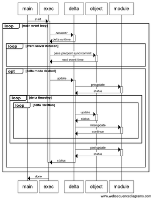

# Clock Operation
The GridLAB-D™ clock advances in variable timesteps in quasi-static mode, and in fixed timesteps during transient mode, as described in [Simulation Time](../../2.0%20-%20New%20Users/Tutorial/2.2.5%20-%20SimulationTime.md#time-management). The rest of this section provides additional information on clock operation targeted to developers.

## Quasi-static mode 
During quasi-static operation, GridLAB-D's main processing loop advances the global clock by varying time steps depending on the pending state changes of the objects defined in the model until no object reports that is has a pending state change.

Pending state changes are called sync events. There are two types of such events. Hard events are events that must be handled in order for the simulation to continue. If there are no hard events pending, the simulation will stop. Soft events are events that are only handled if they occur before a hard event. If there are only soft events pending, the simulation will stop.

An object's sync() function actually performs two essential missions. First, it updates the state of an object to a designated point in time. Second, it informs the core about the next expected state change. This is vital for the core, as its core's clock will be advanced to the time of the next expected state change, and all objects will be synchronized to that time.

During each sync pass, every object returns a timestamp indicating its next internal state change. As each object is processed, the time returned by the object’s sync() function is compared with the lowest timestamp returned by other objects earlier in the same iteration. At the end of the iteration, the GridLAB-D™ core checks if every object can progress to a later timestamp, i.e., that it has converged and returned a timestamp in the future. If any object returns a time that is not in the future, either an error is reported, or it is assumed that another simulator iteration is required. 

The stoptime global variable is a special hard event if it is NOT set to NEVER. If the stoptime is set to NEVER, the simulation will only stop when there are no pending hard events. Otherwise, the simulation will stop when the stoptime is reached.

The DATETIME structure is used to store local times. Local times are different from global times stored in TIMESTAMP structures because local times consider timezone and daylight-savings/summer time offsets. Global times are always stored in seconds since January 1, 1970 00:00:00 UTC. 

### Object ranks
An object rank is a relationship structure that affects the order in which objects are accessed during the synchronization procedure TODO: Add link. Objects are assigned ranks when they are created, which can later be altered through parent-child declarations or explicit promotion commands. Normally, the modeler only controls the parent-child relationship by either nesting objects when they are defined, or by using the name property. Modelers cannot strictly control the rank of objects because modules will generally apply their own ranking rules to ensure a stable solution. A good example of the utilization of object ranks is the powerflow module TODO: Add link.

### Synchronization procedure
Objects are instances of classes. Each class has a synchronization characteristic that determines when it receives synchronization signals from the main exec loop. The sync signals are sent in the following order:
- **create**: called once for every object
- **init**: called until every object confirms successful initialization
- *do until clock stops* 
  - Internal synchronization events 
    - Link - links are updated first
    - Random - All random variables are updated
    - Schedule - All schedules are updated
    - Loadshape - All loadshapes are updated
    - Transforms - Schedule transforms are updated
    - Enduse - All end uses are updated
    - Heartbeat - All heartbeat signals are sent

  - **precommit** - called once per timestep before sync; used to setup for new timestep

  - *do until valid timestep is found*
      - **presync** - called once per pass from the top rank down; used to prepare objects for bottom-up pass
      - **sync** - called once per pass from the bottom rank up; used to perform main calculations in objects
      - **postsync** - called once per pass from the top rank down; used to complete calculations
    
  - **commit** - called once per timestep after sync
- **finalize**: called once per simulation after clock stops
- **term**: called to terminate simulation

TODO - Quasi-Static Mode Synchronization Procedure - Find the diagram that Frank talks about.

## Model Initialization
Models are initialized after the GLM file is loaded but before the clock start and the first pre-commit or sync calls. The order in which objects are initialized depends on the value of the init_sequence global variable: 

* `#set init_sequence=CREATION`:
    Objects are initialized in the order in which they are defined in the GLM file. 

* `#set init_sequence=DEFERRED`: 
    Objects are initialized in the order in which they are created. However objects are allowed to request deferred initialization if they need to wait for another object to be initialized first. Objects that defer initialization will be called again until they no longer defer init. The maximum number of deferrals is specified by the `init_max_defer` global variable. 

  * `#set init_max_defer=0`: 
    The `init_max_defer` global variable establishes the maximum number of times that any object `init()` function may be called. When the limit is negative or zero, the highest rank number is used as the value for `init_max_defer`. 

* `#set init_sequence=BOTTOMUP`: 
  Objects are initialized in bottom-up rank order, in the order in which they are created within each rank, and can defer initialization if desired.

* `#set init_sequence=TOPDOWN`: 
  Objects are initialized in top-down rank order, in the order in which they are created within each rank, and can defer initialization if desired.

* `#set init_sequence=AUTO`: 
  Object are initialized in the order in which they are created but are automatically deferred if either the object parent or any object referred by an object property is not yet initialized.

## Transient mode
The simulation enters transient mode when at least one module or object requests a switch out of the quasi-static mode. When such a request is made, it also informs the simulation core of the desired time-step, which is usually a parameter either fixed by the module's programmer or determined by the modeler. 

While operating in transient mode, the simulation performs the following sequence of operations until all the modules and objects state that the simulation may return to quasi-static mode.

-	Module **preupdate**: notify modules that quasi-static mode is being suspended and a series of transient mode updates is about to begin
- *do for every transient timestep*
  - For each object with **update** functionality
    - **update** - perform object-directed transient actions
  - For each module with **interupdate** functionality
    - **interupdate** - perform module-directed transient actions (this can include object-specific **interupdate** transient actions)
- Module **postupdate** - finalize transient mode and prepare for quasi-static mode

{ #fig:TransientMode }

### Coding Guide
To support transient mode processing, developers first need to decide whether they would like to offer module-level and/or object-level support. GridLAB-D™ modules that currently support module-level transient mode are generators, powerflow, and residential, while object-level support is offered by assert.

Next, we present the module-level and object-level approaches required by the GridLAB-D™ core. Afterwards, we present the implementation of the `powerflow` module as an example of best practices for developers who wish to implement transient mode.

#### Module-level transient mode approach
The following changes to `init.cpp` are required to enable transient mode operation for a module. 

The GridLAB-D™ core needs some specific functions in order to interact with modules in transient mode. These need to be added to the `init.cpp`, and they are the following:
    
    
    EXPORT int transient mode_desired(int *flags)
    {
    	/* indicate whether transient mode is desired */
    	flags |= DMF_SOFTEVENT; /* set flag if not required, but only desired */
    
    	/* **TODO** Add your transient mode_desired code */
    	
    	return dt_val;	/* Returns time in seconds to when the next transient mode transition is desired */
    	
    	/* Return DT_INFINITY if this module doesn't have any specific triggering times */
    }
    
    EXPORT int preupdate(MODULE *module, TIMESTAMP t0, unsigned int64 dt)
    {
    	/* **TODO** Add preupdate code */
    	/* t0 is the current global clock time (event-based) */
    	/* dt is the current deltaclock nanosecond offset from t0 */
    	
    	return deltamode_timestep;	/* Return minimum delta timestep module requires */
    	
    	/* return DT_INFINITY if this module doesn't have any minimum timstep requirements */
    	/* DT_INFINITY can also be returned if no transient mode updates are desired as part of this module */
    }
    
    EXPORT int interupdate(MODULE *module, TIMESTAMP t0, unsigned int64 dt, unsigned int iteration_count_val)
    {
    	/* **TODO** Add your interupdate code here */
    	/* Module-level call at each deltatimestep, including iterations */
    	/* t0 is the current global clock time (event-based) */
    	/* dt is the current deltaclock nanosecond offset from t0 */
    	/* interation_count_val is the current iteration on deltatime dt */
    	
    	return SM_EVENT; /* return SM_DELTA, SM_DELTA_TER, SM_EVENT, or SM_ERROR */
    	
    	/* SM_DELTA - ready to proceed to next delta timestep */
    	/* SM_DELTA_ITER - stay at this delta timestep and reiterate */
    	/* SM_EVENT - transient mode is no longer needed, this module is ready to return to event mode */
    	/* SM_ERROR - an error has occurred */
    }
    
    EXPORT int postupdate(MODULE *module, TIMESTAMP t0, unsigned int64 dt)
    {
    	/* **TODO** Add your postupdate code here */
    	/* t0 is the current global clock time (event-based) */
    	/* dt is the current deltaclock nanosecond offset from t0 */
    	
    	return SUCCESS;	/* return FAILURE (0) or SUCCESS (1) */
    }
    

**int transient mode_desired()** -
    This function is used by the core to find out whether the module wants to use transient mode and if so, how long before transient mode must begin (in seconds).

**int preupdate()** -
    This function is used by the core to notify modules that it is about to start a series of transient mode updates. This happens only when the simulation is switching from event mode to transient mode. The return value is the delta timestep this module requires.

**int interupdate()** -
    This function is used by the core to notify modules that is has completed a single timestep in transient mode, or is reiterating the current transient mode timestep.

**int postupdate()** -
    This function is used by the core to notify modules that it has completed a series of transient mode updates. This happens only when the simulation is switching from transient mode to event mode.

#### Object-level transient mode approach
To each class that needs to process object-level updates add the following at the end of implementation file (e.g., class.cpp) 
    
    
    int class ::deltaupdate(unsigned long dt)
    {
      /* **TODO** add your object update code here */
      return 1;
    }
    EXPORT int update_class(OBJECT *obj, unsigned long dt, unsigned int iteration_count_val)
    {
      class *my = OBJECTDATA(obj,class);
      int status = 0;
      try
      {
        status = my->deltaupdate(dt);
        return status;
      }
      catch (char *msg)
      {
        gl_error("update_class(obj=%d;%s): %s", obj->id, obj->name?obj->name:"unnamed", msg);
        return status;
      }
    }
    

and add the declaration of the update function to the class definition itself 
    
    
    class class
    {
      // ...
    public:
      int class ::deltaupdate(unsigned long dt);
      // ...
    }
    

Classes should only implement this function when it is absolutely necessary that objects be notified of a transient mode timestep. Objects should only enable the call using OF_DELTAMODE when it is absolutely necessary because this call can have very significant performance impacts on the speed of transient mode. Careful consideration should be given to the code design of the module in order to reduce the necessity and complexity of this function. 

#### An example implementation
The currently preferred transient mode paradigm is implemented in the `powerflow` module. This works as follows. First, add the following global variables:
    
    
    bool enable_subsecond_models = false; /* normally not operating in delta mode */
    unsigned long deltamode_timestep = 10000000; /* in ns, e.g., 10 ms timestep */
    

and add the following global registrations to init() 
    
    
    gl_global_create("modulename ::enable_subsecond_models", PT_bool, &enable_subsecond_models,NULL);
    gl_global_create("modulename ::deltamode_timestep", PT_int32, &deltamode_timestep,NULL);
    

**enable_subsecond_models** -
    This boolean value should be used to indicate whether transient mode operation is desired. It can be set by the GLM modeler or it can be set by internal module code, depending on the modeling approach chosen.

**transient mode_timestep** - 
    This value indicates how long the timestep is desired when operating in transient mode. The value is given in nanoseconds, so be carefully when combining it with clock values given in seconds. You can use the DT_SECOND macro which specifies how many delta ticks there are in a clock tick.