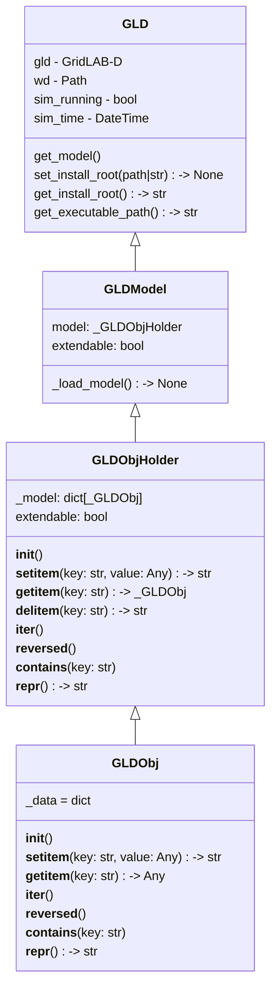

# Checkpointing

Brief description of feature (~1 paragraph).

From wiki:

TECHNICAL MANUAL

Checkpoints are a method of periodically saving the state of a simulation in progress to a file in such a way that the file can be loaded by another instance of GridLAB-D and resumed from the same state.

Checkpoints are enabled by defining the checkpoint_file to establish the base file name used for the checkpoint file.

The interval at which the checkpoint is saved is specified by the checkpoint_interval global variable. The checkpoint interval can either be based on the wall clock or the simulation clock depending on the setting of checkpoint_type global variable.

Normally, the checkpoint system keeps only the last checkpoint. However, all checkpoint images can be preserved using the checkpoint_keepall global variable.

## GLM
    
    #set checkpoint_file="savefile"
    #set checkpoint_interval=3600
    #set checkpoint_type=WALL
    
## Command line
    
    host% gridlabd -D checkpoint_file="savefile" -D checkpoint_interval=3600 -D checkpoint_type=WALL

## Motivation

Why will this be worthwhile feature for GridLAB-D? Why now? Who will it help (developers or users)? How will it help them?

## Feature Objective

What problem will this feature solve?

### Developer Goals

What do the developers want to see out of this feature?

### User Goals

What do the users hope to see out of this feature?

## Functionality

How will devs/users interact with this feature? Will it be behind-the-scenes, a new module, method, or interface?

## Class/Sequence Diagrams

If apropriate, document the feature using class or sequence diagrams.

## Itemized Subfeatures

- Define format and internal/core mechanisms - November 30, 2025
    - Q: We should discuss how we're defining the format. Either try to incorporate it into the JSON schema, or if that seems like too much, have some way to define it in code that can be exported if needed?
    - A: My thoughts/plan are for it to be exactly the JSON structure, maybe with a couple extra fields (related to current state - maybe simulation time?).  However, we can certainly discuss/iterate on that.
- Complete model conversions/expansions to support checkpoints - December 31, 2025 - revised to January 31, 2026
- Complete core functionality to support checkpoint system - December 31, 2025 - revised to February 6, 2026
- Complete testing/validation of checkpoints - January 31, 2026 - revised to February 27, 2026
    - Q: Are we thinking this is just manual end to end testing? Or should we incorporate more formal or automated testing.
    - A: My goal is both "manual end to end" (which is what I'd consider is the January 31, 2026 milestone), but there will certainly be automated portions of that, even if it is just another autotest added (but may be more extensive if that makes sense). 

## Source Code

Links to any relevant source code for the feature as it is developed.

- 

## Workflow

!!! Team

    Feature Lead:
    Team Members:

!!! status

        Complete by Februrary 27, 2026

!!! Tracking

        [Checkpointing GBO Board Page](https://github.com/orgs/gridlab-d/projects/2/views/2)