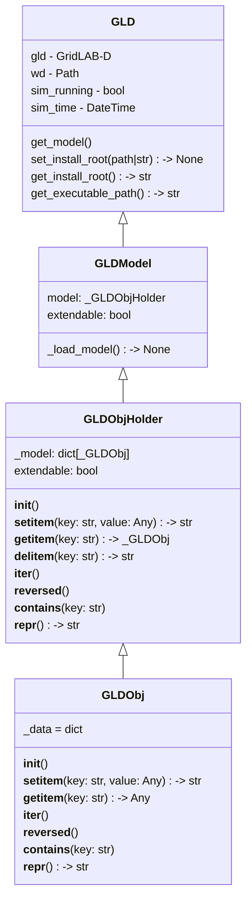

# Checkpointing

Checkpointing serves as a method to take a "snapshot" of the current simulation time in GridLAB-D and export that information into a file.  That file represents the whole system state of the GridLAB-D run and can be useful for tracking how the whole system is changing (as opposed to a `recorder` or `multi_recorder` that track specific properties), or it can be used as the starting point for a subsequent run.

As an example, consider a scenario where a GridLAB-D simulation needs to run for a year, but you want to try different controls at the 6-month point and evaluate how it impacts end of year metrics.  Without checkpointing, each control iteration would require running the full year of simulation.  With checkpointing, GridLAB-D runs to the 6-month timestamp, exports the checkpoint snapshot, and then proceeds to evaluate the first control strategy.  To evaluate a second strategy, GridLAB-D would load that checkpoint snapshot, then you apply the second control and continue running, saving you from needing to run the identical first 6 months of model time again.

## Motivation

The Checkpointing system was created to save simulation computation time, especially when changes to the behavior are expected later in a simulation run.  If a GridLAB-D model takes 2 hours to run a year-long simulation, the ability to save a checkpoint at the 6-month (1 hour computation time) mark can save an hour of compute time on every subsequent run.  This is especially useful if you are researching different controls or technologies for a specific event, or if you want periodic "backups" of your simulation in case there's issue with the computing platform.

Checkpointing is a feature aimed at all users, be they just normal GridLAB-D users (for computation time savings) or developers (to get a known starting point before a bug occurs or model error occurs, to help debug it).

## Functionality

Checkpointing is expected to primarily be used through the C/C++ API (or Python interpretation of that).  Using command line options and global variable settings is possible, but not recommended.

TODO: detail what API calls

## Class/Sequence Diagrams

TODO: Repalce this as necessary - placeholder/sample left for now

If apropriate, document the feature using class or sequence diagrams.

## Itemized Subfeatures

TODO:

## Source Code

Links to any relevant source code for the feature as it is developed.

- 

## Workflow

!!! Team

    Feature Lead:
    Team Members:

!!! status

        Complete by Februrary 27, 2026

!!! Tracking

        [Checkpointing GBO Board Page](https://github.com/orgs/gridlab-d/projects/2/views/2)