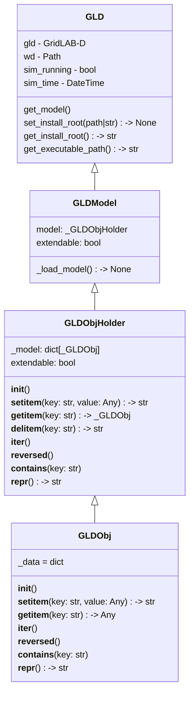

# JSON Loader

Brief description of feature (~1 paragraph).

## Motivation

Why will this be worthwhile feature for GridLAB-D? Why now? Who will it help (developers or users)? How will it help them?

## Feature Objective

What problem will this feature solve?

### Developer Goals

What do the developers want to see out of this feature?

### User Goals

What do the users hope to see out of this feature?

## Functionality

How will devs/users interact with this feature? Will it be behind-the-scenes, a new module, method, or interface?

## Class/Sequence Diagrams

If apropriate, document the feature using class or sequence diagrams.

## Itemized Subfeatures

- Initial "load a GLM" functionality (simple GLMs) - October 31, 2025
- Ability to load "any JSON-formatted GLM" - November 30, 2025 - Revised to January 31, 2026

## Source Code

Links to any relevant source code for the feature as it is developed.

- 

## Workflow

!!! Team

    Feature Lead:
    Team Members:

!!! status

        Complete by November 30, 2026

!!! Tracking

        [JSON Loader GBO Board Page]()