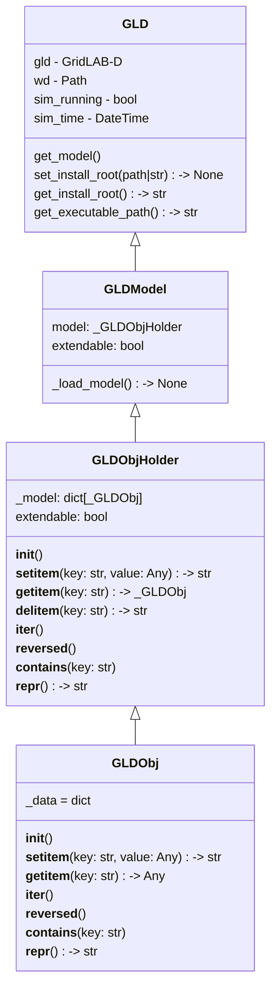

# Multithreading

Multithreading is the capability for GridLAB-D to use multiple threads/cores on the computer to execute the models being studied more quickly.  Due to the agent-based nature of GridLAB-D, aspects of the model structure lend itself well to being executed in parallel (minimal or no interaction between those particular objects), which can use multithreading to execute faster.

## Motivation

GridLAB-D models of actual systems often have a very large number of objects and time-series simulations can take a significant amount of compute time to complete.  Methods to improve the computation time/computational efficiency of GridLAB-D help improve the user experience, and also improve the applicability of GridLAB-D to near-term planning/potential operations instead of long-term planning or post-event reconstruction.

Most modern computers have several threads and/or distinct computation cores at their discretion, so nearly all users can benefit from a reliable multithreading capability being implemented in GridLAB-D.  While some aspects will remain sequential, longer time series may benefit almost linearly from increased thread counts, allowing that level of speedup on the GridLAB-D model runs.

## Feature Objective

Multithreading gets divided into two main implementations in GridLAB-D: batch multithreading and model multithreading.

Batch multithreading is primarily used by the autotest feature in GridLAB-D, which effectively allow a single controlling instance of GridLAB-D to spin up individual instaces of GridLAB-D running specific autotest models.  The individual instances are still single threaded, but multiples of them can be executed in parallel as they are independent instances of GridLAB-D (so called "embarassingly parallel" implementations).

Model multithreading is allowing common `rank`s of objects to be executed in parallel within a single GridLAB-D model instance (GLM of JSON file).  Multithreading only applies to the time-series execution portion of the overall GridLAB-D program loop -- items like the file loader and objection creation will still be single threaded for the immediate future.

## Functionality

Interactions with the multithreading capability will be different between a developer and a user.

On the development side, GridLAB-D core functions are expected to handle most of the specifics of multithreading such that the common model/module developer will not need to do anything different.  The exception will be any potential contention areas, where additional memory management/locking features may be needed, which developers will need to include in their objects.

On the user side, the only interaction will be designating a core/threadcount for GridLAB-D to utilitize, which will just result in additional performance/faster simulation times.  Answers from GridLAB-D models should be identical between single-threaded and multithreaded runs, with the only difference being in execution time. 

## Class/Sequence Diagrams

TODO: Needed?

If apropriate, document the feature using class or sequence diagrams.

## Itemized Subfeatures

- Initial ideas/framework discussion on how to do multithreading - January 31, 2026
- Implementation/demonstration - March 31, 2026

## Source Code

Links to any relevant source code for the feature as it is developed.

- 

## Workflow

!!! Team

    Feature Lead:
    Team Members:

!!! status

        Complete by March 31, 2026

!!! Tracking

        [Multithreading GBO Board Page]()