# Python API

GridLAB-D has a Python API that provides users programmatic ways of interacting with the simulation engine. The API provides simple means of using GridLAB-D in a hands-off manner where a model is loaded and then a simulation is run. This basic capablity allows users to integrate GridLAB-D into a larger suite of Python-based analysis or workflow. The API also provides more advanced capabilities such as controlling simulation time and reading and writing to object parameters. This capability allows for more sophisticated extensions of GridLAB-D such as customized data collection, use-case specific monitoring and control of the system being modeled, and integration into multi-domain models as might be performed in a HELICS-based co-simulation.

## Motivation (Problem Definition?)

The development of the GridLAB-D Python API was motivated by a need to allow users a more dynamic means of interacting with GridLAB-D models than was planned when GridLAB-D was originally conceived nearly two decades ago. Since that time, GridLAB-D has been a purpose-built command-line tool with limited means of user-interaction through a few purpose-built mechanisms. These mechanisms have served GridLAB-D well but have not met the expectations of users as their needs for more dynamic interactions and control of the simulation tools they use grow. 

As a dedicated simulation tool, GridLAB-D has lacked a flexibility that much modern software can provide. For example, the mechanisms to insert data dynamically into GridLAB-D have primarily been accomplished through dedicated objects in the GridLAB-D model that are able to read files with particular time-series formats to define specific object parameter values. Similarly, reading data out of a GridLAB-d model required adding data collection and recording objects. These objects performed their job well-enough but are constrained by implementation limitations and can, at times, be somewhat clumsy to use.

The lack of flexibility is even more pronounced for objects that are used to model specific devices such as inverters or houses. The behavior of these devices is defined by the model used to implement them and thus fixed when GridLAB-D is compiled. To support flexibility for users in some of these devices, some parameters are device specific operating modes for the device with corresponding mode-specific parameters. This proliferation of parameters makes the configuring the devices correctly confusing and difficult.

In short, the behavior of GridLAB-D in general and its modeling of specific devices have been constrained by the limitations of the modeling framework (objects and parameters) as well as the implicit assumptions of the GridLAB-D developers that define how devices will need to behave when being simulated.

## Feature Objective

The GridLAB-D Python API provides users with a large degree of flexibility to

- Configure their models by adding, removing and editing objects and their corresponding parameters prior to beginning simulation 
- Control of simulation time 
- Writing and reading arbitrary model state during simulation

### Developer Goals

Developers are not the primary audience for this feature but as the originators of the feature, they need to produce the API in a way that is easy to understand and maintain.

### User Goals

Users need an API that is

- Easy to install
- Easy to understand and use
- Flexible enough to support the interations with the GridLAB-D engine and their model to achieve their analysis goals.


## Functionality

The Python API will be distributed as a PyPI package that users will be able to `pip install ...`. Users will `import ...` the package like any other Python package, allowing them to make the API calls that have been developed. More specifically, this will allow users to instantiate a GridLAB-D engine, load a GridLAB-D model into it, advance the GridLAB-D model through simulation time in a controlled manner, and read and write to model parameters as simulation time is being advanced.

**TODO** - Add additional paragraph or two about the Python class assuming that materializes as planned.


## API Examples

The Python API enables a broad range of applications for GridLAB-D, from simply running a model to integrating GridLAB-D into a larger code base where it serves as a modeling engine alongside a wide range of Python-enabled functionality. The API fundamentally changes GridLAB-D from a command-line simulation tool to a simulation engine that can be used in a much broader range of applications. Below are a few examples of how we envision GridLAB-D being used via this new API and fully expect users to go even further to meet a broad range of power system simulation needs.

### General API Notes

- **TODO** - exmaples - Verify in final version that the following comment on data types is correct.
The data types used when interacting with the model match the types used by GridLAB-D. That is, if a GridLAB-D model specifies that a value is a complex number, that is the data type returned when using the API to ask for that parameter from the specified object and the data type expected when writing to that parameter via the API.
- **TODO** - examples - Verify in final version that the following comment on simulation time strings is correct.
Simulation time is always represented by and ISO 8601 string which is easily converted to a Python datetime object. (Or maybe in the final version with the user-facing API it is a datetime object already).
- Messages produced by the GridLAB-D engine that are normally printed on the console are supressed by default and are instead as a list of JSON strings whenever the simulation is stopped via the `get_messages()` method. 
- **TODO** - examples - Verify in final version that the following comment on read-only parameters is correct.
Trying to write an object parameter that is read-only via the API will produce a warning.

### Installation

PyPI, baby: `pip install --index-url https://test.pypi.org/simple/ --extra-index-url https://pypi.org/simple/ gridlabd==1.0.13`

**TODO** - examples - Update the installation command we have a release version.


### Simple Model Run
As a most minimal use case, the following code is all that is required to simply run a GridLAB-D model.

```python
import gridlabd

# Instantiate a GridLAB-D engine
gld = gridlabd.GridLabD()

# Load the model
gld.load("model.glm")

# Simulate the model
gld.run()

# Finish up cleanly
gld.exit_gld()
```

Though this simple example shows no new additional functionality as compared to running the model from the command line 

### API Best Practices
**TODO** - examples - Add best practices when using the API and link to sections that demonstrate each of them.
 - Check GridLAB-D messages programmatically with `.get_messages()`
 - Use datetime objects to track simulation time (makes any time math easier)
 - Make checkpoints at judicious times (especially when using `house` objects that take a few days to initialize) **TODO** examples - - Waiting for checkpoints to be completed to demonstrate this.
 - Double-check simulation start and stop times 
 - Check return codes on API calls to make sure they succeeded (**TODO** - examples - Github #1745 requests that developers add these checks in the APIs so users don't have to.)

### Running Multiple Models in Parallel
Waiting on resolution of [Github issue 1720](https://github.com/gridlab-d/gridlab-d/issues/1720).

### Controlling Simulation Start and Stop Time
Managing simulation time is one of the fundamental tasks in running a time-series simulation; this example walks through the how to control the start and stop time of the simulation, using Python's "datetime" library to do the heavy lifting for any time math. The example file is "example_sim_start_stop.py" **TODO** - exmaples - Update example file name once finalized

GridLAB-D defines the simulation start and stop time inside the model file itself inside the "clock" object. This is a special object and isn't accessible via the normal object APIs (which we'll get to later) but instead uses a few dedicated APIs:

```python
gld = gridlabd.GridLabD()
starttime = gld.get_starttime()
stoptime = gld.get_stoptime()
gld.set_starttime(starttime)
gld.set_stoptime(stoptime)
```
These methods work exactly as you might guess based on their names, allowing you to get and set the start- and stop-time of the simulation. The values returned and accepted by these methods are [ISO 8601](https://en.wikipedia.org/wiki/ISO_8601) strings. Not by accident at all, Python's "datetime" library can convert these strings into datetime objects and convert datetime objects into these strings.

```python
from datetime import datetime, timedelta
starttime = datetime.fromisoformat(gld.get_starttime())
stoptime = datetime.fromisoformat(gld.get_stoptime())
gld.set_starttime(starttime.isoformat())
gld.set_stoptime(stoptime.isoformat())
```

The use of Python datetime objects avoids any of the common pitfalls when doing time-related string formatting or math. In this example, after getting the start and stop time into datetime objects, we can easily calculate the existing duration of the simulation, add an hour to it, and add half of that new time to the beginning and end of the simulation.

```python
old_sim_duration = stoptime - starttime
new_sim_duration = old_sim_duration + timedelta(hours=1)
sim_duration_half = new_sim_duration / 2
calc_starttime = datetime.isoformat(starttime - sim_duration_half)
calc_stoptime = datetime.isoformat(stoptime + sim_duration_half)
gld.set_starttime(calc_starttime.isoformat())
gld.set_stoptime(calcstoptime.isoformat())
```

After adjusting these simulation times, we can just run the simulation directly. Add, as a bonus, it is also possible pass in new simulation start and/or stop times when calling `run()`

```python
gld.run()

# Alternatively, call `run()` with start and stop time defined
gld.run(start_time=calc_starttime, stop_time=calc_stoptime)
```


### Controlling Simulation Time
Managing simulation time is one of the fundamental tasks in running a time-series simulation; this example walks through how to advance simulation time through GridLAB-D's provided `step_to()` and `step()` methods. The example file is "example_sim_stepping.py" **TODO** - examples - Update example file name once finalized

As shown in the previous example (**TODO** - examples - add link to appropriate example), it is possible to programmatically set the start and stop time of a simulation prior to actually simulating the model. If you're using the GridLAB-D API to manage running multiple models, this may be all you need to do. It is common, though, to need to interact with the model while running and to do that, you need to control the simulation time such that its advancement pauses at the times of our choosing so that we can interact with the model as we need. To facilitate this, there are two methods we can use: `step_to()` and `step()`.

`step_to()` provides the ability to advance simulation time to a time specified a timestamp string. `step()` allows the user to advance through simulation time at regular step sizes (specifed by `set_time_step()`). Becuase of how GridLAB-D simulates objects internally, there may be other times that are simulated internally but GridLAB-D will not pause the simulation at these times. As far as you, the programmer, are concerned, you are asking to step to a specific time or take a time step of a specific size and GridLAB-D will do what it takes to advance simulation time to that point and then pause, returning control back to the script that called that API.

This example shows the use of both API called. The first call is to `step_to()` specifying a time 20 minutes after the "starttime" of the model. After reaching this point, the simulation is advanced a few time steps with the `step()` API. Lastly, the script demonstrates the fatal error that is generated when trying to step beyond the end of the specified "stoptime" in the simulation.

### Monitoring Console Messages
Covered in "example_get_messages.py"

### Reading Data from the Model
Covered in "example_reading_data.py".

### Writing Data to the Model
Covered in "example_read_write_data.py".

### Working with Checkpoints
Waiting on checkpoint feature to be complete.

### Working in Transient Mode
Waiting on transient mode feature to be complete.

### Example Application 1: GUI for Model Configuration

### Example Application 2: Runtime Monitoring
Covered in "sim_monitor_gui_demo.py"

### Example Application 3: Integration with pandapower
With the Python API in GridLAB-D, integration with other Python-based power system simulation tools is now possible. The code in "pp_gld_pf.py" shows how to create an integrated bulk power system and distribution system powerflow model. In this case, we just couple a single GridLAB-D model to a single bus in pandapower bus, replacing the fixed load at that bus with a scaled-up version of the load as simulated by GridLAB-D. 

Users have a few parameters they can set at the top of the file:
    1 - "step_size" - The simulation step size in seconds of the integrated powerflow. This is value is only used by GriLAB-D as the powerflow in pandapower is time agnostic.
    2 - "microstep_max" - The number of iteration micro-steps to take at each simulation time step. Minimum value is one.
    3 - "plotting_tool" - Choose between "matplotlib" and "plotly" to select which tool is used to plot the collected data.

To integrate the powerflow between GridLAB-D and pandapower, we define the variables being exchanged between the two models in such a way so as to cause a circular dependency. In this case, we send the solution of the unbalanced GridLAB-D powerflow, expressed as the positive sequence load (real and reactive power) at the head of the distribution model (in the "substation" object) to pandapower as the load at the specified bus. This load value is scaled such to generally match the nominal load pandapower is expecting at that bus. Similarly, the nodal complex voltage found with pandapower's AC powerflow is used to define the substation's object's voltage on three phases. The substation object voltage is a boundary condition GridLAB-D and will impact the solution of the powerflow, including the total distribution system load. The distribution system load as expressed in pandapower as the load on specified bus influences that system's poweflow solution and will change the voltage at the node where the GridLAB-D is coupled.

Generally, with the data exchanges between the two models only taking once at each time step, the two models will have slightly different opinions on what the load and voltage at the point of coupling are. That is, without extra effort, the models may or may not be converged very well. To solve this problem, this example implements "micro-stepping" to allow GridLAB-D, which can't resimulate a given time, and pandapower to reach a more consistent (converged) state. Micro-stepping simply advances GridLAB-D small simulation times (one second time steps), using the latest voltage from pandapower to effectively resolve the model. The assumption is that nothing in the model will meaningful change in one second and thus taking a modest number of one-second steps will not meaningfully change the model state. For this example, we consider that last state of the micro-stepping to have taken place when the micro-stepping began. For powerflow purposes, pandapower has no sense of time and thus can re-iterate its powerflow solution as needed.

Lastly, both visualization of the voltage and load are captured at each simulation time step and plotted after the simulation finishes. 


### Example Application 4: Co-Simulation with GLD as a HELICS Federate

### Simulation Control with Model Reading and Writing
GridLAB-D, as an existing part of its core functionality, loads properly formatted models from a file into memory as a part of preparing for simulation. The Python API is able to leverage that model parsing and allow access to the model in memory via API calls. This allows users to read and write to the model directly, both before and during the execution of the simulation proper. 

This is particularly useful when coupled with APIs that allow users to control the advancement of simulation time. The APIs allow users to advance through simulation time at a regular cadence or advance to a particular time. Once at that simulation time, users can then read state of the model. In the example below, the code gets the state of all house objects in the model and prints out the current indoor air temperature of each. If the temperature is too high or too low, the thermostat setpoint in the modeled house is adjusted.

```python
import gridlabd

gld = gridlabd.GridLabD()
gld.load("houses.glm")
gld.set_time_step(60)
gld.step()
house_list = gld.get_all_objects("house")
for house in house_list:
    indoor_temp = gld.get_object_properties(house["air_temperature"])
    house_name = gld.get_object_properties(house["name"])
    print(f"Indoor temperature for house {house_name} is {indoor_temp}".)
    if float(indoor_temp) > 85:
        gld.set_property(house_name, "cooling_setpoint", 80)
        print(f"Adjusted cooling setpoint lower for house {house_name}.")
    elif float(indoor_temp) < 65:
        gld.set_property(house_name, "heating_setpoint", 70)
        print(f"Adjusted heating setpoint higher for house {house_name}.")
gld.run()
gld.exit_gld()
```

### Data Collecting and Monitoring
GridLAB-D has many existing data collection capabilities that are often sufficient but if the data collection mechanism or the output data format needs to be customized, the Python API provides mechanisms for doing so. Using the Python APIs to read data out of a model, its possible to write that data to disk in an arbitrary format (_e.g._ parquet, zarr) or write it to a database (_e.g._ SQLite, Postgres). Furthermore, it would not be difficult to make a data monitoring application that runs the GridLAB-D model and pulls out particular parameters and graphs their change in value or simulated time or presents, say, hourly histograms of the indoor air temperature of the house objects. 


## User-Facing GridLAB-D Class

**TODO** this class is proposed but may or may not be implemented by the initial release of the GridLAB-D API. This documentation is being kept here for now as design notes and needs to find an appropriate permanent home.

```mermaid
classDiagram
      GLD <|-- GLDModel
      GLDModel <|-- GLDObjHolder
      GLDObjHolder <|-- GLDObj
      GLD: gld - GridLAB-D
      GLD: wd - Path
      GLD: sim_running - bool
      GLD: sim_time - DateTime
      GLD: start_time - DateTime
      GLD: stop_time - DataTime
      GLD: step_size - float
      GLD: console_messages- list
      GLD:get_model()
      GLD:set_install_root(path|str) -> None
      GLD:get_install_root() -> str
      GLD:get_executable_path() -> str
      GLD:set_config_file(config_file| str) -> int
      GLD:set_working_directory(self, dir| str) -> int
      GLD:setup_before_load() -> int
      GLD:setup_after_load() -> int
      GLD:start() -> int
      GLD:load_glm(arguments| list[str]) -> int
      GLD:load(filename| str) -> int
      GLD:run(start_time| Optional[float] = None, stop_time| Optional[float] = None) -> t
      GLD:run_test(self) -> int
      GLD:step() -> tuple[int, float]
      GLD:step_to(target_time_str| str) -> tuple[int, float]
      GLD:set_time(self, timestamp| str) -> int
      GLD:get_time(self) -> tuple[int, str]
      GLD:set_time_step(self, time_step| int) -> int
      GLD:save_checkpoint(self, save_path| str, mode| Optional[int] = None) -> int
      GLD:load_checkpoint(self, file_path| str) -> int
      GLD:get_checkpoint_json(self, filepath| str = "") -> str
      GLD:stop(self) -> int
      GLD:exit_gld(self, filepath| str = "") -> int
      GLD:finalize(self, filepath| str = "") -> int
      GLD:is_initialized(self) -> bool
      GLD:get_all_classes(self) -> list[str]
      GLD:get_all_objects(class_name| str) -> list[dict]
      GLD:get_model() -> dict[list[dict]]
      GLD:get_objects_by_class(self, class_name| str) -> list[str]
      GLD:get_object_properties(self, object_name| str) -> dict[str, str]
      GLD:get_property(self, object_name| str, property_name| str) -> tuple[int, str]
      GLD:set_property(self, object_name| str, property_name| str, value| str) -> int
      GLD:get_properties_by_class(self, class_name| str, property_name| str) -> dict[str, str]
      GLD:set_property_by_class(self, class_name| str, property_name| str, value| str) -> int
      GLD:global_setvar(self, name| str, value| str) -> int
      GLD:global_getvar(self, name| str) -> str
      class GLDModel{
            model: _GLDObjHolder
            extendable: bool

            _load_model() -> None
            }
        class GLDObjHolder{
            _model: dict[_GLDObj]
            extendable: bool

            __init__()
            __setitem__(key: str, value: Any) -> str
            __getitem__(key: str) -> _GLDObj
            __delitem__(key: str) -> str
            __iter__()
            __reversed__()
            __contains__(key: str)
            __repr__() -> str
            }
        class GLDObj{
            _data = dict

            __init__()
            __setitem__(key: str, value: Any) -> str
            __getitem__(key: str) -> Any
            __iter__()
            __reversed__()
            __contains__(key: str)
            __repr__() -> str
            }
```




## Itemized Subfeatures

- Base functions to duplicate existing functionality (start GLD, load GLM, execute)
- Advanced functions/"utility functions" can continue after deadline
- Documentation of data model for GLD models when in memory
- Simple model modification APIs - add and remove objects, update object parameters individually, get parameter values, APIs to get groups of objects by object type
- Time management APIs - Ability to advance GLD one time step (either GLD-defined or API-defined step size)
- Advanced model modification APIs - network traversal


## Source Code

**TODO** - Update link to master branch once the features is merged in.

- [GLD Python Bindings](https://github.com/gridlab-d/gridlab-d/tree/feature/1478/python_bindings/src/gridlabd): 


## Workflow

!!! Team

    Feature Lead: Trevor Hardy
    Team Members: Victoria Reynolds, Riley Maltos


!!! Status

        Complete by March 31, 2026

!!! Tracking

        [API GBO Board Page](https://github.com/orgs/gridlab-d/projects/2/views/3)
