# Python API

GridLAB-D has a Python API that provides users programmatic ways of interacting with the simulation engine. The API provides simple means of using GridLAB-D in a hands-off manner where a model is loaded and then a simulation is run. This basic capablity allows users to integrate GridLAB-D into a larger suite of Python-based analysis or workflow. The API also provides more advanced capabilities such as controlling simulation time and reading and writing to object parameters. This capability allows for more sophisticated extensions of GridLAB-D such as customized data collection, use-case specific monitoring and control of the system being modeled, and integration into multi-domain models as might be performed in a HELICS-based co-simulation.

## Motivation (Problem Definition?)

Why will this be worthwhile feature for GridLAB-D? Why now? Who will it help (developers or users)? How will it help them?

The development of the GridLAB-D Python API was motivated by a need to allow users a more dynamic means of interacting with GridLAB-D models than was planned when GridLAB-D was originally conceived nearly two decades ago. Since that time, GridLAB-D has been a purpose-built command-line tool with limited means of user-interaction through a few purpose-built mechanisms. These mechanisms have served GridLAB-D well but have not met the expectations of users as their growing needs for more dynamic interactions and control of the simulation tools they use. 

As a dedicated simulation tool, GridLAB-D has lacked a flexibility that much modern software can provide. For example, the mechanisms to insert data dynamically into GridLAB-D have primarily been accomplished through dedicated objects in the GridLAB-D model that are able to read files with particular time-series formats to define object parameter values. Similarly, reading data out of a GridLAB-d model required adding data collection and recording objects. These objects performed their job well-enough but are constrained by implementation limitations and can, at times, be somewhat clumsy to use.

The lack of flexibility is even more pronounced for objects that are used to model specific devices such as inverters or houses. The behavior of these devices is defined by the model used to implement them and thus fixed when GridLAB-D is compiled. To support flexibility for users in some of these devices, some parameters device specific operating modes for the device with corresponding mode-specific parameters. This proliferation of parameters makes the configuring the devices correctly confusing and difficult.

In short, the behavior of GridLAB-D in general and its modeling of specific devices have been constrained by the limitations of the modeling framework (objects and parameters) as well as the implicit assumptions of the GridLAB-D developers that define how devices will need to behave when being simulated.

## Feature Objective

The GridLAB-D Python API provides users with a large degree of flexibility to

- Configure their models by adding, removing and editing objects and their corresponding parameters prior to beginning simulation 
- Control of simulation time 
- Writing and reading arbitrary model state during simulation

### Developer Goals

Developers are not the primary audience for this feature but as the originators of the feature, they need to produce the API in a way that is easy to understand and maintain.

### User Goals

Users need an API that is

- Easy to install
- Easy to understand and use
- Flexible enough to support the interations with the GridLAB-D engine and their model to achieve their analysis goals.

## Functionality

How will devs/users interact with this feature? Will it be behind-the-scenes, a new module, method, or interface?

## Class/Sequence Diagrams

If apropriate, document the feature using class or sequence diagrams.

```mermaid
classDiagram
      GLD <|-- GLDModel
      GLDModel <|-- GLDObjHolder
      GLDObjHolder <|-- GLDObj
      GLD: gld - GridLAB-D
      GLD: wd - Path
      GLD: sim_running - bool
      GLD: sim_time - DateTime
      GLD: start_time - DateTime
      GLD: stop_time - DataTime
      GLD: step_size - float
      GLD: console_messages- list
      GLD:get_model()
      GLD:set_install_root(path|str) -> None
      GLD:get_install_root() -> str
      GLD:get_executable_path() -> str
      GLD:set_config_file(config_file| str) -> int
      GLD:set_working_directory(self, dir| str) -> int
      GLD:setup_before_load() -> int
      GLD:setup_after_load() -> int
      GLD:start() -> int
      GLD:load_glm(arguments| list[str]) -> int
      GLD:load(filename| str) -> int
      GLD:run(start_time| Optional[float] = None, stop_time| Optional[float] = None) -> t
      GLD:run_test(self) -> int
      GLD:step() -> tuple[int, float]
      GLD:step_to(target_time_str| str) -> tuple[int, float]
      GLD:set_time(self, timestamp| str) -> int
      GLD:get_time(self) -> tuple[int, str]
      GLD:set_time_step(self, time_step| int) -> int
      GLD:save_checkpoint(self, save_path| str, mode| Optional[int] = None) -> int
      GLD:load_checkpoint(self, file_path| str) -> int
      GLD:get_checkpoint_json(self, filepath| str = "") -> str
      GLD:stop(self) -> int
      GLD:exit_gld(self, filepath| str = "") -> int
      GLD:finalize(self, filepath| str = "") -> int
      GLD:is_initialized(self) -> bool
      GLD:get_all_classes(self) -> list[str]
      GLD:get_all_objects(class_name| str) -> list[dict]
      GLD:get_model() -> dict[list[dict]]
      GLD:get_objects_by_class(self, class_name| str) -> list[str]
      GLD:get_object_properties(self, object_name| str) -> dict[str, str]
      GLD:get_property(self, object_name| str, property_name| str) -> tuple[int, str]
      GLD:set_property(self, object_name| str, property_name| str, value| str) -> int
      GLD:get_properties_by_class(self, class_name| str, property_name| str) -> dict[str, str]
      GLD:set_property_by_class(self, class_name| str, property_name| str, value| str) -> int
      GLD:global_setvar(self, name| str, value| str) -> int
      GLD:global_getvar(self, name| str) -> str
      class GLDModel{
            model: _GLDObjHolder
            extendable: bool

            _load_model() -> None
            }
        class GLDObjHolder{
            _model: dict[_GLDObj]
            extendable: bool

            __init__()
            __setitem__(key: str, value: Any) -> str
            __getitem__(key: str) -> _GLDObj
            __delitem__(key: str) -> str
            __iter__()
            __reversed__()
            __contains__(key: str)
            __repr__() -> str
            }
        class GLDObj{
            _data = dict

            __init__()
            __setitem__(key: str, value: Any) -> str
            __getitem__(key: str) -> Any
            __iter__()
            __reversed__()
            __contains__(key: str)
            __repr__() -> str
            }
```

## Itemized Subfeatures

- Base functions to duplicate existing functionality (start GLD, load GLM, execute)
- Advanced functions/"utility functions" can continue after deadline
- Documentation of data model for GLD models when in memory
- Simple model modification APIs - add and remove objects, update object parameters individually, get parameter values, APIs to get groups of objects by object type
- Time management APIs - Ability to advance GLD one time step (either GLD-defined or API-defined step size)
- Advanced model modification APIs - network traversal

## Source Code

Links to any relevant source code for the feature as it is developed.

- [gldapi.h](https://github.com/gridlab-d/gridlab-d/blob/feature/1478/gldcore/gldapi.h): brief description

## Workflow

!!! Team

    Feature Lead:
    Team Members:

!!! Status

        Complete by October 31, 2025

!!! Tracking

        [API GBO Board Page](https://github.com/orgs/gridlab-d/projects/2/views/3)
