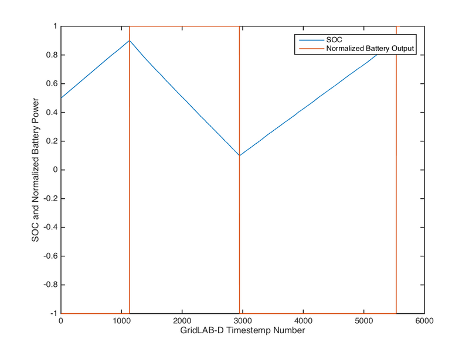

# Interfacing with External Software

Though the utility of GridLAB-D™ is relatively broad (when thinking of it as simply an electrical distribution simulator), the scope of the research in which it is employed is much broader. Rather than forcing users to implement additional functionality by extensively modifying and extending the GridLAB-D™ source code, GridLAB-D™ has implemented a number of ways in which it can programmatically interact with external software packages. This chapter will demonstrate how these interfaces work.

## MATLAB Interface

[MATLAB](http://www.mathworks.com/products/matlab/) is a very common general technical computing language and environment. Because MATLAB is so general, the interface with GridLAB-D™allows for a dramatic increase in functionality, allowing user written MATLAB code to interact with objects in GridLAB-D™.

### Building GridLAB-D™ with MATLAB

To enable this interaction, GridLAB-D™ must first be compiled from source with additional options; see [Building GridLAB-D™ from Source](../4.0%20Developing/4.2%20Building%20from%20Source/). These options are enabled when running `./configure `:

```
./configure --with-matlab=<path to MATLAB executable>
```

If this option has been correctly set, the output of the `./configure` will show that the software hooks have been implemented.

```
...

gridlabd 4.0.0: Automatic configuration OK.

Dependencies:

  MinGW: ...................... no
  Doxygen: .................... /usr/local/bin/doxygen
  libcppunit: ................. no
  libxerces-c: ................ yes
  matlab: ..................... yes
  mysql-connector-c: .......... no
  curses: ..................... yes

...
```

(Once this has been verified, be sure to complete the GridLAB-D™ installation process.)

The core interaction between GridLAB-D™ and MATLAB comes in two parts. The first is a set of three MATLAB commands that can be defined, each running at a different stage in the process: initialization (`on_init`), each timestep (`on_sync`) and at the conclusion of the GridLAB-D™ simulation (`on_term`). These three functions determine what MATLAB will do, the functionality it will provide during the run of the GridLAB-D™ simulation. 

!!! note

    The `script` directives cause external commands to be executed. The simulation will wait for the command to exit. If the exit code is non-zero, the simulation will immediately terminate with the exit code returned by the script. The recognized exit codes are listed in the exit codes page.

    Loader scripts (those without event specifications) are loaded one at a time in the order in which they are encountered by the loader.

    Event scripts may be run in parallel if the threadcount is greater than 1.

        script command-line;
        script on_create command-line;
        script on_init command-line;
        script on_sync command-line;
        script on_term command-line;
        script export global-name;

    * **export** - The variable listed is exported to the shell's environment before script are executed.

      Note that the syntax for accessing a variable is dependent on the shell being used to interpret the script commands. For example, DOS uses the %_name_ % syntax whereas bash uses the $_name_ syntax.

    * **on_create** - The script is executed after all objects have been created and before the first object is initialized.

    * **on_init** - The script is executed after all objects have been initialized and before the first sync event.

    * **on_sync** - The script is executed after each clock synchronization pass has been completed.

    * **on_term** - The script is executed when the simulation terminates.

    Caveats:
    
    * **platform independence** - In the current implementation, scripts are interpreted by the platform's native shell command processor (e.g., DOS for MS Windows, bash for linux and Mac). This means GLM files that use scripts are not normally portable from one platform to another.

    On most platforms you can specify the shell to use by preceding the command with the name of the shell, e.g.
    
        script python my_script.py
    
    provided you include the shell command in the your PATH environment. If platform independent scripts are desired, care should be take to only use those shell features that are platform independent. See the shell's documentation for details.

    * **Asynchronous calls** - On MS Windows platform the DOS shell interprets the `start` command as a request for asynchronous execution of the script. On Linux/Mac platforms, a trailing `&` causes asynchronous execution of the script. If a script request is repeated before the previous copy if done (e.g., `on_sync`), this can result in many copies of the script running concurrently and the system becoming bogged down with multiple copies of the same process.

    * **Variable expansion** - Variable names are interpreted when the script command is parsed by the GLM rather than when it is executed. It is currently not possible to update the value of a variable when the script is executed. As a result, the following directive will not work as expected
    
        script on_sync echo ${clock}
    
    because the value of the `clock` is interpreted when the directive is encountered (when `clock` contains the start time) and not when the script is executed. You must use the export option to export variables to scripts. The correct syntax for the above example is
    
    
        script export clock;
        script on_sync echo $clock; // linux/mac variable expansion syntax
    
      or
    
        script export clock;
        script on_sync echo %clock%; // windows variable expansion syntax

    

The second portion of the interaction is the variable value exchange. Though there are probably cases in which MATLAB functions need to be called without using any data from the GridLAB-D™ simulation, the far more likely scenario is that the MATLAB function being called will be using values from GridLAB-D™ and may be returning values that need to be incorporated into GridLAB-D™. 

Note that the link between MATLAB and GridLAB-D™ can be problematic at times. If difficulties in the compiling or use of the link is not behaving properly, check the [GridLAB-D™ forums](https://sourceforge.net/p/gridlab-d/discussion/842562/) to see if other users have encountered similar problems.

The following two examples will show how to configure the GridLAB-D™ model file and link file to enable the connection between MATLAB and GridLAB-D™.

### Example - Energy Meter

For this example, let's do something a little silly and use MATLAB as an energy meter, summing the power flow of one of the batteries in the model at each time step of the GridLAB-D™ simulation to calculate the total energy transfer. (This is a silly example because GridLAB-D™ already has meter objects that do exactly this but we can pretend that maybe this particular user is VERY new to GridLAB-D™.) Open up the [MATLAB_link.glm](https://github.com/gridlab-d/course/blob/master/Tutorial/Chapter%209%20-%20Interfacing%20with%20External%20Software/MATLAB%20Link/MATLAB_link.glm) model file to see how we enable this connection from GridLAB-D™.

At the very top of the file, we've added a statement that tells GriLAB-D™ where to look for the MATLAB link configuration.

```
link MATLAB_energy_meter.link
```

And that's it; that's the only change we need to make. We will still be referring to the specific variable names in the model file as we build the link file but this is the only edit that is needed.

Now open up the [MATLAB_energy_meter.link](https://github.com/gridlab-d/course/blob/master/Tutorial/Chapter%209%20-%20Interfacing%20with%20External%20Software/MATLAB%20Link/MATLAB_energy_meter.link) file itself. The comments in the link file are mostly self-explanatory and additional details can be found on the [Matlab link](../3.0%20Modeling/Modeling%20Reference/Matlab_link.md) page. The most important items in our case are:

* **on_init** -  This is the MATLAB command run prior to the start of the GridLAB-D™ simulation. In this case, we simply use it to initialize the variable we'll be using to zero. As the comments indicate, the state of `ans` can be used to to test whether the command succeeded. (Somewhat paradoxically, this value can be set explicitly by making the command:

```
on_init b1m1_batt_energy_kWh = 0; ans=GLD_OK
```

If this last part is not added a confusing error message will be posted when the model is run that does not affect the simulation or its results.

```
Error using save
Variable 'ans' not found.
```

This applies to the `on_term` command as well.)

* **on_sync** -  This is the MATLAB command that will be run every time that GridLAB-D™ updates the state of all the objects in the model. Using ";" it is possible to string together a large number of MATLAB commands to form relatively complex statements though at some point it probably makes more sense to use a function call (discussed in the next example). For this function, the last statement defining *ans* is essential and must be set in the link file.

* **on_term** -  Similar in form and function to the `on_init` function but runs at the completion of the GridLAB-D™ simulation.

* **global clock** -  Required to correctly enable to connection between GridLAB-D™ and MATLAB.

* **import/export** -  Defines how the values are exchanged between GridLAB-D™ and MATLAB. `export` statements are used for values flowing from GridLAB-D™ to MATLAB and `import` for the converse. The first parameter is the GridLAB-D™ object name and object parameter name (joined by a ".")  that is being passed between the two; the second is the MATLAB name of the same parameter. In this case we're sending the real power measurement of the triplex meter just upstream of the battery out to MATLAB.

When we use GridLAB-D™ to run a simulation of this model, MATLAB gets called (the MATLAB launch splash screen may or may not show up) and the power measurements GridLAB-D™ makes get passed to it. Looking the definition of the `b1m1_batt` and `b1m1_batt_inv`, we can see the the battery is operating at 3 kW and the simulation runs for half an hour which means the total energy discharged should be 1.5 kWh. The `on_term` function has MATLAB write this value out to a CSV and opening that up shows, indeed, the total energy from the battery is 1.5 kWh (the negative indicating the battery was discharging).

### Example - Battery Control

The above example is not the most useful application for MATLAB so let's try something a little more complicated and control the output of the battery using a MATLAB function. Open up [MATLAB_battery_control.glm](https://github.com/gridlab-d/course/blob/master/Tutorial/Chapter%209%20-%20Interfacing%20with%20External%20Software/MATLAB%20Link/MATLAB_battery_control.glm) and[MATLAB_battery_control.link](https://github.com/gridlab-d/course/blob/master/Tutorial/Chapter%209%20-%20Interfacing%20with%20External%20Software/MATLAB%20Link/MATLAB_battery_control.link). The general structure of the file is similar to the last example though there are a few items of note.

The `on_sync` MATLAB command is a function call using two values from GridLAB-D™ and returning a third. Looking down at the bottom of the file to the `import` and `export` section, we can see that a single GridLAB object parameter is both `import`ed and `export`ed (which is perfectly fine) but each of these statements assigns a separate MATLAB name to avoid confusion in the MATLAB function. 

Opening up the MATLAB function ("battery_controller.m") reveals a simple function that charges the battery until it is almost full and then discharges until it is almost empty. Each time the function is called, the input variables are appended to a CSV.

The `on_init` and `on_term` play supporting roles with the former deleting any previous results file hanging around to provide a clean slate for the run and the later reading in the results CSV and making a plot. Note that both of these lines use multiple MATLAB commands strung together with ";" at the end of each and either or both could have been packaged into stand-alone function files like the `on_sync`. Doing so might have been a good idea to increase readability of the file (particularly with the lengthy `on_term` command) but they work just fine as is and demonstrate what is possible from inside the link file.

When running the model, like before, MATLAB is called by GridLAB-D™, the simulation runs, and two output files are produced: the raw data CSV and an image of the graph MATLAB produced of that raw data.



As the graph shows, the simple controller functions as expected, keeping the battery with certain state-of-charge range. Though this is a very simple controller, it is easy to imagine a much more complex controller being implemented in MATLAB, using perhaps a wider variety of input data and running more complex calculations to determine the battery's output. Without having to learn the broader architecture of GridLAB-D™ source code, in this way MATLAB can be used to implement custom functionality.

## FNCS

[FNCS](https://github.com/FNCS) (Framework for Networked Co-Simulation) is a companion software package developed at [PNNL](http://www.pnnl.gov), which, as the name implies, allows GridLAB-D™ to interact with other supported software as co-simulators. Using FNCS allows GridLAB-D™ to interface with more than just a single MATLAB instance and by doing so enables very large collections of simulation instances to exchange information and effectively simulate a single aggregated system.

For example, FNCS allows the simulation of both the bulk transmission system and one or more distribution systems in such a way that the results of each affect the other. A single transmission system model solved in [MATPOWER](http://www.pserc.cornell.edu/matpower/) could be used to define nodal voltage values. GridLAB-D™ models of distribution systems can be attached to these transmission system nodes and, in turn, use this voltage information to solve its system and define a load value seen at that transmission system node. This proces then repeats AS MATPOWER uses this new updated load information to redefine the nodal voltages throughout the transmission system. This exchange of information overcomes traditional analysis barriers by allowing changes in the transmission system to affect the distribution system and vice versa.

As of this writing, FNCS is still in early development though demonstrations exactly like the one described above (and including a communication system modeled in a [customized version of NS-3](https://github.com/FNCS/ns-3.24)) have been completed. Further documentation on installing and setting up FNCS can be found in the [code repository](https://github.com/FNCS/fncs). 
