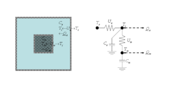
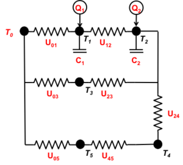
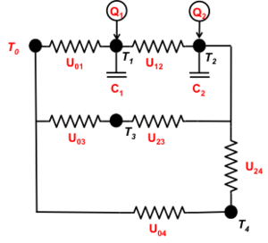
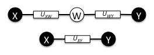
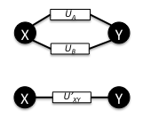
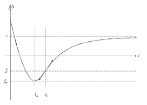

# Commercial Module

!!! warning

	This page contains features that are unfinished, were never implemented, or have since been deprecated. We preserve these pages for archival purposes, and also as a foundational resource for prospective developers who may wish to implement the same or similar feature. Many of these pages provide robust explanations of the theory behind a particular module or feature that we hope readers will find useful. 
	
	**This page does not reflect the current state of GridLAB-D™**

The Commercial Module implements commercial building models. Version 1.0 of this module only supports single-zone office buildings. Support for additional commercial buildings types is planned, including multi-zone office, schools, stores, and refrigerated warehouses. 

## Small Office Building

##### Figure 1 - The Equivalent Thermal Parameters (ETP) model

The Commercial Module uses a simple Equivalent Thermal Parameters (ETP) model for small single-zone office buildings (Taylor and Pratt 1988), shown in Figure 1, with first-order ordinary differential equations (ODEs): 

$$\begin{align} T_i' & = \frac{1}{C_a} \left [ T_m H_m - T_i \left ( U_a - H_m \right ) + \sum_{end\ uses}Q_x + T_o U_a \right ] \\ T_m' & = \frac{1}{C_m} \left [ H_m \left ( T_i - T_m \right ) + Q_m \right ] \end{align}$$

where 

  * $T_i$ = the temperature of the air inside the building
  * $T_i'$ = $dT_i/dt$
  * $T_m$ = the temperature of the mass inside the building (for example, furniture, inside walls)
  * $T_m'$ = $dT_m/dt$
  * $T_o$ = the ambient temperature outside air
  * $U_a$ = the UA of the building envelope
  * $H_m$ = the UA of the mass of the furniture, inside walls, etc.
  * $C_m$ = the heat capacity of the mass of the furniture inside the walls, etc.
  * $C_a$ = the heat capacity of the air inside the building
  * $Q_i$ = the heat rate from internal heat gains of the building (for example, plugs, lights, people)
  * $Q_h$ = the heat rate from heating, ventilating, and air conditioning unit
  * $Q_s$ = the heat rate from the sun to air (solar heating through windows, etc.)
  * $Q_m$ = the heat rate direct to the mass (e.g, solar radiation direct to mass)
The general first order ODEs ($c_1 - c_5$  defined by inspection above) is 

$$\begin{align} T_i' & = c_1 T_i + c_2 T_m + c_3 \\ T_m' & = c_4 T_i + c_5 T_m + c_6 \end{align}$$

with the constants $c_1$ through $c_6$ defined as 

  * $c_1 = - (U_a+U_m)/C_a$
  * $c_2 = U_m/C_a$
  * $c_3 = (Q_a+U_a T_o)/C_a$
  * $c_4 = U_m/C_m$
  * $c_5 = - U_m/C_m$
  * $c_6 = Q_m/C_m$

The general form of the second-order ODE is $p_1 T_i + p_2 T_i' + p_3 T_i = p_4$. The solutions to the second-order ODEs for indoor and mass temperatures are:

$$\begin{align} T_i(t) & = k_1 e^{r_1 t} + k_2 e^{r_2 t} + \frac{p_4}{p_3} \\ T_m(t) & = \frac{T_i'(t) - c_1 T_i(t) - c_3}{c_2} \end{align}$$

where: 

  * $p_1 = 1/c_2$
  * $p_2 = -(c_1+c_5)/c_2$
  * $p_3 = c_1 c_5 / c_2 - c_4$
  * $p_4 = -c_3 c_5 / c_2 + c_6$
  * $r_1,r_2$ are the roots of the $p_1 r^2 + p_2 r + p_3 = 0$
  * $k_1 = [ r_1 T_i(0) - r_2 p_4/p_3 - T_i'(0) ] / (r_2 - r1)$
  * $k_2 = [T_i'(0) - r_1 k_1] / r_2$
  * $t$ = the elapsed time
  * $T_i(t)$ = the temperature of the air inside the building at time $t$
  * $T_i'(t)$ = the rate of temperature change of the air inside the building at time $t$

so that 

$$T_i'(0) = c_2 T_m(0) + c_1 T_i(0) - \left(c_1 + c_2\right) T_o + c_7 \tag{}$$

and 

$$T_m(t) = k_1 \frac{r_1 - c_1}{c_2} e^{r_1 t} + k_2 \frac{r_2-c_1}{c_2} e^{r_2 t} + \frac{p_4}{p_3} + \frac{c_6}{c_2}$$

with 

  * $c_7 = Q_a / C_a$

## Defaults

All end-use power factor default to 1.0. 

The outdoor air defaults to 59 F, relative humidity to 75%, and solar exposures as follows 

  * South : 0
  * South-east : 0
  * South-west : 0
  * East : 0
  * West : 0
  * North-east : 0
  * North-west : 0
  * North : 0
  * Horizontal : 0

The default interior air and mass temperatures are set to the default outdoor air temperature. 

The control defaults are as follows: 

  * Heating setpoint : 70F
  * Cooling setpoint : 75F
  * Auxiliary cut-in: 20F
  * Economizer cut-in: 60F
  * Setpoint deadband : 1F
  * Ventilation fraction : 1 /h
  * Lighting fraction : 0.5 pu

The default occupancy schedule is M-F 8-17h. When occupied, the default occupancy is 0.002 occupants/sf. 

## Initialization

The default heating capacity is computed by solving the heat flow equation for the peak heating condition, which gives: 

$$Q_{max_{heat}}=UA ( T_{set_{heat}}-T_{design_{heat}} )$$

The default cooling capacity is computed by solving the heat flow equation for the peak cooling condition, which gives: 

$$Q_{max_{cool}} = UA ( T_{design_{cool}}-T_{set_{cool}}) + \sum_{windows}{A_{window} Q_{solar} c_{glazing}} + \sum_{loads}{Q_{load}} +Q_{vent}$$

where 

$Q_{vent}=0.2402 \times 0.0735(T_{design_{cool}}-T_{set_{cool}}) \times V_{air} \times ACH $

The heating COP is given by $COP_{heat} = Dist_{triangle}(1,2)$ and the cooling COP is given by $COP_{cool} = Dist_{triangle}(3,5)$. 

## Controls

The HVAC system has 6 control modes: 

Mode | Description
-- | --
**OFF** | In the **OFF** mode, the HVAC system is completely off. No ventilation and no heating or cooling of any kind of performed. This mode is engaged whenever $T_{off_{heat}} < T_{air} < T_{off_{cool}}$ and $occupancy = 0$. 
**VENT** | In the **VENT** mode, the HVAC system is ventilating the zone at the **minimum_ach** rate. This mode is engaged whenever $T_{off_{heat}} < T_{air} < T_{off_{cool}}$ and $occupancy > 0$. 
**HEAT** | In the **HEAT** mode, the primary heating (COP>1) system is on and the building is ventilating at the **minimum_ach** rate only if **occupancy** is non-zero. This mode is engaged whenever $T_{cutin_{aux}} < T_{air} \le T_{on_{heat}}$. 
**AUX** | In the **AUX** mode, the secondary heating (COP=1) system is on and the building is ventilating at the **minimum_ach** rate only if **occupancy** is non-zero. This mode is engaged whenever $T_{air} \le T_{cutin_{aux}}$. 
**COOL** | In the **COOL** mode, the active cooling (COP>1) system is on and the building ventilating at the **minimum_ach** rate only if **occupancy** is non-zero. This mode is engaged whenever $T_{air} \ge T_{on_{cool}} and T_{out} > T_{cutin_{econ}}$. 
**ECON** | In the **ECON** mode, the passive cooling (COP=$\infty$;) system is on and the building is ventilating using the rate required to cool using outdoor air only. This mode is engaged whenever $T_{air} \ge T_{on_{cool}}$ and $T_{out} \le T_{cutin_{econ}}$. 

## Power calculations

Except as noted below, when ventilation is required, $P_{vent} = floor\_area (0.1 - 0.01\imath)VA/sf$, and $Q_{vent}=0.2402 \times 0.0735 (T_{out}-T_{air}) V_{air} \times ventilation\_rate$. 

### HVAC

Setting | Description 
-- | --
OFF | `COP = 0, Qactive = Qpassive = 0, Pvent = 0`
VENT| `COP = 0, Qactive = 0, Qpassive = Qvent`
HEAT | <pre><code>COP = 1.0 + (COP_{heating}-1) (T_{out} - T_{aux}) / Trange, zone.hvac.heating.capacity + zone.hvac.heating.capacity_perF*(zone.hvac.heating.balance_temperature-Tout), Qpassive = Qvent</code></pre>
AUX | <pre><code>COP = 1.0, Qactive = COP * heating_capacity, Qpassive = Qvent</code></pre>
COOL |  <pre><code>COP = -1.0 - (zone.hvac.cooling.cop+1)*(Tout-TmaxCool)/(TmaxCool-Tecon), zone.hvac.cooling.capacity - zone.hvac.cooling.capacity_perF*(Tout-zone.hvac.cooling.balance_temperature), Qpassive = Qvent</code></pre>
ECON | `COP = 0, Qactive = 0, Qpassive = Qvent`

### Lighting

Setting | Description 
-- | --
lights.load | <pre><code>lights.fraction*(lights.capacity + (lights.capacity/lights.power_factor)*(sin(arccos(lights.power_factor)))_J_) (kW) </code></pre>
lights.heatgain | <pre><code>lights.load*lights.heatgain_fraction (kW) </code></pre>

### Plugs

Setting | Description 
-- | --
plugs.load | <pre><code> plugs.fraction*(plugs.capacity + (plugs.capacity/plugs.power_factor)*(sin(arccos(plugs.power_factor)))_J_) (kW) </code></pre>
plugs.heatgain | <pre><code> plugs.load * plugs.heatgain_fraction (kW) </code></pre>

### Other loads

Other loads

## Large Office Buildings

The general formulation for a multizone state-space solution 

For every node n, the heat transfer equation is 

$$C_n\frac{dT_n(t)}{dt} =    Q_n(t)  + \sum_{m=1}^M{ U_{nm} \left[ T_m(t)-T_n(t) \right] } \tag{6}$$

For a state space representation form a continuous, linear, time-invariant system is 

$$\begin{align} 
    \dot x & = Ax + Bu \\
    y & = Cx + Du
\end{align}$$

And from (25), the solution is: 

$$y_t= \sum_{j=0}^n(S_j u_{t-j\delta})-\sum_{j=1}^n(e_j y_{t-j\delta})$$

where 

$$\begin{align}     
S_0 & = CR_0 \Gamma_2+D \\
S_j & = C \left[ R_{j-1} ( \Gamma_1 -\Gamma_2 ) + R_j \Gamma_2 \right] + e_j D, for 1 \le j \le n-1 \\
S_n & = CR_{n-1} (\Gamma_1 -\Gamma_2 ) + e_n D
\end{align}$$

## Caveat

Prior to Hassayampa (Version 3.0) Multizone offices are created by connecting several single-zone objects with a **multizone** object linking them together with a user-defined _UA_. Unfortunately, this _UA_ is not integrated into the thermal solution but used to add or remove heat from the zones based on the temperature difference. This method works fine as long as the temperature difference between the two zones remains relatively constant. The **multizone** object limits the time step to avoid problem with excessive changes in the heat transfer rate. Nevertheless, this method is only an approximation and can introduce some error when large temperature fluctuations occur. 

At this time, the multizone offices only support unitary HVAC. There is no support for central/VAV HVAC systems. 

## Multizone ETP Linearization

*** WORKING DRAFT ***   

Tech:Commercial \- Linearized solution of the Equivalent Thermal Parameters method for modeling multizone commercial buildings 

## Introduction

Describe purpose of multizone ETP solver and reason for linearization. 

### Nomenclature

* $C_n$ The heat capacity of $n$-th node (Btu/degF).
* $\Delta t$
    The time-step taken for the next iteration (h).
* $\Delta T_n$
    The difference between the observed temperature and the setpoint temperature of the $n$-th node, if controlled.
* $k$
    The proportional control gain of the HVAC control system (unitless).
* $N$
    The number of nodes in a thermal network (integer).
* $n$
    A reference to the $n$-th of $N$ nodes (integer).
* $m$
    A reference to the $m$-th of $N$ nodes (integer).
* $Mode_n$
    The HVAC mode of the system interacting with the $n$-th zone (_heat_ , _cool_ , etc.).
* $Q_n$
    The HVAC heat flow into (positive for heating) or out of (negative for cooling) the $n$-th node, if controlled (Btu/h).
* $Q_{nm}$
    The heat flow from the $n$-th to $m$-th nodes (Btu/h).
* $Q_{mode-cap,n}$
    The heating (positive) or cooling (negative) capacity of the HVAC system interacting with the $n$-th node, if controlled (Btu/h).
* $T_n$
    The temperature of the $n$-th node (degF).
* $T_{cool,n}$
    The cooling setpoint temperature of the $n$-th node, if controlled (degF).
* $T_{heat,n}$
    The heating setpoint temperature of the $n$-th node, if controlled (degF).
* $U_{nm}$
    The thermal conductance of the path from the $n$-th and $m$-th nodes (Btu/degF/h).

## Methodology

Fig. 1: An example of a 6-node commercial building model. 
The branch from node 0 to node 2 is the original ETP model such as is used by the [residential] module. Node 3 represents an unconditioned space, while nodes 4 and 5 represent a series of massless nodes between the indoor spaces and the outdoor.

Large multizone commercial buildings are simulated using a linearized _N_ -node ETP model, such as the one illustrated in Fig. 1. Because large buildings are separated into multiple control zones, each control zone must be associated with exactly one thermal node. Other thermal nodes may be defined as needed. 

Each thermal node is characterized by its temperature $T_n $, its thermal mass $C_n $, and an exogenous heat gain (or loss) $Q_n $ from solar, internal, and/or HVAC boundary conditions (and which may be zero). 

Two nodes $n$ and $m$ are connected by the conductance $U_{nm}$, which represents the combined effect of the _UA_ of the surfaces separating the two zones, the associated convective surface heat transfers, and the air exchange between the zones. 

##### Figure 1. 6-Node Thermal Network

Known parameter values and boundary conditions are shown in red. Illustrated in Figure 1 is an arbitrary six-node thermal network. Note that the top horizontal branch is the original ETP circuit model, where $T_0$ is the outdoor air temperature (known boundary condition), $T_1$ is the indoor air temperature, and $T_2$ is the mass temperature. Node 3 might represent an unconditioned atrium space. Nodes 4 and 5 are present to illustrate series solutions of massless nodes, and might also represent an atrium with an additional buffer space to the outdoors. 

Two additional massless paths are added to illustrate additional circumstances. A node n is characterized by its temperature Tn, its mass $C_n$ (which can be zero), and an exogenous heat gain $Q_n$ (from solar, internal, and/or HVAC, which is a boundary condition that can also be zero). 

Nodes $m$ and $n$ are connected by conductance’s $U_{mn}$. A conductance might represent the UA of a building, an air flow rate between two nodes, or the product of a convective surface heat transfer coefficient and the surface area, for example. 

To solve this circuit explicitly, the heat flow from any node $m$ through the conductance to any other node $n$ at the time $t$is denoted as $Q_{mn}(t)$. Thus 

$$Q_{mn}(t)=U_{mn}\left[T_m(t)-T_n(t)\right] \tag{1}$$

where $T_n$ is the temperature of the node $n$. Note that the sign convention for $Q$ is positive for heat flowing into a node. Thus by definition $Q_{nm} = -Q_{mn}$. Note that this implies a sign convention for heat flow into a node as positive. Thus, by definition, $Q_{mn}=-Q_{nm}$. 

Assume a "small" time step $\Delta t$ during which all temperatures change by a "small" amount relative to the temperature differences between the nodes, i.e. $Q_{mn}$ can be considered a constant. This is the linearizing assumption. The maximum time-step $\Delta t$ permissible that satisfies the linearizing assumption is limited by two considerations: 

(1) How long until an HVAC $Mode_n$ changes or internal gains $Q_n$ change?
    This is determined by the time to the next expected change in mode, which can be estimated for each node based on the type of control (bang-bang or proportional).

(2) How long until the change in the temperature difference between a two nodes $n$ and $m$ exceeds a preset limit?
    This is determined by computing the rate of change of the temperature difference and estimating the time until that rate of change exceeds a preset limit.

### Step 1: Compute temperatures of all massive nodes

Assuming a "small" time step, $dt$ during which all temperature changes are "small" enough relative to the differences between the node temperatures that all the quantities $Q_{nm}$ can be considered constant. This is the linearization assumption. Then the heat balance on a massive node $n$, i.e., $C_n >0$, from a set of connected nodes $m=1$ to $M$, from time $t$ to time $t+\Delta t$ is: 

$$Q_n(t)+\sum_{m=1}^M Q_{mn}(t)=\frac{C_n\left[T_n(t+\Delta t)-T_n(t) \right]} |{\Delta t} \tag{2}$$

where $Q_n(t)$ is assumed to be constant boundary condition over the interval. 

Solving this for the temperature of the node at the next time step: 

$$\frac{C_n T_n(t+\Delta t)}{\Delta t} = Q_n(t)+\sum_{m=1}^M Q_{nm}(t)+\frac{C_n T_n(t)}{\Delta t} \tag{3}$$

$$T_n(t+\Delta t) = \frac{\Delta t}{C_n} \left[Q_n(t)+\sum_{m=1}^M Q_{nm}(t)\right] + T_n(t) \tag{4}$$

Substituting the definition for $Q_{nm}$ from Equation (1): 

$$T_n(t+\Delta t) = \frac{\Delta t}{C_n} \left[Q_n(t)+\sum_{m=1}^M U_{mn}\left[T_m(t)-T_n(t)\right]\right] + T_n (t) \tag{5}$$

or 

$$T_n(t+\Delta t) = \frac{\Delta t}{C_n} Q_n(t) + \frac{\Delta t}{C_n} \sum_{m=1}^M U_{mn} T_m(t) + T_n(t) \left[1-\frac{\Delta t}{C_n}\sum_{m=1}^M U_{mn}\right] \tag{6}$$

### Step 2a: Massless node reduction

Before computing the temperatures of the massless nodes, all those in series must be reduced until all the adjacent nodes are massive. Most often series reductions are sufficient: 

$U_ik = \left ( \frac{1}{U_{ij}} + \frac{1}{U_{jk}} \right )^{-1}$.

In some cases a parallel reduction over $K$ paths is necessary 

$U_{ij_k} = \sum_{k=1}^K U_{ij_k}$.

More generally, all "star" configurations of massless nodes must be reduced to "mesh" configuration by eliminating the node $k$ for all other pairs of nodes $i,j$ using 

$U_{ij} = z_{ik} z_{jk} \sum z^{-1}$.

### Step 2b: Compute temperatures of all massless nodes

If node $n$ is massless, i.e., $C_n = 0$, then it must be in thermal equilibrium with all adjacent nodes at any time. For massless nodes, Equation (2) reduces to 

$$Q_n(t)+\sum_{m=1}^M Q_{nm}(t+\Delta t)=0 \tag{7} $$

where over the time interval from $t$ to $t+\Delta t$ $Qn$ is a constant boundary condition. 

Substituting the definition for $Q_{mn}$ from Equation (1): 

$$Q_n(t)+\sum_{m=1}^M U_{mn} \left[ T_m(t+\Delta t)-T_n(t+\Delta t) \right]=0 \tag{8}$$

Solving for the temperature of the node at time t+Δt: 

$$T_n(t+\Delta t)=\frac{Q_n(t)+\sum_{m=1}^M U_{mn}T_m(t+\Delta t)}{\sum_{m=1}^M U_{mn}} \tag{9}$$

##### Figure 2. Reduced equivalent of 6-node thermal network

Computing the temperature of massless nodes in the thermal network assumes all temperatures of adjacent nodes are known at the end of a time-step, either as boundary conditions, or because they are massive and have had their temperatures computed in Step 1. 

The simplest way to resolve this is to reduce the network to an equivalent network when massless nodes are in series, parallel, or "wye" configuration. 

#### Series massless nodes configurations

##### Figure 3a - Series massless node reduction

A series configuration of two nodes, such as the thermal network in Figure 1, can be reduced as shown in Figure 2, where Node 5 is eliminated and the equivalent series conductance from Node 0 to Node 4 is 

$$U_{xy} = \frac{U_{xw} + U_{wy}}{U_{xw} U_{wy}} \tag{10}$$

#### Parallel massless nodes configurations

##### Figure 3b - Parallel thermal path reduction

A parallel configuration of two nodes can be reduced to a single node thus: 

$$U_{xy} = U_{A} + U_{B} \\ \tag{11}$$

#### Delta massless nodes configurations

A "delta" configuration of 3 nodes $(x, y, z)$ can be transformed to a "wye" configuration of four nodes $(x,y,z,w)$ as follows: 

$$\begin{align}
U_{xw} &= U_{xy}U_{xz}\left[ \frac{1}{U_{xy}} + \frac{1}{U_{yz}} + \frac{1}{U_{xz}} \right] \\ U_{yw} &= U_{xy}U_{yz}\left[ \frac{1}{U_{xy}} + \frac{1}{U_{yz}} + \frac{1}{U_{xz}} \right] \\ U_{zw} &= U_{xz}U_{yz}\left[ \frac{1}{U_{xy}} + \frac{1}{U_{yz}} + \frac{1}{U_{xz}} \right]
\end{align}$$

Note that for the general "star-mesh" case, the transformation is: 

$$U_{ij} = U_iw U_jw \sum_{n=1}^N \frac{1}{U_n} \tag{15}$$

where $N=1$ is the dangling node case (which eliminates the node), $N=2$ is the series node case (see above) and $N=3$ is the "delta-wye" transformation case. The "star-mesh" transformation has no general inverse without additional constraints, so all mesh configurations must be simplified using a series of appropriate wye-delta transformations. 

In such all cases, the temperature of the new node, $w$ is calculated as follows: 

$$T_w = \frac{\sum_{n=1}^N U_{nw} T_n}{\sum_{n=1}^N U_{nw}} \tag{16}$$

#### Special Case for "Bang-Bang" HVAC Control

Only massive nodes may have "bang-bang" HVAC controls applied to them. The total heat contribution from the HVAC systems is 

$Q_{HVAC} = Q_{heat} - Q_{cool} + Q_{fan}$

where 

  * $Q_{heat}$ is the plant heating contribution to the zone (if any)
  * $Q_{cool}$ is the plant cooling contribution to the zone (if any)
  * $Q_{reheat}$ is the terminate reheat contribution to the zone (if any)
  * $Q_{fan}$ is the heat from the circulation fan (if running)
  
The thermostat in the zone $n$ controls the heating/cooling/ventilation by operating in one of four modes, $Mode_n$

  * $OFF$ \- the fan is off (no heating or cooling)
  * $VENT$ \- the fan is on without heating or cooling
  * $HEAT$ \- the fan is on for heating
  * $COOL$ \- the fan is on for cooling

Each zone thermostat has two set-points, a deadband, and minimum separation: 

  * $T_{heat}$ \- the heating set-point
  * $T_{cool}$ \- the cooling set-point
  * $T_{dead}$ \- the deadband width around each set-point (half above and half below)
  * $T_{sep}$ \- the minimum separation between the heating and cooling set-points

The following constraints exists for the thermostats parameters: 

$T_{heat} < T_{cool} - T_{sep}$
$T_{sep} < 2*T_{dead}$
$T_{dead} > 0.0$

The ventilation schedule for each zone must be specified as weekly schedule of days and hours when minimum ventilation must be maintained: 

  * $V_{min}$ \- the minimum % of air that must be replaced each hour (value between 0.0 and 1.0)

The thermostat modes persist in time until changed as follows: 

  * When no ventilation is scheduled: 
    * $( Mode_n \ne HEAT )  \land ( T_n < T_{heat_n} - \frac{1}{2} T_{dead_n} ) \implies Mode_n \larr HEAT$
    * $( Mode_n = HEAT )  \land ( T_n > T_{heat_n} + \frac{1}{2} T_{dead_n}) \implies Mode_n \larr OFF$
    * $( Mode_n \ne COOL )  \land ( T_n > T_{cool_n} + \frac{1}{2} T_{dead_n} ) \implies Mode_n \larr COOL$
    * $( Mode_n = COOL )  \land ( T_n < T_{cool_n} - \frac{1}{2} T_{dead_n}) \implies Mode_n \larr OFF$
  * When ventilation is scheduled: 
    * $( Mode_n \ne HEAT )  \land ( T_n < T_{heat_n} - \frac{1}{2} T_{dead_n} ) \implies Mode_n \larr HEAT$
    * $( Mode_n = HEAT )  \land ( T_n > T_{heat_n} + \frac{1}{2} T_{dead_n} ) \implies Mode_n \larr VENT$
    * $( Mode_n \ne COOL )  \land ( T_n > T_{cool_n} + \frac{1}{2} T_{dead_n} ) \implies Mode_n \larr COOL$
    * $( Mode_n = COOL )  \land ( T_n < T_{cool_n} - \frac{1}{2} T_{dead_n} ) \implies Mode_n \larr VENT$

The thermostat modes are locked for a minimum time duration during which time no change in the mode is permitted: 

  * $T_{lock}$ \- the minimum lock time (default is 2 minutes)
The heats are computed as follows: 

$Mode_n=OFF \implies Q_{heat} \larr 0.0  \land Q_{cool} \larr 0.0  \land Q_{fan} \larr 0.0$

$Mode_n=VENT \implies Q_{heat} \larr 0.0  \land Q_{cool} \larr 0.0  \land Q_{fan} \larr Q_{fan_{low}}$

$Mode_n=HEAT \implies Q_{heat} \larr Q_{heat_{cap_n}}  \land Q_{cool_n} \larr 0.0  \land Q_{fan} \larr Q_{fan_{high}}$

$Mode_n=COOL \implies Q_{heat} \larr 0.0 \land Q_{cool} \larr Q_{cool_{cap_n}} \land Q_{fan} \larr Q_{fan_{high}}$

where 

  * $Q_{heat_{cap_n}}$ is the heating capacity of the heating system for node $n$
  * $Q_{cool_{cap_n}}$ is the cooling capacity of the heating system for node $n$
  * $Q_{fan_{low_n}}$ is heat from the fan when running at low power
  * $Q_{fan_{high_n}}$ is heat from the fan when running at high power

The time until the next mode change is 

$$\Delta t = \frac { C_n [ T_{target_n}(t) - T_n(t) ] } { Q_n(t) + \sum_{m=1}^M U_{mn} [ T_m(t) - T_n(t) ] }$$

where the target temperature is determined as follows 

$$Mode_n=HEAT \implies T_{target_n} \larr T_{heat_n} + \frac{1}{2} T_{dead_n}$$

$$Mode_n=COOL \implies T_{target_n} \larr T_{cool_n} - \frac{1}{2} T_{dead_n}$$

$$( Mode_n=OFF \lor Mode_n=VENT ) \land ( \Delta T_n < 0 ) \implies T_{target_n} \larr T_{heat_n} - \frac{1}{2} T_{dead_n}$$

$$( Mode_n=OFF \lor Mode_n=VENT ) \land ( \Delta T_n > 0 ) \implies T_{target_n} \larr T_{cool_n} + \frac{1}{2} T_{dead_n}$$

where $\Delta T_n = T_n(t-\Delta t)-T_n(t)$. 

In the rare event that $T_{target_n}(t) = T_n(t)$ the mode should remain unchanged. 

The time $\Delta t$ must not to exceed 5 minutes. There is no practical minimum for the $\Delta t$. 

Nodes whose temperature is used to control $Q_n$ (typically heating or cooling from the HVAC system) must have a modified calculation procedure, because $Q_n$ is no longer a boundary condition but rather a function of the node temperature, $T_n$, and the thermostat setpoints $T_{cool,n}$ and $T_{heat,n}$. 

Define $Q_n$ as the sum of the HVAC energy input (heating positive, cooling negative), and the sum of internal heat gains and solar heat gains, to Node $n$: 

$$Q_n = Q_{hvac,n}+Q_{gains,n} \quad \tag{17}$$

Let $Q_{cool-cap,n}$ and $Q_{heat-cap,n}$ be the net cooling and heating capacity available to supply the zone, respectively (net of the fan power). Let $Q_{fan,n}$ be the fan power when the HVAC is off (i.e., if the fan runs continually then $Q_{fan,n} > 0$). 

Assume a heating and cooling thermostat with setpoints centered in a deadband with range $+\Delta T_n$ on either side of the setpoint. Note that setpoints must not overlap: 

$$T_{cool,n} - \Delta T_n > T_{heat,n} + \Delta T_n \quad \tag{18}$$

The thermostat sets $Q_{hvac,n}$, which persists in subsequent time steps until changed by the thermostat: 

When $T_n < T_{heat,n} - \Delta T_n$

$$Mode_n = On \quad ; \quad Q_{hvac,n} = Q_{heat-cap,n} \tag{19}$$

When $T_n > T_{cool,n} + \Delta T_n$

$$Mode_n = On \quad ; \quad Q_{hvac,n} = Q_{cool-cap,n} \tag{20}$$

When $Mode_n=On$ and $T_{heat,n}+ \Delta T_n $≤ $T_n  ≤ $T_{cool,n} - \Delta T_n$

$$Mode_n = Off \quad ; \quad Q_{hvac,n} = Q_{fan,n} \tag{21}$$

Then the node temperature at time $t+\Delta t$ can be calculated from Equation (6). Note that all HVAC control nodes with On/Off control must be massive. If one were massless, Equation (9) indicates there is no way to maintain a setpoint without proportional control of $Q_{hvac,n}$. 

#### Special case for Proportional-Differential (PD) HVAC Control

In the case of proportional control for $Q_{hvac,n}$, then a proportional-differential control scheme: 

When $T_{heat,n} - \Delta T_n < T_n(t) < T_{heat,n} + \Delta T_n \quad$

$$\begin{align} 
Q_{hvac,n}(t) = Q_{heat-cap,n}(t) \left[ \frac{T_{heat,n}+\Delta T_n-T_n(t)}{2\Delta T_n} - \frac{k}{2\Delta T_n} \left[ T_n(t)-T_n(t-\Delta t)\right]\right] \tag{22}
\end{align}$$

When $T_{cool,n} - \Delta T_n < T_n(t) < T_{cool,n} + \Delta T_n \quad$

$$\begin{align}
Q_{hvac,n}(t) = Q_{cool-cap,n}(t) \left[ \frac{T_n(t) - T_{cool,n} + \Delta T_n}{2 ∆T_n} - \frac{k}{2\Delta T_n} \left[ T_n(t-\Delta t)-T_n(t) \right] \right] \tag{23}
\end{align}$$

When $T_{heat,n} + \Delta T_n \le T_n(t) \le T_{cool,n} - \Delta T_n$

$$Q_{hvac,n}(t) = Q_{fan,n} \quad \tag{24}$$

where $k$ is the proportional gain for the controller. 

### Step 3: Compute temperatures of reduced nodes

Massless nodes that have been reduced from the network are unnecessary to the simulation model of the network if:

  1. the temperature of the node does not affect some non-linear aspect such as a thermostatic control, and
  2. the temperature is not needed as an output variable for some purpose.

In general, it may be best to assume that if the user specified “unneeded” nodes, that there was some purpose in mind, and their temperatures should be computed from Equation (9) as a final step. 

## Validation

Describe how to validate a numerical implementation of this Commercial Module. 

## Authors

This method was developed by Robert G. Pratt and Lucy Huang at Pacific Northwest National Laboratory 

# ETP Equation Solution Algorithm

##### Figure 2 - The general ETP equation

The evolution of air temperature as a function of time is the fundamental equation in ETP, as shown in Figure 2. It takes the following form 

$$f \left ( t \right ) = a e^{nt} + b e^{mt} + c \tag{25}
$$

where both $m$ and $n$ are negative and equation $f(t) = 0$ must be solved for the first value of $t > 0$. Unfortunately, this function has no closed-form solution and must be solved numerically. 

When $a b < 0$, the function always has one extremum and one inflexion point, and the extremum time $t_m$is always less than inflexion time $t_i$. The extremum time is found at $t_m = \log (-a n / b m) / (m-n)$ and the value of the function at this point is defined as $f_m = f(t_m) $. The inflexion point is found at $t_m = \log ( -a n^2 / b m^2) / (m-n)$ and the value of the function at this point is defined as $f_i = f(t_i)$. The initial value at $t = 0$ if defined as $f_0 = f(0)$. 

  
The simplest efficient numerical method is Newton's method, but the method will not converge under certain conditions that depend on when the extremum and the inflexion points occur. The following tests must be made before starting the numerical solution: 

  * for $_m > 0$, a solution exists when $f_0×f_m < 0$ or $c×f_m < 0$
  * for $t_m = 0$ a solution only exists when $f_m = 0$
  * for $t_m < 0 ≤ t_i$ a solution only exists when $f_m < 0 < f_i$
  * for $t_i = 0$ a solution only exists when $f_i = 0$
  * for $t_i < 0$ a solution only exists when $c×f_i < 0$

When a solution exists the starting point $t_0$ of the numerical solution must be chosen based on the values of $t_m$ and $t_i$

  * $t_0 = 0$ should be used when $t_m > 0$ and $f_m$ ≤ $f_0 < 0$
  * $t_0 = t_i$ should be used for all other conditions for which a solution exists
  
# References

  * Taylor, ZT and RG Pratt. 1988 "The effects of model simplifications on equivalent thermal parameters calculated from hourly building performance data." In proc. 1988 ACEEE Summer Study on Energy Efficiency in Buildings, pp. 10.268-10.285.
* * *

Authors: David Chassin and Ross Guttromson, Pacific Northwest National Laboratory, Richland Washington (USA), PNNL 17615, May 2008. 
