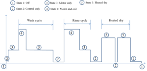
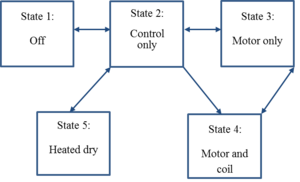
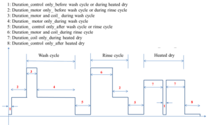
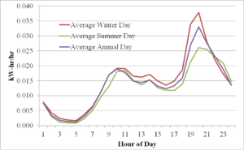

# Spec:Dishwasher

!!! warning

	This page contains features that are unfinished, were never implemented, or have since been deprecated. We preserve these pages for archival purposes, and also as a foundational resource for prospective developers who may wish to implement the same or similar feature. Many of these pages provide robust explanations of the theory behind a particular module or feature that we hope readers will find useful. 
  
	**This page does not reflect the current state of GridLAB-D™**
  
The purpose of this document is to describe the specifications of the dishwasher class in the residential module. 

## Modeling Assumptions

  * Energy consumption in dishwasher is split between motors and resistance heaters. Thus, the power factor changes depending on whether the wash cycle includes water temperature boost and changes from one part of the cycle to another. At this point, however, power factor modeling is simplified to be a constant value.
  * The dishwasher model was designed as a multi-state machine model. These states are defined by the level of their electricity consumption.
  * Eight different time intervals are considered in this model, and these intervals determine the transition times between the states.

##### Figure 1. Dishwasher representative cycle

The dishwasher model developed in GridLAB-D is a multi-state load model and it is shown in Figure 1. The states in the dishwasher model are defined by the level of their electricity consumption and they are: State 1 (off), State 2 (Control only), State 3 (Motor only), State 4 (Motor and coil) and State 5 (Heated dry). 

Each state in the model is governed by a ZIP model with transitions between states determined by internal state transition rules. The multi-state dishwasher model is shown Figure 2. 

##### Figure 2. Dishwasher multi-state model

##### Figure 3 shows the time intervals considered in the multi-state model of the dishwasher. These time intervals determine the transition times between the states. There are eight different time intervals are considered in this model and they are not fixed. It means user do have an option to change the time intervals between states. If user does not specify any inputs, the default values will be used. The default values are estimated based on the energy consumption profile of the dishwasher [1]. 

##### Figure 3. Dishwasher time intervals

##### Table 1 below gives the logic for allowable state transitions shown in the multi-state dishwasher model. 

##### Table 1: Transition Rules  From State | To State | Transition Rule   
---|---|---  
Off | Control only | Allowed when number of loads accumulated (queue) greater than 1.   
Control only | Off | Transition from ` Control only ` to `Off` will happen only after `Time_interval_8` elapses after the end of heated dry.   
Control only | Motor only | Transition from ` Control only ` to `Motor only` will happen only when after `Time_interval_2` elapses between `Off` and `Control only` before the beginning of wash cycle   
Control only | Motor and coil | Transition from ` Control only ` to `Motor and coil` will happen only when after `Time_interval_5` elapses after the end of `Motor only`.   
Control only | Heated dry | Transition from ` Control only ` to `Heated dry` will happen two times (both happens after wash and rinse cycles): The first transition happens after `Time_interval_5` elapses immediately after the end of rinse cycle. The second transition happens after `time_interval_1` elapses after the end of `Heated dry` during heated dry.   
Motor only | Control only | Transition from `Motor only` to ` Control only ` will happen two times (one happens after the end of wash cycle and the other one after the end of rinse cycle): The first transition happens immediately after the end of wash cycle. The second transition happens immediately after the end of rinse cycle.   
Motor only | Motor and coil | Transition from `Motor only` to `Motor and coil` will happen only when after `Time_interval_2` elapses after the end of ` Control only ` before the beginning of wash cycle.   
Motor and coil | Motor only | Transition from `Motor and coil` to `Motor only` will happen two times (one happens during wash cycle and the other one during rinse cycle): The first transition happens after `Time_interval_3` elapses after the end of `Motor only` (before wash cycle). The second transition happens after `time_interval_5` elapses after the end of ` Control only `.   
Heated dry | Control only | Transition from `Heated dry` to ` Control only ` will happen two times (one during heated dry and the other after the heated dry): The first transition happens after `Time_interval_7` elapses (during heated dry) after the end of ` Control only ` The second transition happens after the heated dry. Dishwasher stays in ` Control only ` until `Time_interval_8` elapses.   
  
The basic assumption made in the GridLAB-D™ implementation of the dishwasher model is that for each mode, the amount of energy needed by a dishwasher is constant. State transition times in this model are also fixed (however, user can change all transition times) as long as energy consumption of dishwasher is lower than the given base line energy (Model stops whenever total energy consumption exceeds the baseline energy and this can be possible any state of the dishwasher. Once model stops, it will not transit into any other states). Explicit hot water consumption from the water heater model is not considered at this point of time, but will be implemented in the future.= Specifications = 

## Governing equations

A common way to model the voltage response of a device is to model it as a collection of constant impedance, constant current, and constant power elements; the ZIP model [2]. Each state in the dishwasher model is governed by a ZIP model with transitions between states determined by internal state transition rules. The default ZIP components for each heating coil are modeled as 100% constant impedance, and motor at 100% constant power. All coils in this model assume to be the same ZIP fraction. Equation notation will follow: 

If motor is only running (i.e., State 3): 

$$\begin{align} \mathrm{Load\ power\ [kW]} &= \mathrm{motor\ power\ [VA]}\cdot \mathrm{power\ factor\_motor}/1000\\

\mathrm{Load\ current\ [kW]} = 0\\ 

\mathrm{Load\ impedance\ [kW]} =0\\ \end{align}$$

If heating coil is only ON (i.e., State 2 and State 5): 

$$\begin{align} \mathrm{Load\ power\ [kW]} =0\\

\mathrm{Load\ current\ [kW]}=0\\ \mathrm{Load\ impedance\ [kW]} &= \mathrm{heating\_element\_capacity\ [W]}/1000\\ \end{align}$$

If heating coil and motor are ON (i.e., State 4): 

$$\begin{align} \mathrm{Load\ power\ [kW]} &= \mathrm{motor\ power\ [VA]}\cdot \mathrm{power\ factor\_motor}/1000\\

\mathrm{Load\ current\ [kW]}=0\\ 

\mathrm{Load\ impedance\ [kW]} &= \mathrm{heating\_element\_capacity\ [W]}/1000\\ 

\end{align}$$

Energy calculation: 

$$\begin{align}\mathrm{Total\ power\ [kW]} &= \mathrm{Load\ power\ [kW]}+ \mathrm{Load\ current\ [kW]} + \mathrm{Load\ impedance\ [kW]} \\

\end{align}$$

$$\begin{align}\mathrm{Energy\ used\ [kWh]} &= \mathrm{Total\ power\ [kW]}\cdot \Delta t\mathrm{[ sec]}/3600\\

\end{align}$$

# User options

Dishwasher is modeled as a generic one to allow the user to make change(s) to input variables such as total energy consumption, controls rating, motor power rating, coil ratings, time intervals between the states etc., to obtain different energy profiles. If user wants to skip the heated dry cycle, it can be done by setting the heated dry option to false. If heated dry is eliminated, dishwasher consumes 35% less energy than the normal mode. All the options that user has are listed in Table 2. 

## Specifications

# S1

Interfacing overview (R1)

The dishwasher model shall use the residential end use interface for all output. 

# S2

Inputs (R2)
##### Table 2: Dishwasher inputs  Variable | Type | Units | Value (default) | Allowable values | Definition   
---|---|---|---|---|---  
energy_baseline | double | kWh | 0.9 | Value > 0 | The amount of energy need for a dishwasher cycle   
control_power | double | W | 10 | Value > 0 | The power required to drive control panel equipment   
motor_power | double | W | 250 | Value > 0 | The rating of the motor that is used to pump water up   
coil_rating_wash and rinse cycles | double | W | 950 | Value > 0 | The rating of the heating element that is used to heat the water for wash and rinse cycles to a pre-set value.   
coil_rating_heated dry | double | W | 695 | Value > 0 | The rating of the heating element that is used to help in drying the dishes.   
heateddry_option_check | bool | N/A | true | Either true or false | This option allows user to select or deselect heated dry cycle.   
daily_dishwasher_demand | double | N/A | 1 | Value > 0 | The probability that a given dishwasher is turned on depends on its daily demand D, and the value of the normalized appliance load shape. The higher these quantities are, the higher is the probability of the given appliance turning on [3].   
power_factor_motor | double | N/A | 0.95 | 0 < Value <= 1 | Motor power factor (assumed inductive)   
power_factor_coil | double | N/A | 1 | 0 < Value <= 1 | Coil power factor (assumed inductive)   
power_coil_only | double | N/A | 0 | 0 <= Value <= 1 | Constant power component fraction of heating coil   
queue | double | N/A | 0.8 | 0 < Value <= 1 | This is the initial queue value. The queue is incremented by an amount that is proportional to its daily demand (equation 1.1). Dishwasher turns on when queue is greater than threshold (in this model threshold is 1)   
duration_control only_before wash cycle or during heated dry | double | sec | 60 | Value > 0 | Control circuit is only ON in this interval before the wash cycle or during the heated dry   
duration_motor only_ before wash cycle or during rinse cycle | double | sec | 600 | Value > 0 | Motor is only ON in this interval before wash cycle or during rinse cycle   
duration_motor and coil_ during wash cycle | double | sec | 3600 | Value > 0 | Motor and coil are ON in this interval during dishwasher wash cycle   
duration_ motor only_during wash cycle | double | sec | 1740 | Value > 0 | Motor is only ON in this interval during dishwasher wash cycle   
duration_ control only_after wash cycle or rinse cycle | double | sec | 580 | Value > 0 | Control circuit is only ON in this interval after wash cycle or rinse cycle   
duration_motor and coil_during rinse cycle | double | sec | 1200 | Value > 0 | Motor and coil are ON in this interval during rinse cycle   
duration_coil only_during heated dry | double | sec | 1100 | Value > 0 | Coil is only ON in this interval during heated dry   
duration_control only_after heated dry | double | sec | 550 | Value > 0 | Control circuit is only ON in this interval after heated dry   
  
## S3

Outputs ([R3])

##### Table 3: Dishwasher outputs  Variable | Type | Units | Definition   
---|---|---|---  
total_power | double | kW | Total power required during the dishwasher cycle   
energy_used | double | kWh | Energy consumption during a dishwasher cycle.   
energy_needed | double | kWh | The amount of energy need for a dishwasher cycle   
queue | double | N/A | Number of loads accumulated.   
dishwasher_run | double | N/A | The chance of the dishwasher to run   
daily_dishwasher_demand | double | N/A | The daily demand of dishwasher   
  
## S4

Operational model ([R4])

Each cycle of operation involves a certain power draw (kW) from the power grid over the duration from start to finish. Furthermore, the rate of appliance usage or demand, i.e., average number of cycles per day is stochastic around some average value (to mimic the fact that in real life, demand for the usage of dishwasher is driven by dishwasher user’s behavior). 

Let $D$ denotes the demand in cycles per day of a dishwasher. Note that depending on the value of $D$, a given dishwasher could turn on more than once or not at all during a given day's simulation of that dishwasher. 

For a dishwasher, and each simulation time step $kT$, $k = 1, 2, 3,...,$ where $T$ is the simulation sampling time interval, we define a variable $queue(k)$ as follows 

##### Table 4: Equations  Equation | Number   
---|---  
$\begin{align} queue(k) &= queue (k-1) + D (E_k/E_{tot})), k = 1,2,3, ...\end{align}$ | 1.1   
$\begin{align} queue(0) &= q _0\end{align}$ | 1.2   
  
where $E_k$ denotes the energy consumed by the dishwasher over the $k^{th}$ time step as specified by ELCAP(integral of an ELCAP curve such as the one shown in Figure 4 between $(k-1)T$ )$kT$) and $E_{tot}$ denotes the total energy consumed by the appliance over the course of a day as specified by ELCAP. The ratio $Ek/E_{tot}$ gives a measure of the percentage of daily appliance consumption over the $k^{th}$ time step, and a plot of $E_k/E_{tot}$ as a function of $kT$ gives the normalized ELCAP dishwasher load shape. The difference Equation (1.1) is initialized to a random number $q_o$ (1.2). 

##### Figure 4. ELCAP Dishwasher Load Shape

Note that there is an interesting physical interpretation of $queue(k)$. Basically, dishwasher is placed in its 'queue', and waiting its turn to be turned on. And after each simulation time step of duration $T$, $queue(k)$ is incremented by an amount that is proportional to its daily demand. In other words, each appliance’s ‘queue’ is being built up or accumulated. And the rate at which the ‘queue’ is accumulated depends on the normalized load shape $Ek/E_{tot}$. Thus higher value of $Ek/E_{tot}$ would result in a higher rate at which an dishwasher’s ‘queue’ is accumulated, and the following logic is utilized to determine when to turn on a particular appliance 

  * If fore some $k$ = $k^*$, $queue(k^*)>\displaystyle{}\delta$ for some threshold $\displaystyle{}\delta > 0$, dishwasher is turned on. And once turned on, its 'queue' is re-set as follows
  * $\begin{align}queue(k^*+1) &= queue(k^*) - \displaystyle{}\delta\end{align}$

and accumulated again in accordance with Equation (1.1) to be turned on again at some later time. Intuitively, it is clear that the probability that a given appliance i is turned on depends on its daily demand $D$, and the value of the normalized appliance load shape $Ek/E_{tot}$ at any given time $kT$. The higher these quantities are, the higher is the probability of the given appliance turning on. 

## S5

Timing model ([R5])

Dishwasher model needs to be properly timed with the requirements of the individual dishwasher components. 

  * Assign default values to all the variables in init()
  * Define ZIP fractions, power factor of the motor and initial state of the dishwasher in create()
The dishwasher model follows the following steps: 

  * Each simulation time step of duration $T$, $queue(k)$ is incremented by an amount that is proportional to its daily demand as shown in equation 1.1. If $queue(k)$ is greater than some threshold value ($\displaystyle{}\delta$), dishwasher is turned on. And once turned on, its $queue(k)$ is reset as follows: $\begin{align}
queue(k+1) &= queue(k) - \displaystyle{}\delta\end{align}$. This is calculated in sync() 

  * Once dishwasher is turned on, it goes from one state to another (sync()). The sequence of intermediate states is determined by the transition times between the states (Transition Rules in Table 1).
  * Update energy consumption each simulation time step $T$ (sync())as long as energy consumption of dishwasher is lower than the given base line energy (dishwasher stops whenever total energy consumption exceeds the baseline energy)

# References

  * 1\. Source: IEEE power & energy magazine; May/June 2010.
  * 2\. K. P. Schneider and J. C. Fuller, “Detailed end use models for distribution system analysis,” in Proc. 2010 IEEE PES General Meeting, pp. 1-7.
  * 3\. J. C. Fuller, B. Vyakaranam, N. Prakash Kumar, S.M. Leistritz, and GB Parker, “Modeling of GE Appliances in GridLAB-D: Peak Demand Reduction,” PNNL-XXXXX, Pacific Northwest National Laboratory, Richland, WA, 2012.
  * 4\. Pratt, R.G., et al., 1989. “Description of Electric Energy Use in Single-Family Residences in the Pacific Northwest," end use Load and Consumer Assessment Program (ELCAP),” Pacific Northwest Laboratory, DOE/BP-13795-21, Richland, WA, April 1989

## Related Concepts:

  * dishwasher
    * Requirements
    * Specifications
    * Validation
    * Technical manual
    * User manual
  * House

