## User-Facing GridLAB-D Class

**TODO** this class is proposed but may or may not be implemented by the initial release of the GridLAB-D API. This documentation is being kept here for now as design notes and needs to find an appropriate permanent home.

```mermaid
classDiagram
      GLD <|-- GLDModel
      GLDModel <|-- GLDObjHolder
      GLDObjHolder <|-- GLDObj
      GLD: gld - GridLAB-D
      GLD: wd - Path
      GLD: sim_running - bool
      GLD: sim_time - DateTime
      GLD: start_time - DateTime
      GLD: stop_time - DataTime
      GLD: step_size - float
      GLD: console_messages- list
      GLD:get_model()
      GLD:set_install_root(path|str) -> None
      GLD:get_install_root() -> str
      GLD:get_executable_path() -> str
      GLD:set_config_file(config_file| str) -> int
      GLD:set_working_directory(self, dir| str) -> int
      GLD:setup_before_load() -> int
      GLD:setup_after_load() -> int
      GLD:start() -> int
      GLD:load_glm(arguments| list[str]) -> int
      GLD:load(filename| str) -> int
      GLD:run(start_time| Optional[float] = None, stop_time| Optional[float] = None) -> t
      GLD:run_test(self) -> int
      GLD:step() -> tuple[int, float]
      GLD:step_to(target_time_str| str) -> tuple[int, float]
      GLD:set_time(self, timestamp| str) -> int
      GLD:get_time(self) -> tuple[int, str]
      GLD:set_time_step(self, time_step| int) -> int
      GLD:save_checkpoint(self, save_path| str, mode| Optional[int] = None) -> int
      GLD:load_checkpoint(self, file_path| str) -> int
      GLD:get_checkpoint_json(self, filepath| str = "") -> str
      GLD:stop(self) -> int
      GLD:exit_gld(self, filepath| str = "") -> int
      GLD:finalize(self, filepath| str = "") -> int
      GLD:is_initialized(self) -> bool
      GLD:get_all_classes(self) -> list[str]
      GLD:get_all_objects(class_name| str) -> list[dict]
      GLD:get_model() -> dict[list[dict]]
      GLD:get_objects_by_class(self, class_name| str) -> list[str]
      GLD:get_object_properties(self, object_name| str) -> dict[str, str]
      GLD:get_property(self, object_name| str, property_name| str) -> tuple[int, str]
      GLD:set_property(self, object_name| str, property_name| str, value| str) -> int
      GLD:get_properties_by_class(self, class_name| str, property_name| str) -> dict[str, str]
      GLD:set_property_by_class(self, class_name| str, property_name| str, value| str) -> int
      GLD:global_setvar(self, name| str, value| str) -> int
      GLD:global_getvar(self, name| str) -> str
      class GLDModel{
            model: _GLDObjHolder
            extendable: bool

            _load_model() -> None
            }
        class GLDObjHolder{
            _model: dict[_GLDObj]
            extendable: bool

            __init__()
            __setitem__(key: str, value: Any) -> str
            __getitem__(key: str) -> _GLDObj
            __delitem__(key: str) -> str
            __iter__()
            __reversed__()
            __contains__(key: str)
            __repr__() -> str
            }
        class GLDObj{
            _data = dict

            __init__()
            __setitem__(key: str, value: Any) -> str
            __getitem__(key: str) -> Any
            __iter__()
            __reversed__()
            __contains__(key: str)
            __repr__() -> str
            }
```

## Itemized Subfeatures

- Base functions to duplicate existing functionality (start GLD, load GLM, execute)
- Advanced functions/"utility functions" can continue after deadline
- Documentation of data model for GLD models when in memory
- Simple model modification APIs - add and remove objects, update object parameters individually, get parameter values, APIs to get groups of objects by object type
- Time management APIs - Ability to advance GLD one time step (either GLD-defined or API-defined step size)
- Advanced model modification APIs - network traversal

## Source Code

**TODO** - Update link to master branch once the features is merged in.

- [GLD Python Bindings](https://github.com/gridlab-d/gridlab-d/tree/feature/1478/python_bindings/src/gridlabd): 

## Workflow

!!! Team

    Feature Lead: Trevor Hardy
    Team Members: Victoria Reynolds, Riley Maltos

!!! Status

        Complete by March 31, 2026

!!! Tracking

        [API GBO Board Page](https://github.com/orgs/gridlab-d/projects/2/views/3)
