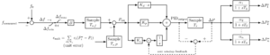
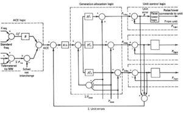
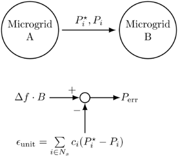
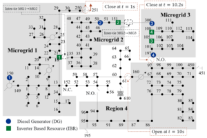

# Spec:sec control
TODO: SPECIFICATION *** WORKING DRAFT ***   

## Overview

The secondary controller object has a structure illustrated in Figure 1, and is very similar to textbook examples like Figure 2. 

Figure 1: Secondary controller structure

Figure 2 - AGC Control Structure. Source: [1]

The basic idea is that the frequency error $\Delta f$ is 

  1. Converted to a power error via bias factor $ B$
  2. Adjusted with respect to the current deviation from schedule of participating units (and potentially intertie flows) via $ \epsilon_{\text{unit}}$
  3. Integrate the error via a PID controller, where by default only the integrator branch is non-zero.
  4. Distribute the output $\Delta P$ to participating units via participation factor $\alpha_i$.

Additionally, sampling blocks are added to allow for different information input and output rates. A low pass filter is also possible on each unit channel to smooth out the signal to individual units. 

## Inter-Tie Modelling

Inter-tie modeling is incorporated into the unit error input, as illustrated in Figure 3. The scheduled flow, $P^{\star}_i$, and actual flow $P_i$, on this inter-tie are _positive_ if they correspond with the definition and _negative_ otherwise. A multiplier $c_i$ is introduced to account for this directionality, and is equal to 1 for all generators. Considering Microgrid A: 

  * When $P^{\star}_i - P_i$ is _positive_ , either not enough power is exported ($P^{\star}_i > 0$) or too much power is imported ($P^{\star}_i<0$). Either way, _more_ generation from the units in Microgrid A is needed, which is achieved by _increasing_ its error signal, $P_{\text{err}}^A$. Therefore, $P^{\star}_i - P_i$, should be multiplied by $c_i = -1$, to negate the minus sign in the summation point.
  * When $P^{\star}_i - P_i$ is \emph{negative}, either too much power is exported ($P^{\star}_i > 0)$, or too little power is imported ($P^{\star}_i<0$). Either way, _less_ generation from the units in Microgrid A is needed, which is achieved by _decreasing_ its error signal, $P_{\text{err}}^A$. This is similarly achieved by setting multiplier $c_i = -1$.

The logic for Microgrid B is equal and opposite to that of Microgrid A, and therefore $c_i=1$. These rules are summarized in the following table: 

| |  | $P^{\star}_i-P_i > 0$ | $P^{\star}_i-P_i < 0 $  
---|---|---|---  
Link _from_ end  
(Microgrid A) | Desired | $P_{\text{err}}\uparrow$ | $P_{\text{err}}\downarrow$  
$c_i$ | -1 | -1   
Link _to_ end  
(Microgrid B) | Desired | $P_{\text{err}}\downarrow$ | $P_{\text{err}}\uparrow$  
$c_i$ | 1 | 1   
  
!Illustration of inter-tie incorporation into the secondary controller via the unit error, $\epsilon_{text{unit}}$ 

Figure 3: Illustration of inter-tie incorporation into the secondary controller via the unit error, $\epsilon_{text{unit}}$ input

## Anti-Windup

Since the secondary controller predominantly works as an integrator and various sampling intervals are also involved, some anti-windup functionality is important. A few different options are considered. 

### Zero In Deadband

This option simply zeros the integrator state, ` xi ` when the the frequency is within its deadband and all tie-line flows are within tolerance. 

### Feedback PID Output

This is a common feedback mechanism2 used on sampled outputs, and is shown in Figure 1. The difference of the PID output, $\text{PID}_{\text{output}}$ and the sampled output $\Delta P$ is fed back to the weighted error signal prior to the integration stage. If we consider $K_d = K_p = 0$ then there are two cases: 

  1. **Sampling** : In this case $\text{PID}_{\text{output}} = \Delta P$, the feedback signal is 0 and the the integration step is  

$$x_i[t+1] = \text{PID}_{\text{output}}[t+1] = \text{PID}_{\text{output}}[t] + \Delta t \cdot (K_i\epsilon[t])$$

  1. **No Sampling** : In this case $\Delta P = 0$ and the feedback signal is $-\text{PID}_{\text{output}}$, leading the integration step to be:  

$$x_i[t+1] = \text{PID}_{\text{output}}[t+1] = \text{PID}_{\text{output}}[t] + \Delta t \cdot (K_i\epsilon[t] - \text{PID}_{\text{output}}[t])$$

Note the the no-sampling case looks very similar to a low pass filter, which helps keep the integrator output from increasing too rapidly between sample instances. In a more general case where $K_d \neq K_p \neq 0$, the integrator output and PID output don't line up as neatly, but the concept behind the method remains the same. 

### Feedback Integrator

This is the same as the Feedback PID Ouput except that the integrator output is fed back rather than the whole PID output. The relationship to a low pass filter will therefore be preserved even if $K_d \neq K_p \neq 0$, however, the feedback might not be as effective if the integrator gain is relatively small compared to the other two PID gains. 

## Requirements/Limitations

  1. The secondary control object operates in deltamode only, but will transition back to QSTS.
  2. Currently only inverter_dyn and diesel_dg are supported as generators. Any power flow link object can be used as an inter-tie.
  3. The frequency is currently only measured at the parent node of the secondary controller object.

## Parameters

### Global Secondary Controller Object Parameters

The following parameters are general to the secondary controller object. 

Parameter | glm | units | Default | Description   
---|---|---|---|---  
$i$ | `participant_input` |  |  | Set of participating objects in secondary control, see  unit specific parameters.   
$f_0$ | `f0` | Hz | 60 | Nominal frequency   
$\Delta f_{\text{max}}$ | `underfrequency_limit` | Hz | 57 | The _upper_ limit $\Delta f_{\text{max}}$ on $\Delta f$ is ` f0 - underfrequency_limit`  
$\Delta f_{\text{min}}$ | `overfrequency_limit` | Hz | 62 | The _lower_ limit $\Delta f_{\text{min}}$ on $\Delta f$ is ` f0 - overrfrequency_limit`  
$\epsilon$ | `deadband` | Hz | 0.2 | Frequency error dead band. As long as $ -\epsilon \leq \Delta f \leq +\epsilon$ the propagated error is 0.   
$\epsilon_{\text{tie}}$ | `tieline_tol` | p.u. | 0.05 | Generic tie-line error tolerance in p.u. w.r.t set schedule in link parameter `pdispatch + pdispatch_offset`.   
$B$ | `B` | MW/Hz | 1 | Frequency bias: converts frequency error signal to a power signal.   
$K_p$ | `KpPID` | p.u. | 0 | PID Proportional gain.   
$K_i$ | `KiPID` | p.u./s | 0.0167 | PID Integral gain.   
$K_d$ | `KdPID` | p.u.$\cdot$s | 0 | PID derivative gain.   
$T_s$ | `Ts` | s | $\Delta t$ | PID output sampling period.   
$T_{s,f}$ | `Ts_f` | s | $\Delta t$ | Input frequency sampling period.   
$T_{s,P}$ | `Ts_P` | s | $T_s$ | Input unit error (includes tie-line) sampling period.   
$T_{\text{lp}}$ | `Tlp` | s | 0 | Default for $T_i$, time constant for low pass filters to participating units. Zero means inactive.   
anti-windup | `anti_windup` |  | `FEEDBACK_PIDOUTPUT` | Integrator anti-windup options: `NONE, ZERO_IN_DEADBAND,  FEEDBACK_PIDOUT,  FEEDBACK_INTEGRATOR`.   
  
### Unit Specific Parameters

The unit specific parameters are provided via the `participant_input` parameter (access via player). Properties are provided in a specific order, which is listed below in column _Pos_ (1 indexed). 

Pos | Parameter | Units | Range | Default | Description   
---|---|---|---|---|---  
1 | name |  |  |  | Object name (used to get a pointer to the object internally)   
2 | **Generator Object:** $\alpha_i$   
**Link Object:** $c_i$ |  | **Generator Object:** $(0,1]$   
**Link Object:** $\\{1,-1\\}$ |  | **Generator Object:** unit participation factor   
**Link Object:** directionality indicator 1 = Link _to_ zone, -1= Link _from_ zone   
3 | $\Delta P_{\text{dn}}$ | MW | $0, (P_{\text{max}} - P_{\text{min}})P_r$ | $(P_{\text{max}} - P_{\text{min}})P_r$ | Maximum change from original setpoint in the _downward_ direction. If output is $P^{\star} = P_{\text{set}} + \Delta P^{\star}$ then $\Delta P^{\star} \geq -\Delta P_{\text{dn}}$.  
_Note:_ Not used for link objects.   
4 | $\Delta P_{\text{up}}$ | MW | $ 0, (P_{\text{max}} - P_{\text{min}})P_r $ | $(P_{\text{max}} - P_{\text{min}})P_r$ | Maximum change from original setpoint in the _upward_ direction. If output is $P^{\star} = P_{\text{set}} + \Delta P^{\star}$ then $\Delta P^{\star} \leq \Delta P_{\text{up}}$.  
_Note:_ Not used for link objects, since $\Delta P^{\star} = 0$ always.   
5 | $P_{\text{max}}$ | p.u. | -1,13 |  diesel_dg: 1  
 Grid Forming: `Pmax`   
 Grid Following: `Pref_max`   
 link: $\epsilon_{\text{tie}}$ | **Generator Object** : Maximum allowable output w.r.t rating $P_r$.   
**Link Object** : positive tie-line tolerance $(P_i^{\star} - P_{i})/P^{\star} \leq P_{\text{max}}$.   
6 | $P_{\text{min}}$ | p.u. | -1,13 |  diesel_dg: 0  
 Grid Forming: `Pmin`   
 Grid Following: `Pref_min`   
 link: $-\epsilon_{\text{tie}}$ | **Generator Object** : Minimum allowable output w.r.t rating $P_r$.   
**Link Object** : negative tie-line tolerance $(P_i^{\star} - P_{i})/P^{\star} \geq P_{\text{min}}$.   
7 | $T_i$ | s | $[\Delta t, \infty)$ | $T_{\text{lp}}$ | Low pass filter time constant.   
_Note_ : Note used for link objects.   
  
There are three different key words that can be specified when passing unit specific parameters: 

  * ` ADD `: is used to add new objects to the secondary controller
  * ` MODIFY `: is used to modify parameters of objects already participating in secondary control
  * ` REMOVE `: is used to to remove an object from the secondary controller
To pass information to the secondary controller: 

  1. Specify the appropriate key word
  2. List the unit name and relevant properties (to skip a property simply leave it blank)
  3. List additional units, separated by a line in csv or `;` in glm.
  4. Repeat steps 1-3 for more key words as necessary
  
There are two possible input formats: 

  1. glm
  2. csv

The csv method is recommended in general as it is more robust, easy to read, and does not risk exceeding the allotted array buffer of 1024 characters. 

The syntax is demonstrated using the following example. Initially (at ` t0 `) the secondary controller contains: 

Name | $\alpha_i$ | $\Delta P_{\text{dn}}$ MW | $\Delta P_{\text{up}}$ MW | $P_{\text{max}}$ p.u. | $P_{\text{min}}$ p.u. | $T_i$ s   
---|---|---|---|---|---|---  
gen1 | 0.7 | default | default | 0.9 | 0.3 | default   
gen2 | 0.3 | 0.5 | 0.5 | default | default | 1   
tie1 | -1 | N/A | N/A | 0.1 | 0.1 | N/A   
  
At ` t1 ` gen2 is removed from secondary control. In response gen1's $\alpha_i = 1$ and $P_{\text{max}} = 1$, and the tie line tolerance is changed to $\pm 15\%$

#### glm syntax

The syntax for direct glm input is: 
    
    
    t0 ADD gen1, 0.7, , , 0.9, 0.3; gen2, 0.3, 0.5, 0.5, , , 1; tie1, -1, , , 0.1, 0.1;
    t1 REMOVE gen2; MODIFY gen1, 1, , , 1; tie1, , , , 0.15, 0.15;
    

#### csv syntax

For the csv input two files would be needed: 

`t0.csv`
    
    
    ADD
    gen1, 0.7, , , 0.9, 0.3
    gen2, 0.3, 0.5, 0.5, , , 1
    tie1, -1, , , 0.1, 0.1
    

which looks something like: 

ADD   
---  
gen1 | 0.7 |  |  | 0.9 | 0.3 |   
gen2 | 0.3 | 0.5 | 0.5 |  |  | 1   
tie1 | -1 |  |  | 0.1 | 0.1   
  
and `t1.csv`
    
    
    REMOVE
    gen2
    MODIFY
    gen1, 1, , , 1
    tie1, , , , 0.15, 0.15
    

which looks something like: 

REMOVE   
---  
gen2 |  |  |  |  |   
MODIFY   
gen1 | 1 |  |  | 1 |   
tie1 |  |  |  | 0.15 | 0.15   
  
The player would then have contain: 
    
    
    t0 t0.csv
    t1 t1.csv
    

### Generator Properties

The following properties are implemented in the  inverter_dyn and  diesel_dg models to allow interaction with the secondary controller.  
**Note:** Any future object that should also be capable of interaction with the secondary object will likely need these properties. 

Object | Parameter | glm | units | Default | Description   
---|---|---|---|---|---  
 diesel_dg | $P_{\text{set}}$ | `pdispatch` | p.u. | GGOV with Rselect=1: $P_{\text{ref}}/R$ | Power set point   
GGOV with Rselect=-1 or -2: $K_{\text{turb}}(P_{\text{ref}}/R - w_{\text{fnl}})$  
DEGOV1: $(\omega_{\text{ref}} - 1)/R$  
P_CONSTANT: $P_{\text{ref}}$  
$\Delta P^{\star}$ | `pdispatch_offset` | p.u. | 0 | Offset to $P_{\text{set}}$. This is the quantity that the secondary controller manipulates   
 inverter_dyn | $P_{\text{set}}$ | `pdispatch` | p.u. | GRID_FORMING, PSET_MODE: $P_{\text{set}}$ | Power set point   
GRID_FORMING, FSET_MODE: $(2\pi f_{\text{set}} - \omega_{\text{ref}})/m_p$  
GRID_FOLLOWING or GFL_CURRENT_SOURCE: $P_{\text{ref}}/S_{\text{base}}$  
$\Delta P^{\star}$ | `pdispatch_offset` | p.u. | 0 | Offset to $P_{\text{set}}$. This is the quantity that the secondary controller manipulates   
  
 
The current set point, $P^{\star}$, is calculated as  

$$P^{\star} = P_{\text{set}} + \Delta P^{\star}$$

### Link Properties

The following properties are implemented in the  link object to allow interaction with the secondary controller as a tie-line. 

Parameter | glm | units | Description   
---|---|---|---  
$P_{\text{set}}$ | ` pdispatch ` | W | Scheduled flow. Positive flow matches the links from-to definition.   
$\Delta P^{\star}$ | `pdispatch_offset` | W | Offset to the scheduled flow.  
**Note** : currently unused.   
set dispatch trigger | `set_dispatch` | true/false | Trigger to set schedule to current power flow value. When True will set:  
$P_{\text{set}} = (P_{\text{in}} + P_{\text{out}})/2$   
$\Delta P^{\star} = 0$  
  
## Interaction with QSTS Mode

### Initialization

Since QSTS mode is a steady state formulation there is no frequency error. Therefore, all states are initialized to zero. 

### Return to QSTS Operation

The controller keeps track of two conditions: 

  1. Frequency within deadband: $-\epsilon \leq \Delta f \leq \epsilon$
  2. Tie-lines within tolerance: $P_{\text{min}} \leq (P^{\star}_i - P_i)/P^{\star}_i \leq P_{\text{max}} \forall i$

When both of these conditions are met for the length of two output sampling periods ($2T_s$) then the secondary controller requests to return to QSTS mode. 

## Examples

### Multiple Secondary Controllers With Inter-Ties

The following glm snippet shows how to set up a controller including inter-ties as shown in Figure 4. Only the controller for Microgrid 2 is shown for brevety. 

Main `.glm`: 
    
    
    // Controller Parametrization
    object sec_control {
      name secondary_controller_MG2;
      flags DELTAMODE;
      parent meter_50;
      deadband 0.001; //1 mHz deadband
      B 1.7476; //MW/Hz
      kiPID 0.04; // pu/s;
      kpPID 0; //pu
      Ts 0.2; // 200ms output sample time
      Ts_f 0.1; // 100ms frequency sample time
      Ts_P 0.2; // 200ms unit error and inter-tie sample time
      anti_windup FEEDBACK_PIDOUT;
      participant_input "sec_cntrl_MG2_part_init.csv";
    };
    //Triggers to set the tie-line schedules 
    object player{
      name MG1_MG2_tie_set;
      flags DELTAMODE;
      parent microgrid_switch1;
      file "tielineset.player";
      property set_pdispatch;
    };
    object player{
      name MG2_MG3_tie_set;
      flags DELTAMODE;
      parent microgrid_switch4;
      file "tielineset.player";
      property set_pdispatch;
    };
    

`sec_cntrl_MG2_part_init.csv`: 
    
    
    ADD
    Inv2, 1
    microgrid_switch1, 1
    microgrid_switch4, -1
    

`tielineset.player`: 
    
    
    2001-08-01 12:00:00, true
    

### Low Pass Filter

The following example uses the low pass filter option via a default value. The `participan_input` also shows a custom value for $P_{\text{min}}$ for Gen4. 

Main `.glm`: 
    
    
    object sec_control {
      name secondary_controller;
      flags DELTAMODE;
      parent node_150;
      deadband 0.001; //1 mHz deadband
      B 12.1187; //MW/Hz
      kiPID 0.2; // pu/s;
      kpPID 0; //pu
      Ts 1;
      Tlp 1;
      anti_windup FEEDBACK_PIDOUT;
      participant_input "sec_cntrl_part_init.csv";
    };
    

`sec_cntrl_part_init.csv`: 
    
    
    ADD
    Gen1, 0.3
    Gen4, 0.2,,,,0.3
    Inv1, 0.2
    Inv3, 0.3
    

Figure 4: Secondary controller setup on the IEEE 123 Bus case for illustration purposes.

## References

  1. ↑ "Wood, Allen J., Bruce F. Wollenberg, and Gerald B. Sheblé. Power generation, operation, and control. John Wiley & Sons, 2013."
  2. ↑ See, for example Aström, Karl (2002). Control System Design (PDF(https://www.cds.caltech.edu/~murray/courses/cds101/fa02/caltech/astrom-ch6.pdf)). pp. 228–231.
  3. ↑ 3.0 3.1 Negative values possible for inverters if a battery is assumed that can also charge

## See Also

Req:sec_control

