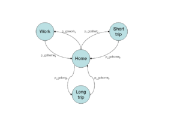
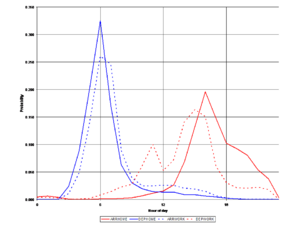

# Hybrid Electric Vehicle Chargers

!!! warning

	This page contains features that are unfinished, were never implemented, or have since been deprecated. We preserve these pages for archival purposes, and also as a foundational resource for prospective developers who may wish to implement the same or similar feature. Many of these pages provide robust explanations of the theory behind a particular module or feature that we hope readers will find useful. 
	
	**This page does not reflect the current state of GridLAB-D™**

In December 2008 the **residential** module received a preliminary implementation of all-electric and plug-in hybrid-electric vehicle charger loads for inclusion in Diablo (Version 2.0). The following describes that implementation and the requiremenets for subsequent enhancements (noted as **TODO**). 

## EV/PHEV Model

There are only two types of electric vehicles supported: 

  * **ELECTRIC** pure electric vehicle with limited range based on battery capacity
  * **HYBRID** hybrid electric vehicle with longer range based on fuel capacity
The **evcharger** simulation is based on demand state profile of the vehicle. When the vehicle is at home, it has a probability of leaving on one of 3 trips, as shown in Figure 1. 

  * **WORK** trip to work (standard distance defined by trip.d_work)
  * **SHORTTRIP** random trip up to 50 miles (battery will not be fully discharged) (**TODO**)
  * **LONGTRIP** random trip over 50 miles (battery will be discharged up to 25%) but only possible for **HYBRID** vehicles (**TODO**)

##### Figure 1 - EV/PHEV trip state diagram

When away, the probability of a return is used to determine when the vehicle returns, as shown in Figure 2. 

##### Figure 2 - Daily EV/PHEV arrival/departure probabilities

The charger power can have one of three levels: 

  * LOW 120V/15A charger
  * MEDIUM 240V/30A charger
  * HIGH 240V/60A charger

The trip distances are used to estimate the battery charge upon return according to the following rules: 

  1. A work trip discharges the battery depending on whether charge_at_work is defined. If charging at work is allowed, the battery will discharge for 1 trip (back only), otherwise it will discharge for 2 trips (there and back). The assumption at this time is that there is enough charging capacity at work to make the time at work inconsequential.
  2. A short trip discharges the battery based on the distance traveled.
  3. A long trip discharges the battery to 25%, but is only possible with hybrids.
  
In all cases, if the trip distance is greater than 50 miles and the car is a hybrid, the discharge will be down to 25%. 

Heat fraction ratio is used to calculate the internal gain from plug loads during the heating phase. Note that this heat gain is to the residential indoor air, not the garage air. So the fraction must account for the very weak coupling between the two, if any. 

## Demand profiles

The format of the demand profile is as follows: 
    
    _DAYTYPE_
    _DIRTRIP_ ,_DIRTRIP_ ,...
    #.###,#.###,...
    #.###,#.###,...
    .
    .
    .
    #.###,#.###,...

where 

  * _DAYTYPE_ is either **WEEKDAY** or **WEEKEND** ,
  * _DIR_ is either **ARR** or **DEP** , and
  * _TRIP_ is either **HOME** , **WORK** , **SHRT** , or **LONG**.
  
There must be 24 rows of numbers, the numbers must be positive numbers between 0 and 1, and each column must be normalized (they must add up to 1.000 over the 24 hour period). 

You may introduce as many _DAYTYPE_ blocks as are supported simultaneously (2 max at this time). 

# Synopsis

    class evcharger {
           (class residential_enduse;)
           enumeration {HIGH=2, MEDIUM=1, LOW=0} charger_type;
           enumeration {HYBRID=1, ELECTRIC=0} vehicle_type;       
           enumeration {WORK=1, HOME=0, UNKNOWN=4294967295} state;       
           double p_go_home[unit/h];
           double p_go_work[unit/h];
           double work_dist[mile];
           double capacity[kWh];
           double charge[unit];
           bool charge_at_work;
           double charge_throttle[unit];
           char1024 demand_profile;
    }
    

## Properties

Property name | Type | Unit | Description   
---|---|---|---  
charger_type | enumeration | none | Charge rate (HIGH, MEDIUM, or LOW)   
vehicle_tpe | enumeration | none | Specify if vehicle is hybrid or all electric.   
state | enumeration | none | Initial location of the vehicle.   
p_go_home | double | unit/h | Probability of vehicle returning home.   
p_go_work | double | unit/h | Probability of vehicle leaving to work.   
work_dist | double | mile | One way distance traveled between home and work.   
capacity | double | kWh | Battery capacity   
charge | double | unit | Current battery state of charge, fraction of capacity.   
charge_at_work | bool | none | Specify if work charging is available.   
charge_throttle | double | unit | Sets fraction of full charge rate.   
demand_profile | char1024 | none | Demand profile of the vehicle.   
  
## Default Evcharger

The minimum definition for an evcharger object is 
    
    
    object evcharger {
    }
    

## Evcharger Schedule

The evcharger object can be put on a schedule to control when it is at home, work, or on a trip. This can be done by using a schedule for the p_go_home and p_go_work properties (only control when it is at home or work) or by using the demand_profile property. 

## Example
    
    
    module residential;
    module tape;
    
    clock {
    	timezone PST+8PDT;
    	timestamp '2001-07-10 00:00:00';
    	stoptime  '2001-07-18 00:00:00'; 
    };
    
    object house {
    	object evcharger {
    		object recorder {
    			file charge.csv;
    			property charge;
    			interval 600;
    		};
    	};				
    }
    

