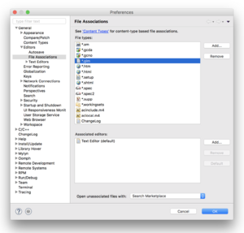
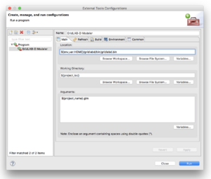
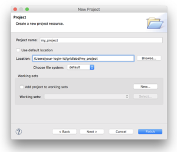
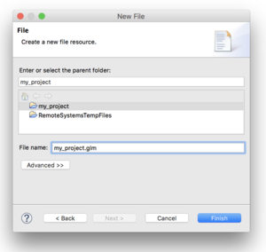

# CMake Build

**Source URL:** https://GridLAB-D™.shoutwiki.com/wiki/CMake_Build

---

From GridLAB-D™ Wiki

Database changes have finished applying - please report any issues you're (still) seeing to support@shoutwiki.com. 

Jump to: navigation, search

[Ostrander (Version 5.0)](/wiki/Ostrander "Ostrander") _New in 5.0!_

## Contents

  * 1 Building GridLAB-D
    * 1.1 Prerequisites
      * 1.1.1 Packages
    * 1.2 Installation
      * 1.2.1 Git
      * 1.2.2 Prepare out-of-source build directory
      * 1.2.3 Generate the build system
      * 1.2.4 Build and install the application
    * 1.3 CMake Variables
      * 1.3.1 Enable building with HELICS
      * 1.3.2 Enable building with MySQL
      * 1.3.3 Enable build debugging
      * 1.3.4 Developer Build Flags
    * 1.4 Building on ARM-Based macOS (M1, M2, M3....)
      * 1.4.1 Switch the architecture of the Terminal shell
      * 1.4.2 Install HomeBrew
      * 1.4.3 Install build dependencies
      * 1.4.4 (HELICS-only) Find the location of the HELICS library file libhelics.dylib
      * 1.4.5 Clone in the GridLAB-D™ repo and set up the build directory (as in above instructions)
      * 1.4.6 Configure the build
      * 1.4.7 Build and install (as in above instructions)

# Building GridLAB-D

## Prerequisites

These instructions should be executed in your terminal of choice. This may be MSYS2, a WSL instance, or the built-in terminal for your OS of choice (note: Windows CMD does not work). 

If you are on Windows and are using MSYS2, see [this page for setting up MSYS2](/wiki/MSYS_Windows_Setup "MSYS Windows Setup") to run the commands below. 

If you have an Apple-ARM-based Mac, be sure to skip to the [ARM-Based Section](/wiki/CMake_Build#Building_on_ARM-Based_macOS_\(M1,_M2,_M3....\) "CMake Build") for those instructions. 

### Packages
    
    
    CMake  
    CCMake or CMake-gui (optional)   
    g++ or Clang
    

## Installation

### Git

Clone the git repository for GridLAB-D™ and update submodules: 
    
    
    git clone <https://github.com/gridlab-d/GridLAB-D™.git>
    cd gridlab-d
    git submodule update --init
    

### Prepare out-of-source build directory

Create build directory and move into it: 
    
    
    mkdir cmake-build
    cd cmake-build
    

### Generate the build system

CMake flags can be added using the `-D` prefix, and different build systems can be selected using `-G`. 

Below is a general format guide, and an actual viable build command for most platforms. 
    
    
    # Format:
    cmake <flags> ..
    
    
    
    # Full Example: 
    cmake -DCMAKE_INSTALL_PREFIX=~/software/GridLAB-D™ -DCMAKE_BUILD_TYPE=Release -G "CodeBlocks - Unix Makefiles" ..
    

### Build and install the application

CMake can directly invoke the build and install process by running the below command. Multiprocess build is enabled through the `-j#` flag (`-j8` in the included example). 
    
    
    # Run the build system and install the application
    cmake --build . -j8 --target install
    

## CMake Variables

The following variables affect the build process and can be changed using the `-D` flag at build generation or by updating the cache using ccmake or cmake-gui (default values are shown). 

Variable | Valid Values | Description | Linux/Mac Default | Windows Default   
---|---|---|---|---  
Example | Example | Example | Example | Example   
CMAKE_BUILD_TYPE | 'Debug', 'RelWithDebInfo', 'MinSizeRel', 'Release' | Compiler optimizer configuration | Debug | Debug   
CMAKE_INSTALL_PREFIX | Any path | Install location | /usr/local | %ProgramFiles%   
GLD_USE_HELICS | ON/OFF | Enables detection and use of HELICS | OFF | OFF   
HELICS_DIR | Any path | Hint indicating HELICS install directory |  |   
GLD_USE_MYSQL | ON/OFF | Enables detection and use of MySQL | OFF | OFF   
MYSQL_DIR | Any path | Hint indicating MySQL install directory |  |   
  
### Enable building with HELICS

To enable HELICS set the `GLD_USE_HELICS` flag to `ON` if HELICS is in a custom path set `HELICS_DIR` to the install location in CMake or as an environmental variable 
    
    
    GLD_USE_HELICS=OFF
    

### Enable building with MySQL

To enable MySQL support set the `GLD_USE_MYSQL` flag to `ON` if MySQL is in a custom path set `MYSQL_DIR` to the install location in CMake or as an environmental variable 

### Enable build debugging

To output all build commands during build, set following flag to `ON` 
    
    
    CMAKE_VERBOSE_MAKEFILE=OFF
    

### Developer Build Flags

GridLAB-D™ Developers may want to enable additional C++ code style and bugprone checks, which have been made available through the use of the clang-tidy tool at compile time. To enable these build-time checks, a flag to enable these checks is provided 
    
    
    GLD_USE_CLANG_TIDY=ON
    

WARNING: Enabling clang-tidy checks will significantly increase the number of build warnings for portions of the code base which have not yet been updated 

## Building on ARM-Based macOS (M1, M2, M3....)

As of this writing (Sept 2024), GridLAB-D™ functions best when built as a x86-64 (Intel-chip) binary where macOS can use [Rosetta 2](https://support.apple.com/en-us/102527) to translate the machine code to run on an ARM-based processor. 

### Switch the architecture of the Terminal shell
    
    
    gld_user2@mymac ~ % arch -x86_64 zsh
    

This launches a new zsh shell as an x86-64 process so the compilation/build run in this shell will produce x86-64 binary. 

### Install HomeBrew

[Homebrew](https://brew.sh/) is a package manager for macOS and is the easiest way to install many tools from the Linux world. As of this writing (Sept 2024), you can install Homebrew with the following command: 
    
    
    /bin/bash -c "$(curl -fsSL https://raw.githubusercontent.com/Homebrew/install/HEAD/install.sh)"
    

### Install build dependencies
    
    
    brew install cmake # installs cmake and ccmake
    

Optionally, if you plan on including HELICS compatibility in GridLAB-D™, install the ZeroMQ library 
    
    
    brew install zeromq
    

### (HELICS-only) Find the location of the HELICS library file libhelics.dylib

Depending on how you installed HELICS (building from source, installing pre-built binaries, using `pip`) the location of the libhelics.dylib on your system will vary. If you did install via `pip` you can use 
    
    
    pip show helics
    

as a starting point for your search. Other good places to look include `/usr/lib`, `/usr/local/lib`. 

Once you find libhelics.dylib, copy the path to the folder containing it as it will be needed in configuring the build. 

### Clone in the GridLAB-D™ repo and set up the build directory (as in above instructions)

No special macOS instructions, here. The next step comes when configuring the build by running 
    
    
    ccmake .
    

### Configure the build

The following environment variables are the most likely ones you may want to change: 
    
    
    CMAKE_INSTALL_PREFIX = <<Location in which to install. If in a virtual or conda environment you'll want to set this to the path used in that environment.>>
    
    
    
    GLD_HELICS_DIR = <<Directory where libhelics.dylib resides.>>
    
    
    
    GLD_USE_HELICS = ON
    
    
    
    GLD_HELICS_DIR = <<Directory where libhelics.dylib resides.>>
    

Once all of these have been set, press `c` to configure and `g` to generate the configuration file. Due to a bug in ccmake it may take multiple attempts with `c` to get the `g` option to appear 

### Build and install (as in above instructions)

Retrieved from "[https://GridLAB-D™.shoutwiki.com/w/index.php?title=CMake_Build&oldid=9897](https://GridLAB-D™.shoutwiki.com/w/index.php?title=CMake_Build&oldid=9897)"
# Eclipse

**Source URL:** https://GridLAB-D™.shoutwiki.com/wiki/Eclipse

---

From GridLAB-D™ Wiki

Database changes have finished applying - please report any issues you're (still) seeing to support@shoutwiki.com. 

Jump to: navigation, search

## Contents

  * 1 Step 1: GLM File Association
  * 2 Step 2: External Tool Configuration
  * 3 Step 3: Create a project
  * 4 Step 4: Create GLM files
  * 5 Step 5: Run the simulation

Eclipse \-- Using Eclipse as your GridLAB-D™ integrated modeling environment 

This page describes how to set up Eclipse as your integrated modeling environment. It is based on the Eclipse C/C++ IDE. 

## Step 1: GLM File Association

[GLM File Association](/wiki/File:Eclipse_step_1.png "Enlarge")

Step 1. GLM File Association

Open **Eclipse - > Preferences** and add an editor file type association for GLM files to the internal text editor. 

  
## Step 2: External Tool Configuration

[External Tool Configuration](/wiki/File:Eclipse_step_2.png "Enlarge")

Step 2. External Tool Configuration

Open **Run - > External Tools -> External Tools Configuration** and clock the **New Launch Configuration** icon (in the upper left corner of the explorer pane). Enter the following values in the **Main** tab: 

Location
    `_your-gridlabd-folder_ /bin/gridlabd.bin`
Working Directory
    `${project_loc}`
Arguments
    `${project_name}.glm`

Click **Apply** and **Close**. 

Select the **Environment** tab and add the following environment variables to set 
    
    
    GRIDLABD=${env_var:HOME}/gridlabd
    GLPATH=${env_var:HOME}/gridlabd/lib/gridlabd:${env_var:HOME}/gridlabd/share/gridlabd
    CXXFLAGS=-w -g -O0
    

## Step 3: Create a project

[Create Project](/wiki/File:Eclipse_step_3.png "Enlarge")

Step 3. Create Project

Open **File - > New Project**, select **General / Project** , and click **Next**. Specify the project name and the project folder. Click **Finish**. 

## Step 4: Create GLM files

[Create GLM File](/wiki/File:Eclipse_step_4.png "Enlarge")

Step 4. Create GLM File

If your project folder already contains files, they will be listed in the project's explorer pane. To create a new GLM file, open **File - > New -> Other**, select **General / File** , and click **Next**. In the **New File** dialog, select the project, enter the GLM file name, and click **Finish**. 

## Step 5: Run the simulation

Once you have coded the GLM file(s), open **Run - > External Tools -> GridLAB-D™ Modeler**, and observe the output in the console window. You can also click the **Run GridLAB-D™ Modeler** icon on the toolbar to start GridLAB-D™. 

Warnings and errors are displayed first in the output. Then the standard output is displayed. You can use the file name and line number to locate the cause of any warnings or errors. 

By default the run configuration uses the project name as the GLM file name. You can change this behavior using the **External Tools Configuration** dialog in Step 2. You can also change the command line arguments, adding options such as `--verbose` or `--profile` to the arguments. 

Retrieved from "[https://GridLAB-D™.shoutwiki.com/w/index.php?title=Eclipse&oldid=8485](https://GridLAB-D™.shoutwiki.com/w/index.php?title=Eclipse&oldid=8485)"

# Getting Started

  This section introduces the basic workings of GridLAB-D™, from file types to
  how to create and run your first model.
---
## Introduction

GridLAB-D™ is a power system simulation tool that provides valuable information to users who design and operate electric power transmission and distribution systems, and to utilities that wish to take advantage of the latest smart grid technology. It incorporates advanced modeling techniques with high-performance algorithms to deliver the latest in end use load modeling technology integrated with three-phase unbalanced power flow, and retail market systems. Historically, the inability to effectively model and evaluate smart grid technologies has been a barrier to adoption; GridLAB-D™ is designed to address this problem.

This guide to using GridLAB-D™ is intended to help those who are at least slightly familiar with distribution systems to establish a foundation that will allow them to use GridLAB-D™ in their work. It is not intended to be comprehensive as GridLAB-D™ contains many models with many parameters, but rather to address some of the more important and popular features.  The guide will not only address practical issues such as how certain models function but also more general topics exploring the architecture of GridLAB-D™.

This guide contains and references many example GridLAB-D™ models and files.  Readers are recommended to pull a local copy of the folder at [https://github.com/gridlab-d/course/tree/master/Tutorial](https://github.com/gridlab-d/course/tree/master/Tutorial) so these files are readily available during the tutorial.

## GridLAB-D™ Design

GridLAB-D™ is a flexible agent-based simulator that can model the behavior of many objects over time.  The simulator looks for changes in objects that affect other objects and keeps track of the evolution of these objects over time.  GridLAB-D™ continues advancing the clock and allows each object to update itself until all the objects report that they are at equilibrium and the clock need not be advanced further.  This is very important to understand and is often one of the least understood aspect of GridLAB-D™.

GridLAB-D™ uses modules to define classes of objects.  Each class must be defined in a module.  Modules can either be static, meaning they are implemented in a dynamic link library (e.g., `.dll` in Windows, `.so` in Linux, `.dylib` on Macs), or they can be dynamic, meaning they are compiled and linked at runtime.  Classes define which properties are allowed in objects, and how behaviors are implemented.  Objects are instances of classes, so each object can have it's own values for each property while sharing behaviors with other objects of the same class. But during simulations GridLAB-D™will keep the objects' properties synchronized with each other as time advances.

## GridLAB-D™ Input Files

GridLAB-D™ uses two principle kinds of input files.  `.glm` files are used primarily to synthesize populations of objects and encode object behavior.  `.xml` files are used to represent instances of `.glm` files and exchange data with other software systems.  In general `.xml` files will work best with static modules that can be loaded from pre-existing libraries (.so files in Linux), while `.glm` files do not require static modules.  `.glm` files can also extend classes of objects implemented by modules, while `.xml` files cannot.

At this point, there is no released tool for editing `.glm` files, although the GldEditor is under development and can be worked on by those with access to source code.  Output `.xml` files are viewable using XSL/CSS stylesheets published on the GridLAB-D™website.

Please consult the \["/wiki/Creating\_GLM\_Files">Creating GLM Files] page for details on designing GridLAB-D™ models.  For a guide to the modeling using the static module, see the \["/wiki/Modeler%27s\_Guide">Modeler's Guide].

## Running GridLAB-D™

GridLAB-D™ can be run using the simple command line `gridlabd myfile`.  Command line arguments, including options are evaluated and executed in the order in which they appear.

Output is generated to `stdout` and `stderr`.  Output redirection is controlled using the `--redirect` command line option.

## GridLAB-D™ Output Files

GridLAB-D™ can output result one of two ways.  The first and simplest is to use the `-o myfile.xml` command line option to generate an instance of the model at the end of simulation.  For more information on `.xml` output, see the \["/w/index.php?title=XML\_Data\_Files\&action=edit\&redlink=1" >XML Data Files] page.

The second method of generating output is to use the *tape* module's *recorder* and *collector* objects to generate a time-series of particular values or aggregate values over the entire model.  For more information on this see \["/wiki/Tape\_Module\_Guide" >Tape Module Guide] page.

### The Primer

If you’re already competent with GridLAB-D™ and want skip straight to the details of runtime classes or high-performance simulation, then as an advanced user, you should feel free to jump straight the list of \["/wiki/Modules">modules].  However, all beginners and most intermediate users will find there are important concepts and details that you’ll need to get start and quickly become an advanced user.

GridLAB-D™ is the first (and so far only) environment for simulating the highly integrated modern energy systems that are coming into being all over the world.  GridLAB-D™ is also an open-source system, meaning that the source code, the programming code that makes up GridLAB-D™, is freely available to anyone.  People all over the world can add to GridLAB-D™, fix bugs, make improvements, or suggest optimizations.  And they do.  GridLAB-D™ has grown a lot since the prototype implementation (called PDSS, short for Power Distribution System Simulator) created at Pacific Northwest National Laboratory (PNNL) in 2002 \["#References">\[1]].  Back then, David Chassin and Ross Guttromson were commissioned under the Laboratory’s Energy Systems Transformation Initiative to look into a) whether such a software system could be built, b) whether it could model how energy systems might evolve over time, and c) how much value would this evolution bring to consumers and utilities.  In 2007, after the US Department of Energy's Office of Electricity committed to getting the results of that work more widely available, the open-source model of development and distribution was used to make sure that as many people as possible could both contribute to it and benefit from what it has to offer.  Since then, GridLAB-D™ has grown quickly, mainly because of the hard work and dedication of all the contributors, and of course the early dedication of the GridLAB-D™ team at PNNL.

Unlike proprietary simulation tools, where the source code is written by a few people and carefully guarded, open-source projects like GridLAB-D™ exclude no one who is interested in making a contribution if they are competent enough.  Many vendors of energy established software tools still scoff at the idea that such a tool can make an impact, but the success of other large-scale open-source projects shows that this approach can work and will work so long as enough support from contributors is available.

Another important advantage of the open-source model is the transparency of the implementation, which is necessary to building confidence in the accuracy of the results that come from using GridLAB-D™.  While proprietary tools must be carefully validated using test-cases, GridLAB-D™has the advantage that validation can begin much sooner by ensuring that the implementation meets industry standards for quality and accuracy.

With Version 1, GridLAB-D™revealed the potential for a transformation in how complex energy systems are modeled, and garnered a great deal of interest from potential users around the world.  The availability of Version 2 has built on that interest and provides a much more appealing and flexible product with a wider potential range of users.  The open-source system works well on both proprietary and open-source operating system and is expected to perform strongly in the utility market.  GridLAB-D™is set to transform how we model and study modern energy systems.

In this primer we will discuss the following:

* Essential concepts and terminology

* Starting and stopping GridLAB-D

* Creating and running models

* Creating and modifying classes

* Instantiating objects

* Extracting results

* Constructing complex models

Throughout these pages certain conventions are observed to assist readers in gaining access to a maximum amount of information with a minimum of effort.

* Unavailable links are marked in red.  These indicate that further information is needed, but it has not yet been written.  As with many MediaWiki documentation efforts, these pages are always a work in progress.  Red links indicate the leading edge of that work.

*Synopsis*

* Most pages have a leading synopsis section that briefly describes the usage of the command or concept in question.  Often the synopsis will contain blue links to other portions of the page that describe that aspect of the topic in more detail.

* Sample code is usually provided with descriptions of features.  Often these examples build on previous examples. In such cases, new lines are underlined, unwanted lines are stricken, and only the new concepts and terms are marked with \["/wiki/Gridlabd">blue links].

*See Also*

* Most pages have a "See also" section at the bottom that provide you with suggested topics that are related to the page.  These are often grouped in topic areas of many related pages.

## Understanding GridLAB-D™ Basics

GridLAB-D™ is an agent-based simulation environment specifically designed to model modern energy systems.  It’s a program capable of tracking the simultaneous states of vast numbers of objects having a wide variety of properties and behaviors, and gathering information about their condition as time progresses in the simulation.

GridLAB-D™ simulates a system by computing a series of steady states, separated by state transitions.  The simulation discovers when those state transitions occur by looking at each object to determine a) what its next proposed steady is, b) whether that state consistent with the proposed steady states of all the other objects in the model, and c) how long that state is expected to last.

The details of how GridLAB-D™ works are left to a later discussion.  But GridLAB-D™ comes with everything needed to make this happen, and determine what the final result is.  All the tools needed for constructing and compiling models, debugging and running them in the simulator, and extracting results are either installed with GridLAB-D™ or available as free downloads from open-source repositories.

At this point, this is all you need to know to get right into creating a simple model and running a simulation. Jump on over to [Modeling 101](docs:intro-to-modeling) to start modeling in GridLAB-D™.

# Introduction to Programming GridLAB-D

**Source URL:** https://GridLAB-D™.shoutwiki.com/wiki/Introduction_to_Programming_GridLAB-D

---

Database changes have finished applying - please report any issues you're (still) seeing to support@shoutwiki.com. 

# Introduction to Programming GridLAB-D

  * [Language]( "Language")
  * [Watch](/w/index.php?title=Special:UserLogin&returnto=Introduction+to+Programming+GridLAB-D™ "Watch")
  * [Edit](/w/index.php?title=Introduction_to_Programming_GridLAB-D&action=edit&section=0 "Edit the lead section of this page")

DEPRECATED  See [Guide to Programming GridLAB-D](/wiki/Guide_to_Programming_GridLAB-D™ "Guide to Programming GridLAB-D") for [Hassayampa (Version 3.0)](/wiki/Hassayampa "Hassayampa") and later. 

_By Matt Hauer <matthew.hauer@pnl.gov> for developer use only_

## Contents

  * 1 Font Conventions
  * 2 Introduction
  * 3 Running Example
  * 4 Objects, Classes, Modules
    * 4.1 The Core
    * 4.2 GL_* Global Functions
  * 5 Runtime Organization
    * 5.1 On Sync()
      * 5.1.1 Example: The Metronome Class
    * 5.2 The Clock
    * 5.3 AGGREGATION
      * 5.3.1 AGGREGATION *gl_create_aggregate(char *aggr, char *group)
      * 5.3.2 double gl_run_aggregate(AGGREGATION *aggr)
  * 6 Modules and Dealing With the Core
    * 6.1 Fetching Objects in the core
      * 6.1.1 OBJECT *gl_get_object(char *objname)
      * 6.1.2 OBJECT *object_find_by_id(OBJECTNUM id)
      * 6.1.3 FINDLIST *gl_find_object(FINDLIST *start, ...)
      * 6.1.4 OBJECT *gl_find_next(FINDLIST *list, OBJECT *obj)
    * 6.2 Anatomy of a Find Object command
    * 6.3 Working with object properties
      * 6.3.1 PROPERTY *gl_get_property(OBJECT *obj, char *name)
    * 6.4 Get Property Functions
    * 6.5 Common property types
    * 6.6 Unusual property types
    * 6.7 Registering classes with the core
      * 6.7.1 CLASS *gl_register_class(MODULE *module, CLASSNAME name, PASSCONFIG passconfig)
    * 6.8 Publishing variables with the core
  * 7 Model Initialization
  * 8 WORKING WITH TIME IN GRIDLAB-D
    * 8.1 TIMESTAMP gl_parsetime(char *value)
    * 8.2 TIMESTAMP gl_mktime(DATETIME *dt)
    * 8.3 int gl_strtime (DATETIME *t, char *buffer, int size)
    * 8.4 double gl_todays(TIMESTAMP t)
    * 8.5 double gl_tohours(TIMESTAMP t)
    * 8.6 double gl_tominutes(TIMESTAMP t)
    * 8.7 double gl_toseconds(TIMESTAMP t)
    * 8.8 int gl_localtime(TIMESTAMP ts, DATETIME *dt)
  * 9 COMMAND LINE ARGUMENTS
    * 9.1 [filename]
    * 9.2 -o [filename]
    * 9.3 \--output [filename]
    * 9.4 \--kml[=filename]
    * 9.5 -h
    * 9.6 \--help
    * 9.7 -c
    * 9.8 \--check
    * 9.9 \--debugger
    * 9.10 \--version
    * 9.11 \--xmlencoding {0, 1}
    * 9.12 \--xsd module
    * 9.13 -D [prop]=[val]
    * 9.14 \--define [prop]=[val]
    * 9.15 \--relax
    * 9.16 -T [num]
    * 9.17 \--threadcount [num]
    * 9.18 -q
    * 9.19 \--quiet
    * 9.20 \--bothstdout
    * 9.21 -w
    * 9.22 \--warn
    * 9.23 \--debugger
    * 9.24 -v
    * 9.25 \--verbose

### Font Conventions

Some sections use different fonts for ready recognition. 

**Bold** or _italic_ phrases in the body are used to denote function names or variable names. All function names use a `no_leading_cap_with_underscores` format, even if certain text editors believes this is wrong. 

Sections in `Courier` represent literal code snippets, whether inline function names with arguments, code blocks, or model file examples. They either were or may be copied verbatim as appropriate. 

>This document is a work in progress, so sections with a left bar are meant as author’s notes, and left in to indicate that there is more with a topic than has been explained. 

# 

Introduction

This document is meant to explain some of the inner workings of GridLAB-D™ to those who have recently started working with it, and have not discovered the myriad quirky behaviors that make the simulator work. The “Beginner’s Guide” set is not meant to provide a rigorous explanation of the core and the released modules, but instead is to facilitate understanding of what’s in the core, how it behaves, how the released modules work, and how to write new modules that interface with existing modules. 

The author has a background in computer science, rather than power systems. The focus will be weighted towards how the system works as a piece of software, rather than how power systems are modeled. “It’s the engineer’s job to figure out how it’s supposed to work; it’s the developer’s job to make it work.” Even if the engineer is often also the developer, in context, understanding how a model is supposed to work does not convey understanding of how to implement it within GridLAB-D™. 

# 

Running Example

Throughout the guide, a Metronome class will be referred to. There is no Metronome module or class defined in GridLAB-D™ (yet!), but it is used as a simple device that can be readily modeled. All mention of the Metronome class will attempt to remain internally consistent as additional concepts and properties about GridLAB-D™ are introduced to the reader. Another class and module will likely be added to better explain how objects communicate between modules. 

There is a separate document that only concerns itself with the MetronomeExample, and is recommended either as a jump-start for writing GridLAB-D™ classes, or if the examples in this guide are discontinuous to the reader. 

# 

Objects, Classes, Modules

GridLAB-D™, in practice, concerns itself with objects, the class of each of those objects, and the DLL modules that registered those classes. 

The largest building block for GridLAB-D™ is the module. These are DLLs that are loaded by the GridLAB-D™ core that use the core functions to register a set of classes, and a set of properties for each of those classes. The core has a small structure with handles to various parts for that DLL, including its name, the module interface functions such as init and check, and the classes registered with that module. 

GridLAB-D™ classes are similar to, but not the C++ classes that are coded for them. The core sees a class as a structure with a set of published properties, with some function pointers to the common routines, such as create, init, sync, and isa, then stores the name and instance size (in bytes) of the class. 

GridLAB-D™ objects are malloc’ed structures that include enough space for a GridLAB-D™ object header and an instance of the class. In practice, the C++ classes are created using malloc() in the core, rather than using new() in the modules. Using the properties defined for the GridLAB-D™ class, it is possible for modules with no definition for an object’s C++ class to access any published variable in that foreign class. 

A published variable is one that is explicitly registered with the GridLAB-D™ core from within a class’s registration process. The property structure holds only the name of the property, its type, and an offset pointer to find the variable from the start of the object’s class block. 

Graphically, objects in memory look like ` [[struct OBJECT][class Metronome-----]] [[struct OBJECT][class Link]] [[struct OBJECT][class Metronome-----]] [[struct OBJECT][class Light--]] ` The contents of the Object struct are always at the start of the allocated memory block, and the entire object is allocated as one block. 

## The Core

The first thing to recognize is that GridLAB-D™ functions much like a combination of a compiler and an operating system. It defines modules, classes, objects, inheritance hierarchy, and named variable types, loads in DLLs to extend its capabilities, links various objects together by name instead of address, contains PATH information, and handles object processing distribution and order. Though incomplete as an operating system, and unable to write programs or scripted instructions, many similarities exist at the deeper levels. 

The second thing to recognize is that GridLAB-D’s simulation model is event-driven, instead of time-driven. Every object reports the time it will next change state. The clock will then advance to the time of the next state change, and process the new states for all the objects in the model for that time step. 

The third thing to observe is that GridLAB-D™ doesn’t do a great deal by itself. Without a model file or any modules, it becomes a big “Hello World!” exercise. If a model file includes, but does not use, objects of a particular type, that functionality is never realized. Without some sort of action from GridLAB-D™, it looks much like a large black monolith. 

## GL_* Global Functions

A great deal of the consternation with the core, when developing modules, is that there is no direct access to the core. There are instead a set of callbacks that are exported to modules through inclusion of gridlabd.h. The callback structure, defined in module.c, near line 500, and in object.h, near line 50, is a large group of function pointers that are populated when the core starts up, and is passed to each DLL as they are loaded. This structure is available within modules developed from the GridLAB-D™ basecode, and allows the functions below to be used transparently. 

The bulk of this section has been moved to [wiki:globalvar] and [wiki:outputfuncs]. 

# 

Runtime Organization

The breakdown of the various steps when running GridLAB-D™ includes the whole simulation run, the timesteps, the iterations, and the passes. The whole of the simulation is composed of a number of arbitrarily long time steps. The length is calculated based on which object will change state the soonest. This may be as short as one second away, or it may be several days until an object changes state. At the end of a time step, all the objects will have advanced to the same time and will have converged to an answer. During each time step, the core iterates through until all the objects converge to an answer. With each iteration of the core, every object will attempt to sync to the next time stamp as instructed by the core. If any object does not converge, it should return a timestamp equal to the time being advanced to, as an indication that it is waiting for other objects to perform an iterative process. If a number of iterations pass without converging to a solution -- 100 iterations by default -- the simulation will abort. This prevents the simulation from infinitely looping, such as when a transformer in the simulation is unknowingly overloading and starts to swing. Every iteration of the core calls three sync passes: pre-top-down, bottom-up, and post-top-down. “Bottom-up” and “top-down” both refer to the object ranks, with the root objects having the lowest rank, and the child nodes being the higher ranks. Think of rank as the height of a leaf on a tree. Each iteration calls the sync function for every object that participates in that pass. If an object is out of service (defined by in_svc and out_svc in the model file), it will be skipped and implicitly return TS_NEVER, its in_svc time, or its out_svc time, whichever is sooner. 

Each sync pass involves calling presync(), sync(), or postsync() for every object. The sync() family calls have two arguments, the time that they are supposed to sync from and the time they are supposed to sync to. The function also returns the time at which its internal state will next change. 

> Topics to touch on: >\- core initialization >\- opening the file >\- loading modules based on the file >\- creating objects from the file >\- linking object references >\- object->init() >\- breaking out into check() >\- breaking out the debugger (which will need explaining) >\- looping through sync() >\- cleanup – profiler, output files 

## On Sync()

One frequently asked question is “Why is my object running until the 31st century?” The sync() call seems to be the least understood and most unpredictable part of the GridLAB-D™ model. 

The inline, doxygen-base documentation for the sync call is: 

_An object's sync method actually performs two essential functions. First, it updates the state of an object to a designated point in time, and second it lets the core know when the object is next expected to change state. This is vital for the core to know because the core's clock will be advanced to the time of the next expected state change, and all objects will be synchronized to that time._

The sync function ends up being the meat and potatoes for the simulations. As the documentation says, it first updates all the objects to the current time in the model, and it determines when the next time to update the simulation is. This is a fairly vague statement, but the actions taken during the sync function are determined by the module designer. 

### Example: The Metronome Class

For the purpose of demonstration, consider a metronome. It has a frequency between when it goes “tick” or “tock”, and a mechanical metronome’s pendulum swings left, and then swing back right. ` class Metronome { enum sound {tick, tock}; int last_time; int rate; int count; } `

`int sync(int t0, int t1) { if(t1 > last_time+rate) { sound = (sound == tick) ? tock : tick; last_time += rate; --count; } return count<=0 ? TS_NEVER : last_time+rate; } ` This simple object goes “tick, tock, tick, tock” every rate seconds, until it has made noise count times. The logic in the if block updates the internal state, changing “tick” to “tock” and back, updating the time that the metronome last made noise, and decrements the number of remaining cycles. The return statement passes to the core the time when the metronome’s internal state will next change. 

An important point comes up: the sync function needs to return only when an object’s internal state will change. A recent problem came up with a solar panel model that updated once an hour to capture the next solar input value from the climate module. The solar input is external to the solar panel, though, and there was no way to stop the solar panel to reach a steady state this way. The solution was to rethink the way the solar panel worked: it was already in a steady state, even with the variable solar input, and instead it was another element in the model that was not at a steady state. By using something much like the above Metronome object, the solar panel model was kept in a steady state, and the simulation continued for a predetermined period of time, updating once an hour. 

## The Clock

The GridLAB-D™ clock is one of the simplest and most frequently confused pieces of the system. During each sync pass, every object returns a timestamp “at which its internal state will next change”. As each object is processed, a quick comparison is made between the time the object’s sync() returns, and the lowest timestamp that has been returned by the other objects that iteration. At the end of the iteration, the core checks to see that every object is able to progress to a later timestamp, ie, that it has converged and returned a timestamp in the future. If any object returns a time that is not in the future, either an error is reported, or it is assumed that another simulator iteration is required. 

Example: Consider a model with two metronomes. One has a rate of 20 seconds, and the other has a rate of 25 seconds. Both metronomes will run five times. The first metronome will tick at 20, 40, 60, 80, and 100. The second metronome will tick at 25, 50, 75, 100, and 125. When this model runs, the clock will advance through 20, 25, 40, 50, 60, 75, 80, 100, and 125 seconds. Both metronomes will have their sync() called every time the clock advances, resulting in m1->sync(0, 20), m2->sync(0, 20), m1->sync(20, 25), m2->sync(20, 25), m1->sync(25, 40), m2->sync(25, 40), etc. Any other objects in the simulation will also be called at these time steps. 

## AGGREGATION

>reorganize and clarify Aggregations are a combination of a GridLAB-D™ find operation and a mathematical function performed for each object found. 

The valid aggregation groups include: min Minimum value max Maximum value avg Average value std Standard deviation sum Sum of all values prod Product of all values mbe =sum(abs(value – avg(value))) mean Average value (like avg) var Variance kur Kurtosis (in development) ~ “a measure of the ‘peaked-ness’ of the probability distribution” count Size of the set gamma =1 + sum(log(value)) / (n–sum(log(value))*log(max(value)) 

Aggregate functions require some property to operate on, which follows the group definition like a C argument. Some examples include: 

min(size) max(line_length) std(power.ang) sum(power.mag) 

Complex values need one of five options following the property after a period: real, imag, mag, ang, or arg. 

### AGGREGATION *gl_create_aggregate(char *aggr, char *group)

This function constructs an aggregate using the token in aggr, which should correspond to one valid aggregation group and contain a target property, and performs the operation across all objects found by the FINDLIST constructed with group. The group used must explicitly include only one class, and the aggregate property must be represented as an integer, a double floating-point number, or a complex value. 

### double gl_run_aggregate(AGGREGATION *aggr)

Calculates the value for the aggregation aggr and returns it. 

# 

Modules and Dealing With the Core

## Fetching Objects in the core

GridLAB-D™ is able to dynamically access foreign objects at run-time, with only an interface of the class and variable names. An object find capability is built in the core that allows modules to search the object list for objects that meet specified criteria. For the following examples, assume that we are using an input file with the following directives: 
    
    
    class example {
      double x;
    }
    object example {
    	name "MyExample";
    	x 1.234;
    }
    

For details on the implementation in each version of GridLAB-D™ see the [Source documentation](/wiki/Source_documentation "Source documentation"). 

### OBJECT *gl_get_object(char *objname)

This function will do a direct search for a named object. If no object is found with that name, a null pointer is returned. For example: 
    
    
    OBJECT *pExample = gl_get_object("MyExample");
    

No matter which module the above is called from, it will return a pointer to the same object in the core. 

### OBJECT *object_find_by_id(OBJECTNUM id)

Retrieves an object based on its id number. Note that this id number is core-internal, rather than from the input file, starting with id = 0 and incrementing as objects are created. 

### FINDLIST *gl_find_object(FINDLIST *start, ...)

Find_object is use to find objects in the core. It will populate a list with the objects from the group that match one or more conditions. 

### OBJECT *gl_find_next(FINDLIST *list, OBJECT *obj)

  * returns the object in the list after the one pointed to by obj
  * returns NULL if there are no more objects in the list
  * returns the first object if obj is NULL
  * empty list if obj == NULL and returns NULL

## Anatomy of a Find Object command

` FINDLIST *list = gl_find_objects(FL_NEW,FT_MODULE,SAME,"powerflow",NULL); FINDLIST *climates = gl_find_objects(FL_NEW,FT_CLASS,SAME,"climate",FT_END); `

While not FT_END, 1\. check for and/or 2\. consume FT_PARENT args 3\. if FT_PROPERTY, get property name 

## Working with object properties

Pulling objects out of the core is just the first step. Once we have an object, we want to read from or write to the various properties within the object. 

>default object properties Parent, name, rank, in, out, latitude, longitude, and flags are all built-in properties that are associated with the OBJECT struct allocated prior to every C++ object instance when creating objects from the model file. 

### PROPERTY *gl_get_property(OBJECT *obj, char *name)

Equal as forward as gl_get_object, this will look for a named property name belonging to the class the object obj belongs to and return a handle to the property structure. This PROPERTY structure is not entirely useful to us, but we can use it to retrieve the property directly, if we know what kind it is. 

Example: ` PROPERTY *metronome_rate = gl_get_property(my_metronome, “rate”); int rate = *gl_get_int32(my_metronome, metronome_rate); `

Optionally, the first step can be skipped by fetching the value of the property by name out of the object, which is more frequently what we seek. ` int rate = *gl_get_int32_by_name(my_metronome, “rate”); `

## Get Property Functions

The following functions will retrieve a pointer to the particular kind of property, given an OBJECT handle and either a PROPERTY handle or the name of a property. The returned pointer will be null if the property could not be found in the object’s class. ` int16 *gl_get_int16(OBJECT *obj, PROPERTY *prop) int16 *gl_get_int16_by_name(OBJECT *obj, char *pname) `

`int32 *gl_get_int32(OBJECT *obj, PROPERTY *prop) int32 *gl_get_int32_by_name(OBJECT *obj, char *pname) `

`int64 *gl_get_int64(OBJECT *obj, PROPERTY *prop) int64 *gl_get_int64_by_name(OBJECT *obj, char *pname) `

`double *gl_get_double(OBJECT *obj, PROPERTY *prop) double *gl_get_double_by_name(OBJECT *obj, char *pname) `

`complex *gl_get_complex(OBJECT *obj, PROPERTY *prop) complex *gl_get_complex_by_name(OBJECT *obj, char *pname) `

`char *gl_get_char(OBJECT *obj, PROPERTY *prop) char *gl_get_char_by_name(OBJECT *obj, char *pname) `

Generic Set & Get Functions The functions gl_get_value and gl_set_value may be used as a brute-force approach for handling object properties, as they use character strings to carry the value to or from a published property. In either case, the contents of value are converted to or converted from a character string. The function will return a positive number if successful, and will return 0 if the contents could not be properly converted, or if a null pointer is encountered. 

int gl_get_value(OBJECT *obj, void *addr, char *value, int size, PROPERTY *prop=NULL) int gl_set_value(OBJECT *obj, void *addr, char *value, PROPERTY *prop) 

The obj field is a pointer to the object we are seeking a variable from. Addr is the offset pointer for the property ~ use GETADDR(obj, prop). Value, as above, is the buffer for the value, with size as the length when using it as an output buffer (to prevent overruns). > Prop points to the property structure and it used to avoid the extra search required to process the data. 

>example? 

## Common property types

The commonly used property types include `double`, `complex`, `int16|32|64`, `char8|32|256|1024`, and `object`. 

Double is just that. It is one of the only two types that can have units assigned to them, which will be mentioned later. 

Complex is a complex number, as defined with “a+bi”, where a and b are stored as doubles. 

Char# refers to the length of the character array. Most of the convert to/from string routines involve bound checking to prevent the core from overflowing any buffers it is given. 

Object is treated as an OBJECT * by the core. When the core loads in the model file, it attempts to find the address of an object referenced by a string cached for the object property. It will search by object name, by type:id, by type:”id”+/-val, by type:”*” (to reference any unlinked object of that type), or with type.prop val (find an object where a property equals a specific value). 

Examples: ` object metronome { name Metronome20; } object pointer { obj Metronome20; # referenced by name } `

`object metronome:100{} # gives the object ID# 100 in the context of the model file only object pointer { obj metronome:100; } `

`object metronome { rate 30; } object pointer{ obj metronome.rate 30; # only works if only one metronome has rate=30 } `

`object metronome{} object pointer{ obj metronome:*; # grabs the first metronome without something linking to it } `

## Unusual property types

The `enumeration` property allows the core to create a variable that associates strings with particular states. These enumerated strings can be used in the model file, and explicitly set using `gl_set_value` or `gl_get_value`. The string value will also be printed to any output file. object metronome { sound tick; } The above block would initialize the “sound” enumeration of the metronome to the “tick” state, which is published with an integer representation when the class is registered, as explained below. 

The set variable is similar to the enumeration variable, but behaves like a bitfield instead of an enumeration. Setting a color set to “RED|GREEN” is legitimate, as would “RED”, “GREEN”, “RED|GREEN|YELLOW”. Whitespace between the pipe and a keyword is counted as part of the keyword. The integer representations, defined when the set variable is published by the class, must use values that conform to bitwise operations (powers of 2). If a particular state conforms with more than one other state, that state will be printed first. IE, if “PURPLE” has the same value as “RED|BLUE”, the value “RED|WHITE|BLUE” would be printed as “PURPLE|WHITE”. If a particular set is composed of only single letter characters, the pipe may be omitted, making “ABCD” and “A|B|C|D” equivalent statements. This exception concerns the published keywords, rather than the keywords used in the set, such that if “R” and “RED” were equivalent keywords, and “B” and “BLUE” were equivalent keywords, “R|B” would be a valid set definition, while “RB” was not. 

Unlike `enum` types in C and Java, the keywords registered for an enumeration or a set in GridLAB-D™ only applies to the published variable they are created with. Where we could define an enum Shape {Box, Circle, Triangle}; and declare Shape S1, S2, S3; to use all three keywords, we would need to define Box, Circle, and Triangle for S1, S2, and S3 in the published property list if we wanted uniform keywords between those published properties.. While this is an observed limitation of the core, this is not considered to be a bug. 

The `void` type stores no values. It can provide a pointer to something in memory, but will not access that particular handle in practice. Attempts to set the property in a model file will have no effect, and output files will simply print “(void)”. 

These properties will come up later when we explain how to publish class properties. 

## Registering classes with the core

Writing classes and filling in the sync functions becomes the staple activity for developing GridLAB-D™ modules, but to be useful, every class has to be registered with the core. This requires only two function calls. 

The first step is to construct and register the module itself. The basecode for the module interface can be found in the init.cpp file that each module has. 

### CLASS *gl_register_class(MODULE *module, CLASSNAME name, PASSCONFIG passconfig)

A call to gl_register class will inform the core that we want to create a class named name that has sync() calls for passconfig in module. 

Assuming that we were registering our Metronome class with the Metronome module, and only handling the presync() call, the call would look like: ` CLASS *metronome::oclass = NULL; metronome::metronome(MODULE *mod){ if(oclass==NULL){ oclass = gl_register_class(mod, “metronome”, PC_PRETOPDOWN); … } … } ` This assumption would require redefining our earlier `sync()` call as a `presync()` call, but will jump in and change the state of the metronome before the sync() call of other objects that may be listening to the metronome have the opportunity to process, possibly before the metronome changed state. We want to keep the state of the metronome consistent for all dependent objects, which can either be done with rank, or with the order of sync calls. Rank will be discussed later. 

The call to `gl_register_class()` will return `NULL` and set `errno` if we try to register two classes with the same name in the same module, if the memory allocation failed, or if the class name is longer than 31 characters. 

The particular call to `gl_register_class()` is only in the C++ class constructor because that constructor is normally only called once. In practice, objects are allocated by the core, using `malloc(sizeof(myclass)+sizeof(OBJECT))`, thus never calling the constructor. The constructor is called explicitly in `init.cpp`, as part of the module registration and expressly to register the class with the core. 

Please note that a class’s `init()` call is used for initializing an object once it has been constructed by the contents of a model file and set any specific initial values from that file. Any derived values should be calculated in the init() function, whereas default values should be copied from a default object, which will be more fully explained later in this guide. 

Though this process will register the class with the core, allowing users to refer to its type in model files and include it in the simulation, another step must be taken to publish variables for external access. 

## Publishing variables with the core

Registering a class with the core is honestly the easier of the two steps. If the above is the only effort taken, querying the core would give us a generic object type that had no unique attributes. The process of publishing variables informs the core that there are particular properties at a given address with a specific type and unique name that we wish other modules to have access to. 

It should be noted that we only need to publish the variables that we want to share with the core, or that we want to have access to with the input and output files. If a variable only concerns itself with internal, unshared states, there is no need to define an initial value, and there is no use in printing its value at the end of a simulation, there is no need to publish the variable. 

The published variables provide a skeletal data-driven structure to reduce the opacity of other objects within the core. Querying the core for a particular object would only return an untyped pointer to another block of memory. The properties published for that class provide a map to those variables, allowing external modules to read or write to foreign objects. By maintaining the shape of custom memory structures, the core exhibits some behaviors common to source code compilers. 

Suppose we are publishing the variables for the Metronome. We have the sound enum, the rate, the last_time, and the limit fields. The sound should be public, as with the rate, since we want other objects to see how fast the metronome is moving, and whether it has tick’ed or tock’ed. The limit should be published, even though other modules do not need to know how much longer the metronome will continue working. The last_time field does not make sense to publish, since that is initialized by the core, and as only used internally to the metronome. 

With this rationale, we would call ` if(gl_publish_variable(oclass, PT_enumeration, “sound”, PADDR(sound), PT_KEYWORD,”TICK”,tick, PT_KEYWORD,”TOCK”,tock, PT_int32, “rate”, PADDR(rate), PT_int32, “limit”, PADDR(limit), NULL) < 1) { GL_THROW(“unable to publish metronome in %s”, __FILE__); } ` That’s a beastly looking function call by any definition of the concept. The prototype looks like ` int gl_publish_variable(CLASS *oclass, ...) ` From the inline documentation: 

The variable argument list must be `NULL`-terminated. Each property declaration begins with a **PROPERTYTYPE** value, followed by a char* pointing to the name of the property, followed the offset from the end of the OBJECT header's address (or the absolution address of the data if PT_SIZE is used). If the property name includes units in square brackets, they will be separated from the name and added to the property's definition, provided the are defined in the file unitfile.txt. 

The oclass is the class object we are publishing variables for, typically the one returned from gl_register_class on the preceding line. The “…” is a NULL-terminated list of arguments to define variables, in a type-name-address-extra order. 

Valid property types for this function include PT_void, PT_double, PT_complex, PT_enumeration, PT_set, PT_int16, PT_int32, PT_int64, PT_char8, PT_char32, PT_char256, PT_char1024, PT_object, PT_delegated, PT_bool, PT_timestamp, PT_double_array, and PT_complex_array. 

The property name is limited to 63 characters, and should not conflict with other variables registered with that class, or with the built-in object properties: parent, rank, clock, latitude, longitude, in, out, name, flags. Trying to initialize an object with built-in property conflicts could result in incorrect or ambiguous states. 

It is possible to publish a double or complex property with explicit units. These will follow the name in the string, but not be part of the published name. Publishing “distance[m]” will use meters, “distance[yd]” yards, “distance[ft]” feet, etc. If the property is set in the model file with units, the value will be converted into the appropriate units: distance[m] with “distance 300yd;” in the model file will be set to ~276 meters. The specific units supported can be found in “unitfile.txt”, and a complete explanation can be found at the top of unit.c in the core. 

The address needs to be an offset from the start of the class to the member within the class. PADDR(var) is the cleanest way to deal with the address. 

If an object is a PT_set or PT_enumeration, keywords can be defined with PT_KEYWORD, a string, and a value. The string is the name within the core for using that keyword, which then will be read and written with model and output files. The value is an integer that can be used for an enumeration or for a bitfield, given a PT_set. 

Our earlier example of publishing the metronome’s variables will raise the question: how do other objects know exactly when the metronome changes state? When the metronome does tick, it will occur on a sync pass. Every object in the core is called to sync at the same timestamp, without exception. If every object listening to the metronome caches the previously observed state, every object will observe when the state changes and be mid-sync, a position to take action. 

>== Ranks == > >Insert explanation about object ranks, parents, and sync call ordering here. 

In short, the objects form a directed graph with the parent property, and objects are ranked according to their parent, or to objects they are dependent on. The “top” is the object with no parents, is independent from other objects, and has the most objects depending on it. The “lowest” objects are those with no objects depending on it. Pre-top-down and post-top-down sync calls work from the objects with the most children down the tree. The bottom-up sync calls work from the child object and go up the tree to their parents. All of the objects at a given rank are processed before any objects in the next rank are processed. Presync() is called during the pre-top-down pass. Sync() is called for the bottom-up pass. Postsync() is called with the post-top-down pass. The specific sync call and the pass direction are sometimes interchanged. Object rank can be manually moved ‘up’, so that it will process in a different order. The parent objects will all have their rank increased so that the parent’s rank is always greater than the child’s rank. The core does not work properly with ambiguously high ranks, and will print an error message if an object’s rank exceeds the number of objects in the model. Few modules explicitly define an object’s rank with a constant, and in practice this has only tripped when the object tree contains a loop. 

# 

Model Initialization

Quite a few things happen in GridLAB-D™ when it runs with an input file. The first noteworthy event is when the core begins parsing the command line arguments. They are processed immediately as they are encountered, working from left to right. This can be used to override global values defined in model files, to silence only the model loader, or other small things. 

What we really care about at runtime is loading the model file into the simulation. There are both GLM and XML parsers, which are sensitive to the file extension. The core will default to GLM parsing for .txt files, and refuse to process unrecognized file types. 

The general structure of a GLM file is to start with a commented-out header that explains the purpose of the model, what it models, the author, and the version of GridLAB-D™ and the associated modules that it was written for. Comments are statements that begin with the pound sign. 

Frequently, a clock block is included first, to provide a zero point for the model. Using a clock is recommended for consistency. The typical clock used is: ` clock { timestamp '2000-01-01 0:00:00'; timezone EST+5EDT; } ` The third segment of most models is the module list, which will load in the named module. For example, “module powerflow;” will look for the powerflow module DLL, load it into memory, and call the init() routine in init.cpp. By convention, modules will register their classes at this point, running the code typically found in the C++ class constructors. This is the point at which a module will fail to load. The progress of module loading can be followed using the –verbose flag. 

After the modules are loaded, we jump into the objects. Each line that begins “object [type] {}” will trigger the core to call malloc(), allocating the object within the core without calling the class’s constructor. The loader will immediately call the create() method for the class instead, which normally memcpy’s a default instance of the object. These default values may be overwritten by entering values into the brackets. For example, ` object metronome{ rate 35; } ` will create a Metronome object and set the rate to 35. All other values will be left at their defaults. Object definitions also recognize the properties of “root”, “parent [ref]”, “rank [n]”, “clock [time]”, “latitude [lat]”, “longitude [long]”, “in [time]”, “out [time]”, “name [name]”, and “flags flags”. 

>linking object references > >object->init() 

We’ve concluded initializing the model, have tightened the screws, and are ready to go. The clock starts ticking and the simulation starts making `sync` calls. 

# 

WORKING WITH TIME IN GRIDLAB-D

The clock is stored in a TIMESTAMP, which is a typedef’d int64. Under normal circumstances, the clock corresponds to the UNIX timestamp. The special values defined for it include TS_ZERO, TS_MAX, TS_INVALID, and TS_NEVER. The valid year range is 1970 to 2969. ` struct DATETIME { unsigned short year, month, day, hour, minute, second unsigned int microsecond unsigned short is_dst, weekday, yearday char tz } `

### TIMESTAMP gl_parsetime(char *value)

Converts a string into a Unix timestamp. Handles “INIT”, “TS_NEVER”, “NOW”, “[num]{sSmMhHdD}”, or “YYYY-MM-DD HH:MM:SS TZ”, where TZ can be the timezone abbreviation, or the hour offset (+4, -6, etc). 

### TIMESTAMP gl_mktime(DATETIME *dt)

This will convert a datetime struct into a GMT Unix timestamp. 

### int gl_strtime (DATETIME *t, char *buffer, int size)

The structure t will be converted into “YYYY-MM-DD HH:MM:SS.ssssss TZ” format in buffer, if the size is large enough. The number of bytes written will be returned, zero if nothing was written on account of not enough space, no datetime, or no buffer being provided. The microseconds trailing the seconds will only be written if that level of precision is being used. 

### double gl_todays(TIMESTAMP t)

Counts the number of days elapsed since epoch in t. 

### double gl_tohours(TIMESTAMP t)

Counts the number of hours elapsed since epoch in t. 

### double gl_tominutes(TIMESTAMP t)

Counts the number of minutes elapsed since epoch in t. 

### double gl_toseconds(TIMESTAMP t)

Counts the number of second elapsed since epoch in t. Useful when the timestamp does not resolve to one second increments. 

### int gl_localtime(TIMESTAMP ts, DATETIME *dt)

Converts a Unix timestamp into a DATETIME struct, adjusting the timezone if necessary. 

# 

COMMAND LINE ARGUMENTS

The overarching control of GridLAB-D™ is provided with command line arguments, which stems from a heavy Linux background for all of the core developers. The following list includes the documented and the undocumented command line arguments, in order of perceived importance. 

### [filename]

The inclusion of “just” a filename, relative or absolute, will cause GridLAB-D™ to use that file as an input model file. GridLAB-D™ only supports one model file at a time, and will abort if more than one model file is found on the command line. 

### -o [filename]

### \--output [filename]

Output the model solution to a file. GridLAB-D™ is sensitive to the file extension, and will use either GLM or XML format based on .txt, .glm, or .xml extensions. Only the last output file on the command line will be used. 

### \--kml[=filename]

Writes KML data into gridlabd.kml, or into the optional [filename]. 

### -h

### \--help

Prints a quick help message, as well as a number of command line arguments. 

### -c

### \--check

Causes the core to run check() for all modules instead of running the simulation for the loaded model file. This is useful for identifying model inconsistencies and errors that could interrupt the simulator or invalidate the results. 

### \--debugger

Runs the model in the debugger, rather than the normal simulator loop, providing access to published variables and to observe the behavior of the model at runtime. 

### \--version

Displays the current version of GridLAB-D™ on stdout. 

### \--xmlencoding {0, 1}

Sets the XML to loose (0) or strict(1) encoding. Strict encoding will conform to a dynamicly generated XSD. 

### \--xsd module

Generates an XSD for the specified module onto stdout. 

### -D [prop]=[val]

### \--define [prop]=[val]

Defines the value of a global property to the inline value. This will create a new global variable if the property does not yet exist, which may cause conflicts if the model file has not yet appeared on the command line and been loaded. 

### \--relax

Disables strict global names, thus enabling implict global variable creation. 

### -T [num]

### \--threadcount [num]

Controls the number of threads to use, typically one per processor. Using “0” threads will cause the core to use as many threads as there are processors. 

### -q

### \--quiet

Toggles quiet mode, which disables some messages. 

### \--bothstdout

Forces all command line output onto stdout, rather than both stderr and stdout. 

### -w

### \--warn

Prints warning messages to stdout. 

### \--debugger

Prints internal messages. 

### -v

### \--verbose

Prints verbose messages, which results in a great deal of output from the core pertaining to how modules are loaded. 

Retrieved from "[https://GridLAB-D™.shoutwiki.com/w/index.php?title=Introduction_to_Programming_GridLAB-D&oldid=486](https://GridLAB-D™.shoutwiki.com/w/index.php?title=Introduction_to_Programming_GridLAB-D&oldid=486)"
  *[m]: This is a minor edit
# Mac OSX/Setup

**Source URL:** https://GridLAB-D™.shoutwiki.com/wiki/Mac_OSX/Setup

---

From GridLAB-D™ Wiki

Database changes have finished applying - please report any issues you're (still) seeing to support@shoutwiki.com. 

Jump to: navigation, search

_Out of Date:_ This page has been tagged as out of date and may contain data which does not represent current recommended use or functionality. 

## Contents

  * 1 Overview
  * 2 Build Environment Setup Procedure
    * 2.1 Install Xcode Command Line Tools (Development Tools)
    * 2.2 Install homebrew
    * 2.3 Install autoconf, automake, and libtool
    * 2.4 Install gnu-sed
    * 2.5 Symlink gsed to sed
    * 2.6 Install xerces-c
    * 2.7 Install mysql-connector-c (optional)
    * 2.8 Link matlab (optional)
    * 2.9 Link the new commands (only in event of errors)
  * 3 El Capitan debugging using gdb
  * 4 Bugs
  * 5 See also

**Mac OSX Setup** \-- Building GridLAB-D™ on a Mac 

## Overview

Building GridLAB-D™ on a Mac uses much the same process as on Linux/Unix. We recommend that you use Xcode and homebrew to install GridLAB-D's dependencies on your system. 

## Build Environment Setup Procedure

### Install Xcode Command Line Tools (Development Tools)

From the command line prompt (Terminal): 
    
    
    xcode-select --install
    

A dialog box will pop-up asking to confirm the installation of the command line tools. 

### Install homebrew
    
    
    /bin/bash -c "$(curl -fsSL <https://raw.githubusercontent.com/Homebrew/install/master/install.sh>)"
    

### Install autoconf, automake, and libtool
    
    
    brew install autoconf
    brew install automake
    brew install libtool
    

### Install gnu-sed
    
    
    brew install gnu-sed
    

### Symlink gsed to sed
    
    
    ln -s /usr/local/bin/gsed /usr/local/bin/sed
    

### Install xerces-c

This is a required package for GridLAB-D™. 
    
    
    brew install xerces-c
    

### Install mysql-connector-c (optional)

Required only when using MySQL 
    
    
    brew install mysql-connector-c
    ln -s /usr/local/Cellar/mysql-connector-c/<version> /usr/local/mysql-connector-c
    

where <version> is replaced by your particular version, e.g., "6.1.6". 

### Link matlab (optional)

If you want to use Matlab you must have an active license. Add matlab to your path in ~/.bash_profile so 'configure' can find it, e.g., 
    
    
    PATH=/usr/local/bin:/usr/bin:/bin:/usr/texbin:/usr/sbin:/sbin:/Applications/MATLAB_<version>.app/bin
    

where <version> is replaced by your particular version, e.g., "R2015a". You can test your path by asking matlab to report its environment: 
    
    
    matlab -e
    

which, if configured properly produces a series of environment variables and their values, e.g., 
    
    
    TERM_PROGRAM=Apple_Terminal
    MATLABPATH=/Applications/MATLAB_R2015a.app/toolbox/local
    TERM=xterm-256color
    SHELL=/bin/bash
    ...
    

### Link the new commands (only in event of errors)

The above commands should create symlinks in /usr/local/bin to each of these tools. On some combinations of XCode version and Mac OSX version, the symlinks don't get created. If this is the case, create them with 
    
    
    brew ln --force autoconf
    brew ln --force automake
    brew ln --force libtool
    

You should now be prepared to [build GridLAB-D™ on your Mac](/wiki/Build#Mac_OS_X "Build"). 

## El Capitan debugging using `gdb`

To enable `gdb` on OS X El Capitan you must do the following (source: <http://unixnme.blogspot.com/2016/04/how-to-enable-gdb-on-mac-os-x-el-capitan.html>). 

First,install `gdb`. 
    
    
    brew install gdb
    

At this point if you debug a program with `gdb` you get this rather unhelpful message: 
    
    
    Unable to find Mach task port for process-id 627: (os/kern) failure (0x5).
    (please check gdb is codesigned - see taskgated(8))
    

Normally you would follow this advice and codesign `gdb` (see for example <http://stackoverflow.com/questions/33162757/how-to-install-gdb-debugger-in-mac-osx-el-capitan>). But an alternative to codesigning gdb is to enable the old Tiger convention for the `task_for_pid` access control daemon: 

  1. Restart OS X. Enter recovery mode by pressing and holding [command + R] until you see Apple logo (for details see <https://support.apple.com/en-us/HT201314>).
  2. In the recovery mode, choose utilities menu and open up terminal
  3. In the terminal, disable system integrity protection (SIP) 

    $ **csrutil disable && reboot**
  4. Add `-p` option to `/System/Library/LaunchDaemons/com.apple.taskgated.plist` file. After your edit, it should like something like this around line 22 

    `<array>`
    ` <string>/usr/libexec/taskgated</string>`
    ` <string>-sp</string>`
    `</array>`
  5. (Optional) Re-enable SIP by repeating steps 1~3 with the command and reboot. 

    `$ **csrutil enable && reboot**`
  6. . Add your username to procmod group 

    `$ **sudo dseditgroup -o edit -a username -t user procmod**`
  7. Locate gdb executable file and run 

    `$ **sudo chgrp procmod /user/local/Cellar/gdb/7.10.1/bin/gdb**`
    `$ **sudo chmod g+s /user/local/Cellar/gdb/7.10.1/bin/gdb**`

You need to reboot your system for the change to take effect. 

If your `gdb` path differs from above, search for the location using 

    ` $ find / -name 'gdb' -type f -print 2>/dev/null`

  

## Bugs

Some tickets have a bad configuration and produce invalid Makefile variables for matlab-related targets, such as 
    
    
    MATLAB = matlab
    MATLAB_CPPFLAGS = -Imatlab/extern/include
    MATLAB_LDFLAGS = -L
    MATLAB_LDPATH = 
    

which causes the core/link/matlab folder build to fail. If you run into this you can patch the Makefile as follows 
    
    
    MATLAB = /Applications/MATLAB_R2015a.app
    MATLAB_CPPFLAGS = -I${MATLAB}/extern/include
    MATLAB_LDFLAGS = -L${MATLAB}/bin/maci64
    MATLAB_LDPATH = ${MATLAB}/bin/maci64
    

or you can download a fixed version of the automake files. 

## See also

  * [Installation Guide](/wiki/Installation_Guide "Installation Guide")

Retrieved from "[https://GridLAB-D™.shoutwiki.com/w/index.php?title=Mac_OSX/Setup&oldid=9853](https://GridLAB-D™.shoutwiki.com/w/index.php?title=Mac_OSX/Setup&oldid=9853)"
